# Technical Design Document

## Document Information

### Document Revision History

| Version | Date       | Author        | Description                                                                 |
|--------|------------|---------------|-----------------------------------------------------------------------------|
| 1.1    | 2025-10-30 | dhc.qiangshi  | Completed system optimization adjustments, unified data formats, improved business logic, refactored authentication mechanism, and established a complete testing strategy. |
| 1.0    | 2025-08-19 | dhc.qiangshi  | Completed basic system architecture setup, including core modules such as user registration/login, account management, inquiries, project and file management. |

### Document Review History

| Version | Date       | Reviewer | Comments |
|--------|------------|----------|----------|
| 1.0    | 2025-07-28 |          |          |

## Table of Contents

- [Technical Design Document](#technical-design-document)
  - [Document Information](#document-information)
    - [Document Revision History](#document-revision-history)
    - [Document Review History](#document-review-history)
  - [Table of Contents](#table-of-contents)
  - [1. Project Background and Overview](#1-project-background-and-overview)
    - [1.1 Project Requirement Background](#11-project-requirement-background)
    - [1.2 Terms and Definitions](#12-terms-and-definitions)
    - [1.3 Constraints](#13-constraints)
      - [1.3.1 User Status Management Constraints](#131-user-status-management-constraints)
        - [Portal Side](#portal-side)
        - [View Side](#view-side)
    - [1.4 System Architecture](#14-system-architecture)
      - [1.4.1 Portal-side Architecture Sequence Diagram](#141-portal-side-architecture-sequence-diagram)
      - [1.4.2 WeChat Authorization & Registration Flow](#142-wechat-authorization--registration-flow)
      - [1.4.3 View-side Business Sequence Diagram](#143-view-side-business-sequence-diagram)
  - [2. Portal Public Module Design and Functions](#2-portal-public-module-design-and-functions)
    - [2.1 WeChat Authorization Component Design](#21-wechat-authorization-component-design)
      - [2.1.1 WechatAuthService](#211-wechatauthservice)
      - [2.1.2 WechatMessageService](#212-wechatmessageservice)
      - [2.1.3 Related Tables](#213-related-tables)
    - [2.2 Authentication & Authorization Component Design](#22-authentication--authorization-component-design)
      - [2.2.1 Component Relationship Description](#221-component-relationship-description)
      - [2.2.2 AuthMiddleware](#222-authmiddleware)
      - [2.2.3 PermissionMiddleware](#223-permissionmiddleware)
      - [2.2.4 UserPermissionService](#224-userpermissionservice)
      - [2.2.5 Class Relationship Diagram](#225-class-relationship-diagram)
    - [2.3 Common Business Component Design](#23-common-business-component-design)
      - [2.3.1 CompanyService](#231-companyservice)
      - [2.3.2 SmsVerificationService](#232-smsverificationservice)
      - [2.3.3 Related Tables](#233-related-tables)
    - [2.4 System Integration Component Design](#24-system-integration-component-design)
      - [2.4.1 InterSystemService](#241-intersystemservice)
    - [2.5 Laravel Built-in Feature Implementations](#25-laravel-built-in-feature-implementations)
      - [2.5.1 Rate Limiting](#251-rate-limiting)
      - [2.5.2 Logging](#252-logging)
      - [2.5.3 System Configuration](#253-system-configuration)
      - [2.5.4 Internationalization](#254-internationalization)
    - [2.6 Exception Handling Component Design](#26-exception-handling-component-design)
      - [2.6.1 Unified Exception Handling](#261-unified-exception-handling)
      - [2.6.2 Frontend Error Handling](#262-frontend-error-handling)
    - [2.7 Summary of Public Modules](#27-summary-of-public-modules)
      - [2.7.1 Component Dependency Diagram](#271-component-dependency-diagram)
      - [2.7.2 Core Module List](#272-core-module-list)
  - [3. Portal Business Process Design](#3-portal-business-process-design)
    - [3.1 Registration Business Module](#31-registration-business-module)
      - [3.1.1 Business Flow](#311-business-flow)
      - [3.1.2 Affected Tables](#312-affected-tables)
      - [3.1.3 Frontend Implementation](#313-frontend-implementation)
        - [3.1.3.1 View Directory Structure](#3131-view-directory-structure)
        - [3.1.3.2 Key Component Functions](#3132-key-component-functions)
        - [3.1.3.3 API Design](#3133-api-design)
      - [3.1.4 Feature Development and Implementation](#314-feature-development-and-implementation)
        - [3.1.4.1 Class Relationship Diagram](#3141-class-relationship-diagram)
        - [3.1.4.2 Code Implementation](#3142-code-implementation)
    - [3.2 Login Business Module](#32-login-business-module)
      - [3.2.1 Business Flow](#321-business-flow)
        - [3.2.1.1 Business Background](#3211-business-background)
      - [3.2.2 Affected Tables](#322-affected-tables)
      - [3.2.3 Frontend Implementation](#323-frontend-implementation)
        - [3.2.3.1 View Directory Structure](#3231-view-directory-structure)
        - [3.2.3.2 Key Component Functions](#3232-key-component-functions)
        - [3.2.3.3 API Design](#3233-api-design)
      - [3.2.4 Feature Development and Implementation](#324-feature-development-and-implementation)
        - [3.2.4.1 Class Relationship Diagram](#3241-class-relationship-diagram)
        - [3.2.4.2 Code Implementation](#3242-code-implementation)
    - [3.3 MyInfo Module](#33-myinfo-module)
      - [3.3.1 Business Flow](#331-business-flow)
        - [3.3.1.1 Business Background](#3311-business-background)
      - [3.3.2 Affected Tables](#332-affected-tables)
      - [3.3.3 Frontend Implementation](#333-frontend-implementation)
        - [3.3.3.1 View Directory Structure](#3331-view-directory-structure)
        - [3.3.3.2 Key Component Functions](#3332-key-component-functions)
        - [3.3.3.3 API Design](#3333-api-design)
      - [3.3.4 Feature Development and Implementation](#334-feature-development-and-implementation)
        - [3.3.4.1 Class Relationship Diagram](#3341-class-relationship-diagram)
        - [3.3.4.2 Code Implementation](#3342-code-implementation)
    - [3.4 Inquiry Module](#34-inquiry-module)
      - [3.4.1 Business Flow](#341-business-flow)
        - [3.4.1.1 Business Background](#3411-business-background)
      - [3.4.2 Affected Tables](#342-affected-tables)
      - [3.4.3 Frontend Implementation](#343-frontend-implementation)
        - [3.4.3.1 View Directory Structure](#3431-view-directory-structure)
        - [3.4.3.2 Key Component Functions](#3432-key-component-functions)
        - [3.4.3.3 API Design](#3433-api-design)
      - [3.4.4 Feature Development and Implementation](#344-feature-development-and-implementation)
        - [3.4.4.1 Class Relationship Diagram](#3441-class-relationship-diagram)
        - [3.4.4.2 Code Implementation](#3442-code-implementation)
    - [3.5 Project Module](#35-project-module)
      - [3.5.1 Business Flow](#351-business-flow)
        - [3.5.1.1 Business Background](#3511-business-background)
      - [3.5.2 Affected Tables](#352-affected-tables)
      - [3.5.3 Frontend Implementation](#353-frontend-implementation)
        - [3.5.3.1 View Directory Structure](#3531-view-directory-structure)
        - [3.5.3.2 Key Component Functions](#3532-key-component-functions)
        - [3.5.3.3 API Design](#3533-api-design)
      - [3.5.4 Feature Development and Implementation](#354-feature-development-and-implementation)
        - [3.5.4.1 Class Relationship Diagram](#3541-class-relationship-diagram)
        - [3.5.4.2 Code Implementation](#3542-code-implementation)
    - [3.6 TKE Library Module](#36-tke-library-module)
      - [3.6.1 Business Flow](#361-business-flow)
        - [3.6.1.1 Business Background](#3611-business-background)
      - [3.6.2 Affected Tables](#362-affected-tables)
      - [3.6.3 Frontend Implementation](#363-frontend-implementation)
        - [3.6.3.1 View Directory Structure](#3631-view-directory-structure)
        - [3.6.3.2 Key Component Functions](#3632-key-component-functions)
        - [3.6.3.3 TKE Library API Design](#3633-tke-library-api-design)
      - [3.6.4 Feature Development and Implementation](#364-feature-development-and-implementation)
        - [3.6.4.1 Class Relationship Diagram](#3641-class-relationship-diagram)
        - [3.6.4.2 Code Implementation](#3642-code-implementation)
    - [3.7 AGR Homepage](#37-agr-homepage)
      - [3.7.1 Business Flow](#371-business-flow)
        - [3.7.1.1 Business Background](#3711-business-background)
      - [3.7.2 Table Design](#372-table-design)
      - [3.7.3 Feature Development and Implementation](#373-feature-development-and-implementation)
        - [3.7.3.1 Class Relationship Diagram](#3731-class-relationship-diagram)
        - [3.7.3.2 API Design](#3732-api-design)
        - [3.7.3.3 Code Implementation](#3733-code-implementation)
  - [4. Portal Testing Strategy](#4-portal-testing-strategy)
    - [4.1 PHPUnit Unit Test Design](#41-phpunit-unit-test-design)
      - [4.1.1 Service Layer Test Design](#411-service-layer-test-design)
        - [4.1.1.1 Registration Module Service Tests](#4111-registration-module-service-tests)
        - [4.1.1.2 Login Module Service Tests](#4112-login-module-service-tests)
        - [4.1.1.3 MyInfo Module Service Tests](#4113-myinfo-module-service-tests)
        - [4.1.1.4 Inquiry Module Service Tests](#4114-inquiry-module-service-tests)
        - [4.1.1.5 Project Module Service Tests](#4115-project-module-service-tests)
        - [4.1.1.6 TKE Library Module Service Tests](#4116-tke-library-module-service-tests)
        - [4.1.1.7 AGR Homepage Module Service Tests](#4117-agr-homepage-module-service-tests)
    - [4.2 BDD Test Framework (Cucumber)](#42-bdd-test-framework-cucumber)
      - [4.2 BDD Test Framework (Cucumber)](#42-bdd-test-framework-cucumber)
        - [4.2.1.1 Full Registration Flow](#4211-full-registration-flow)
        - [4.2.1.2 Login and Company Switch](#4212-login-and-company-switch)
        - [4.2.1.3 MyInfo Information Maintenance](#4213-myinfo-information-maintenance)
        - [4.2.1.4 Inquiry Process](#4214-inquiry-process)
        - [4.2.1.5 Project Management](#4215-project-management)
        - [4.2.1.6 TKE Library File Access](#4216-tke-library-file-access)
        - [4.2.1.7 AGR Redirect Flow](#4217-agr-redirect-flow)
  - [5. View Public Component Design](#5-view-public-component-design)
    - [5.1 Data Receiving Routing Component](#51-data-receiving-routing-component)
      - [5.1.1 ModChannelDataReceiver](#511-modchanneldatareceiver)
      - [5.1.2 Data Distribution Routing Logic](#512-data-distribution-routing-logic)
    - [5.2 Business Data Handling Services (Handler)](#52-business-data-handling-services-handler)
      - [5.2.1 UserRegistrationHandler](#521-userregistrationhandler)
      - [5.2.2 InquiryHandler](#522-inquiryhandler)
      - [5.2.3 ProjectHandler](#523-projecthandler)
      - [5.2.4 UserDataPullHandler](#524-userdatapullhandler)
    - [5.3 Data Push Component](#53-data-push-component)
      - [5.3.1 ModChannelDataSender](#531-modchanneldatasender)
    - [5.4 Notification Service Component](#54-notification-service-component)
      - [5.4.1 ModChannelNotificationService](#541-modchannelnotificationservice)
    - [5.5 ModChannel Integration Configuration Management](#55-modchannel-integration-configuration-management)
      - [5.5.1 Rate Limiting](#551-rate-limiting)
      - [5.5.2 System Configuration](#552-system-configuration)
  - [6. CNView Business Process Design](#6-cnview-business-process-design)
    - [6.1 Channel Partner Upload Module](#61-channel-partner-upload-module)
      - [6.1.1 Business Flow](#611-business-flow)
        - [6.1.1.1 Business Background](#6111-business-background)
      - [6.1.2 Affected Tables](#612-affected-tables)
      - [6.1.3 Frontend Implementation](#613-frontend-implementation)
        - [6.1.3.1 View Directory Structure](#6131-view-directory-structure)
        - [6.1.3.2 Key View Functions](#6132-key-view-functions)
        - [6.1.3.3 Routing Design](#6133-routing-design)
        - [6.1.3.4 Logging](#6134-logging)
      - [6.1.5 Feature Development and Implementation](#615-feature-development-and-implementation)
        - [6.1.5.1 Class Relationship Diagram](#6151-class-relationship-diagram)
        - [6.1.5.2 Code Implementation](#6152-code-implementation)
    - [6.2 Channel Partner Dashboard Module](#62-channel-partner-dashboard-module)
      - [6.2.1 Business Flow](#621-business-flow)
        - [6.2.1.1 Business Background](#6211-business-background)
      - [6.2.2 Affected Tables](#622-affected-tables)
      - [6.2.3 Frontend Implementation](#623-frontend-implementation)
        - [6.2.3.1 View Directory Structure](#6231-view-directory-structure)
        - [6.2.3.2 Key View Functions](#6232-key-view-functions)
      - [6.2.4 Routing Design](#624-routing-design)
      - [6.2.5 Error Handling and Logging](#625-error-handling-and-logging)
        - [6.2.5.1 Logging](#6251-logging)
      - [6.2.6 Feature Development and Implementation](#626-feature-development-and-implementation)
        - [6.2.6.1 Class Relationship Diagram](#6261-class-relationship-diagram)
        - [6.2.6.2 Code Implementation](#6262-code-implementation)
    - [6.3 Channel Partner Approval Module](#63-channel-partner-approval-module)
      - [6.3.1 Business Flow](#631-business-flow)
        - [6.3.1.1 Business Background](#6311-business-background)
      - [6.3.2 Affected Tables](#632-affected-tables)
      - [6.3.3 Frontend Implementation](#633-frontend-implementation)
        - [6.3.3.1 View Directory Structure](#6331-view-directory-structure)
        - [6.3.3.2 Key View Functions](#6332-key-view-functions)
      - [6.3.4 Routing Design](#634-routing-design)
      - [6.3.5 Error Handling and Logging](#635-error-handling-and-logging)
        - [6.3.5.1 Logging](#6351-logging)
      - [6.3.6 Feature Development and Implementation](#636-feature-development-and-implementation)
        - [6.3.6.1 Class Relationship Diagram](#6361-class-relationship-diagram)
        - [6.3.6.2 Controller Implementation](#6362-controller-implementation)
    - [6.4 Channel Partner Status Summary Module](#64-channel-partner-status-summary-module)
      - [6.4.1 Business Flow](#641-business-flow)
        - [6.4.1.1 Business Background](#6411-business-background)
      - [6.4.2 Affected Tables](#642-affected-tables)
      - [6.4.3 Frontend Implementation](#643-frontend-implementation)
        - [6.4.3.1 View Directory Structure](#6431-view-directory-structure)
        - [6.4.3.2 Key Component Functions](#6432-key-component-functions)
        - [6.4.3.3 Routing Design](#6433-routing-design)
      - [6.4.4 Error Handling and Logging](#644-error-handling-and-logging)
        - [6.4.4.1 Logging](#6441-logging)
      - [6.4.5 Feature Development and Implementation](#645-feature-development-and-implementation)
        - [6.4.5.1 Class Relationship Diagram](#6451-class-relationship-diagram)
        - [6.4.5.2 Code Implementation](#6452-code-implementation)
    - [6.5 Pre-Lead Project Upload, Creation and Updates Module](#65-pre-lead-project-upload-creation-and-updates-module)
      - [6.5.1 Business Flow](#651-business-flow)
        - [6.5.1.1 Business Background](#6511-business-background)
      - [6.5.2 Affected Tables](#652-affected-tables)
      - [6.5.3 Frontend Implementation](#653-frontend-implementation)
        - [6.5.3.1 View Directory Structure](#6531-view-directory-structure)
        - [6.5.3.2 Key Component Functions](#6532-key-component-functions)
        - [6.5.3.3 Routing Design](#6533-routing-design)
      - [6.5.4 Error Handling and Logging](#654-error-handling-and-logging)
        - [6.5.4.1 Logging](#6541-logging)
      - [6.5.5 Feature Development and Implementation](#655-feature-development-and-implementation)
        - [6.5.5.1 Class Relationship Diagram](#6551-class-relationship-diagram)
        - [6.5.5.2 Code Implementation](#6552-code-implementation)
    - [6.6 Channel Partner Project Summary Module](#66-channel-partner-project-summary-module)
      - [6.6.1 Business Flow](#661-business-flow)
        - [6.6.1.1 Business Background](#6611-business-background)
      - [6.6.2 Affected Tables](#662-affected-tables)
      - [6.6.3 Frontend Implementation](#663-frontend-implementation)
        - [6.6.3.1 View Directory Structure](#6631-view-directory-structure)
        - [6.6.3.2 Key Component Functions](#6632-key-component-functions)
        - [6.6.3.3 Routing Design](#6633-routing-design)
      - [6.6.4 Error Handling and Logging](#664-error-handling-and-logging)
        - [6.6.4.1 Logging](#6641-logging)
      - [6.6.5 Feature Development and Implementation](#665-feature-development-and-implementation)
        - [6.6.5.1 Class Relationship Diagram](#6651-class-relationship-diagram)
        - [6.6.5.2 Code Implementation](#6652-code-implementation)
    - [6.7 Channel Partner Project Report Module](#67-channel-partner-project-report-module)
      - [6.7.1 Business Flow](#671-business-flow)
        - [6.7.1.1 Business Background](#6711-business-background)
      - [6.7.2 Affected Tables](#672-affected-tables)
      - [6.7.3 Frontend Implementation](#673-frontend-implementation)
        - [6.7.3.1 View Directory Structure](#6731-view-directory-structure)
        - [6.7.3.2 Key Component Functions](#6732-key-component-functions)
        - [6.7.3.3 Routing Design](#6733-routing-design)
      - [6.7.4 Error Handling and Logging](#674-error-handling-and-logging)
        - [6.7.4.1 Logging](#6741-logging)
      - [6.7.5 Feature Development and Implementation](#675-feature-development-and-implementation)
        - [6.7.5.1 Class Relationship Diagram](#6751-class-relationship-diagram)
        - [6.7.5.2 Code Implementation](#6752-code-implementation)
    - [6.8 Inquiry Module](#68-inquiry-module)
      - [6.8.1 Business Flow](#681-business-flow)
        - [6.8.1.1 Business Background](#6811-business-background)
      - [6.8.2 Affected Tables](#682-affected-tables)
      - [6.8.3 Frontend Implementation](#683-frontend-implementation)
        - [6.8.3.1 View Directory Structure](#6831-view-directory-structure)
        - [6.8.3.2 Key Component Functions](#6832-key-component-functions)
        - [6.8.3.3 Routing Design](#6833-routing-design)
      - [6.8.4 Error Handling and Logging](#684-error-handling-and-logging)
        - [6.8.4.1 Logging](#6841-logging)
      - [6.8.5 Feature Development and Implementation](#685-feature-development-and-implementation)
        - [6.8.5.1 Class Relationship Diagram](#6851-class-relationship-diagram)
        - [6.8.5.2 Code Implementation](#6852-code-implementation)
    - [6.9 TKE Library Module](#69-tke-library-module)
      - [6.9.1 Business Flow](#691-business-flow)
        - [6.9.1.1 Business Background](#6911-business-background)
      - [6.9.2 Affected Tables](#692-affected-tables)
      - [6.9.3 Frontend Implementation](#693-frontend-implementation)
        - [6.9.3.1 View Directory Structure](#6931-view-directory-structure)
        - [6.9.3.2 Key Component Functions](#6932-key-component-functions)
        - [6.9.3.3 Routing Design](#6933-routing-design)
      - [6.9.4 Error Handling and Logging](#694-error-handling-and-logging)
        - [6.9.4.1 Logging](#6941-logging)
      - [6.9.5 Feature Development and Implementation](#695-feature-development-and-implementation)
        - [6.9.5.1 Class Relationship Diagram](#6951-class-relationship-diagram)
        - [6.9.5.2 Code Implementation](#6952-code-implementation)
  - [Chapter 7: View-side Testing Strategy](#chapter-7-view-side-testing-strategy)
    - [7.1 Unit Tests (PHPUnit)](#71-unit-tests-phpunit)
      - [7.1.1 Service Layer Test Design](#711-service-layer-test-design)
        - [7.1.1.1 Channel Partner Upload Module Service Tests](#7111-channel-partner-upload-module-service-tests)
        - [7.1.1.2 Channel Partner Dashboard Module Service Tests](#7112-channel-partner-dashboard-module-service-tests)
        - [7.1.1.3 Channel Partner Approval Module Service Tests](#7113-channel-partner-approval-module-service-tests)
        - [7.1.1.4 Channel Partner Status Summary Module Service Tests](#7114-channel-partner-status-summary-module-service-tests)
        - [7.1.1.5 Pre-Lead Project Upload/Creation Module Service Tests](#7115-pre-lead-project-uploadcreation-module-service-tests)
        - [7.1.1.6 Channel Partner Project Summary/Report Module Service Tests](#7116-channel-partner-project-summaryreport-module-service-tests)
        - [7.1.1.7 Inquiry Module Service Tests](#7117-inquiry-module-service-tests)
        - [7.1.1.8 TKE Library Module Service Tests](#7118-tke-library-module-service-tests)
    - [7.2 BDD Test Framework (Cucumber)](#72-bdd-test-framework-cucumber)
      - [7.2.1 Feature File Design](#721-feature-file-design)
        - [7.2.1.1 Channel Partner Upload Feature File](#7211-channel-partner-upload-feature-file)
        - [7.2.1.2 Channel Partner Approval Feature File](#7212-channel-partner-approval-feature-file)
        - [7.2.1.3 Pre-Lead Project Feature File](#7213-pre-lead-project-feature-file)
        - [7.2.1.4 Inquiry Management Feature File](#7214-inquiry-management-feature-file)
        - [7.2.1.5 TKE Library File Management Feature File](#7215-tke-library-file-management-feature-file)
        - [7.2.1.6 Portal Data Sync Feature File](#7216-portal-data-sync-feature-file)
  - [8. Appendix](#8-appendix)
    - [8.1 Database Table Design](#81-database-table-design)
      - [8.1.1 Portal-side](#811-portal-side)
      - [8.1.2 View-side](#812-view-side)
      - [8.1.3 Portal & View ER Relationship Diagram](#813-portal--view-er-relationship-diagram)
    - [8.2 Email Notification Rules](#82-email-notification-rules)
    - [8.3 WeChat Push Notification Rules](#83-wechat-push-notification-rules)
    - [8.4 Portal API Response Format Complete Specification](#84-portal-api-response-format-complete-specification)
      - [8.4.1 Unified Response Format](#841-unified-response-format)
      - [8.4.2 Full Definition of Business Status Codes](#842-full-definition-of-business-status-codes)
      - [8.4.3 Frontend Handling Examples](#843-frontend-handling-examples)
      - [8.4.4 Portal API Response Examples (VUE)](#844-portal-api-response-examples-vue)
      - [8.4.5 Portal and CNView Two-way API List](#845-portal-and-cnview-two-way-api-list)
        - [8.4.5.1 APIs Provided by Portal to CNView (CNView calls Portal)](#8451-apis-provided-by-portal-to-cnview-cnview-calls-portal)
        - [8.4.5.2 APIs Provided by CNView to Portal (Portal calls CNView)](#8452-apis-provided-by-cnview-to-portal-portal-calls-cnview)
        - [8.4.5.3 Portal actively pushing data to CNView APIs (Portal calls CNView)](#8453-portal-actively-pushing-data-to-cnview-apis-portal-calls-cnview)

## 1. Project Background and Overview

### 1.1 Project Requirement Background

This project aims to develop a Partner channel comprehensive management platform based on WeChat service accounts, providing TKE channel agents and distributors with full lifecycle business management services. Through a Portal-VIEW dual-side architecture, the system supports registration via WeChat QR codes, data synchronization between Portal and VIEW, and sales approval workflows to manage Partner lifecycle from application to activation and project assignment.

### 1.2 Terms and Definitions

| Term | Explanation |
|------|-------------|
| **openid** | The user's unique identifier under the WeChat service account |
| **Scene parameter** | QR code scene value, used to track registration source and sales assignment: sales QR code contains SalesId, company QR code contains company identifier |
| **Partner** | 1 user + 1 company = 1 complete business data record = Partner = 1 customer + 1 contact |
| **Partner Status** | pending (awaiting approval), active (activated), signed (contracted), declined (rejected) |
| **User Status** | active (activated), banned (blocked), deleted (deactivated) |

### 1.3 Constraints

#### 1.3.1 User Status Management Constraints

##### Portal Side

- Core concept: 1 user + 1 company = 1 complete business data record = Partner (applies to Portal side only).
- Data ownership: all business operations, permission control, and status management are based on the user_company association record.
- Multi-company support: users and companies are many-to-many; bindings maintained via user_company table.
- Independent status: each user_company record has an independent Status (pending/active/declined/signed), which do not affect each other.
- Status-driven permissions:
  - pending: can edit personal and company info, can create Inquiry/Project, can only view own data.
  - active: can edit only personal info, company info is read-only, can view entire company data, can accept/reject TKE projects.
  - declined: no company binding, can only edit personal info, must re-apply.
  - signed: automatically redirect to View AGR Homepage.
- Assignment logic:
  - project assignment applies only to Partners with active status.
  - TKE project assignment is based on CompanyId, not directly bound to UserId.
- Data sync trigger:
  - only when user_company.Status changes from pending → active, historical Inquiry/Project data is synced to View side.
- Deactivation impact:
  - user-initiated deactivation only unbinds current user_company relation, does not affect Customer/Contact already created on View side.

##### View Side

- Core concept: Partner = Customer (company) + Contract (contact); status is driven by the approval process, independent of data source (Upload / Portal).
- Unified status model:
  - all new applications (regardless of Upload or Portal) start with status pending/inactive.
  - approval → status becomes active, creates customer + contract.
  - rejection → status becomes declined, no formal customer created, only rejection logged.
  - declined records can be reactivated; reactivation logic is same as initial approval.
- Portal Account control:
  - only when Portal Account is checked will users be created on Portal side and bound to user_company.
  - if not checked → exists only on View side, no Portal login ability.
  - Portal-side registration defaults to checked and is not editable; Upload data can be decided by sales whether to check.
- Status change synchronization:
  - Approval:
    - create customer / contract;
    - if Portal Account is checked, push active status to Portal;
    - synchronize historical Inquiry / Project (only Portal-origin has such data);
    - send WeChat activation notification (only to Portal Account users).
  - Rejection:
    - do not create customer;
    - call Portal API to unbind user_company (Portal-origin only);
    - do not send WeChat notification;
    - record declined status for later reactivation.
- Data uniqueness:
  - TaxCode used as unique identifier;
  - active records must not be overwritten (regardless of Upload or Portal);
  - when TaxCode duplicates:
    - active → automatically skip;
    - inactive/declined → allow replacement (requires confirmation).
- Permissions and operations:
  - sales can for all pending Partners (Upload / Portal) perform: edit, assign, approve, reactivate;
  - approval page logic is identical; only data retrieval method differs:
    - Upload: read local mod_channel_partner_companies;
    - Portal: call Portal API to fetch in real time.

### 1.4 System Architecture

#### 1.4.1 Portal-side Architecture Sequence Diagram

```mermaid
sequenceDiagram
    actor User as Partner
    participant WeChat as WeChat Service Account
    participant Portal as Portal Side
    participant VIEW as VIEW Side
    actor Sales as TKE Sales

    %% 1. Registration
    rect rgb(255,255,204)
    Note over User,Portal: 🟨 【1. Registration】
    User->>WeChat: Scan QR to enter registration page
    WeChat->>Portal: Open registration page & check OpenID
    alt Not authorized
        WeChat-->>User: Popup authorization
        User->>WeChat: Grant authorization
    end
    WeChat->>Portal: Return OpenID
    Portal-->>User: Display registration form
    User->>Portal: Fill and submit
    Portal->>Portal: Query by phone number
    alt Exists
        Portal-->>User: Prompt "Account exists, please login directly"
    else New user
        Portal->>VIEW: [API: Query by TaxCode]
        alt TaxCode not exist
            VIEW-->>Portal: Not exist
            Portal->>VIEW: [API: New registration application]
            VIEW->>Sales: Send pending approval email
            Portal-->>User: Prompt "Registration successful", guide to follow service account
            User->>WeChat: Follow TKE official service account
            WeChat-->>User: Send welcome message
        else TaxCode exists but not bound
            VIEW-->>Portal: Return company info
            Portal-->>User: Prompt need phone + verification binding
            User->>Portal: Verify phone
            Portal->>Portal: [API: Complete binding operation]
            Portal->>VIEW: [API: New registration application]
            VIEW->>Sales: Send pending approval email
            Portal-->>User: Prompt "Registration successful", guide to follow service account
            User->>WeChat: Follow TKE official service account
            WeChat-->>User: Send welcome message
        else Already bound user
            VIEW-->>Portal: Already bound
            Portal-->>User: Prompt "Account exists, please login directly"
        end
    end
    Note over Sales: Approval
    Sales->>VIEW: View Channel partner dashboard
    Note left of Sales: 🟨 If partner was imported\nafter scanning matches an imported record,\nits source will change to self-scan.
    VIEW-->>Sales: Display partner dashboard
    Sales->>VIEW: View Self-Scan request details
    VIEW->>Portal: [API: Get Portal data]
    Portal-->>VIEW: Return Portal data
    VIEW-->>Sales: Display new partner request details
    alt Approval passed
        VIEW->>Portal: [API: Get all partner data]
        Portal-->>VIEW: Return project/customer/contact/inquiry data
        VIEW->>VIEW: Store activation data
        VIEW->>Portal: [API: Return activation results]
        Portal->>Portal: Update partner status to active
        Portal-->>WeChat: Send activation notification
        WeChat-->>User: Prompt account activated
    else Approval rejected
        VIEW->>Portal: [API: Return rejection result]
        Portal-->>WeChat: Send rejection notification
        WeChat-->>User: Prompt registration application rejected, can reapply
    end
    end

    %% 2. Login
    rect rgb(204,255,255)
    Note over User,Portal: 🟦 【2. Login】
    alt WeChat authorization login
        User->>WeChat: WeChat authorization
        WeChat->>Portal: Return OpenID
        Portal->>Portal: Validate account
        alt Multiple companies
            alt Has historical company
                Portal->>Portal: Open last company
            else
                Portal->>Portal: Default to first company
            end
            Portal-->>User: Auto-enter company (can switch)
        else Single company
            Portal-->>User: Directly enter company
        end
    else Phone+verification login
        User->>Portal: Enter phone + verification
        Portal->>Portal: Validate account
        alt Multiple companies
            Portal-->>User: Display company list
            User->>Portal: Select manually
        else Single company
            Portal-->>User: Directly enter
        end
    end
    end

    %% 3. AGR login / Redirect (phase2)
    rect rgb(255,255,204)
    Note over User,VIEW: 🟨 【3. AGR Login (phase2)】
    alt Enter via Portal
        User->>Portal: Select AGR company in company selection screen
        Portal->>VIEW: Redirect to VIEW
        VIEW-->>User: Display AGR Homepage
        User->>VIEW: Project operations
        VIEW->>Portal: Return to Portal and reselect company
    else User directly login to View side
        User->>VIEW: Login directly with VIEW account
        VIEW-->>User: Display AGR Homepage (no Portal redirect)
        User->>VIEW: Project operations
    end
    end

    %% 4. Inquiry Management
    rect rgb(204,255,255)
    Note over User,VIEW: 🟦 【4. Inquiry Management】
    alt Unactivated user
        User->>Portal: Create inquiry
        Portal->>Portal: Store data locally
        Portal->>VIEW: [API: Send inquiry notification]
        VIEW-->>Sales: Email push
        Sales->>VIEW: View unanswered inquiries
        VIEW->>Portal: [API: Get inquiry info] 
        Portal-->>VIEW: Return inquiry info
        Sales->>VIEW: Reply inquiry
        VIEW->>Portal: [API: Update Portal]
        Portal->>Portal: Store data locally
        Portal-->>WeChat: New reply notification
        WeChat-->>User: Reminder to check
        User->>Portal: View inquiry
        Portal-->>User: Show inquiry details
    else Activated
        User->>Portal: Create inquiry
        Portal->>VIEW: [API: Push inquiry data]
        VIEW->>VIEW: Store inquiry data
        Sales->>VIEW: Reply inquiry
        VIEW->>VIEW: Store reply data
        VIEW->>Portal: [API: Return reply result]
        Portal-->>WeChat: Push notification
        WeChat-->>User: Notify new reply
        User->>Portal: View inquiry
        Portal->>VIEW: [API: Get inquiry info]
        VIEW-->>Portal: Return inquiry data
        Portal-->>User: Show inquiry details
    end
    end

    %% 5. Project Management
    rect rgb(255,255,204)
    Note over User,VIEW: 🟨 【5. Project Management】
    alt Unactivated
        User->>Portal: Create/Edit Pre-Lead project
        Portal->>Portal: Save in Portal temporarily
        Portal-->>User: Display data
    else Activated
        User->>Portal: View project list
        Portal->>VIEW: [API: Get project data]
        VIEW-->>Portal: Return project data (including assigned projects)
        Portal-->>User: Display project list
        User->>VIEW: Create/Edit Pre-Lead project
        VIEW->>VIEW: Store data
        Sales->>VIEW: Assign TKE project
        VIEW-->>Portal: [API: Return assignment info]
        Portal-->>WeChat: Push notification
        WeChat-->>User: Notify user
        User->>Portal: Accept/Reject
        Portal->>VIEW: [API: Sync decision]
        VIEW->>VIEW: Store data
    end
    end

    %% 6. File Management
    rect rgb(204,255,255)
    Note over User,VIEW: 🟦 【6. File Management (TKE Library)】
    Sales->>VIEW: Upload files (store in NAS)
    VIEW->>Portal: Sync basic file info
    User->>Portal: Open file library
    Portal->>VIEW: Pull file directory (by status: Active/Inactive/AGR)
    VIEW-->>Portal: Return file list and download links
    Portal-->>User: Display file entry
    User->>Portal: Download/preview file (NAS)
    end

    %% 7. Account Status Changes
    rect rgb(255,255,204)
    Note over VIEW,Portal: 🟨 【7. Account Status Changes】
    opt Portal account disabled
        User->>Portal: Deactivate account
        Portal->>Portal: Update status = disabled and unbind WeChat
        Portal->>VIEW: [API: Deactivate account info]
        VIEW->>VIEW: Portal account deactivated, VIEW-side contact data not affected
        VIEW-->>Portal: Return confirmation
        Portal-->>WeChat: Push account deactivation notification
        WeChat-->>User: Prompt "Account deactivated successfully"
    end
    opt VIEW customer/contacts deleted
        Sales->>VIEW: Delete customer/contacts
        VIEW->>Portal: [API: Deleted customer/contacts info]
        Portal->>Portal: Delete user and company binding
        Portal-->>WeChat: Push company unbind notification
        WeChat-->>User: Prompt "Company unbound"
    end
    opt VIEW AGR account disabled (phase2)
        Sales->>VIEW: Disable Partner account
        VIEW->>Portal: [API: Disable Portal account]
        Portal->>Portal: Update status = disabled
        Portal-->>WeChat: Push account disabled
        WeChat-->>User: Prompt "Account disabled"
    end
    end
```

