# 技术设计文档

## 文档信息

### 文档修订历史

| 版本 | 日期       | 作者    | 描述                         |
|------|------------|---------|------------------------------|
| 1.1  | 2025-10-30 | dhc.qiangshi | 完成系统优化调整，统一数据格式，完善业务逻辑，重构认证机制，并建立完整的测试策略。 |
| 1.0  | 2025-08-19 | dhc.qiangshi | 完成系统基础架构搭建，包括用户注册登录、账户管理、问询、项目及文件管理等核心模块。 |

### 文档评审历史

| 版本 | 日期       | 评审人 | 评论 |
|------|------------|--------|------|
| 1.0  | 2025-07-28 |    |      |

## 目录

- [技术设计文档](#技术设计文档)
  - [文档信息](#文档信息)
    - [文档修订历史](#文档修订历史)
    - [文档评审历史](#文档评审历史)
  - [目录](#目录)
  - [1. 项目背景与概述](#1-项目背景与概述)
    - [1.1 项目需求背景](#11-项目需求背景)
    - [1.2 术语和定义](#12-术语和定义)
    - [1.3 约束](#13-约束)
      - [1.3.1 用户状态管理约束](#131-用户状态管理约束)
        - [Portal端](#portal端)
        - [View端](#view端)
    - [1.4 系统架构](#14-系统架构)
      - [1.4.1 Portal端架构时序图](#141-portal端架构时序图)
      - [1.4.2 WeChat授权注册流程](#142-wechat授权注册流程)
      - [1.4.3 View端业务时序图](#143-view端业务时序图)
  - [2. Portal端公共模块设计及功能](#2-portal端公共模块设计及功能)
    - [2.1 微信授权组件设计](#21-微信授权组件设计)
      - [2.1.1 WechatAuthService](#211-wechatauthservice)
      - [2.1.2 WechatMessageService](#212-wechatmessageservice)
      - [2.1.3 涉及数据表](#213-涉及数据表)
    - [2.2 认证授权组件设计](#22-认证授权组件设计)
      - [2.2.1 组件关系说明](#221-组件关系说明)
      - [2.2.2 AuthMiddleware](#222-authmiddleware)
      - [2.2.3 PermissionMiddleware](#223-permissionmiddleware)
      - [2.2.4 UserPermissionService](#224-userpermissionservice)
      - [2.2.5 类关系图](#225-类关系图)
    - [2.3 公共业务组件设计](#23-公共业务组件设计)
      - [2.3.1 CompanyService](#231-companyservice)
      - [2.3.2 SmsVerificationService](#232-smsverificationservice)
      - [2.3.3 涉及数据表](#233-涉及数据表)
    - [2.4 系统集成组件设计](#24-系统集成组件设计)
      - [2.4.1 InterSystemService](#241-intersystemservice)
    - [2.5 Laravel内置功能实现](#25-laravel内置功能实现)
      - [2.5.1 限流控制](#251-限流控制)
      - [2.5.2 日志记录](#252-日志记录)
      - [2.5.3 系统配置](#253-系统配置)
      - [2.5.4 国际化](#254-国际化)
    - [2.6 异常处理组件设计](#26-异常处理组件设计)
      - [2.6.1 统一异常处理](#261-统一异常处理)
      - [2.6.2 前端错误处理](#262-前端错误处理)
    - [2.7 公共模块总结](#27-公共模块总结)
      - [2.7.1 组件依赖关系图](#271-组件依赖关系图)
      - [2.7.2 核心模块列表](#272-核心模块列表)
  - [3. Portal端 业务流程设计](#3-portal端-业务流程设计)
    - [3.1 注册业务模块](#31-注册业务模块)
      - [3.1.1 业务流程](#311-业务流程)
      - [3.1.2 影响的数据表](#312-影响的数据表)
      - [3.1.3 前端实现](#313-前端实现)
        - [3.1.3.1 视图目录结构](#3131-视图目录结构)
        - [3.1.3.2 关键组件功能](#3132-关键组件功能)
        - [3.1.3.3 API设计](#3133-api设计)
      - [3.1.4 功能开发与实现](#314-功能开发与实现)
        - [3.1.4.1 类关系图](#3141-类关系图)
        - [3.1.4.2 代码实现](#3142-代码实现)
    - [3.2 登录业务模块](#32-登录业务模块)
      - [3.2.1 业务流程](#321-业务流程)
        - [3.2.1.1 业务背景](#3211-业务背景)
      - [3.2.2 影响的数据表](#322-影响的数据表)
      - [3.2.3 前端实现](#323-前端实现)
        - [3.2.3.1 视图目录结构](#3231-视图目录结构)
        - [3.2.3.2 关键组件功能](#3232-关键组件功能)
        - [3.2.3.3 API设计](#3233-api设计)
      - [3.2.4 功能开发与实现](#324-功能开发与实现)
        - [3.2.4.1 类关系图](#3241-类关系图)
        - [3.2.4.2 代码实现](#3242-代码实现)
    - [3.3 MyInfo 模块](#33-myinfo-模块)
      - [3.3.1 业务流程](#331-业务流程)
        - [3.3.1.1 业务背景](#3311-业务背景)
      - [3.3.2 影响的数据表](#332-影响的数据表)
      - [3.3.3 前端实现](#333-前端实现)
        - [3.3.3.1 视图目录结构](#3331-视图目录结构)
        - [3.3.3.2 关键组件功能](#3332-关键组件功能)
        - [3.3.3.3 API设计](#3333-api设计)
      - [3.3.4 功能开发与实现](#334-功能开发与实现)
        - [3.3.4.1 类关系图](#3341-类关系图)
        - [3.3.4.2 代码实现](#3342-代码实现)
    - [3.4 Inquiry 模块](#34-inquiry-模块)
      - [3.4.1 业务流程](#341-业务流程)
        - [3.4.1.1 业务背景](#3411-业务背景)
      - [3.4.2 影响的数据表](#342-影响的数据表)
      - [3.4.3 前端实现](#343-前端实现)
        - [3.4.3.1 视图目录结构](#3431-视图目录结构)
        - [3.4.3.2 关键组件功能](#3432-关键组件功能)
        - [3.4.3.3 API设计](#3433-api设计)
      - [3.4.4 功能开发与实现](#344-功能开发与实现)
        - [3.4.4.1 类关系图](#3441-类关系图)
        - [3.4.4.2 代码实现](#3442-代码实现)
    - [3.5 Project模块](#35-project模块)
      - [3.5.1 业务流程](#351-业务流程)
        - [3.5.1.1 业务背景](#3511-业务背景)
      - [3.5.2 影响的数据表](#352-影响的数据表)
      - [3.5.3 前端实现](#353-前端实现)
        - [3.5.3.1 视图目录结构](#3531-视图目录结构)
        - [3.5.3.2 关键组件功能](#3532-关键组件功能)
        - [3.5.3.3 API设计](#3533-api设计)
      - [3.5.4 功能开发与实现](#354-功能开发与实现)
        - [3.5.4.1 类关系图](#3541-类关系图)
        - [3.5.4.2 代码实现](#3542-代码实现)
    - [3.6 TKE Library模块](#36-tke-library模块)
      - [3.6.1 业务流程](#361-业务流程)
        - [3.6.1.1 业务背景](#3611-业务背景)
      - [3.6.2 影响的数据表](#362-影响的数据表)
      - [3.6.3 前端实现](#363-前端实现)
        - [3.6.3.1 视图目录结构](#3631-视图目录结构)
        - [3.6.3.2 关键组件功能](#3632-关键组件功能)
        - [3.6.3.3 TKE Library API设计](#3633-tke-library-api设计)
      - [3.6.4 功能开发与实现](#364-功能开发与实现)
        - [3.6.4.1 类关系图](#3641-类关系图)
        - [3.6.4.2 代码实现](#3642-代码实现)
    - [3.7 AGR Homepage](#37-agr-homepage)
      - [3.7.1 业务流程](#371-业务流程)
        - [3.7.1.1 业务背景](#3711-业务背景)
      - [3.7.2 数据表设计](#372-数据表设计)
      - [3.7.3 功能开发与实现](#373-功能开发与实现)
        - [3.7.3.1 类关系图](#3731-类关系图)
        - [3.7.3.2 API设计](#3732-api设计)
        - [3.7.3.3 代码实现](#3733-代码实现)
  - [4. Portal端 Testing Strategy](#4-portal端-testing-strategy)
    - [4.1 PHPUnit 单元测试设计](#41-phpunit-单元测试设计)
      - [4.1.1 服务层测试设计](#411-服务层测试设计)
        - [4.1.1.1 Registration 模块服务测试](#4111-registration-模块服务测试)
        - [4.1.1.2 Login 模块服务测试](#4112-login-模块服务测试)
        - [4.1.1.3 MyInfo 模块服务测试](#4113-myinfo-模块服务测试)
        - [4.1.1.4 Inquiry 模块服务测试](#4114-inquiry-模块服务测试)
        - [4.1.1.5 Project 模块服务测试](#4115-project-模块服务测试)
        - [4.1.1.6 TKE Library 模块服务测试](#4116-tke-library-模块服务测试)
        - [4.1.1.7 AGR Homepage 模块服务测试](#4117-agr-homepage-模块服务测试)
    - [4.2 BDD测试框架（Cucumber）](#42-bdd测试框架cucumber)
      - [4.2 BDD 测试框架（Cucumber）](#42-bdd-测试框架cucumber)
        - [4.2.1.1 注册全流程](#4211-注册全流程)
        - [4.2.1.2 登录与公司切换](#4212-登录与公司切换)
        - [4.2.1.3 MyInfo 信息维护](#4213-myinfo-信息维护)
        - [4.2.1.4 Inquiry 问询流程](#4214-inquiry-问询流程)
        - [4.2.1.5 Project 项目管理](#4215-project-项目管理)
        - [4.2.1.6 TKE Library 文件访问](#4216-tke-library-文件访问)
        - [4.2.1.7 AGR 跳转流程](#4217-agr-跳转流程)
  - [5. View端公共组件设计](#5-view端公共组件设计)
    - [5.1 数据接收路由组件](#51-数据接收路由组件)
      - [5.1.1 ModChannelDataReceiver](#511-modchanneldatareceiver)
      - [5.1.2 数据分发路由逻辑](#512-数据分发路由逻辑)
    - [5.2 业务数据处理服务（Handler）](#52-业务数据处理服务handler)
      - [5.2.1 UserRegistrationHandler](#521-userregistrationhandler)
      - [5.2.2 InquiryHandler](#522-inquiryhandler)
      - [5.2.3 ProjectHandler](#523-projecthandler)
      - [5.2.4 UserDataPullHandler](#524-userdatapullhandler)
    - [5.3 数据推送组件](#53-数据推送组件)
      - [5.3.1 ModChannelDataSender](#531-modchanneldatasender)
    - [5.4 通知服务组件](#54-通知服务组件)
      - [5.4.1 ModChannelNotificationService](#541-modchannelnotificationservice)
    - [5.5 ModChannel集成配置管理](#55-modchannel集成配置管理)
      - [5.5.1 限流控制](#551-限流控制)
      - [5.5.2 系统配置](#552-系统配置)
  - [6. CNView端 业务流程设计](#6-cnview端-业务流程设计)
    - [6.1 Channel Partner Upload模块](#61-channel-partner-upload模块)
      - [6.1.1 业务流程](#611-业务流程)
        - [6.1.1.1 业务背景](#6111-业务背景)
      - [6.1.2 影响的数据表](#612-影响的数据表)
      - [6.1.3 前端实现](#613-前端实现)
        - [6.1.3.1 视图目录结构](#6131-视图目录结构)
        - [6.1.3.2 关键视图功能](#6132-关键视图功能)
        - [6.1.3.3 路由设计](#6133-路由设计)
        - [6.1.3.4 日志记录](#6134-日志记录)
      - [6.1.5 功能开发与实现](#615-功能开发与实现)
        - [6.1.5.1 类关系图](#6151-类关系图)
        - [6.1.5.2 代码实现](#6152-代码实现)
    - [6.2 Channel Partner Dashboard模块](#62-channel-partner-dashboard模块)
      - [6.2.1 业务流程](#621-业务流程)
        - [6.2.1.1 业务背景](#6211-业务背景)
      - [6.2.2 影响的数据表](#622-影响的数据表)
      - [6.2.3 前端实现](#623-前端实现)
        - [6.2.3.1 视图目录结构](#6231-视图目录结构)
        - [6.2.3.2 关键视图功能](#6232-关键视图功能)
      - [6.2.4 路由设计](#624-路由设计)
      - [6.2.5 错误处理和日志记录](#625-错误处理和日志记录)
        - [6.2.5.1 日志记录](#6251-日志记录)
      - [6.2.6 功能开发与实现](#626-功能开发与实现)
        - [6.2.6.1 类关系图](#6261-类关系图)
        - [6.2.6.2 代码实现](#6262-代码实现)
    - [6.3 Channel Partner Approval模块](#63-channel-partner-approval模块)
      - [6.3.1 业务流程](#631-业务流程)
        - [6.3.1.1 业务背景](#6311-业务背景)
      - [6.3.2 影响的数据表](#632-影响的数据表)
      - [6.3.3 前端实现](#633-前端实现)
        - [6.3.3.1 视图目录结构](#6331-视图目录结构)
        - [6.3.3.2 关键视图功能](#6332-关键视图功能)
      - [6.3.4 路由设计](#634-路由设计)
      - [6.3.5 错误处理和日志记录](#635-错误处理和日志记录)
        - [6.3.5.1 日志记录](#6351-日志记录)
      - [6.3.6 功能开发与实现](#636-功能开发与实现)
        - [6.3.6.1 类关系图](#6361-类关系图)
        - [6.3.6.2 控制器实现](#6362-控制器实现)
    - [6.4 Channel Partner Status Summary模块](#64-channel-partner-status-summary模块)
      - [6.4.1 业务流程](#641-业务流程)
        - [6.4.1.1 业务背景](#6411-业务背景)
      - [6.4.2 影响的数据表](#642-影响的数据表)
      - [6.4.3 前端实现](#643-前端实现)
        - [6.4.3.1 视图目录结构](#6431-视图目录结构)
        - [6.4.3.2 关键组件功能](#6432-关键组件功能)
        - [6.4.3.3 路由设计](#6433-路由设计)
      - [6.4.4 错误处理和日志记录](#644-错误处理和日志记录)
        - [6.4.4.1 日志记录](#6441-日志记录)
      - [6.4.5 功能开发与实现](#645-功能开发与实现)
        - [6.4.5.1 类关系图](#6451-类关系图)
        - [6.4.5.2 代码实现](#6452-代码实现)
    - [6.5 Pre-Lead Project Upload, Creation and Updates模块](#65-pre-lead-project-upload-creation-and-updates模块)
      - [6.5.1 业务流程](#651-业务流程)
        - [6.5.1.1 业务背景](#6511-业务背景)
      - [6.5.2 影响的数据表](#652-影响的数据表)
      - [6.5.3 前端实现](#653-前端实现)
        - [6.5.3.1 视图目录结构](#6531-视图目录结构)
        - [6.5.3.2 关键组件功能](#6532-关键组件功能)
        - [6.5.3.3 路由设计](#6533-路由设计)
      - [6.5.4 错误处理和日志记录](#654-错误处理和日志记录)
        - [6.5.4.1 日志记录](#6541-日志记录)
      - [6.5.5 功能开发与实现](#655-功能开发与实现)
        - [6.5.5.1 类关系图](#6551-类关系图)
        - [6.5.5.2 代码实现](#6552-代码实现)
    - [6.6 Channel Partner Project Summary模块](#66-channel-partner-project-summary模块)
      - [6.6.1 业务流程](#661-业务流程)
        - [6.6.1.1 业务背景](#6611-业务背景)
      - [6.6.2 影响的数据表](#662-影响的数据表)
      - [6.6.3 前端实现](#663-前端实现)
        - [6.6.3.1 视图目录结构](#6631-视图目录结构)
        - [6.6.3.2 关键组件功能](#6632-关键组件功能)
        - [6.6.3.3 路由设计](#6633-路由设计)
      - [6.6.4 错误处理和日志记录](#664-错误处理和日志记录)
        - [6.6.4.1 日志记录](#6641-日志记录)
      - [6.6.5 功能开发与实现](#665-功能开发与实现)
        - [6.6.5.1 类关系图](#6651-类关系图)
        - [6.6.5.2 代码实现](#6652-代码实现)
    - [6.7 Channel Partner Project Report模块](#67-channel-partner-project-report模块)
      - [6.7.1 业务流程](#671-业务流程)
        - [6.7.1.1 业务背景](#6711-业务背景)
      - [6.7.2 影响的数据表](#672-影响的数据表)
      - [6.7.3 前端实现](#673-前端实现)
        - [6.7.3.1 视图目录结构](#6731-视图目录结构)
        - [6.7.3.2 关键组件功能](#6732-关键组件功能)
        - [6.7.3.3 路由设计](#6733-路由设计)
      - [6.7.4 错误处理和日志记录](#674-错误处理和日志记录)
        - [6.7.4.1 日志记录](#6741-日志记录)
      - [6.7.5 功能开发与实现](#675-功能开发与实现)
        - [6.7.5.1 类关系图](#6751-类关系图)
        - [6.7.5.2 代码实现](#6752-代码实现)
    - [6.8 Inquiry 模块](#68-inquiry-模块)
      - [6.8.1 业务流程](#681-业务流程)
        - [6.8.1.1 业务背景](#6811-业务背景)
      - [6.8.2 影响的数据表](#682-影响的数据表)
      - [6.8.3 前端实现](#683-前端实现)
        - [6.8.3.1 视图目录结构](#6831-视图目录结构)
        - [6.8.3.2 关键组件功能](#6832-关键组件功能)
        - [6.8.3.3 路由设计](#6833-路由设计)
      - [6.8.4 错误处理和日志记录](#684-错误处理和日志记录)
        - [6.8.4.1 日志记录](#6841-日志记录)
      - [6.8.5 功能开发与实现](#685-功能开发与实现)
        - [6.8.5.1 类关系图](#6851-类关系图)
        - [6.8.5.2 代码实现](#6852-代码实现)
    - [6.9 TKE Library模块](#69-tke-library模块)
      - [6.9.1 业务流程](#691-业务流程)
        - [6.9.1.1 业务背景](#6911-业务背景)
      - [6.9.2 影响的数据表](#692-影响的数据表)
      - [6.9.3 前端实现](#693-前端实现)
        - [6.9.3.1 视图目录结构](#6931-视图目录结构)
        - [6.9.3.2 关键组件功能](#6932-关键组件功能)
        - [6.9.3.3 路由设计](#6933-路由设计)
      - [6.9.4 错误处理和日志记录](#694-错误处理和日志记录)
        - [6.9.4.1 日志记录](#6941-日志记录)
      - [6.9.5 功能开发与实现](#695-功能开发与实现)
        - [6.9.5.1 类关系图](#6951-类关系图)
        - [6.9.5.2 代码实现](#6952-代码实现)
  - [第7章：View端 Testing Strategy](#第7章view端-testing-strategy)
    - [7.1 单元测试（PHPUnit）](#71-单元测试phpunit)
      - [7.1.1 服务层测试设计](#711-服务层测试设计)
        - [7.1.1.1 Channel Partner Upload 模块服务测试](#7111-channel-partner-upload-模块服务测试)
        - [7.1.1.2 Channel Partner Dashboard 模块服务测试](#7112-channel-partner-dashboard-模块服务测试)
        - [7.1.1.3 Channel Partner Approval 模块服务测试](#7113-channel-partner-approval-模块服务测试)
        - [7.1.1.4 Channel Partner Status Summary 模块服务测试](#7114-channel-partner-status-summary-模块服务测试)
        - [7.1.1.5 Pre-Lead Project Upload/Creation 模块服务测试](#7115-pre-lead-project-uploadcreation-模块服务测试)
        - [7.1.1.6 Channel Partner Project Summary/Report 模块服务测试](#7116-channel-partner-project-summaryreport-模块服务测试)
        - [7.1.1.7 Inquiry 模块服务测试](#7117-inquiry-模块服务测试)
        - [7.1.1.8 TKE Library 模块服务测试](#7118-tke-library-模块服务测试)
    - [7.2 BDD测试框架（Cucumber）](#72-bdd测试框架cucumber)
      - [7.2.1 功能文件设计](#721-功能文件设计)
        - [7.2.1.1 Channel Partner Upload 功能文件](#7211-channel-partner-upload-功能文件)
        - [7.2.1.2 Channel Partner Approval 功能文件](#7212-channel-partner-approval-功能文件)
        - [7.2.1.3 Pre-Lead Project 功能文件](#7213-pre-lead-project-功能文件)
        - [7.2.1.4 Inquiry 管理功能文件](#7214-inquiry-管理功能文件)
        - [7.2.1.5 TKE Library 文件管理功能文件](#7215-tke-library-文件管理功能文件)
        - [7.2.1.6 Portal数据同步功能文件](#7216-portal数据同步功能文件)
  - [8. 附录](#8-附录)
    - [8.1 数据库表设计](#81-数据库表设计)
      - [8.1.1 Portal端](#811-portal端)
      - [8.1.2 View端](#812-view端)
      - [8.1.3 Portal端\&View端 ER关系图](#813-portal端view端-er关系图)
    - [8.2 邮件通知规则](#82-邮件通知规则)
    - [8.3 微信推送通知规则](#83-微信推送通知规则)
    - [8.4 Portal端API响应格式完整规范](#84-portal端api响应格式完整规范)
      - [8.4.1 统一响应格式](#841-统一响应格式)
      - [8.4.2 业务状态码完整定义](#842-业务状态码完整定义)
      - [8.4.3 前端处理示例](#843-前端处理示例)
      - [8.4.4 Portal端 API 接口响应示例(VUE)](#844-portal端-api-接口响应示例vue)
      - [8.4.5 Portal 与 CNView 双向 API 接口清单](#845-portal-与-cnview-双向-api-接口清单)
        - [8.4.5.1 Portal 提供给 CNView 的 API（CNView 调用 Portal）](#8451-portal-提供给-cnview-的-apicnview-调用-portal)
        - [8.4.5.2 CNView 提供给 Portal 的 API（Portal 调用 CNView）](#8452-cnview-提供给-portal-的-apiportal-调用-cnview)
        - [8.4.5.3 Portal 主动推送数据到 CNView 的 API（Portal 调用 CNView）](#8453-portal-主动推送数据到-cnview-的-apiportal-调用-cnview)

## 1. 项目背景与概述

### 1.1 项目需求背景

本项目旨在开发一个基于微信服务号的Partner渠道综合管理平台，为TKE渠道代理商和经销商提供完整的业务生命周期管理服务。通过Portal-VIEW双端架构设计，实现Partner注册审批、多公司账号管理、分层权限控制、问询咨询管理、项目全流程管理、文件权限访问等核心业务功能，有效扩大渠道供应商规模,实现订单增长目标。

### 1.2 术语和定义

| 术语 | 解释 |
|------|------|
| **openid** | 用户在微信服务号下的唯一标识 |
| **Scene参数** | 二维码场景值，用于追踪注册来源和销售分配：销售二维码包含SalesId，公司二维码包含公司标识 |
| **Partner** | 1个user + 1个company = 1条完整业务数据记录 = Partner = 1个customer + 1个 contact |
| **Partner状态** | pending(待审批), active(已激活), signed(已签约), declined(已拒绝) |
| **User状态** | active(激活), banned(已封禁), deleted(已注销) |

### 1.3 约束

#### 1.3.1 用户状态管理约束

##### Portal端

- **核心理念**：1个用户 + 1个公司 = 1条完整业务数据记录 = Partner（仅适用于Portal端）
- **数据归属**：所有业务操作、权限控制、状态管理都基于 `user_company` 关联记录
- **多公司支持**：用户与公司为多对多关系，通过 `user_company` 表维护绑定
- **独立状态**：每个 `user_company` 记录拥有独立的 `Status`（pending/active/declined/signed），互不影响
- **状态驱动权限**：
  - `pending`：可编辑个人及公司信息，可创建 Inquiry/Project，仅查看自己数据
  - `active`：仅可编辑个人信息，公司信息只读，可查看全公司数据，可接受/拒绝 TKE 项目
  - `declined`：无公司绑定，仅可编辑个人信息，需重新申请
  - `signed`：自动跳转至 View AGR Homepage
- **分配逻辑**：
  - 项目分配仅对 `active` 状态的 Partner 生效
  - TKE 项目分配基于 `CompanyId`，不直接绑定 `UserId`
- **数据同步触发**：
  - 仅当 `user_company.Status` 从 `pending` → `active` 时，触发向 View 端同步历史 Inquiry/Project 数据
- **注销影响**：
  - 用户主动注销仅解绑当前 `user_company` 关系，不影响 View 端已创建的 Customer/Contact

##### View端

- **核心理念**：Partner = Customer（公司） + Contract（联系人），状态由 **审批流程** 驱动，与数据来源（Upload / Portal）无关。
- **统一状态模型**：
  - 所有新申请（无论 Upload 或 Portal）初始状态均为 **待审批（pending/inactive）**；
  - 审批通过 → 状态变为 **active**，创建 `customer` + `contract`；
  - 审批拒绝 → 状态变为 **declined**，不创建正式客户，仅记录拒绝日志；
  - 被拒绝记录可 **重新激活**，激活逻辑与首次审批一致。
- **Portal Account 控制**：
  - 仅当 **勾选 Portal Account** 时，才在 Portal 端创建 `users` 并绑定 `user_company`；
  - 未勾选 → 仅存在于 View 端，无 Portal 登录能力；
  - **Portal 端注册默认勾选且不可编辑**，Upload 数据可由销售决定是否勾选。
- **状态变更同步**：
  - **审批通过**：
    - 创建 `customer` / `contract`；
    - 若勾选 Portal Account，则推送 `active` 状态至 Portal；
    - 同步历史 Inquiry / Project（仅 Portal 来源有数据）；
    - 发送微信激活通知（仅 Portal Account 用户）。
  - **审批拒绝**：
    - 不创建 `customer`；
    - 调用 Portal API 解绑 `user_company`（仅 Portal 来源）；
    - **不发送微信通知**；
    - 记录 `declined` 状态，供后续重新激活。
- **数据唯一性**：
  - 以 `TaxCode` 为唯一标识；
  - **Active 状态记录禁止被覆盖**（无论 Upload 或 Portal）；
  - 重复 TaxCode 时：
    - Active → 自动跳过；
    - Inactive/Declined → 允许替换（需确认）。
- **权限与操作**：
  - 销售可对 **所有待审批 Partner**（Upload / Portal）执行：编辑、分配、审批、重新激活；
  - 审批页面逻辑完全一致，仅 **数据获取方式不同**：
    - Upload：读本地 `mod_channel_partner_companies`；
    - Portal：调 Portal API 实时拉取。

### 1.4 系统架构

#### 1.4.1 Portal端架构时序图

```mermaid
sequenceDiagram
    actor 用户 as Partner
    participant WeChat as 微信服务号
    participant Portal as Portal端
    participant VIEW as VIEW端
    actor 销售 as TKE销售

    %% 1. 注册
    rect rgb(255,255,204)
    Note over 用户,Portal: 🟨 【1. 注册】
    用户->>WeChat: 扫码进入注册页
    WeChat->>Portal: 打开注册页 & 检查OpenID
    alt 未授权
        WeChat-->>用户: 弹窗授权
        用户->>WeChat: 同意授权
    end
    WeChat->>Portal: 返回OpenID
    Portal-->>用户: 展示注册表单
    用户->>Portal: 填写并提交
    Portal->>Portal: 根据手机号查询
    alt 已存在
        Portal-->>用户: 提示“账号已存在，请直接登录”
    else 新用户
        Portal->>VIEW: [API: 按TaxCode查询]
        alt TaxCode不存在
            VIEW-->>Portal: 不存在
            Portal->>VIEW: [API: 新注册申请]
            VIEW->>销售: 发送待审批邮件
            Portal-->>用户: 提示“注册成功”，引导关注服务号
            用户->>WeChat: 关注TKE官方服务号
            WeChat-->>用户: 发送欢迎消息
        else TaxCode已存在但未绑定
            VIEW-->>Portal: 返回公司信息
            Portal-->>用户: 提示需手机号+验证码绑定
            用户->>Portal: 验证手机号
            Portal->>Portal: [API: 完成绑定操作]
            Portal->>VIEW: [API: 新注册申请]
            VIEW->>销售: 发送待审批邮件
            Portal-->>用户: 提示“注册成功”，引导关注服务号
            用户->>WeChat: 关注TKE官方服务号
            WeChat-->>用户: 发送欢迎消息
        else 已绑定用户
            VIEW-->>Portal: 已绑定
            Portal-->>用户: 提示“账号已存在，请直接登录”
        end
    end
    Note over 销售: 审批
    销售->>VIEW: 查看渠道partner仪表板
    Note left of 销售: 🟨 如果partner是被导入的<br>之后扫描匹配到导入记录，<br>其来源将更改为自扫描。
    VIEW-->>销售: 显示partner仪表板
    销售->>VIEW: 查看Self-Scan请求详情
    VIEW->>Portal: [API: 获取Portal数据]
    Portal-->>VIEW: 返回Portal数据
    VIEW-->>销售: 显示新partner请求明细
    alt 审批通过
        VIEW->>Portal: [API: 获取所有partner数据]
        Portal-->>VIEW: 返回项目/客户/联系人/问询数据
        VIEW->>VIEW: 存储激活数据
        VIEW->>Portal: [API: 返回激活结果]
        Portal->>Portal: 更新partner状态为已激活
        Portal-->>WeChat: 发送激活通知
        WeChat-->>用户: 提示账号已激活
    else 审批拒绝
        VIEW->>Portal: [API: 返回拒绝结果]
        Portal-->>WeChat: 发送拒绝通知
        WeChat-->>用户: 提示注册申请被拒，可重新申请
    end
    end

    %% 2. 登录
    rect rgb(204,255,255)
    Note over 用户,Portal: 🟦 【2. 登录】
    alt WeChat授权登录
        用户->>WeChat: WeChat授权
        WeChat->>Portal: 返回OpenID
        Portal->>Portal: 校验账号
        alt 多家公司
            alt 有历史公司
                Portal->>Portal: 打开上次公司
            else
                Portal->>Portal: 默认进第一个公司
            end
            Portal-->>用户: 自动进入公司(可切换)
        else 单公司
            Portal-->>用户: 直接进入公司
        end
    else 手机号验证码登录
        用户->>Portal: 输入手机号+验证码
        Portal->>Portal: 校验账号
        alt 多家公司
            Portal-->>用户: 展示公司列表
            用户->>Portal: 手动选择
        else 单公司
            Portal-->>用户: 直接进入
        end
    end
    end

    %% 3. AGR登录 / 跳转 (phase2)
    rect rgb(255,255,204)
    Note over 用户,VIEW: 🟨 【3. AGR登录(phase2)】
    alt 通过Portal进入
        用户->>Portal: 在公司选择界面选择AGR公司
        Portal->>VIEW: 跳转VIEW
        VIEW-->>用户: 展示AGR Homepage
        用户->>VIEW: 项目操作
        VIEW->>Portal: 返回Portal并重新选择公司
    else 用户直接View端登录
        用户->>VIEW: 直接用VIEW账户登录
        VIEW-->>用户: 展示AGR Homepage (无需Portal跳转)
        用户->>VIEW: 项目操作
    end
    end

    %% 4. 问询管理
    rect rgb(204,255,255)
    Note over 用户,VIEW: 🟦 【4. 问询管理】
    alt 未激活用户
        用户->>Portal: 发起问询
        Portal->>Portal: 本地存储数据
        Portal->>VIEW: [API: 发送问询通知]
        VIEW-->>销售: 邮件推送
        销售->>VIEW: 查看未回复问询
        VIEW->>Portal: [API: 获取问询信息] 
        Portal-->>VIEW: 返回问询信息
        销售->>VIEW: 回复问询
        VIEW->>Portal: [API: 更新Portal]
        Portal->>Portal: 本地存储数据
        Portal-->>WeChat: 新回复通知
        WeChat-->>用户: 提醒查看
        用户->>Portal: 查看问询
        Portal-->>用户: 显示问询详情
    else 已激活
        用户->>Portal: 发起问询
        Portal->>VIEW: [API: 推送问询数据]
        VIEW->>VIEW: 存储问询数据
        销售->>VIEW: 回复问询
        VIEW->>VIEW: 存储回复数据
        VIEW->>Portal: [API: 返回回复结果]
        Portal-->>WeChat: 推送通知
        WeChat-->>用户: 通知新回复
        用户->>Portal: 查看问询
        Portal->>VIEW: [API: 获取问询信息]
        VIEW-->>Portal: 返回问询数据
        Portal-->>用户: 显示问询详情
    end
    end

    %% 5. 项目管理
    rect rgb(255,255,204)
    Note over 用户,VIEW: 🟨 【5. 项目管理】
    alt 未激活
        用户->>Portal: 新建/编辑Pre-Lead项目
        Portal->>Portal: 暂存Portal
        Portal-->>用户: 显示数据
    else 已激活
        用户->>Portal: 查看项目列表
        Portal->>VIEW: [API: 获取项目数据]
        VIEW-->>Portal: 返回项目数据（包括分配的项目）
        Portal-->>用户: 显示项目列表
        用户->>VIEW: 新建/编辑Pre-Lead项目
        VIEW->>VIEW: 存储数据
        销售->>VIEW: 分配TKE项目
        VIEW-->>Portal: [API: 分配项目信息]
        Portal-->>WeChat: 推送通知
        WeChat-->>用户: 通知用户
        用户->>Portal: 接受/拒绝
        Portal->>VIEW: [API: 同步决策]
        VIEW->>VIEW: 存储数据
    end
    end

    %% 6. 文件管理
    rect rgb(204,255,255)
    Note over 用户,VIEW: 🟦 【6. 文件管理 (TKE Library)】
    销售->>VIEW: 上传文件 (存储NAS)
    VIEW->>Portal: 同步文件基础信息
    用户->>Portal: 打开文件库
    Portal->>VIEW: 拉取文件目录(依据状态: Active/Inactive/AGR)
    VIEW-->>Portal: 返回文件清单和下载链接
    Portal-->>用户: 展示文件入口
    用户->>Portal: 下载文件/预览 (NAS)
    end

    %% 7. 账户状态变更
    rect rgb(255,255,204)
    Note over VIEW,Portal: 🟨 【7. 账户状态变更】
    opt Portal账户被禁用
        用户->>Portal: 注销账户
        Portal->>Portal: 状态更新=禁用并解绑WeChat
        Portal->>VIEW: [API: 注销账户信息]
        VIEW->>VIEW: Portal端账户注销, VIEW端联系人数据不受影响
        VIEW-->>Portal: 返回确认
        Portal-->>WeChat: 推送账号注销通知
        WeChat-->>用户: 提示“账户注销成功“
    end
    opt VIEW customer/contacts 被删除
        销售->>VIEW: 删除customer/contacts
        VIEW->>Portal: [API: 删除的customer/contacts信息]
        Portal->>Portal: 删除用户和该公司绑定关系
        Portal-->>WeChat: 推送公司解绑通知
        WeChat-->>用户: 提示“公司已解绑“
    end
    opt VIEW AGR账户被禁用（phase2）
        销售->>VIEW: 禁用Partner账户
        VIEW->>Portal: [API: 禁用Portal账户]
        Portal->>Portal: 状态更新=禁用
        Portal-->>WeChat: 推送账号禁用
        WeChat-->>用户: 提示"账户被禁用"
    end
    end
```

#### 1.4.2 WeChat授权注册流程

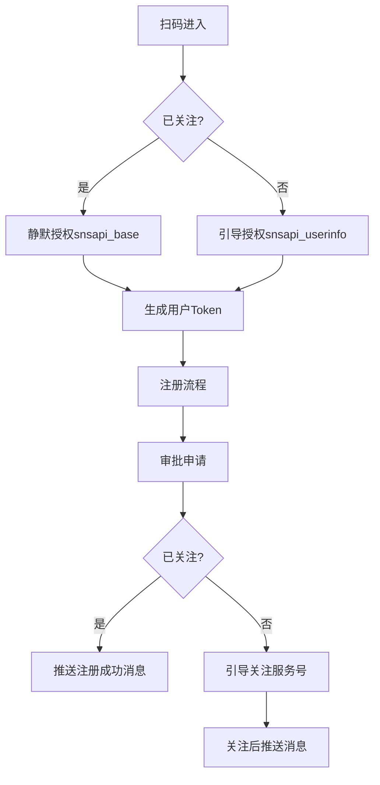

#### 1.4.3 View端业务时序图

```mermaid
sequenceDiagram
    actor TKESales as TKE销售
    participant View as View端
    participant Portal as Portal端
    participant WeChat as 微信服务
    actor Partner as Partner

    %% 1. Partner Upload
    rect rgb(255,255,204)
    Note over TKESales,View: 【1. Potential Channel Partner Upload】
    TKESales->>View: Excel批量上传Partner信息
    View->>View: 验证数据，检查重复 TaxCode
    
    alt 发现重复税号
        View-->>TKESales: 弹出替换确认提示 (active的记录直接跳过,并记录失败)
        TKESales->>View: 确认是否替换
        alt 确认替换
            View->>View: 替换旧记录（仅替换inactive/decline记录）
        else 取消替换
            View->>View: 跳过重复记录,并标记为失败记录
        end
    else 无重复税号
        View->>View: 直接存储新记录
    end
    
    View-->>TKESales: 上传结果（成功/失败/跳过记录）
    Note over View: Excel导入的Partner数据，状态为inactive
    end

    %% 2. Partner Registration (QR Code)
    rect rgb(204,255,255)
    Note over Partner,View: 【2. Partner Registration (QR Code)】
    Partner->>Portal: 扫码注册申请
    Portal->>Portal: Portal本地存储注册申请数据
    Note over Portal: 注册数据仅在Portal端存储，不推送到View
    Note over View: View端无注册数据，直到审批激活后才同步
    end

    %% 3. Dashboard Management
    rect rgb(255,255,204)
    Note over TKESales,View: 【3. Channel Partner Dashboard】
    TKESales->>View: 查看Channel Partner Dashboard
    View->>Portal: 拉取Portal端注册数据
    Portal-->>View: 返回Portal注册数据
    View->>View: 在列表中分别展示,View本地数据 和 Portal数据
    View-->>TKESales: 展示Partner列表（每个公司1条记录）
    Note over View: 显示Partner Status（active/inactive/declined）和Request Status（pending/done）
    
    TKESales->>View: 批量分配销售给Partner (仅Inactive数据)
    View->>View: 更新销售分配信息(Partner可以有多个销售)
    Note over View: 支持对已有销售ID的Partner重新分配
    
    alt 新Partner审批
        TKESales->>View: 点击编辑按钮
        Note over View: 跳转到 Manage Customers Page 新公司审批流程
    else 新Contract审批
        TKESales->>View: 点击编辑按钮
        Note over View: 跳转到 Partner Info Tab 审批联系人
    end
    end

    %% 4. Partner Approval Process
    rect rgb(204,255,255)
    Note over TKESales,Portal: 【4. Partner Approval Process】
    
    alt Manage Customers - 新Partner审批
        TKESales->>View: 进入Manage Customers审批页面
        View->>View: 识别数据来源（Portal数据 vs View导入数据）
        View->>Portal: 获取Portal端用户数据（如果来源是Portal）
        Portal-->>View: 返回用户项目、咨询记录等信息
        
        alt 申请时填写过TaxCode
            View-->>TKESales: 展示审批页面（多个联系人，仅显示第一个申请人填写的Company信息）
            Note over View: 所有相同TaxCode的联系人显示在一个审批页面
        else 申请时未填写TaxCode
            View-->>TKESales: 展示审批页面，TaxCode为必填项(销售填写)
            TKESales->>View: 输入TaxCode
            View->>View: 检查TaxCode是否已存在
            alt TaxCode已存在
                View-->>TKESales: 在input框下显示已存在的公司信息给销售参考
                View->>View: 带出该税号下所有申请的联系人
                View-->>TKESales: 显示该TaxCode下的所有联系人（合并显示）
            else TaxCode不存在
                View-->>TKESales: 显示当前申请的联系人
            end
        end
        
    else Partner Info Tab - 新Contract审批
        TKESales->>View: 进入Partner Info Tab审批页面
        View->>View: 识别数据来源（Portal数据 vs View导入数据）
        View->>Portal: 获取Portal端用户数据和同公司其他联系人信息
        Portal-->>View: 返回用户项目、咨询记录和新申请的联系人
        View-->>TKESales: 展示已存在公司审批页面（显示该公司新申请的联系人，可同时审批多个）
    end

    TKESales->>View: 审批页面 - 联系人可新增/编辑/删除
    View->>View: 任何联系人都可以被删除(发起申请的联系人 被删除 默认拒绝)
    
    TKESales->>View: 查看用户问询记录
    TKESales->>View: 回复用户问询记录
    View->>View: 存储问询回复信息
    
    TKESales->>View: 查看配置的Question List
    TKESales->>View: 回答Question List问题
    View->>View: 存储Question List结果
    Note over View: Question List是系统配置的标准问题列表
    
    alt 数据来源是Portal申请
        Note over View: Portal Account不可编辑，默认勾选
    else 数据来源是View导入
        Note over View: Portal Account可编辑，多手机号 仅能保留主手机号
    end
    
    alt 审批通过
        View->>View: 批量标记审批状态，生成新的Customer&Contact记录（仅保留的联系人）
        View->>View: View导入数据：多个手机号只保留一个
        
        loop 每个通过的联系人
            alt 勾选了Portal Account
                View->>Portal: 发送审批通过结果，允许Portal登录
                Portal->>Portal: 更新用户user_company.Status = 'active'，开启登录权限

                View->>WeChat: 发送激活通知
                WeChat-->>Partner: 推送激活消息（仅通过的联系人）
            else 未勾选Portal Account  
                View->>View: 仅生成Contact记录
            end
        end
        
        View->>View: Dashboard中Request Status 显示为done
        
    else 审批拒绝
        View->>View: 记录拒绝原因，不生成Customer记录
        View->>Portal: 发送审批拒绝结果
        Portal->>Portal: 解绑Company和User关系,同时标记为Decline,用户可以重新发起注册申请
        Note over View:  销售可以重新激活被 Decline数据
        View->>View: Dashboard中Request Status 显示为done
        Note over WeChat: 拒绝时不发送微信提醒
    end
    
    %% 4.1. Reactivate Declined Data
    rect rgb(255,204,204)
    Note over TKESales,View: 【4.1. Reactivate Declined Data - 被Decline数据重新激活】
    TKESales->>View: Dashboard列表点击被Decline数据进入编辑页面
    TKESales->>View: 重新激活被Decline的数据
    
    alt Portal数据被重新激活
        View->>View: 重新在user_company中 增加 user和company的关联关系
        View->>View: 检查Partner是否已存在
        alt Partner不存在
            View->>View: 生成新的Customer&Contact记录
        else Partner已存在
            View->>View: 仅生成新的Contact记录
        end
        View->>Portal: 发送重新激活通知，重新绑定用户和公司
        Portal->>Portal: 重新绑定Company和User关系，更新状态为active
        View->>WeChat: 发送激活通知
        WeChat-->>Partner: 推送激活消息
    else View导入数据被重新激活
        View->>View: 检查Partner是否已存在
        alt Partner不存在
            View->>View: 生成新的Customer&Contact记录，状态为active
        else Partner已存在
            View->>View: 仅生成新的Contact记录，状态为active
        end
        
        alt 勾选了Portal Account
            View->>WeChat: 发送激活通知
            WeChat-->>Partner: 推送激活消息
        else 未勾选Portal Account
            Note over View: 不发送激活通知
        end
    end
    end
    end

    %% 5. Status Summary
    rect rgb(255,255,204)
    Note over TKESales,View: 【5. Channel Partner Status Summary】
    TKESales->>View: 查看Channel Partner Status Summary
    View->>Portal: 获取Portal端数据（包括inactive的Portal数据）
    Portal-->>View: 返回Portal端所有数据
    View->>View: 合并Portal数据+View本地数据进行统计
    View->>View: 按Region->Branch->Partner Owner层级统计
    View->>View: 统计分类：All/Pending on Branch/Pending on Sales/Declined/Active
    View-->>TKESales: 展示多维度统计数据
    Note over View: 数据来源：Portal和View合集（inactive的Portal数据不在View端）
    Note over View: All - 所有Partner统计
    Note over View: Pending on Branch - 等待Branch审批的Partner
    Note over View: Pending on Sales - 等待Sales审批的Partner  
    Note over View: Declined - 被拒绝的Partner
    Note over View: Active - 已激活的Partner
    TKESales->>View: 点击统计数字
    View-->>TKESales: 跳转到Dashboard（带筛选条件）
    Note over View: Summary可以跳转Dashboard进行详细管理
    end

    %% 6. Project Management
    rect rgb(204,255,255)
    Note over TKESales,Partner: 【6. Project Management】
    
    %% 6.1. View端项目管理
    rect rgb(230,255,230)
    Note over TKESales,View: 【6.1. View端导入/新建项目】
    
    alt 导入项目
        TKESales->>View: 进入Upload Project Data页面
        TKESales->>View: 选择"Import Project from Offline Units"选项
        TKESales->>View: 下载Excel模板
        TKESales->>View: 上传填写完整的Excel文件
        View->>View: 验证数据，检测项目名称不允许重复
        View->>View: Excel中填写分配原因，如填写TaxCode则关联对应Partner
        View->>View: 创建项目记录，状态默认为Pre-Lead
        
        alt Partner有多个关联销售
            View->>View: 默认将第一个销售作为主销售
        end
        
        View-->>TKESales: 导入结果（成功/失败/重复记录）
        
    else 新建项目  
        TKESales->>View: 手动新建项目
        View->>View: 创建项目记录，状态为Pre-Lead
        Note over View: 可以选择分配给Partner(active状态)
    end
    
    Note over View: 导入和新建的最终目的都是创建可分配的项目
    end
    
    %% 6.2. Portal端项目创建
    rect rgb(230,230,255)
    Note over Partner,View: 【6.2. Portal端用户创建项目】
    Partner->>Portal: 创建Pre-Lead项目
    Portal->>Portal: 设置Lead Source为"MOD Lead/渠道项目"
    
    alt active用户项目
        Portal->>View: 推送项目数据
        View->>View: 存储项目数据，设置为Pre-Lead状态
        View-->>Portal: 返回接收确认
    else inactive用户项目
        Portal->>Portal: 本地存储项目数据
        Note over Portal: inactive用户项目存在Portal端，激活后同步到View端
    end
    end
    
    %% 6.3. 项目分配流程
    rect rgb(255,230,230)
    Note over TKESales,Partner: 【6.3. 项目分配给Partner公司】
    
    %% 6.3.1. 导入项目时TaxCode关联分配
    rect rgb(245,255,245)
    Note over TKESales,View: 【6.3.1. 导入项目时TaxCode关联分配】
    TKESales->>View: Excel导入项目，填写TaxCode 和 分配原因 关联Partner
    View->>View: 根据TaxCode自动关联对应Partner
    View->>View: 创建项目记录，状态为Pre-Lead，并分配给Partner
    end
    
    %% 6.3.2. 手动新建项目分配
    rect rgb(255,245,245) 
    Note over TKESales,View: 【6.3.2. 手动新建项目分配】
    TKESales->>View: 手动新建项目
    TKESales->>View: 添加Agent/Distributor后关联 Partner
    TKESales->>View: 选择分配原因
    View->>View: 创建项目记录，状态为Pre-Lead，分配给选定Partner
    end
    
    %% 6.3.3. Partner Info Tab批量分配
    rect rgb(245,245,255)
    Note over TKESales,View: 【6.3.3. Partner Info Tab批量分配】
    TKESales->>View: 在Partner Info Tab中点击Assign Project按钮
    View-->>TKESales: 跳转到待分配项目列表
    View-->>TKESales: 展示pre-lead状态的项目
    TKESales->>View: 批量选择项目
    TKESales->>View: 选择分配原因
    TKESales->>View: 批量分配给当前Partner
    end
    
    %% 6.3.4. Project Info中选择Agent/Distributor分配
    rect rgb(255,255,245)
    Note over TKESales,View: 【6.3.4. Project Info中选择Agent/Distributor分配】
    TKESales->>View: 在Project Info页面选择Agent/Distributor
    TKESales->>View: 选择分配原因
    TKESales->>View: 分配项目给选定的Partner
    end
    
    %% 统一分配后续流程
    View->>View: 检查Partner公司状态
    
    alt Partner公司为Active状态
        View->>Portal: 发送项目分配，设置24小时响应期限
        Portal->>Portal: 创建项目，设置24小时截止时间
        Portal-->>View: 返回分配确认(超过24小时标记为 Cancel)
        
        View->>WeChat: 发送项目分配通知
        WeChat-->>Partner: 推送项目通知给该公司所有active状态的联系人（24小时响应提醒）
        
        View->>View: 项目状态为Pre-Lead，Agent/Distributor锁定不可编辑
        Note over View: Pre-Lead状态时Proejct Info中可以替换或删除Agent/Distributor, 但是只能保留一个
        
    else Partner公司为非Active状态
        View-->>TKESales: 提示：只能分配给Active状态的Partner
    end
    end
    
    %% 6.4. 项目响应处理
    rect rgb(255,255,230)
    Note over Partner,View: 【6.4. 项目响应和状态管理】
    alt 24小时内响应
        Partner->>Portal: 接受/拒绝项目
        Portal->>View: 推送项目响应
        View->>View: 更新项目中 Agent/Distributor 接受状态
        
        alt 项目被接受
            View-->>TKESales: 推送接受消息(邮件)
            Note over View: 项目继续Pre-Lead状态，Agent/Distributor保持锁定
        else 项目被拒绝
            View->>View: 记录拒绝原因，在ProjectInfo中显示
            View-->>TKESales: 推送拒绝消息（含拒绝原因）(邮件)
            Note over View: 可以重新发起分配
        end
        
    else 24小时超时自动取消
        View->>View: 定时任务检查24小时超时
        View->>View: 自动更新项目状态为cancelled
        View->>Portal: 通知项目自动取消
        Portal->>Portal: 项目从Partner门户删除
        View->>WeChat: 发送项目取消通知
        WeChat-->>TKESales: 推送取消消息
        Note over View: 可以重新发起分配
    end
    end
    
    %% 6.5. 项目状态变更后管理
    rect rgb(230,255,255)
    Note over TKESales,View: 【6.5. 项目状态变更后的Agent/Distributor管理】
    TKESales->>View: 将项目状态从Pre-Lead变更到Lead或其他后续状态
    
    alt 变更到Lead及之后状态时
        View->>View: 检查Partner是否已接受/拒绝项目
        alt Partner未接受也未拒绝
            View->>View: 直接删除该Partner
            View->>View: 从Partner门户移除该项目
        else Partner已接受
            View->>View: 保持Partner关联，Agent/Distributor解锁可编辑
        end
    else 变更到Pre-Lead之后的其他状态
        View->>View: Agent/Distributor解锁，可随意编辑
    end
    
    alt 在Lead或后续状态添加新Agent/Distributor
        TKESales->>View: 添加新Agent/Distributor到项目
        View->>Portal: 直接推送项目到新Agent/Distributor
        Portal->>Portal: 项目直接显示在Partner的Ongoing列表中，不可编辑
        Note over Portal: Partner不需要接受/拒绝，项目直接生效且Portal端不可编辑
    end
    
    opt 删除之前的Agent/Distributor
        TKESales->>View: 删除项目中的Agent/Distributor
        View->>View: 从Agent/Distributor对应的项目列表中移除此项目
        Note over View: Agent/Distributor被删除后，项目不再出现在其项目列表中
    end
    
    end
    end

    %% 7. Channel Partner Project Summary
    rect rgb(255,255,204)
    Note over TKESales,View: 【7. Channel Partner Project Summary】

    Note over View: 销售仅能看到自己的,有对应branch权限的可以看到所有
    TKESales->>View: 查看Channel Partner Project Summary
    View->>View: 统计仅Pre-Lead状态的项目数据
    View->>View: 按Region->Branch->Partner Owner层级统计
    
    View->>View: 统计项目分类维度
    Note over View: All(Created by partner) - 所有渠道商自带项目（Portal端创建的项目）
    Note over View: To Be Assigned - 待分配项目（Pre-Lead状态，未分配Agent/Distributor）
    Note over View: Accepted - 已接受项目（Partner Accept Status = accepted）
    Note over View: Pending - 待接受项目（Partner Accept Status = pending，24小时内）
    Note over View: Declined - 已拒绝项目（Partner Accept Status = declined）
    Note over View: Cancelled - 已取消项目（Partner Accept Status = cancelled，24小时超时）
    
    View-->>TKESales: 展示多维度统计汇总
    Note over View: 支持按时间范围筛选，默认显示当前月份
    Note over View: 支持按Region/Branch/Partner Owner钻取查看
    
    TKESales->>View: 点击统计数字进行钻取
    View-->>TKESales: 跳转到Project Report页面（带对应筛选条件）
    end
    
    %% 8. Channel Partner Project Report
    rect rgb(255,230,255)
    Note over TKESales,View: 【8. Channel Partner Project Report】
    Note over View: 销售仅能看到自己的,拥有对应branch权限的可以看到所有
    TKESales->>View: 查看Channel Partner Project Report
    View->>View: 基于用户权限过滤项目数据
    Note over View: 仅显示active状态Partner的项目，不包含inactive的项目
    
    alt 筛选条件
        View->>View: Region - 按区域筛选
        View->>View: Branch - 按分支筛选
        View->>View: Partner - 按Partner名称筛选
        View->>View: Project Sales - 按项目销售筛选
        View->>View: Project Name - 按项目名称筛选
        View->>View: Project ID - 按项目ID筛选
        View->>View: Accept Status - 按接受状态筛选
        View->>View: Lead Source - 按线索来源筛选
    end
    
    View->>View: 支持多维度组合筛选
    Note over View: 支持Region/Branch/Partner Owner权限过滤
    
    View-->>TKESales: 展示项目详细列表
    Note over View: Region - 区域
    Note over View: Branch - 分支
    Note over View: Project ID - 项目ID
    Note over View: Project Name - 项目名称
    Note over View: Partner Name - Partner名称
    Note over View: Contact - 联系人
    Note over View: Project Sales - 项目销售
    Note over View: Lead Source - 线索来源
    Note over View: Sales Stage - 销售阶段
    Note over View: Accept Status - 接受状态
    Note over View: Partner Decline Reason - Partner拒绝原因
    Note over View: Units - 数量
    Note over View: Latest Update - 最近更新
    
    TKESales->>View: 点击项目名称
    View-->>TKESales: 跳转到Project Info详细页面
    
    end

    %% 9. Inquiry Management
    rect rgb(255,255,204)
    Note over Partner,View: 【9. Inquiry Management】
    
    %% 9.1. 用户发起咨询
    rect rgb(230,255,230)
    Note over Partner,View: 【9.1. 用户发起咨询】
    Partner->>Portal: 发起咨询
    
    alt active用户咨询
        Portal->>View: 推送咨询数据到View（active后数据记录在View端）
        View->>View: 存储咨询数据，分配给对应销售
        View-->>Portal: 返回接收确认
    else inactive用户咨询
        Portal->>Portal: 本地存储咨询
        Portal->>View: 发送咨询通知
    end
    end
    
    %% 9.2. 销售接收通知
    rect rgb(230,230,255)
    Note over TKESales,View: 【9.2. 销售接收通知】
    View->>View: 检查Partner关联销售
    
    alt Partner关联多个销售
        View-->>TKESales: 所有关联销售都收到问询通知（邮件）
    else Partner关联单个销售
        View-->>TKESales: 单个销售收到问询通知（邮件）
    end
    
    Note over View: 仅关联的销售可以看到并进行回复问询
    end
    
    %% 9.3. Inquiry模块回复咨询
    rect rgb(255,230,230)
    Note over TKESales,View: 【9.3. Inquiry模块中回复咨询和跳转】
    TKESales->>View: 进入Inquiry管理模块
    Note over View: 销售仅能看到自己的,拥有对应branch权限的可以看到所有
    Note over View: 销售不能看用户评价,拥有权限的可以看
    View-->>TKESales: 显示可回复的问询（仅显示该销售关联的Partner问询）
    
    alt 点击Partner Name跳转
        alt Partner为inactive状态
            TKESales->>View: 点击Partner Name
            View-->>TKESales: 跳转到审批页面（Manage Customers或Partner Info）
        else Partner为active状态
            TKESales->>View: 点击Partner Name
            View-->>TKESales: 跳转到Customer页面
        end
    end
    
    alt 在Inquiry模块中回复咨询
        alt 回复active用户咨询
            TKESales->>View: 选择咨询进行回复
            View->>View: 存储回复数据在View端，更新咨询状态为rating，设置30天评价截止时间
            View->>Portal: 发送回复数据
            View->>WeChat: 发送回复通知
            WeChat-->>Partner: 推送回复消息
            
            Partner->>Portal: 对咨询进行评价（30天内）
            Portal->>View: 推送评价数据
            View->>View: 存储评价数据，更新统计信息
            
            opt 30天未对回复评价自动关闭
                View->>View: 定时任务检查30天超时
                View->>View: 自动更新咨询状态为closed
                View->>Portal: 通知自动关闭
                Portal->>Portal: 更新咨询状态为closed
            end
            
        else 回复inactive用户咨询
            TKESales->>View: 选择咨询进行回复
            View->>Portal: 存储回复数据在Portal端，设置30天评价截止时间
            Portal->>Portal: 更新咨询状态为rating
            Portal->>WeChat: 发送回复通知
            WeChat-->>Partner: 推送回复消息
            
            Partner->>Portal: 对咨询进行评价（30天内）
            Portal->>View: 推送评价数据
            View->>View: 存储评价数据，更新统计信息
            
            opt 30天未对回复评价自动关闭
                Portal->>Portal: 定时任务检查30天超时
                Portal->>Portal: 自动更新咨询状态为closed
            end
        end
    end
    
    Note over View: 不论active或inactive用户，都有30天评价期限
    end
    
    %% 9.4. 审批页面回复问询
    rect rgb(255,230,255)
    Note over TKESales,View: 【9.4. 审批页面回复问询】
    
    alt Manage Customers页面回复
        TKESales->>View: 回复inactive用户问询记录
        View->>View: 存储回复，设置30天评价期限
        View->>Portal: 发送回复结果
        Portal->>WeChat: 发送回复通知
        WeChat-->>Partner: 推送回复消息
        
    else Partner Info页面回复
        alt 有待审批的inactive用户
            TKESales->>View: 回复inactive用户问询记录
        else 无待审批的inactive用户
            TKESales->>View: 回复active用户问询记录
        end
        View->>View: 存储回复，设置30天评价期限
        View->>Portal: 发送回复结果
        Portal->>WeChat: 发送回复通知
        WeChat-->>Partner: 推送回复消息
    end
    
    Partner->>Portal: 对咨询进行评价（30天内）
    Portal->>View: 推送评价数据
    View->>View: 存储评价数据，更新统计信息
    
    opt 30天未评价自动关闭
        View->>View: 定时任务检查30天超时
        View->>View: 自动更新咨询状态为closed
    end
    end
    
    %% 9.5. 评价统计展示
    rect rgb(255,255,230)
    Note over TKESales,View: 【9.5. 评价统计展示】
    TKESales->>View: 查看Closed列表
    View->>View: 统计评价数据
    View-->>TKESales: 显示Branch Rates和Sales Rates维度的评价统计
    
    TKESales->>View: 查看Country级别统计
    View->>View: 统计Country级别数据
    View-->>TKESales: 显示Country级别的Rates统计
    
    Note over View: Branch Rates - 按分支机构统计的评价
    Note over View: Sales Rates - 按销售人员统计的评价
    Note over View: Country Rates - 按国家/地区统计的评价
    end
    end

    %% 10. TKE Library
    rect rgb(204,255,255)
    Note over TKESales,Partner: 【10. TKE Library】
    TKESales->>View: 上传文件到TKE Library模块
    View->>View: 存储文件到NAS，记录文件信息
    View->>Portal: 同步文件信息
    Portal->>Portal: 根据访问权限级别存储文件信息
    Portal-->>View: 返回同步确认
    
    Partner->>Portal: 查看文件库（基于用户状态：inactive/active/agr）
    Portal->>View: 获取文件列表
    View-->>Portal: 返回基于权限的文件列表
    Portal-->>Partner: 展示可访问文件
    
    Partner->>Portal: 下载/预览文件
    end
```

## 2. Portal端公共模块设计及功能

### 2.1 微信授权组件设计

#### 2.1.1 WechatAuthService

- **概述**：微信网页授权服务组件，用于拼接授权 URL、通过 code 换取 openid/accessToken/refreshToken、校验 token 有效性及刷新、生成和解析业务token。
- **代码路径**：`packages/General/Foundation/src/Services/Wechat/WechatAuthService.php`
- **文件状态**：新增
- **复用场景**：微信授权登录、用户注册、获取用户信息、刷新授权状态
- **接口定义**：

  - **getAuthUrl($scope, $redirectUri, $state)**
    - **功能描述**：生成网页授权链接。
    - **微信API URL**：<https://open.weixin.qq.com/connect/oauth2/authorize>
    - **请求参数**：

        | 参数名称 | 类型   | 必填 | 描述 |
        |----------|--------|------|------|
        | scope    | String | 是   | `snsapi_base` 静默 / `snsapi_userinfo` 获取资料 |
        | redirect_uri | String | 是 | 回调地址，需 UrlEncode |
        | state    | String | 否   | 自定义参数，存渠道 scene 值 |

    - **响应数据**：

        | 参数名称 | 类型   | 描述              |
        |----------|--------|-------------------|
        | url      | String | 拼接好的授权 URL  |

  - **getAccessToken($code)**
    - **功能描述**：通过授权code换取access_token。
    - **微信API URL**：<https://api.weixin.qq.com/sns/oauth2/access_token>
    - **请求参数**：

        | 参数名称 | 类型   | 必填 | 描述 |
        |----------|--------|------|------|
        | code     | String | 是   | 授权回调获得的code |

    - **响应数据**：

        | 参数名称      | 类型   | 描述 |
        |---------------|--------|------|
        | access_token  | String | 网页授权接口调用凭证 |
        | expires_in    | Integer | access_token接口调用凭证超时时间，单位（秒） |
        | refresh_token | String | 用户刷新access_token |
        | openid        | String | 用户唯一标识 |
        | scope         | String | 用户授权的作用域 |

  - **getUserInfo($openid, $accessToken)**
    - **功能描述**：拉取用户信息。
    - **微信API URL**：<https://api.weixin.qq.com/sns/userinfo>
    - **请求参数**：

        | 参数名称     | 类型   | 必填 | 描述 |
        |--------------|--------|------|------|
        | openid       | String | 是   | 用户的唯一标识 |
        | access_token  | String | 是   | 网页授权接口调用凭证 |

    - **响应数据**：

        | 参数名称   | 类型   | 描述 |
        |------------|--------|------|
        | openid     | String | 用户的唯一标识 |
        | nickname   | String | 用户昵称 |
        | headimgurl | String | 用户头像 |
        | sex        | Integer | 用户的性别，值为1时是男性，值为2时是女性，值为0时是未知 |
        | country    | String | 用户个人资料填写的国家 |
        | province   | String | 用户个人资料填写的省份 |
        | city       | String | 用户个人资料填写的城市 |

  - **refreshAccessToken($refreshToken)**
    - **功能描述**：刷新access_token。
    - **微信API URL**：<https://api.weixin.qq.com/sns/oauth2/refresh_token>
    - **请求参数**：

        | 参数名称      | 类型   | 必填 | 描述 |
        |---------------|--------|------|------|
        | refresh_token  | String | 是   | 填写通过access_token获取到的refresh_token参数 |

    - **响应数据**：

        | 参数名称      | 类型   | 描述 |
        |---------------|--------|------|
        | access_token  | String | 网页授权接口调用凭证 |
        | expires_in    | Integer | access_token接口调用凭证超时时间，单位（秒） |
        | refresh_token | String | 用户刷新access_token |
        | openid        | String | 用户唯一标识 |
        | scope         | String | 用户授权的作用域 |

  - **extractSceneParam($state)**
    - **功能描述**：从state参数中提取场景值。
    - **请求参数**：

        | 参数名称 | 类型   | 必填 | 描述 |
        |----------|--------|------|------|
        | state    | String | 是   | 微信回调中的state参数 |

    - **响应数据**：

        | 参数名称 | 类型   | 描述 |
        |----------|--------|------|
        | scene    | String | 提取的场景值 |

#### 2.1.2 WechatMessageService

- **概述**：微信消息推送服务，用于发送模板消息
- **代码路径**：`packages/General/Foundation/src/Services/Wechat/WechatMessageService.php`
- **文件状态**：新增
- **复用场景**：注册成功通知、审批结果通知、业务状态提醒
- **接口定义**：

  - **sendTemplateMessage($templateData)**
    - **功能描述**：发送模板消息。
    - **微信API URL**：<https://api.weixin.qq.com/cgi-bin/message/template/send>
    - **请求参数**：

        | 参数名称     | 类型   | 必填 | 描述 |
        |--------------|--------|------|------|
        | touser       | String | 是   | 接收者openid |
        | template_id  | String | 是   | 模板ID |
        | url          | String | 否   | 模板跳转链接 |
        | data         | Object | 是   | 模板数据格式形如 { "key1": { "value": any }, "key2": { "value": any } } |

    - **响应数据**：

        | 参数名称 | 类型    | 描述 |
        |----------|---------|------|
        | success  | Boolean | 发送是否成功 |
        | msgid    | Integer | 消息id，64位整型 |
        | errcode  | Integer | 错误码 |
        | errmsg   | String  | 错误信息 |

  - **getAccessToken()**
    - **功能描述**：获取access_token。
    - **微信API URL**：<https://api.weixin.qq.com/cgi-bin/token>
    - **请求参数**：

        | 参数名称   | 类型   | 必填 | 描述 |
        |------------|--------|------|------|
        | grant_type | String | 是   | 获取access_token填写client_credential |
        | appid      | String | 是   | 第三方用户唯一凭证 |
        | secret     | String | 是   | 第三方用户唯一凭证密钥 |

    - **响应数据**：

        | 参数名称     | 类型   | 描述 |
        |--------------|--------|------|
        | access_token | String | 获取到的凭证 |
        | expires_in   | Integer | 凭证有效时间，单位：秒 |

#### 2.1.3 涉及数据表

**wechat_tokens**

| 字段名称 | 类型 | 长度 | 可空 | 默认值 | 描述 |
|----------|------|------|------|--------|------|
| Id | INT | 20 | NO | | 主键ID |
| UserId | INT | 11 | NO | | 用户ID |
| OpenId | VARCHAR | 128 | NO | | 微信openid |
| AccessToken | TEXT | | YES | NULL | 访问令牌 |
| RefreshToken | TEXT | | YES | NULL | 刷新令牌 |
| ExpiresDate | DATETIME | | YES | NULL | 令牌过期时间 |
| CreatedDate | DATETIME | | YES | NULL | 创建时间 |
| LastModifiedDate | DATETIME | | YES | NULL | 更新时间 |

**message_templates**

| 字段名称 | 类型 | 长度 | 可空 | 默认值 | 描述 |
|----------|------|------|------|--------|------|
| Id | INT | 11 | NO | | 主键ID |
| TemplateCode | VARCHAR | 50 | NO | | 模板编码 |
| TemplateId | VARCHAR | 100 | NO | | 微信模板ID |
| TemplateName | VARCHAR | 200 | NO | | 模板名称 |
| TemplateContent | TEXT | | NO | | 模板内容 |
| Status | TINYINT | 1 | NO | 1 | 状态：1启用 0禁用 |
| CreatedDate | DATETIME | | YES | NULL | 创建时间 |
| LastModifiedDate | DATETIME | | YES | NULL | 更新时间 |

### 2.2 认证授权组件设计

#### 2.2.1 组件关系说明

认证授权组件采用"中间件 + 服务"的分层架构：

- **AuthMiddleware**：负责基础身份验证，验证用户Token有效性
- **PermissionMiddleware**：负责权限控制，调用UserPermissionService进行具体权限检查
- **UserPermissionService**：负责权限业务逻辑，处理用户与公司的绑定关系、状态检查、公司切换等

**调用关系**：

```
HTTP Request → AuthMiddleware → PermissionMiddleware → UserPermissionService → Controller
```

#### 2.2.2 AuthMiddleware

- **概述**：API认证中间件，统一处理请求身份验证，验证用户Token有效性，设置用户语言环境。
- **代码路径**：`app/Http/Middleware/AuthMiddleware.php`
- **文件状态**：新增
- **复用场景**：所有需要身份验证的API接口
- **接口定义**：

  - **handle($request, $next)**
    - **功能描述**：处理HTTP请求的身份验证和语言设置。
    - **请求参数**：

        | 参数名称 | 类型    | 必填 | 描述 |
        |----------|---------|------|------|
        | request  | Request | 是   | HTTP请求对象 |
        | next     | Closure | 是   | 下一个中间件 |

    - **响应数据**：

        | 参数名称 | 类型     | 描述 |
        |----------|----------|------|
        | response | Response | HTTP响应或继续执行 |

#### 2.2.3 PermissionMiddleware

- **概述**：权限控制中间件，检查用户是否有权访问特定资源或执行特定操作，通过调用UserPermissionService进行权限验证。
- **代码路径**：`app/Http/Middleware/PermissionMiddleware.php`
- **文件状态**：新增
- **复用场景**：需要权限控制的API接口，如公司相关操作、项目管理等
- **依赖关系**：调用UserPermissionService进行权限检查
- **接口定义**：

  - **handle($request, $next, $permission)**
    - **功能描述**：检查用户权限并控制访问。
    - **请求参数**：

        | 参数名称   | 类型    | 必填 | 描述 |
        |------------|---------|------|------|
        | request    | Request | 是   | HTTP请求对象 |
        | next       | Closure | 是   | 下一个中间件 |
        | permission | String  | 是   | 权限标识 |

    - **响应数据**：

        | 参数名称 | 类型     | 描述 |
        |----------|----------|------|
        | response | Response | HTTP响应或继续执行 |

#### 2.2.4 UserPermissionService

- **概述**：用户权限服务组件，处理用户与公司的绑定关系检查、权限状态验证、公司切换等权限相关业务逻辑。
- **代码路径**：`app/Services/Auth/UserPermissionService.php`
- **文件状态**：新增
- **复用场景**：权限中间件、API权限验证、用户公司切换、权限状态同步
- **被调用者**：PermissionMiddleware、业务控制器
- **接口定义**：

  - **checkUserCompanyBinding($userId, $companyId)**
    - **功能描述**：检查用户是否与指定公司有绑定关系。
    - **请求参数**：

        | 参数名称  | 类型    | 必填 | 描述 |
        |-----------|---------|------|------|
        | userId    | Integer | 是   | 用户ID |
        | companyId | Integer | 是   | 公司ID |

    - **响应数据**：

        | 参数名称  | 类型    | 描述 |
        |-----------|---------|------|
        | isBound   | Boolean | 是否存在绑定关系 |

  - **getUserCompanyStatus($userId, $companyId)**
    - **功能描述**：获取用户在指定公司的状态信息。
    - **请求参数**：

        | 参数名称  | 类型    | 必填 | 描述 |
        |-----------|---------|------|------|
        | userId    | Integer | 是   | 用户ID |
        | companyId | Integer | 是   | 公司ID |

    - **响应数据**：

        | 参数名称      | 类型   | 描述 |
        |---------------|--------|------|
        | contact_status | String | 联系人状态：active/inactive |
        | account_status | String | 账户状态：normal/agr |
        | created_date   | String | 绑定创建时间 |

  - **checkUserCompanyPermission($userId, $companyId, $permission)**
    - **功能描述**：检查用户在指定公司是否具有特定权限。
    - **请求参数**：

        | 参数名称   | 类型    | 必填 | 描述 |
        |------------|---------|------|------|
        | userId     | Integer | 是   | 用户ID |
        | companyId  | Integer | 是   | 公司ID |
        | permission | String  | 是   | 权限标识 |

    - **响应数据**：

        | 参数名称      | 类型    | 描述 |
        |---------------|---------|------|
        | hasPermission | Boolean | 是否具有权限 |
        | status        | String  | 当前状态 |

  - **switchUserCompany($userId, $companyId)**
    - **功能描述**：用户切换当前操作的公司。
    - **请求参数**：

        | 参数名称  | 类型    | 必填 | 描述 |
        |-----------|---------|------|------|
        | userId    | Integer | 是   | 用户ID |
        | companyId | Integer | 是   | 目标公司ID |

    - **响应数据**：

        | 参数名称    | 类型    | 描述 |
        |-------------|---------|------|
        | success     | Boolean | 切换是否成功 |
        | companyInfo | Object  | 公司信息 |
        | permissions | Array   | 用户在该公司的权限列表 |

  - **syncUserCompanyStatus($userId, $companyId, $statusData)**
    - **功能描述**：同步用户公司绑定状态（当VIEW端状态发生变化时）。
    - **请求参数**：

        | 参数名称   | 类型    | 必填 | 描述 |
        |------------|---------|------|------|
        | userId     | Integer | 是   | 用户ID |
        | companyId  | Integer | 是   | 公司ID |
        | statusData | Object  | 状态数据 |

    - **响应数据**：

        | 参数名称     | 类型     | 描述 |
        |-------------|---------|------|
        | updated     | Boolean | 是否更新成功 |
        | oldStatus   | Object  | 更新前状态 |
        | newStatus   | Object  | 更新后状态 |

#### 2.2.5 类关系图

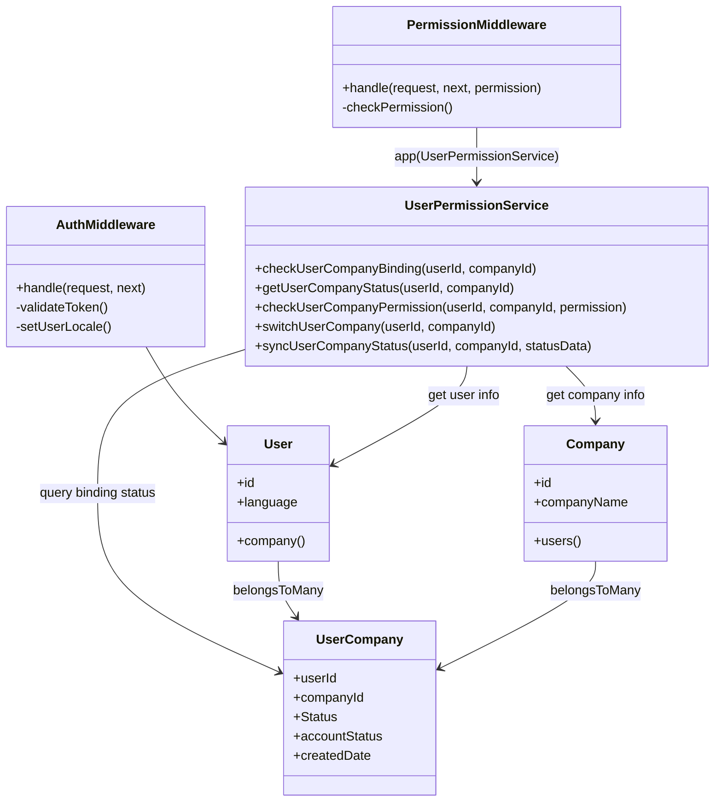

### 2.3 公共业务组件设计

#### 2.3.1 CompanyService

- **概述**：公司信息管理服务组件，处理公司相关的业务逻辑，包括公司信息验证、数据管理、重复性检查等。
- **代码路径**：`app/Services/Business/CompanyService.php`
- **文件状态**：新增
- **复用场景**：公司信息验证、公司数据管理、税码重复检查、公司注册流程
- **接口定义**：

  - **validateCompanyInfo($companyData)**
    - **功能描述**：验证公司信息的完整性和有效性。
    - **请求参数**：

        | 参数名称    | 类型   | 必填 | 描述 |
        |-------------|--------|------|------|
        | companyData | Array  | 是   | 公司信息数组 |

    - **响应数据**：

        | 参数名称   | 类型    | 描述 |
        |------------|---------|------|
        | valid      | Boolean | 验证是否通过 |
        | errors     | Array   | 验证错误信息 |
        | warnings   | Array   | 警告信息 |

  - **checkTaxcodeExists($taxCode)**
    - **功能描述**：检查税号是否已存在。
    - **请求参数**：

        | 参数名称         | 类型    | 必填 | 描述 |
        |------------------|---------|------|------|
        | taxCode          | String  | 是   | 税号 |

    - **响应数据**：

        | 参数名称    | 类型    | 描述 |
        |-------------|---------|------|
        | taxCodeExists  | Boolean | 税号是否存在 |
        | companyId   | Integer | 存在的公司ID |
        | companyName | String | 存在的公司名称 |

#### 2.3.2 SmsVerificationService

- **概述**：短信验证码服务组件，提供验证码发送、验证、管理等功能。
- **代码路径**：`app/Services/Common/SmsVerificationService.php`
- **文件状态**：新增
- **复用场景**：用户注册手机号验证、手机号登录验证、个人信息修改手机号验证
- **接口定义**：

  - **sendCode($mobile, $scene)**
    - **功能描述**：发送短信验证码到指定手机号。
    - **请求参数**：

        | 参数名称 | 类型   | 必填 | 描述 |
        |----------|--------|------|------|
        | mobile    | String | 是   | 手机号码 |
        | scene    | String | 是   | 使用场景：register/login/changeMobile |

    - **响应数据**：

        | 参数名称       | 类型    | 描述 |
        |----------------|---------|------|
        | success        | Boolean | 发送是否成功 |
        | message        | String  | 提示信息 |
        | expireTime     | Integer | 验证码有效期（秒） |
        | canResendAfter | Integer | 可以重新发送的等待时间（秒） |

  - **verifyCode($mobile, $code, $scene)**
    - **功能描述**：验证短信验证码。
    - **请求参数**：

        | 参数名称 | 类型   | 必填 | 描述 |
        |----------|--------|------|------|
        | mobile    | String | 是   | 手机号码 |
        | code     | String | 是   | 验证码 |
        | scene    | String | 是   | 使用场景 |

    - **响应数据**：

        | 参数名称 | 类型    | 描述 |
        |----------|---------|------|
        | valid    | Boolean | 验证码是否正确 |
        | message  | String  | 验证结果信息 |

#### 2.3.3 涉及数据表

- **sms_verifications**
  - **用途**：短信验证码

| 字段名称 | 类型 | 长度 | 可空 | 默认值 | 描述 |
|----------|------|------|------|--------|------|
| Id | INT | 20 | NO | | 主键ID |
| Mobile | VARCHAR | 20 | NO | | 手机号码 |
| Code | VARCHAR | 10 | NO | | 验证码 |
| Scene | VARCHAR | 50 | NO | | 使用场景 |
| IsVerified | TINYINT | 1 | NO | 0 | 是否已验证：1已验证 0未验证 |
| ExpiresDate | DATETIME | | NO | | 过期时间 |
| CreatedDate | DATETIME | | YES | NULL | 创建时间 |
| LastModifiedDate | DATETIME | | YES | NULL | 更新时间 |

### 2.4 系统集成组件设计

#### 2.4.1 InterSystemService

- **概述**：VIEW系统集成服务组件，用于Portal系统与VIEW系统之间的数据同步、状态更新、数据映射转换。所有双向通信均采用统一 envelope 结构，确保接口契约清晰、对称、可预测。
- **代码路径**：`app/Services/Integration/InterSystemService.php`
- **文件状态**：新增
- **复用场景**：用户激活后数据同步、问询数据同步、项目数据同步、公司信息同步、状态回调处理

- **接口定义**：
  - **pushDataToView($syncData)**
    - **功能描述**：推送数据到VIEW系统（用户、公司、项目等）。
    - **请求参数**：

      | 参数名称 | 类型 | 必填 | 描述 |
      |---------|------|------|------|
      | syncData | Array | 是 | 同步数据，必须包含以下字段：<br>- `dataType`: 字符串，如 `'user_registration'`<br>- `dataPayload`: 业务数据对象<br>- `sourceSystem`: 固定为 `"Portal"`<br>- `timestamp`: ISO8601 时间戳 |

    - **响应数据**：

      | 参数名称 | 类型 | 描述 |
      |---------|------|------|
      | success | Boolean | 推送是否成功 |
      | viewId | Integer | VIEW系统生成的ID |
      | syncTime | String | 同步时间 |

  - **pullDataFromView($pullRequest)**
    - **功能描述**：从VIEW系统拉取数据（用户、公司、项目等）。
    - **请求参数**：

      | 参数名称 | 类型 | 必填 | 描述 |
      |---------|------|------|------|
      | pullRequest | Array | 是 | 拉取请求，必须包含以下字段：<br>- `dataType`: 字符串，如 `'user_activation_status'`<br>- `conditions`: 查询条件对象<br>- `sourceSystem`: 固定为 `"Portal"`<br>- `timestamp`: ISO8601 时间戳 |

    - **响应数据**：

      | 参数名称 | 类型 | 描述 |
      |---------|------|------|
      | success | Boolean | 拉取是否成功 |
      | data | Array | VIEW系统返回的数据 |
      | syncTime | String | 同步时间 |

- **具体的同步场景映射**：

| 业务场景 | 使用接口 | 数据流向 | syncData / pullRequest 格式 | 触发时机 |
|---------|----------|----------|-----------------------------|----------|
| 注册申请提交 | pushDataToView | Portal → VIEW | ```json<br>{<br>  "dataType": "user_registration",<br>  "dataPayload": {<br>    "portalUserId": 123,<br>    "firstName": "张",<br>    "lastName": "三",<br>    "mobile": "13800138000",<br>    "email": "zhang@example.com",<br>    "openId": "oAbc123",<br>    "companyInfo": {<br>      "companyName": "ABC电梯公司",<br>      "taxCode": "91310101MA12345678",<br>      "province": 110000,<br>      "city": 110100,<br>      "district": 110105,<br>      "mainOperatingCities": ["110000", "310000"]<br>    },<br>    "salesId": 456<br>  },<br>  "sourceSystem": "Portal",<br>  "timestamp": "2025-10-11T10:30:00Z"<br>}<br>``` | 用户完成注册表单提交时 |
| 激活用户历史数据迁移 | pushDataToView | Portal → VIEW | ```json<br>{<br>  "dataType": "user_activation_data",<br>  "dataPayload": {<br>    "portalUserId": 123,<br>    "portalCompanyId": 789,<br>    "inquiries": [...],<br>    "projects": [...]<br>  },<br>  "sourceSystem": "Portal",<br>  "timestamp": "2025-10-11T11:00:00Z"<br>}<br>``` | VIEW端销售审批通过时 |
| 激活状态回调确认 | pullDataFromView | VIEW → Portal | ```json<br>{<br>  "dataType": "user_activation_status",<br>  "conditions": {<br>    "portalUserId": 123,<br>    "portalCompanyId": 789,<br>    "status": "active"<br>  },<br>  "sourceSystem": "Portal",<br>  "timestamp": "2025-10-11T12:00:00Z"<br>}<br>``` | VIEW端完成用户激活操作后 |
| 激活用户问询提交 | pushDataToView | Portal → VIEW | ```json<br>{<br>  "dataType": "inquiry_create",<br>  "dataPayload": {<br>    "portalInquiryId": 456,<br>    "portalUserId": 123,<br>    "portalCompanyId": 789,<br>    "categoryId": 1,<br>    "content": "电梯噪音过大，如何解决？"<br>  },<br>  "sourceSystem": "Portal",<br>  "timestamp": "2025-10-11T13:00:00Z"<br>}<br>``` | 已激活用户发起新问询时 |
| 未激活用户问询回复 | pullDataFromView | VIEW → Portal | ```json<br>{<br>  "dataType": "inquiry_reply",<br>  "conditions": {<br>    "portalInquiryId": 456,<br>    "portalUserId": 123<br>  },<br>  "sourceSystem": "Portal",<br>  "timestamp": "2025-10-11T14:00:00Z"<br>}<br>``` | 销售回复Portal端存储的问询时 |
| 问询评价结果同步 | pushDataToView | Portal → VIEW | ```json<br>{<br>  "dataType": "inquiry_rating",<br>  "dataPayload": {<br>    "portalInquiryId": 456,<br>    "portalUserId": 123,<br>    "rating": 5,<br>    "ratedTime": "2025-10-11T15:00:00Z"<br>  },<br>  "sourceSystem": "Portal",<br>  "timestamp": "2025-10-11T15:00:05Z"<br>}<br>``` | 用户完成问询评价时 |
| 激活用户项目操作 | pushDataToView | Portal → VIEW | ```json<br>{<br>  "dataType": "project_update",<br>  "dataPayload": {<br>    "portalProjectId": 1001,<br>    "portalUserId": 123,<br>    "portalCompanyId": 789,<br>    "projectName": "万达广场电梯改造",<br>    "unitsCount": 8,<br>    "contractValue": 500000.00<br>  },<br>  "sourceSystem": "Portal",<br>  "timestamp": "2025-10-11T16:00:00Z"<br>}<br>``` | 已激活用户新建/编辑项目时 |
| TKE项目处理结果 | pushDataToView | Portal → VIEW | ```json<br>{<br>  "dataType": "project_response",<br>  "dataPayload": {<br>    "portalProjectId": 1001,<br>    "portalUserId": 123,<br>    "action": "accept",<br>    "responseTime": "2025-10-11T17:00:00Z"<br>  },<br>  "sourceSystem": "Portal",<br>  "timestamp": "2025-10-11T17:00:05Z"<br>}<br>``` | 用户接受/拒绝TKE项目时 |

- **示例1: 激活状态回调确认 (pullDataFromView 响应)**

  ```json
  {
      "success": true,
      "data": {
          "portalUserId": 123,
          "portalCompanyId": 789,
          "status": "active",
          "viewCustomerId": 1001,
          "viewContactId": 2001,
          "activatedDate": "2025-01-15 10:30:00",
          "lastModifiedDate": "2025-01-15 10:30:00"
      },
      "syncTime": "2025-01-15 10:30:15"
  }
  ```

- **示例2: 未激活用户问询回复 (pullDataFromView 响应)**

  ```json
  {
      "success": true,
      "data": {
          "portalInquiryId": 456,
          "portalUserId": 123,
          "portalCompanyId": 789,
          "categoryId": 1,
          "content": "电梯噪音过大，如何解决？",
          "status": "rating",
          "salesReply": "建议检查曳引机润滑情况，定期维护可有效降低噪音",
          "salesId": 789,
          "repliedTime": "2025-01-14 16:45:00",
          "rating": null,
          "ratedTime": null,
          "createdDate": "2025-01-14 09:20:00",
          "lastModifiedDate": "2025-01-14 16:45:00"
      },
      "syncTime": "2025-01-15 09:20:30"
  }
  ```

- **示例3: 激活用户项目数据获取 (pullDataFromView 响应)**

  ```json
  {
      "success": true,
      "data": [
          {
          "portalProjectId": 1001,
          "projectName": "万达广场电梯改造",
          "portalUserId": 123,
          "portalCompanyId": 789,
          "modernizationScope": "full_mod",
          "brand": 1,
          "province": 110000,
          "city": 110100,
          "district": 110105,
          "detailAddress": "万达广场B座",
          "salesStage": "Pre-Lead",
          "unitsCount": 8,
          "contractValue": 500000.00,
          "forecastTenderDate": "2025-03-01",
          "isEditable": 1,
          "createdDate": "2025-01-10 14:20:00",
          "lastModifiedDate": "2025-01-10 14:20:00"
          }
      ],
      "syncTime": "2025-01-15 14:15:45"
  }
  ```

- **示例4: 注册申请提交 (pushDataToView 请求)**  

  ```json
  {
    "dataType": "user_registration",
    "dataPayload": {
      "portalUserId": 123,
      "firstName": "张",
      "lastName": "三",
      "mobile": "13800138000",
      "email": "zhang@example.com",
      "openId": "oAbc123",
      "companyName": "ABC电梯公司",
      "taxCode": "91310101MA12345678",
      "province": 110000,
      "city": 110100,
      "district": 110105,
      "mainOperatingCities": ["110000", "310000"],
      "salesId": 456
    },
    "sourceSystem": "Portal",
    "timestamp": "2025-10-11T10:30:00Z"
  }
  ```

- **示例5: 激活用户问询提交 (pushDataToView 请求)**  

  ```json
  {
    "dataType": "inquiry_create",
    "dataPayload": {
      "portalInquiryId": 456,
      "portalUserId": 123,
      "portalCompanyId": 789,
      "categoryId": 1,
      "content": "电梯噪音过大，如何解决？"
    },
    "sourceSystem": "Portal",
    "timestamp": "2025-10-11T13:00:00Z"
  }
  ```

- **示例6: 问询评价结果同步 (pushDataToView 请求)**  

  ```json
  {
    "dataType": "inquiry_rating",
    "dataPayload": {
      "portalInquiryId": 456,
      "portalUserId": 123,
      "rating": 5,
      "ratedTime": "2025-10-11T15:00:00Z"
    },
    "sourceSystem": "Portal",
    "timestamp": "2025-10-11T15:00:05Z"
  }
  ```

- **示例7: TKE项目处理结果 (pushDataToView 请求)**  

  ```json
  {
    "dataType": "project_response",
    "dataPayload": {
      "portalProjectId": 1001,
      "portalUserId": 123,
      "action": "accept",
      "responseTime": "2025-10-11T17:00:00Z"
    },
    "sourceSystem": "Portal",
    "timestamp": "2025-10-11T17:00:05Z"
  }
  ```

### 2.5 Laravel内置功能实现

#### 2.5.1 限流控制

使用Laravel内置的限流中间件throttle实现API限流：

```php
// 路由中使用配置化限流
Route::middleware(['throttle:portal-api'])->group(function () {
    Route::post('/sms/send', [SmsController::class, 'send']);
});

// 自定义限流规则，从配置文件读取参数
RateLimiter::for('portal-api', function (Request $request) {
    $config = config('business.rate_limit');
    
    return $request->user()
        ? Limit::perMinute($config['user_requests_per_minute'])->by($request->user()->id)
        : Limit::perMinute($config['guest_requests_per_minute'])->by($request->ip());
});
```

#### 2.5.2 日志记录

使用Laravel Log组件配置多个channel实现日志分类管理：

```php
// config/logging.php配置不同channel
'channels' => [
    'business' => [
        'driver' => 'daily',
        'path' => storage_path('logs/business.log'),
        'level' => 'info',
        'days' => 30,
    ],
    'security' => [
        'driver' => 'daily', 
        'path' => storage_path('logs/security.log'),
        'level' => 'warning',
        'days' => 90,
    ],
    'wechat' => [
        'driver' => 'daily',
        'path' => storage_path('logs/wechat.log'), 
        'level' => 'info',
        'days' => 30,
    ]
];

// 使用
Log::channel('business')->info('用户注册', ['user_id' => $userId]);
Log::channel('security')->warning('登录失败', ['ip' => $request->ip()]);
Log::channel('wechat')->info('微信消息推送', ['openid' => $openId]);
```

#### 2.5.3 系统配置

使用Laravel Config系统管理配置：

```php
// config/business.php
return [
    // 短信配置
    'sms' => [
        'daily_limit' => env('SMS_DAILY_LIMIT', 10), // 每日短信发送限制
        'expire_minutes' => env('SMS_EXPIRE_MINUTES', 5), // 验证码过期时间（分钟）
    ],
    
    // 微信配置
    'wechat' => [
        'app_id' => env('WECHAT_APP_ID'), // 微信应用ID
        'app_secret' => env('WECHAT_APP_SECRET'), // 微信应用密钥
        'enabled' => env('WECHAT_ENABLED', true), // 是否启用微信功能
    ],
    
    // API限流配置
    'rate_limit' => [
        'user_requests_per_minute' => env('API_USER_RATE_LIMIT', 10), // 登录用户每分钟请求限制
        'guest_requests_per_minute' => env('API_GUEST_RATE_LIMIT', 5), // 访客每分钟请求限制
    ],
];

// 使用
$smsLimit = config('business.sms.daily_limit');
$wechatEnabled = config('business.wechat.enabled');
```

#### 2.5.4 国际化

**后端实现**：

```php
// AuthMiddleware中设置语言
if ($user = auth('sanctum')->user()) {
    app()->setLocale($user->language ?? 'zh');
}

// 使用翻译
return $this->successResponse(null, __('messages.login_success'));

// 提供翻译API
class TranslationController extends BaseController
{
    public function getTranslations($locale = 'zh')
    {
        // 返回对应语言的翻译文件内容
        return $this->successResponse($translations);
    }
}
```

**前端Vue实现**：

```javascript
// 使用vue-i18n
import { createI18n } from 'vue-i18n'

// 通过API获取翻译数据
const loadLocaleMessages = async (locale) => {
  const response = await request.get(`/api/translations/${locale}`)
  return response.data.data
}

// 语言切换
const changeLanguage = async (lang) => {
  const messages = await loadLocaleMessages(lang)
  $i18n.global.setLocaleMessage(lang, messages)
  locale.value = lang
}
```

### 2.6 异常处理组件设计

#### 2.6.1 统一异常处理

使用Laravel异常处理机制结合自定义状态码体系实现标准化的API错误响应：

```php
// app/Exceptions/Handler.php
public function render($request, Throwable $exception)
{
    if ($request->expectsJson()) {
        return $this->handleApiException($exception);
    }
    
    return parent::render($request, $exception);
}

private function handleApiException(Throwable $exception)
{
    $code = 9001; // 默认系统错误
    $message = __('errors.server_error');
    $errors = null;
    
    if ($exception instanceof ValidationException) {
        $code = 1001; // 表单验证错误
        $message = __('errors.validation_failed');
        $errors = $exception->errors();
    } elseif ($exception instanceof AuthenticationException) {
        $code = 3001; // 认证错误
        $message = __('errors.authentication_failed');
    } elseif ($exception instanceof AuthorizationException) {
        $code = 3002; // 权限错误
        $message = __('errors.permission_denied');
    } elseif ($exception instanceof ModelNotFoundException) {
        $code = 4001; // 业务逻辑错误
        $message = __('errors.resource_not_found');
    }
    
    // 记录错误日志
    Log::channel('business')->error($exception->getMessage(), [
        'exception' => get_class($exception),
        'code' => $code,
        'user_id' => auth('sanctum')->id(),
        'ip' => request()->ip(),
        'url' => request()->url()
    ]);
    
    return response()->json([
        'success' => false,
        'code' => $code,
        'message' => $message,
        'errors' => $errors,
        'timestamp' => now()
    ], $this->getHttpStatusCode($code));
}
```

#### 2.6.2 前端错误处理

根据错误码范围在前端进行不同的错误处理：

```javascript
// utils/errorHandler.js
export const handleApiError = (error) => {
  const { code, message, errors } = error.response.data
  
  if (code >= 1000 && code <= 1999) {
    // 表单验证错误，在对应字段显示
    return { type: 'validation', errors }
  } else if (code >= 3000 && code <= 3999) {
    // 认证权限错误，全局提示并可能跳转
    return { type: 'auth', message }
  } else if (code >= 4000 && code <= 5999) {
    // 业务逻辑错误，全局提示
    return { type: 'business', message }
  } else if (code >= 6000 && code <= 6999) {
    // 地址相关错误
    return { type: 'address', message }
  } else if (code >= 7000 && code <= 7999) {
    // AGR相关错误
    return { type: 'agr', message }
  } else if (code >= 9000 && code <= 9999) {
    // 系统错误，显示通用错误信息
    return { type: 'system', message: '系统繁忙，请稍后重试' }
  }
}
```

### 2.7 公共模块总结

#### 2.7.1 组件依赖关系图

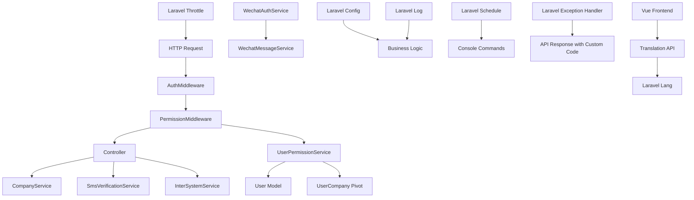

#### 2.7.2 核心模块列表

| 功能模块 | 核心组件 | 主要功能 | 实现方式 |
|----------|----------|----------|----------|
| 微信授权 | WechatAuthService, WechatMessageService | 微信OAuth2.0授权、模板消息推送 | 自定义Service |
| 认证授权 | UserPermissionService, AuthMiddleware, PermissionMiddleware | 权限控制、令牌管理 | Laravel + 自定义Service |
| 通信服务 | SmsVerificationService | 短信验证码、邮件通知 | 自定义Service |
| 业务逻辑 | CompanyService | 公司信息管理 | 自定义Service |
| 系统集成 | InterSystemService | Portal-VIEW数据同步 | 自定义Service |
| 系统配置 | Laravel Config | 配置管理 | config文件 + 可选数据库 |
| 日志审计 | Laravel Log | 错误日志、业务日志 | Laravel Log Channel |
| 限流防护 | Laravel Throttle | API限流 | Laravel内置中间件 |
| 异常处理 | Laravel Exception Handler | 统一异常处理 | Laravel内置 + 自定义状态码 |
| 国际化 | Laravel Lang + Vue i18n | 多语言支持 | Laravel内置 + 前端集成 |


## 3. Portal端 业务流程设计

### 3.1 注册业务模块

#### 3.1.1 业务流程

- **背景**:用户通过扫描**公司/销售**二维码进行注册,注册成为 Partner(渠道商); 用户信息最终同步View 成为Customer/contract.

- **主要流程**:  

  - **扫描公司/销售二维码 进入注册页面**
    1. 用户扫码进入注册流程（二维码携带Scene(SalesId) 仅销售码）
    2. 微信授权获取openid
    3. 解析场景参数等注册状态信息

    

  - **用户信息校验-注册**
    - 系统验证手机号是否已注册过
    - 已注册 → 显示登录提示
    - 未注册 → 继续注册流程
    - 如果手机号已经注册, 默认填充已经注册的信息, 如果重新填写则直接覆盖原有信息
    - 如果手机号已经注册, 还应该验证openid, 不一致 就要短信验证一下，如果验证通过 直接替换openid
    
    

  - **公司信息校验-注册**
    - 基于taxCode 拉取View端已经Active状态的公司, 如果存在填充Company信息(此时不可编辑)
    - 验证当前手机号是否已绑定过该公司
      - 新公司 → 创建公司记录(需审批)
      - 已存在公司 → 绑定到现有公司(需审批)
    - 添加公司时要重新审批
    - 省市区数据从VIEW端获取
    - MainOperatingCities数据从VIEW端获取
    - 如果申请绑定  已存在公司:对应销售等信息 直接同步为已存在公司的 而不是扫码的
    - 如果新公司注册, 未扫销售码， 则按照 选择的MainOperatingCities 第一个进行匹配 匹配Branch manager
    
    <mark style="background-color: #ffeb3b; color: #d32f2f;">**[待定]** 配件选项 应该要改名</mark>

  - **注册后跳转**
    - 新用户注册校验是否关注, 已关注 → 跳转至主页，未关注 → 引导关注服务号。
    - TKE导入并激活的用户则直接关联信息,同样校验是否关注，已关注 → 跳转至主页，未关注 → 引导关注服务号。
    - 已注册用户再次扫码注册的新公司, 同样校验是否关注，已关注 → 跳转至主页，未关注 → 引导关注服务号。

  - **短信验证阶段**:
    - 发送短信验证码到用户手机
    - 用户输入验证码进行验证
    - 短信供应商: <mark style="background-color: #ffeb3b; color: #d32f2f;">**[待定]**</mark>

  - **邮件通知阶段**:
    - 优先根据scene参数查找绑定的销售ID
    - 无销售ID绑定时，根据MainOperatingCities查找对应的Branch Manager 默认第一个
    - <mark style="background-color: #ffeb3b; color: #d32f2f;">**[待定]** 发送邮件给Sales或Branch manager（邮件内容待定）</mark>

  - **隐私协议**
    - 隐私协议存放在general_options中, 并标记版本
    - 用户注册/登录时,必须要勾选隐私协议
    - 记录 隐私协议版本 以及 是否勾选
    - 如果已经勾选过,再次登录时自动勾选, 如果版本更新则需用户手动重新勾选
    

- **异常流程**:  
  - 微信授权失败（code无效/过期） → 重新授权。  
  - 手机号已绑定其他 openid → 拒绝注册。  
  - 短信验证码错误/超时 → 重新获取。  

- **流程图**:

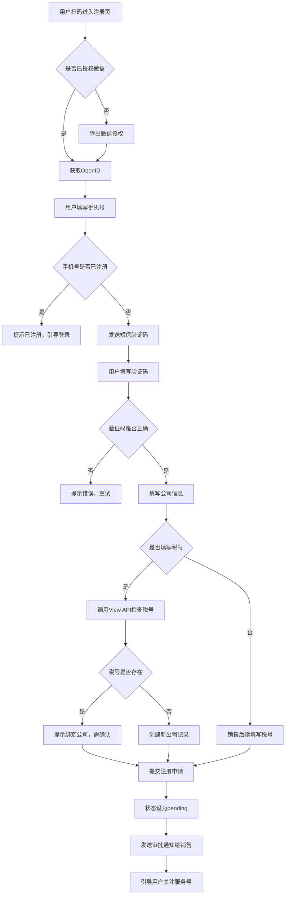

#### 3.1.2 影响的数据表

- Portal端
  - **[users](#table-users)** : Portal端 User基础信息表
  - **[companies](#table-companies)** : Portal端 Company 基础信息表
  - **[user_company](#table-user_company)** : User&Company 关联表(记录 Partner 当前状态)
  - **[registration_requests](#table-registration_requests)** : Portal端 审批记录表
  - **[user_company_assignment](#table-user_company_assignment)** : Portal端 Partner 关联 销售表

- View端 Portal->View 标记 Flag = 1 避免统计/合并Company时 Portal和View的数据交集问题
  - **[mod_channel_partner_companies](#table-mod_channel_partner_companies)** : View端 Upload数据表/ 审批Save留存Portal记录

#### 3.1.3 前端实现

##### 3.1.3.1 视图目录结构

```plaintext
/src/views/registration/
  RegistrationMain.vue         - 注册主页面
  RegistrationResult.vue       - 注册结果页面

/src/components/registration/
  WechatAuth.vue               - 微信授权组件
  RegistrationFlow.vue         - 注册流程控制组件
```

##### 3.1.3.2 关键组件功能

- **WechatAuth.vue**
  - 微信授权处理

- **RegistrationFlow.vue**
  - 注册流程控制（手机号验证→信息填写→短信验证→提交）
  - 公共组件完成注册流程
  - 注册状态管理

##### 3.1.3.3 API设计

| HTTP 方法 | 端点                          | 描述                    |
|-----------|-------------------------------|-------------------------|
| POST      | `/api/registration/wechat-auth` | 微信授权获取用户信息 |
| POST      | `/api/registration/verify-mobile` | 验证手机号是否可注册 |
| POST      | `/api/registration/send-sms` | 发送短信验证码 |
| POST      | `/api/registration/verify-sms` | 验证短信验证码 |
| POST      | `/api/registration/register`  | 提交注册信息 |

#### 3.1.4 功能开发与实现

##### 3.1.4.1 类关系图

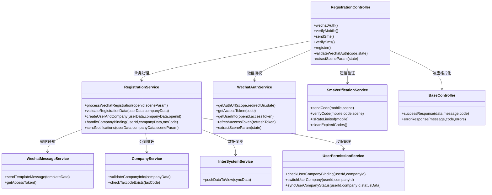

##### 3.1.4.2 代码实现

- **RegistrationController.php**
  - **文件路径**:`packages/Registration/src/Controllers/RegistrationController.php`
  - **文件状态**:新增
  - **依赖服务**:
  - **方法**:
    - **wechatAuth()**  
      - **功能描述**:微信授权回调处理，用code换取openid。集成完整日志记录。  
      - **方法状态**:新增  
      - **调用顺序**:微信授权后回调时首先调用  
      - **依赖服务**:
        - `WechatAuthService::getAccessToken()`
        - `WechatAuthService::getUserInfo()`
        - `WechatAuthService::extractSceneParam()`
        - `Log::channel('business')`
      - **请求参数**:  

        | 参数名称 | 数据类型 | 是否必填 | 描述             |
        |----------|----------|----------|------------------|
        | code     | String   | 是       | 微信授权回调code |
        | state    | String   | 否       | 二维码场景参数   |

      - **响应数据**:  

        | 参数名称 | 数据类型 | 描述                  |
        |----------|----------|-----------------------|
        | success       | Boolean  | 是否授权成功              |
        | openid        | String   | 用户openid                |
        | userInfo     | Object   | 用户基本信息（如有）      |
        | sceneParam   | String   | 场景参数                  |
        | message       | String   | 提示/异常信息             |

    - **verifyMobile()**
      - **功能描述**:验证手机号是否已注册，决定是否可继续注册流程。集成完整日志记录。  
      - **方法状态**:新增  
      - **调用顺序**:用户输入手机号点击Next时调用  
      - **依赖服务**:
        - `User::where('mobile')->exists()`
        - `Laravel Validation`
        - `Log::channel('business')`
      - **请求参数**:  

        | 参数名称     | 数据类型 | 是否必填 | 描述             |
        |--------------|----------|----------|------------------|
        | mobile        | String   | 是       | 手机号           |

      - **响应数据**:  

        | 参数名称 | 数据类型 | 描述                  |
        |----------|----------|-----------------------|
        | canProceed  | Boolean  | 是否可继续注册          |
        | isRegistered | Boolean | 手机号是否已注册        |
        | validFormat | Boolean | 手机号格式是否正确      |
        | message     | String   | 提示信息                |

    - **sendSms()**
      - **功能描述**:发送短信验证码。  
      - **方法状态**:新增  
      - **调用顺序**:用户填写完信息后调用  
      - **依赖服务**:
        - `SmsVerificationService::sendCode()`
      - **请求参数**:  

        | 参数名称     | 数据类型 | 是否必填 | 描述             |
        |--------------|----------|----------|------------------|
        | mobile        | String   | 是       | 手机号           |

      - **响应数据**:  

        | 参数名称 | 数据类型 | 描述                  |
        |----------|----------|-----------------------|
        | success      | Boolean  | 是否发送成功            |
        | expireTime   | Integer  | 验证码有效期（秒）      |
        | canResendAfter | Integer | 可以重新发送的等待时间（秒） |
        | message      | String   | 提示信息                |

    - **verifySms()**
      - **功能描述**:验证短信验证码。
      - **方法状态**:新增  
      - **调用顺序**:用户输入验证码时调用  
      - **依赖服务**:
        - `SmsVerificationService::verifyCode()`
      - **请求参数**:  

          | 参数名称     | 数据类型 | 是否必填 | 描述             |
          |--------------|----------|----------|------------------|
          | mobile        | String   | 是       | 手机号           |
          | code         | String   | 是       | 短信验证码       |
          | scene        | String   | 是       | 验证场景(register) |

      - **响应数据**:  

          | 参数名称 | 数据类型 | 描述                  |
          |----------|----------|-----------------------|
          | valid       | Boolean  | 验证码是否正确           |
          | message     | String   | 验证结果信息             |

    - **register()**
      - **功能描述**:用户填写注册信息时调用，创建用户和公司记录。集成全面日志记录和信息修改历史记录。  
      - **方法状态**:新增  
      - **调用顺序**:短信验证通过后提交注册时调用  
      - **依赖服务**:
        - `RegistrationService::validateRegistrationData()`
        - `RegistrationService::createUserAndCompany()`
        - `RegistrationService::sendNotifications()`
      - **请求参数**:  

        | 参数名称     | 数据类型 | 是否必填 | 描述             |
        |--------------|----------|----------|------------------|
        | openid       | String   | 是       | 微信openid       |
        | sceneParam   | String   | 否       | 场景参数         |
        | firstName        | String   | 是       | 用户名                             |
        | lastName         | String   | 是       | 用户姓氏                           |
        | role             | String   | 是       | 用户角色选择                        |
        | mobile            | String   | 是       | 手机号                             |
        | email            | String   | 否       | 邮箱（非必填）                     |
        | taxCode          | String   | 否       | 税号（非必填）                     |
        | companyName      | String   | 是       | 公司名                             |
        | province         | String   | 是       | 公司省份                           |
        | city             | String   | 是       | 公司城市                           |
        | district         | String   | 是       | 公司区县                           |
        | address          | String   | 否       | 公司详细地址（非必填）             |
        | niSales          | TINYINT(1) | 否    | 主营业务 - 新梯销售 (0/1)（非必填） |
        | installation     | TINYINT(1) | 否    | 主营业务 - 安装 (0/1)（非必填）     |
        | maintenance      | TINYINT(1) | 否    | 主营业务 - 维保 (0/1)（非必填）     |
        | fullMod          | TINYINT(1) | 否    | 主营业务 - 全改造  (0/1)（非必填）   |
        | partialMod       | TINYINT(1) | 否    | 主营业务 - 部分改造  (0/1)（非必填） |
        | NoOfMaintenanceUnits        | Int      | 条件必填 | 当维保=1 时必填设备数量            |
        | MainOperatingCities        | Array    | 是       | 主营业务覆盖城市（多选）           |

      - **响应数据**:  

        | 参数名称 | 数据类型 | 描述                  |
        |----------|----------|-----------------------|
        | success    | Boolean  | 是否注册成功            |
        | userId     | Integer  | 系统内部用户ID          |
        | companyId  | Integer  | 系统内部公司ID          |
        | requestId  | Integer  | 注册申请记录ID（如有）  |

- **RegistrationService.php**
  - **文件路径**:`packages/Registration/src/Services/RegistrationService.php`
  - **文件状态**:新增
  - **依赖服务**:WechatMessageService, CompanyService, InterSystemService, UserPermissionService
  - **方法**:
    - **processWechatRegistration($openid, $sceneParam)**
      - **功能描述**:处理微信授权注册的完整业务流程，包括用户信息获取、场景参数解析、初步验证等
      - **方法状态**:新增
      - **返回数据**:注册上下文信息和用户基础数据

    - **validateRegistrationData($userData, $companyData)**
      - **功能描述**:验证注册数据的完整性和合法性，包括用户信息验证、公司信息验证、重复性检查等
      - **方法状态**:新增
      - **返回数据**:验证结果和错误信息

    - **createUserAndCompany($userData, $companyData, $openid)**
      - **功能描述**:创建用户和公司记录，处理公司绑定关系，生成审批申请记录
      - **方法状态**:新增
      - **返回数据**:创建的用户ID和公司ID

    - **handleCompanyBinding($userId, $companyData, $taxCode)**
      - **功能描述**:处理公司绑定逻辑，包括新公司创建、现有公司绑定、重复检查等
      - **方法状态**:新增
      - **返回数据**:绑定结果和公司信息

    - **sendNotifications($userData, $companyData, $sceneParam)**
      - **功能描述**:发送注册相关通知，包括邮件通知销售、微信消息推送等
      - **方法状态**:新增
      - **返回数据**:通知发送结果

### 3.2 登录业务模块

#### 3.2.1 业务流程

##### 3.2.1.1 业务背景

- **背景**:用户有2种登录方式 1.手机号+验证码登录; 2. wechat 持久化自动登录, 登录后根据当前Partner状态 给予不同的操作权限，系统支持用户在多个公司之间切换，每次登录记录最后登录时间和最后操作的公司。

- **登录流程**:  
  - **wechat登录**
    1. 用户授权(检测token是否过期 过期重新授权)
    2. 校验openid 是否绑定Portal端 User
    3. 校验通过 -> 检测公司 默认 登录最后一次选择的公司, 如果没有则 获取第一个关联的公司
    4. 校验失败 -> 禁止登录/跳转注册
  - **手机号登录** :
    - **登录页**
      - 用户输入手机号发送短信验证码
      - 验证验证码是否正确
      
      
    - **公司选择器**
      - 绑定1个公司 → 直接登录进入主页
      - 绑定多个公司 → 显示公司选择页面
      

- **登录校验**
  - 用户不存在 → 跳转注册页面
  - 用户存在但未绑定公司 → **允许登录，只能查看个人信息和申请添加公司**
  - 如果更换设备, 验证码通过校验则直接替换openid

- **隐私协议**:
  - 隐私协议存放在general_options中, 并标记版本
  - 用户注册/登录时,必须要勾选隐私协议
  - 记录 隐私协议版本 以及 是否勾选
  - 如果已经勾选过,再次登录时自动勾选, 如果版本更新则需用户手动重新勾
  

- **权限控制阶段**:
  - 校验当前User 选择的Company 校验 Partner状态
    - pending:允许登录, 编辑 用户/公司信息, 创建Inquiry,Porject, 查看资料
    - active: 允许登录, 编辑用户信息 公司信息不可编辑, 创建Inquiry,Porject, 接受/拒绝 分配的项目, 查看资料
    - decline: 允许登录, 无关联公司, 需重新申请, 编辑用户信息, 无其它操作
    - signed: 允许登录, 跳转 View - Agr Home-Page
  - **无公司关联用户:只能查看个人信息，申请添加公司，进行重新绑定流程**

- **weclome页面**
  - 用户登录成功后跳转到Welcome Page
  - 检查用户权限状态和公司绑定情况,开放不同功能
  - 统计待回复问询数量（Rating状态） - pending时 仅统计自己; active时 统计Company下所有
  - 统计待处理TKE项目数量 - active状态时统计, 统计该Company下所有待处理
  

- **异常流程**:
  - 手机号验证码错误/过期 → 重新获取验证码
  - 手机号码被占用
  - Partner状态被 Decline/解绑/拉黑
  - 数据加载失败 → 显示默认值并记录错误

- **流程图**:

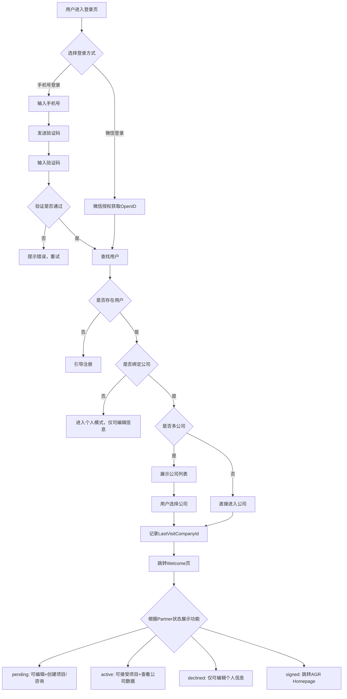

#### 3.2.2 影响的数据表

- **[users](#table-users)** : Portal端 User基础信息表 - 校验手机号
- **[companies](#table-companies)** : Portal端 Company 基础信息表
- **[user_company](#table-user_company)** : User&Company 关联表(记录 Partner 当前状态)
- **[user_company_assignment](#table-user_company_assignment)** : Portal端 Partner 关联 销售表

#### 3.2.3 前端实现

##### 3.2.3.1 视图目录结构

```plaintext
/src/views/login/
  LoginMain.vue                - 登录主页面
  CompanySelection.vue         - 多公司选择页面

/src/components/login/
  LoginFlow.vue                - 登录流程控制组件
  CompanySelector.vue          - 公司选择器组件
```

##### 3.2.3.2 关键组件功能

- **LoginFlow.vue**
  - 登录流程控制（手机号验证→多公司选择→状态获取）
  - 集成公共短信验证组件(SmsVerificationService)
  - 登录状态管理

- **CompanySelector.vue**
  - 用户绑定公司列表展示
  - 公司选择和确认逻辑
  - 无公司关联状态处理

##### 3.2.3.3 API设计

| HTTP 方法 | 端点                          | 描述                    |
|-----------|-------------------------------|-------------------------|
| POST      | `/api/auth/send-sms`          | 发送登录短信验证码 |
| POST      | `/api/auth/verify-code`       | 验证验证码并查找用户 |
| POST      | `/api/auth/select-company`    | 选择公司完成登录 |
| GET       | `/api/user/company`           | 获取用户绑定公司列表 |
| GET       | `/api/user/switch-company`    | 切换公司组件 - 通用 |
| GET       | `/api/welcome/stats`          | 获取统计数据 待评价/待操作 Inquiry/Project |

#### 3.2.4 功能开发与实现

##### 3.2.4.1 类关系图

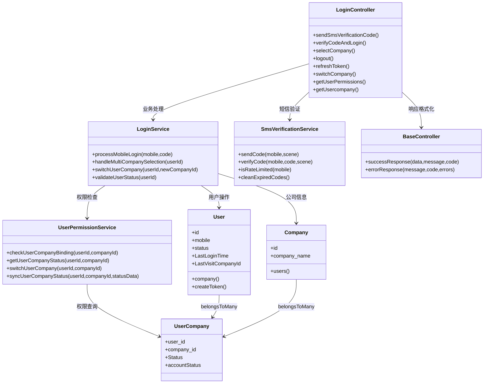

##### 3.2.4.2 代码实现

- **WelcomeController.php**
  - **文件路径**:`app/Http/Controllers/WelcomeController.php`
  - **文件状态**:新增
  - **方法**:
    - **getDashboard()**  
      - **功能描述**:获取Welcome Page主页所有数据，包括用户信息、统计数据、权限状态和通知提醒。集成日志记录。  
      - **方法状态**:新增  
      - **调用顺序**:用户登录成功跳转到主页时调用  
      - **依赖服务**:
        - `WelcomeService::getDashboardData()`
        - `auth('sanctum')->user()`
        - `UserPermissionService::getUserCompanyStatus()`
        - `Log::channel('business')->info()`
      - **请求参数**:无

      - **响应数据**:  

        | 参数名称 | 数据类型 | 描述                  |
        |----------|----------|-----------------------|
        | success  | Boolean  | 是否获取成功           |
        | userInfo | Object   | 用户基本信息           |
        | companyInfo | Object | 公司信息（如有）       |
        | userPermission | String | 用户权限级别(active/inactive/agr/none) |
        | stats    | Object   | 统计数据汇总           |
        | notifications | Object | 通知提醒数量         |
        | quickNav | Array    | 快速导航菜单           |
        | isPersonalMode | Boolean | 是否个人模式        |
        | availableCompanies | Array | 可切换的公司列表   |

    - **getStats()**
      - **功能描述**:获取待处理事项统计数据，包括待回复问询数量和待处理TKE项目数量，根据用户权限过滤数据范围。集成日志记录。  
      - **方法状态**:新增  
      - **调用顺序**:主页加载或用户手动刷新统计数据时调用  
      - **依赖服务**:
        - `WelcomeService::getStatsSummary()`
        - `WelcomeService::calculateNotificationBadges()`
        - `auth('sanctum')->user()`
        - `UserPermissionService::getUserCompanyStatus()`
        - `Log::channel('business')->info()`
      - **请求参数**:无

      - **响应数据**:  

        | 参数名称 | 数据类型 | 描述                  |
        |----------|----------|-----------------------|
        | success  | Boolean  | 是否获取成功           |
        | pendingInquiries | Integer | 待处理问询数量      |
        | pendingProjects | Integer | 待处理项目数量       |
        | inquiryBadge | Integer | 问询模块小红点数字    |
        | projectBadge | Integer | 项目模块小红点数字    |
        | lastUpdate | DateTime | 统计数据更新时间      |
        | dataScope | String  | 数据范围(personal/company) |
        | permissionLevel | String | 用户权限级别        |

    - **switchCompany()**
      - **功能描述**:用户在Welcome Page切换当前操作公司
      - **方法状态**:新增  
      - **调用顺序**:用户从公司切换器中选择新公司时调用  
      - **依赖服务**:
        - `UserPermissionService::switchUserCompany()`
        - `auth('sanctum')->user()->currentAccessToken()->delete()`
        - `auth('sanctum')->user()->createToken('auth-token', ['company:' . $companyId])`
        - `User::update(['last_company_id' => $companyId])`
        - `Log::channel('business')->info()`
      - **请求参数**:  

        | 参数名称  | 数据类型 | 是否必填 | 描述             |
        |-----------|----------|----------|------------------|
        | companyId | Integer  | 是       | 目标公司ID       |

      - **响应数据**:  

        | 参数名称 | 数据类型 | 描述                  |
        |----------|----------|-----------------------|
        | success  | Boolean  | 切换是否成功           |
        | token    | String   | 新的Token令牌       |
        | userInfo | Object   | 用户信息               |
        | companyInfo | Object | 新公司信息           |
        | permissions | Object | 新的权限信息         |
        | stats    | Object   | 新公司的统计数据       |
        | redirectUrl | String | 切换后跳转地址       |

- **LoginController.php**
  - **文件路径**:`packages/Login/src/Controllers/LoginController.php`
  - **文件状态**:新增
  - **方法**:
    - **sendSmsVerificationCode()**  
      - **功能描述**:发送登录短信验证码，包含频率限制检查。
      - **方法状态**:新增  
      - **调用顺序**:用户输入手机号点击发送验证码时调用  
      - **依赖服务**:
        - `SmsVerificationService::sendCode($mobile, 'login')`
        - `SmsVerificationService::isRateLimited($mobile)`
        - `Log::channel('business')->info()`
        - `Log::channel('security')->warning()`
      - **请求参数**:  

        | 参数名称 | 数据类型 | 是否必填 | 描述             |
        |----------|----------|----------|------------------|
        | mobile    | String   | 是       | 手机号           |

      - **响应数据**:  

        | 参数名称 | 数据类型 | 描述                  |
        |----------|----------|-----------------------|
        | success  | Boolean  | 是否发送成功           |
        | message  | String   | 提示信息               |
        | expireTime | Integer | 验证码有效期(秒)       |
        | canResendAfter | Integer | 可重新发送等待时间(秒) |

    - **verifyCodeAndLogin()**
      - **功能描述**:验证短信验证码并处理登录逻辑，返回用户绑定的公司列表，更新最后登录日期。
      - **方法状态**:新增  
      - **调用顺序**:用户输入验证码点击登录时调用  
      - **依赖服务**:
        - `SmsVerificationService::verifyCode($mobile, $code, 'login')`
        - `LoginService::processMobileLogin($mobile, $code)`
        - `LoginService::handleMultiCompanySelection($userId)`
        - `User::where('mobile', $mobile)->first()`
        - `Log::channel('business')->info()`
        - `Log::channel('security')->warning()`
      - **请求参数**:  

        | 参数名称 | 数据类型 | 是否必填 | 描述             |
        |----------|----------|----------|------------------|
        | mobile    | String   | 是       | 手机号           |
        | code     | String   | 是       | 短信验证码       |

      - **响应数据**:  

        | 参数名称 | 数据类型 | 描述                  |
        |----------|----------|-----------------------|
        | success  | Boolean  | 验证是否通过           |
        | userId   | Integer  | 用户ID                 |
        | userInfo | Object   | 用户基本信息           |
        | company | Array   | 用户绑定的公司列表     |
        | needCompanySelection | Boolean | 是否需要选择公司 |
        | hasNoCompany | Boolean | 是否无公司关联 |
        | message  | String   | 提示信息               |

    - **selectCompany()**
      - **功能描述**:用户选择公司后，记录最后操作的公司。
      - **方法状态**:新增  
      - **调用顺序**:用户从公司列表中选择公司时调用  
      - **依赖服务**:
        - `LoginService::validateUserStatus($userId)`
        - `UserPermissionService::checkUserCompanyBinding($userId, $companyId)`
        - `UserPermissionService::getUserCompanyStatus($userId, $companyId)`
        - `User::find($userId)->createToken('auth-token', ['company:' . $companyId])`
        - `User::find($userId)->update(['last_company_id' => $companyId])`
        - `Log::channel('business')->info()`
      - **请求参数**:  

        | 参数名称  | 数据类型 | 是否必填 | 描述             |
        |-----------|----------|----------|------------------|
        | userId    | Integer  | 是       | 用户ID           |
        | companyId | Integer  | 是       | 选择的公司ID     |

      - **响应数据**:  

        | 参数名称 | 数据类型 | 描述                  |
        |----------|----------|-----------------------|
        | success  | Boolean  | 登录是否成功           |
        | token | String | Token令牌             |
        | userInfo | Object   | 用户信息               |
        | companyInfo | Object | 公司信息             |
        | permissions | Object | 用户权限信息         |
        | redirectUrl | String | 登录后跳转地址       |

    - **logout()**
      - **功能描述**:用户退出登录，删除当前用户Token。
      - **方法状态**:新增  
      - **调用顺序**:用户点击退出登录时调用  
      - **依赖服务**:
        - `auth('sanctum')->user()->currentAccessToken()->delete()`
        - `Log::channel('security')->info()`
      - **请求参数**:无（从Authorization header获取token）

      - **响应数据**:  

        | 参数名称 | 数据类型 | 描述                  |
        |----------|----------|-----------------------|
        | success  | Boolean  | 是否退出成功           |
        | message  | String   | 提示信息               |

    - **refreshToken()**
      - **功能描述**:刷新用户Token延长认证状态。
      - **方法状态**:新增  
      - **调用顺序**:token即将过期时自动调用或用户主动刷新  
      - **依赖服务**:
        - `auth('sanctum')->user()->currentAccessToken()->delete()`
        - `auth('sanctum')->user()->createToken()`
        - `Log::channel('business')->info()`
      - **请求参数**:无（从Authorization header获取当前token）

      - **响应数据**:  

        | 参数名称 | 数据类型 | 描述                  |
        |----------|----------|-----------------------|
        | success  | Boolean  | 是否刷新成功           |
        | token | String | 新的Token令牌         |
        | expiresAt | DateTime | 新的过期时间         |
        | message  | String   | 提示信息               |

    - **switchCompany()**
      - **功能描述**:用户在多个公司间切换当前操作公司。
      - **方法状态**:新增  
      - **调用顺序**:用户在系统中选择切换到其他公司时调用  
      - **依赖服务**:
        - `UserPermissionService::switchUserCompany($userId, $companyId)`
        - `User::find($userId)->update(['last_company_id' => $companyId])`
        - `auth('sanctum')->user()->currentAccessToken()->delete()`
        - `auth('sanctum')->user()->createToken('auth-token', ['company:' . $companyId])`
        - `Log::channel('business')->info()`
      - **请求参数**:  

        | 参数名称  | 数据类型 | 是否必填 | 描述             |
        |-----------|----------|----------|------------------|
        | companyId | Integer  | 是       | 目标公司ID       |

      - **响应数据**:  

        | 参数名称 | 数据类型 | 描述                  |
        |----------|----------|-----------------------|
        | success  | Boolean  | 是否切换成功           |
        | token | String | 新的Token令牌         |
        | companyInfo | Object | 新公司信息           |
        | permissions | Object | 新的权限信息         |
        | redirectUrl | String | 切换后跳转地址       |

    - **getUserPermissions()**
      - **功能描述**:获取当前用户在指定公司的权限信息。
      - **方法状态**:新增  
      - **调用顺序**:前端需要检查用户权限时调用  
      - **依赖服务**:
        - `UserPermissionService::getUserCompanyStatus($userId, $companyId)`
        - `auth('sanctum')->user()`
        - `auth('sanctum')->user()->tokenCan('company:' . $companyId)`
      - **请求参数**:无（从token中获取用户和公司信息）

      - **响应数据**:  

        | 参数名称 | 数据类型 | 描述                  |
        |----------|----------|-----------------------|
        | success  | Boolean  | 是否获取成功           |
        | permissions | Object | 用户权限详情         |
        | Status | String | 联系人状态           |
        | companyInfo | Object | 当前公司信息         |
        | isPersonalMode | Boolean | 是否个人模式       |

    - **getUserCompany()**
      - **功能描述**:获取用户绑定的所有公司列表。
      - **方法状态**:新增  
      - **调用顺序**:用户需要查看或切换公司时调用  
      - **依赖服务**:
        - `auth('sanctum')->user()->company()->withPivot(['contract_status', 'account_status'])->get()`
        - `UserPermissionService::checkUserCompanyBinding($userId, $companyId)`
      - **请求参数**:无（从token中获取用户信息）

      - **响应数据**:  

        | 参数名称 | 数据类型 | 描述                  |
        |----------|----------|-----------------------|
        | success  | Boolean  | 是否获取成功           |
        | company | Array   | 用户绑定公司列表       |
        | currentCompany | Object | 当前操作公司信息     |
        | totalCount | Integer | 绑定公司总数         |

- **LoginService.php**
  - **文件路径**:`packages/Login/src/Services/LoginService.php`
  - **文件状态**:新增
  - **方法**:
    - **processMobileLogin($mobile, $code)**
      - **功能描述**:处理手机号验证码登录的完整业务逻辑，包括验证码验证、用户查找、状态检查等
      - **方法状态**:新增
      - **返回数据**:登录结果和用户信息

    - **handleMultiCompanySelection($userId)**
      - **功能描述**:处理多公司选择逻辑，获取用户绑定的公司列表及其权限状态，为公司选择提供数据支持
      - **方法状态**:新增
      - **返回数据**:可选公司列表和选择建议

    - **switchUserCompany($userId, $newCompanyId)**
      - **功能描述**:处理用户公司切换逻辑，验证切换权限，更新会话状态，重新获取权限信息
      - **方法状态**:新增
      - **返回数据**:切换结果和新权限信息

    - **validateUserStatus($userId)**
      - **功能描述**:验证用户登录状态和账号状态，检查是否被删除、暂停等，确保用户可以正常登录
      - **方法状态**:新增
      - **返回数据**:用户状态验证结果

### 3.3 MyInfo 模块

#### 3.3.1 业务流程

##### 3.3.1.1 业务背景

- **背景**:Portal端用户可以自行编辑 User信息 和根据Partner状态编辑Company信息 

- **主要流程**:  
  - **个人信息**
    1. **个人信息**:始终可编辑（firstName, lastName, role, email, mobile)
    2. **手机号**:变更手机号需要短信验证
    3. 当Partner变更至 active时, 变更用户信息需同步View端 contract
    

  - **公司信息**
    - User无公司绑定 → 不可编辑公司信息
    - Partner状态为pending → 可编辑
    - Partner状态为active → 不可编辑，显示只读信息
      

  - **编辑信息阶段**
    - 手机号需要重复校验 并提醒
    - 编辑Company信息时, 如税号变更 且时Active Company则与注册时一致 同步出公司信息 且不可编辑

  - **注销账号**
    - User主动发起注销账号流程, 注销时需要二次确认
    - 注销后,解绑 User与Company关联关系, 同时解绑 View端 contract和 Portal User关联, 但是保留View端关联信息,仅解绑
    - 注销后30天后可以才可以重新发起申请
    
    
    - 仅关联1家公司时
    
    - 关联多家公司时
    
    

- **异常流程**:  
  - 公司信息冲突（税号重复等）→ 提示冲突信息
  - 手机号验证码错误/过期 → 重新获取验证码
  - 新手机号已被其他用户使用 → 拒绝修改并提示

- **流程图**:

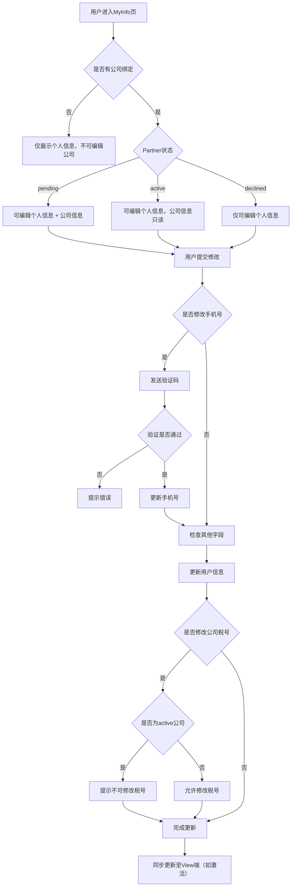

#### 3.3.2 影响的数据表

- Portal端
  - **[users](#table-users)** : Portal端 User基础信息表 - 校验手机号
  - **[companies](#table-companies)** : Portal端 Company 基础信息表
  - **[user_company](#table-user_company)** : User&Company 关联表(记录 Partner 当前状态)
  - **[audit_log](#table-audit_log)** : 记录用户编辑信息Log

- View端  Portal->View 同步联系变更信息,  Pending状态变更 Taxcode时 同步Flag = 0/1
  - **[mod_channel_partner_companies](#table-mod_channel_partner_companies)** :View端 公司基础信息表 同步flag
  - **[mod_channel_contract_bindings](#table-mod_channel_contract_bindings)** :View端 联系人表与PortalUser关联表
  - **[contract](#table-contract)** :View端 联系人表信息表

#### 3.3.3 前端实现

##### 3.3.3.1 视图目录结构

```plaintext
/src/views/myinfo/
  MyInfoMain.vue               - 个人信息主页面
  
/src/components/myinfo/
  PersonalInfoCard.vue         - 个人信息卡片组件
  CompanyInfoCard.vue          - 公司信息卡片组件
```

##### 3.3.3.2 关键组件功能

- **PersonalInfoCard.vue**
  - 个人信息展示和编辑入口
  - 始终可编辑模式

- **CompanyInfoCard.vue**
  - 公司信息展示
  - 根据绑定状态控制编辑权限
  - 集成只读模式展示

##### 3.3.3.3 API设计

| HTTP 方法 | 端点                          | 描述                    |
|-----------|-------------------------------|-------------------------|
| GET       | `/api/myinfo/profile`         | 获取用户完整信息 |
| PUT       | `/api/myinfo/update`          | 更新个人和公司信息 |
| GET       | `/api/myinfo/edit-permissions`| 获取信息编辑权限 |
| POST      | `/api/account/delete`         | 用户注销账户 |

#### 3.3.4 功能开发与实现

##### 3.3.4.1 类关系图

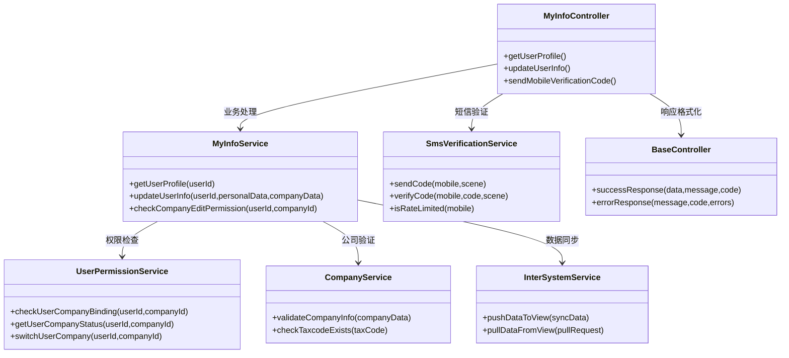

##### 3.3.4.2 代码实现

- **MyInfoController.php**
  - **文件路径**:`packages/MyInfo/src/Controllers/MyInfoController.php`
  - **文件状态**:新增
  - **方法**:
    - **getUserProfile()**  
      - **功能描述**:获取当前登录用户的完整个人信息和公司信息，包含编辑权限状态。
      - **方法状态**:新增  
      - **调用顺序**:用户进入个人信息页面时调用  
      - **依赖服务**:
        - `MyInfoService::getUserProfile($userId)`
        - `auth('sanctum')->user()`
        - `Log::channel('business')->info()`
      - **请求参数**:无
      - **响应数据**:  

        | 参数名称 | 数据类型 | 描述                  |
        |----------|----------|-----------------------|
        | success  | Boolean  | 是否获取成功           |
        | userInfo | Object   | 用户个人信息           |
        | companyInfo | Object | 关联公司信息（如有）   |
        | editPermissions | Object | 字段编辑权限       |
        | bindingStatus | String | 公司绑定状态（active/inactive/none）|
        | canEditCompany | Boolean | 是否可编辑公司信息   |

    - **updateUserInfo(UpdateUserInfoRequest $request)**
      - **功能描述**:统一更新用户个人信息和公司信息，手机号修改需要验证码确认，根据绑定状态控制公司信息的修改。
      - **方法状态**:新增  
      - **调用顺序**:用户提交信息修改时调用  
      - **依赖服务**:
        - `MyInfoService::updateUserInfo($userId, $personalData, $companyData)`
        - `SmsVerificationService::verifyCode($mobile, $code, 'change_mobile')`
        - `auth('sanctum')->user()`
        - `Log::channel('business')->info()`
      - **请求参数**:使用UpdateUserInfoRequest进行验证

      - **响应数据**:  

        | 参数名称 | 数据类型 | 描述                  |
        |----------|----------|-----------------------|
        | success  | Boolean  | 是否更新成功           |
        | updatedPersonalFields | Array | 实际更新的个人字段 |
        | updatedCompanyFields | Array | 实际更新的公司字段   |
        | userInfo | Object   | 更新后的用户信息       |
        | companyInfo | Object | 更新后的公司信息     |
        | message  | String   | 操作结果提示           |

    - **sendMobileVerificationCode()**
      - **功能描述**:发送手机号修改验证码到新手机号。
      - **方法状态**:新增  
      - **调用顺序**:用户输入新手机号并申请修改时调用  
      - **依赖服务**:
        - `SmsVerificationService::sendCode($newmMobile, 'change_mobile')`
        - `SmsVerificationService::isRateLimited($newmMobile)`
        - `User::where('mobile', $newmMobile)->exists()`
        - `Log::channel('business')->info()`
      - **请求参数**:  

        | 参数名称  | 数据类型 | 是否必填 | 描述             |
        |-----------|----------|----------|------------------|
        | newmMobile  | String   | 是       | 新手机号         |

      - **响应数据**:  

        | 参数名称 | 数据类型 | 描述                  |
        |----------|----------|-----------------------|
        | success  | Boolean  | 是否发送成功           |
        | message  | String   | 提示信息               |
        | expireTime | Integer | 验证码有效期(秒)       |
        | maskedMobile | String | 脱敏后的手机号       |

- **MyInfoService.php**
  - **文件路径**:`packages/MyInfo/src/Services/MyInfoService.php`
  - **文件状态**:新增
  - **方法**:

    - **getUserProfile($userId)**
      - **功能描述**:获取用户完整档案信息，包括个人信息、公司信息和编辑权限
      - **方法状态**:新增
      - **返回数据**:用户档案对象和权限信息

    - **updateUserInfo($userId, $personalData, $companyData)**
      - **功能描述**:统一处理用户个人信息和公司信息更新，权限验证和历史记录
      - **方法状态**:新增
      - **返回数据**:更新结果和变更详情

    - **checkCompanyEditPermission($userId, $companyId)**
      - **功能描述**:检查用户是否有权限编辑特定公司信息
      - **方法状态**:新增
      - **返回数据**:Boolean权限结果

- **AccountManageService.php**
  - **文件路径**:`packages/MyInfo/src/Services/AccountManageService.php`
  - **文件状态**:新增
  - **方法**:

    - **deleteAccount($userId, $reason)**
      - **功能描述**:处理用户账户注销的业务逻辑，执行软删除并记录完整变更历史
      - **方法状态**:新增
      - **返回数据**:注销结果和历史记录信息

    - **unbindAllCompanies($userId)**
      - **功能描述**:解绑用户所有公司关联关系，更新user_company表状态
      - **方法状态**:新增
      - **返回数据**:解绑的公司列表和数量

    - **validateDeletePermission($userId)**
      - **功能描述**:验证用户注销，检查账户状态和身份验证
      - **方法状态**:新增
      - **返回数据**:Boolean权限结果

### 3.4 Inquiry 模块

#### 3.4.1 业务流程

##### 3.4.1.1 业务背景

- **背景**:Partner可以发起技术咨询, 填写咨询后由销售进行回复, 销售回复后可以进行评价。

- **主要流程**:

  - **问询列表 数据展示逻辑**
    - **Partner(active)**:可查看公司内所有问询记录
    - **Partner(pending)**:只能查看个人创建的问询，active时, 数据来源都是 VIEW,不会再从Portal端获取数据
    - 数据存储策略:未激活存Portal端，激活后同步/后续存储都在VIEW端，Portal端数据定时脚本清理
    - 显示范围:过去12个月记录，按时间降序
    - 可以筛选 并查看同公司下其它联系人的 问询,但是不能评价

  - **发起问询**
    - 用户选择问题分类（后台配置的分类列表）
    - 填写具体问题内容和描述
    - 系统创建问询记录，状态为Open
    

  - **Open列表**:已提问但未回复
    

  - **Rating列表**:销售已回复待评价（默认进入）
    - 销售人员回复问题，状态变更为Rating
    - 用户收到回复通知，进行1-5星评价
    - 评价完成后状态变更为Closed(或者30天未处理 自动关闭)
    

  - **Closed列表**:已评价完成或自动关闭(包含 30天未评价)
    

  - **邮件通知阶段**:
    - 优先根据scene参数查找绑定的销售ID
    - 无销售ID绑定时，根据MainOperatingCities查找对应的Branch Manager 默认第一个
    - <mark style="background-color: #ffeb3b; color: #d32f2f;">**[待定]** 发送邮件给Sales或Branch manager（邮件内容待定）</mark>

- **异常流程**:  
  - 创建问询失败 → 允许重新创建
  - 评价提交失败 → 允许重新评价

- **流程图**:

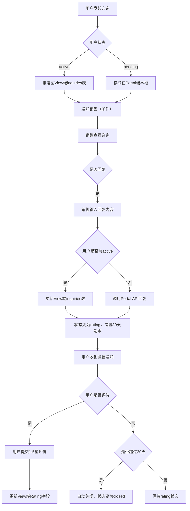

#### 3.4.2 影响的数据表

- Porta端
  - **[users](#table-users)** : Portal端 User基础信息表
  - **[companies](#table-companies)** : Portal端 Company 基础信息表
  - **[user_company](#table-user_company)** : User&Company 关联表(记录 Partner 当前状态)
  - **[inquiries](#table-inquiries)** : 存储问询记录
  - **[inquiry_ratings](#table-inquiry_ratings)** : 存储问询评分详情
  - **[user_company_assignment](#table-user_company_assignment)** : Portal端 Partner 关联 销售表
  - **[general_options](#table-general_options)** : 基础配置表

- View端
  - **[mod_channel_inquiries](#table-mod_channel_inquiries)** : View端 记录咨询信息
  - **[mod_channel_inquiry_ratings](#table-inquiry_ratings)** : View端 记录咨询评价
  - **[customer_employee](#table-customer_employee)** :View端Customer 关联销售表

#### 3.4.3 前端实现

##### 3.4.3.1 视图目录结构

```plaintext
/src/views/inquiry/
  InquiryMain.vue              - 问询主页面
  CreateInquiry.vue            - 发起问询页面

/src/components/inquiry/
  InquiryList.vue              - 问询列表组件
  InquiryCard.vue              - 问询卡片组件
  RatingModal.vue              - 评价组件
```

##### 3.4.3.2 关键组件功能

- **InquiryMain.vue**
  - 4个状态标签页:Rating(默认)、Open、Closed、All
  - 集成问询列表和创建入口
  - 权限状态检查和数据过滤

- **InquiryList.vue**
  - 问询列表展示，支持分页加载
  - 根据用户权限过滤数据（个人/公司）
  - 过去12个月数据，按时间降序

- **RatingModal.vue**
  - 1-5星评价组件
  - 评价提交和状态更新

##### 3.4.3.3 API设计

| HTTP 方法 | 端点                          | 描述                    |
|-----------|-------------------------------|-------------------------|
| GET       | `/api/inquiry`                | 获取问询列表(支持状态筛选) |
| POST      | `/api/inquiry`                | 发起新问询 |
| POST      | `/api/inquiry/{id}/rating`    | 提交评价 |
| GET       | `/api/inquiry/categories`     | 获取问题分类 |

#### 3.4.4 功能开发与实现

##### 3.4.4.1 类关系图

##### 3.4.4.2 代码实现

- **InquiryController.php**
  - **文件路径**:`packages/Inquiry/src/Controllers/InquiryController.php`
  - **文件状态**:新增
  - **方法**:
    - **index()**
      - **功能描述**:显示咨询列表页面，根据用户权限过滤数据。Active用户咨询从View端inquiries表查询，inactive用户咨询通过Portal API获取，最后合并展示。仅显示最近12个月数据，默认显示Open状态。
      - **方法状态**:新增
      - **依赖服务**:InquiryService, InquiryStatsService
      - **请求参数**:

        | 参数名称 | 数据类型 | 是否必填 | 描述 |
        |----------|----------|----------|------|
        | status | String | 否 | 状态筛选(open/rating/closed/all)，默认open |
        | sales | String | 否 | 销售人员筛选 |
        | partner | String | 否 | 渠道商筛选 |
        | category | String | 否 | 分类筛选 |
        | createDate | String | 否 | 创建日期筛选 |
        | page | Integer | 否 | 页码，默认1 |
        | perPage | Integer | 否 | 每页条数，默认15 |

      - **响应数据**:

        | 参数名称 | 数据类型 | 描述 |
        |----------|----------|------|
        | inquiries | Array | 咨询列表（合并Active和Inactive数据） |
        | pagination | Object | 分页信息 {current_page, total_pages, total_count} |
        | filterOptions | Object | 筛选条件选项 {sales_list, category_list} |
        | statusCounts | Object | 各状态咨询数量 {open, rating, closed, all} |
        | defaultStatus | String | 默认状态（open） |
        | portalDataStatus | String | Portal数据获取状态 (success/failed/partial) |

    - **reply()**
      - **功能描述**:处理咨询回复，实现独占机制。Active用户咨询存储回复到View端inquiries表的SalesReply字段，inactive用户咨询通过API操作Portal端。回复后其他销售无法查看，状态变为Rating，设置RatingDeadline为30天后。
      - **方法状态**:新增
      - **依赖服务**:InquiryService
      - **请求参数**:

        | 参数名称 | 数据类型 | 是否必填 | 描述 |
        |----------|----------|----------|------|
        | inquiryId | Integer | 是 | 咨询ID |
        | replyContent | String | 是 | 回复内容 |
        | registerChannel | Boolean | 否 | 是否为Portal端数据 |
        | portalInquiryId | Integer | 否 | Portal端咨询ID |

      - **响应数据**:

        | 参数名称 | 数据类型 | 描述 |
        |----------|----------|------|
        | success | Boolean | 回复是否成功 |
        | inquiryStatus | String | 更新后咨询状态（rating） |
        | exclusiveLocked | Boolean | 是否获得独占锁 |
        | ratingDeadline | String | 评价截止时间 |
        | message | String | 操作结果信息 |
        | registerChannel | String | 数据来源(view/portal) |

    - **getStats()**
      - **功能描述**:获取咨询统计数据，根据权限返回不同详细程度的统计信息。仅统计View端inquiries表中的Active用户数据。
      - **方法状态**:新增
      - **依赖服务**:InquiryStatsService
      - **请求参数**:

        | 参数名称 | 数据类型 | 是否必填 | 描述 |
        |----------|----------|----------|------|
        | statsType | String | 否 | 统计类型(country/branch/sales)，默认sales |
        | dateRange | String | 否 | 日期范围(last_year) |
        | salesFilter | String | 否 | 销售人员筛选 |

      - **响应数据**:

        | 参数名称 | 数据类型 | 描述 |
        |----------|----------|------|
        | stats | Object | 统计数据 |
        | averages | Object | 平均评分 {professional, timeliness, satisfaction, overall}（仅查看全部权限） |
        | showRatings | Boolean | 是否显示评分（基于权限） |
        | permissionLevel | String | 用户权限级别(view/view_all) |
        | totalInquiries | Integer | 总咨询数 |
        | ratingDistribution | Object | 评分分布（仅查看全部权限） |

- **InquiryService.php**
  - **文件路径**:`packages/Inquiry/src/Services/InquiryService.php`
  - **文件状态**:新增
  - **方法**:
    - **getInquiriesWithPermission($userId, $filters, $pagination)**
      - **功能描述**:根据用户权限获取咨询列表。查询View端inquiries表获取Active用户咨询，调用Portal API获取inactive用户咨询，最后合并返回。Sales只能看自己的，SalesManager能看所有。解析JSON字段用于展示。
      - **方法状态**:新增
      - **处理流程**:
            1. 检查用户权限（view/view_all）
            2. 查询inquiries表，过滤最近12个月数据
            3. 解析AssignedSales
            4. 调用Portal API获取inactive用户数据
            5. 合并两部分数据并分页
            6. 解析Rating用于列表展示
      - **返回数据**:权限过滤后的咨询列表（合并数据）

    - **getActiveUserInquiries($userId, $filters)**
      - **功能描述**:从View端inquiries表查询Active用户的咨询数据，解析JSON字段
      - **方法状态**:新增
      - **返回数据**:Active用户咨询列表

    - **getInactiveUserInquiries($userId)**
      - **功能描述**:调用Portal API获取inactive用户的咨询数据
      - **方法状态**:新增
      - **返回数据**:Inactive用户咨询列表

    - **replyToActiveInquiry($inquiryId, $userId, $replyContent)**
      - **功能描述**:回复Active用户咨询，存储回复到View端inquiries表的SalesReply字段，实现独占机制，更新状态为Rating，设置RatingDeadline为30天后
      - **方法状态**:新增
      - **处理流程**:
          1. 检查咨询是否仍为Open状态
          2. 设置独占锁，更新RepliedBy和RepliedName字段
          3. 更新SalesReply字段存储回复内容
          4. 更新Status为'rating'，设置RatingDeadline（当前时间+30天）
          5. 更新LastModifiedDate
          6. 对其他销售隐藏该咨询
          7. 调用Portal API通知用户（发送微信消息）
      - **返回数据**:回复结果和状态

    - **replyToInactiveInquiry($userId, $replyContent)**
      - **功能描述**:回复Inactive用户咨询，通过Portal API操作Portal端数据，设置评价截止时间
      - **方法状态**:新增
      - **处理流程**:
          1. 调用Portal API发送回复
          2. Portal端更新状态为Rating
          3. Portal端设置30天评价期限
          4. Portal端触发微信通知
      - **返回数据**:回复结果

    - **processAutoClose()**
      - **功能描述**:定时任务处理咨询自动关闭，仅处理View端inquiries表中的数据
      - **方法状态**:新增
      - **处理流程**:
          1. 扫描用户30天未评价的Rating状态咨询（RatingDeadline < NOW()）
          2. 批量更新Status为'closed'，设置AutoClosed=1
          3. 设置ClosedDate为当前时间
          4. 记录自动关闭日志
      - **返回数据**:处理的咨询数量统计

    - **syncInquiriesFromPortal($userId, $portalData)**
      - **功能描述**:用户激活时将Portal端所有咨询数据同步到View端inquiries表存储，将Portal端的数组数据转换为JSON格式
      - **方法状态**:新增
      - **处理流程**:
          1. 验证Portal咨询数据完整性
          2. 转换AssignedSales 逗号分割
          3. 处理失败项记录错误日志
      - **返回数据**:同步结果统计

### 3.5 Project模块

#### 3.5.1 业务流程

##### 3.5.1.1 业务背景

- **背景**:Partner可以自行创建项目,也可以接受拒绝由系统分配的项目。

- **主要流程**:

  - **添加/编辑项目**
    - 用户自主创建项目，填写项目基本信息
    - 系统验证项目名称重复性
    - 项目默认状态为Pre-Lead
    - 项目状态不可编辑
    
    

  - **ongoing列表**
    - Partner自己创建的项目 Pending时 仅能看到自己, Active后可以看到 Company下所有
    

  - **tke分配项目列表**
    - Partner 状态 Active后, 可以操作View端 分配的项目 接受/拒绝
    - 可以查看详情 但是不能编辑, 接收后 进入ongoing列表
    - 24小时内不处理, 则标记取消状态
    
    

  - **All**
    

  - **项目分配逻辑**
    - 项目分配基于**Company维度**, 不会直接绑定Portal User
    - 项目分配给Company后, active Portal User 立即可见 并操作
    - 分配项目后, 推送 wechat消息
    - 接受/拒绝/24小时过期 后 都会给 View端销售 推送邮件
    - 24小时过期项目, 不会在列表中展示

- **异常流程**:
  - 项目名重复 → 根据View端Project 校验
  - 已过期项目,用户继续操作 → 系统拒绝
  - 数据同步异常 → 记录错误日志

- **流程图**:

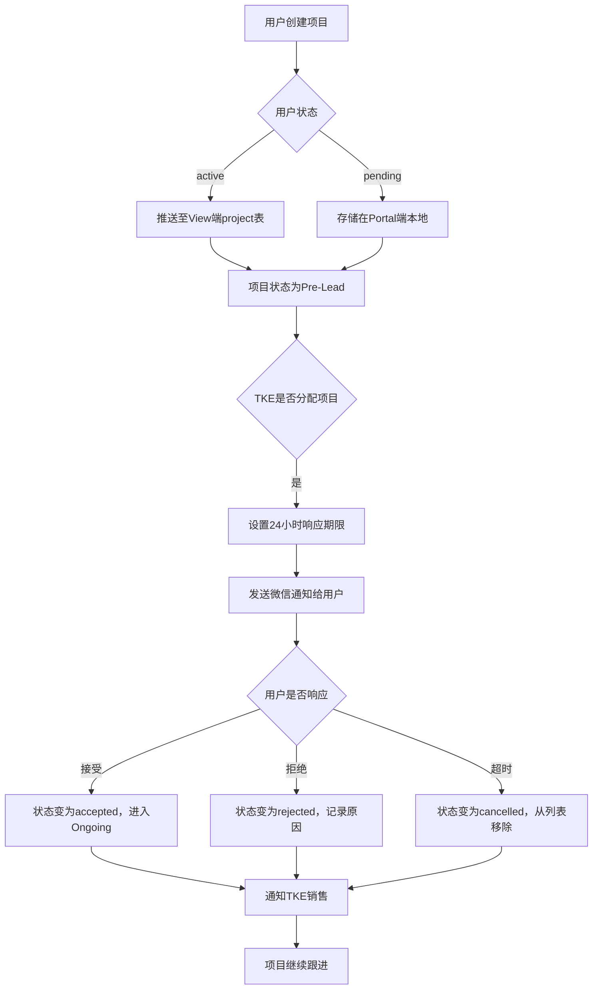

#### 3.5.2 影响的数据表

- Portal端
  - **[user_company](#table-companies)** : User&Company 关联表(记录 Partner 当前状态)
  - **[leads](#table-leads)** : Portal端 Project 基础信息表
- View端
  - **[project](#table-project)** : View端 Project 信息表
  - **[project_customer](#table-project)** : View端 Project 信息表
  - **[projectbank](#table-projectbank)** : View端 Project 信息表
  - **[projectbank_unitdetails](#table-projectbank_unitdetails)** : View端 Project 信息表

#### 3.5.3 前端实现

##### 3.5.3.1 视图目录结构

```plaintext
/src/views/project/
  ProjectMain.vue              - 项目主页面
  CreateProject.vue            - 创建项目页面

/src/components/project/
  ProjectList.vue              - 项目列表组件
  ProjectForm.vue              - 项目表单组件
  ProjectActions.vue           - 项目操作组件
```

##### 3.5.3.2 关键组件功能

- **ProjectMain.vue**
  - 3个状态标签页:TKE(默认)、Ongoing、All
  - 集成项目列表和创建入口
  - 权限状态检查和数据过滤

- **ProjectList.vue**
  - 项目列表展示，支持搜索
  - 根据用户权限过滤数据（个人/公司）
  - TKE项目显示接受/拒绝操作

- **ProjectActions.vue**
  - TKE项目:接受/拒绝操作
  - Ongoing项目:编辑操作
  - 权限控制的操作按钮显示

##### 3.5.3.3 API设计

| HTTP 方法 | 端点                          | 描述                    |
|-----------|-------------------------------|-------------------------|
| GET       | `/api/project`                | 获取项目列表(支持状态筛选) |
| POST      | `/api/project`                | 创建新项目 |
| PUT       | `/api/project/{id}`           | 更新项目信息 |
| POST      | `/api/project/{id}/accept`    | 接受TKE项目 |
| POST      | `/api/project/{id}/reject`    | 拒绝TKE项目 |

#### 3.5.4 功能开发与实现

##### 3.5.4.1 类关系图

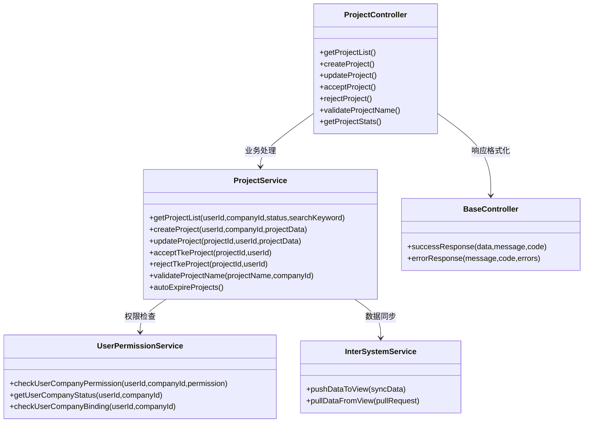

##### 3.5.4.2 代码实现

- **ProjectController.php**
  - **文件路径**:`packages/ProjectManagement/src/Controllers/ProjectController.php`
  - **文件状态**:新增
  - **方法**:
    - **getProjectList()**  
      - **功能描述**:获取项目列表，根据用户权限过滤数据，支持状态筛选和搜索，显示不同类型项目分类。集成日志记录。  
      - **方法状态**:新增  
      - **调用顺序**:用户进入项目页面或切换状态标签时调用  
      - **依赖服务**:
        - `ProjectService::getProjectList()`
        - `auth('sanctum')->user()`
        - `Log::channel('business')->info()`
      - **请求参数**:  

        | 参数名称 | 数据类型 | 是否必填 | 描述             |
        |----------|----------|----------|------------------|
        | status   | String   | 否       | 状态筛选(tke/ongoing/all) |
        | userId   | Integer   | 否       | 用户ID（默认自己） |
        | search   | String   | 否       | 项目名称搜索关键词 |
        | page     | Integer  | 否       | 页码(默认1) |
        | pageSize | Integer  | 否       | 每页条数(默认20) |

      - **响应数据**:  

        | 参数名称 | 数据类型 | 描述                  |
        |----------|----------|-----------------------|
        | success  | Boolean  | 是否获取成功           |
        | projects | Array    | 项目列表数据           |
        | total    | Integer  | 总记录数               |
        | stats    | Object   | 各状态统计数量         |
        | hasMore  | Boolean  | 是否有更多数据         |
        | userPermission | String | 用户权限级别(personal/company) |

    - **createProject()**
      - **功能描述**:创建新项目，验证项目名重复性（根据配置），设置默认状态为Pre-Lead，根据用户状态选择存储位置。集成完整日志记录。  
      - **方法状态**:新增  
      - **调用顺序**:用户提交项目创建表单时调用  
      - **依赖服务**:
        - `ProjectService::createProject()`
        - `auth('sanctum')->user()`
        - `Log::channel('business')->info()`
      - **请求参数**:  

        | 参数名称   | 数据类型 | 是否必填 | 描述             |
        |------------|----------|----------|------------------|
        | projectName | String  | 是       | 项目名称(最大40字符) |
        | modernizationScope | String | 是 | 改造范围(full_mod/partial_mod) |
        | brand      | String   | 是       | 品牌(tke/sanfte) |
        | province   | String   | 是       | 省份 |
        | city       | String   | 是       | 城市 |
        | district   | String   | 是       | 区县 |
        | detailAddress | String | 否     | 详细地址 |
        | unitsCount | Integer  | 是       | 梯台数 |
        | contractValue | Decimal | 是     | 合同金额 |
        | forecastTenderDate | Date | 是   | 预计报价日期 |

      - **响应数据**:  

        | 参数名称 | 数据类型 | 描述                  |
        |----------|----------|-----------------------|
        | success  | Boolean  | 是否创建成功           |
        | projectId | Integer | 项目ID                 |
        | status   | String   | 项目状态               |
        | message  | String   | 提示信息               |

    - **acceptProject()**
      - **功能描述**:接受TKE分配项目，验证项目类型和用户权限，更新项目状态为accepted，记录接受时间。集成日志记录。  
      - **方法状态**:新增  
      - **调用顺序**:用户点击接受TKE项目时调用  
      - **依赖服务**:
        - `ProjectService::acceptTkeProject()`
        - `Log::channel('business')->info()`
      - **请求参数**:  

        | 参数名称 | 数据类型 | 是否必填 | 描述             |
        |----------|----------|----------|------------------|
        | projectId | Integer | 是       | 项目ID           |

      - **响应数据**:  

        | 参数名称 | 数据类型 | 描述                  |
        |----------|----------|-----------------------|
        | success  | Boolean  | 是否接受成功           |
        | projectStatus | String | 更新后项目状态       |
        | acceptedAt | DateTime | 接受时间             |
        | message  | String   | 提示信息               |

    - **rejectProject()**
      - **功能描述**:拒绝TKE分配项目，验证项目类型和用户权限，更新项目状态为rejected，记录拒绝时间和原因。集成日志记录。  
      - **方法状态**:新增  
      - **调用顺序**:用户点击拒绝TKE项目时调用  
      - **依赖服务**:
        - `ProjectService::rejectTkeProject()`
        - `Log::channel('business')->info()`
      - **请求参数**:  

        | 参数名称 | 数据类型 | 是否必填 | 描述             |
        |----------|----------|----------|------------------|
        | projectId | Integer | 是       | 项目ID           |
        | comments | String   | 否       | 拒绝原因         |

      - **响应数据**:  

        | 参数名称 | 数据类型 | 描述                  |
        |----------|----------|-----------------------|
        | success  | Boolean  | 是否拒绝成功           |
        | projectStatus | String | 更新后项目状态       |
        | rejectedAt | DateTime | 拒绝时间             |
        | message  | String   | 提示信息               |

    - **updateProject()**
      - **功能描述**:更新项目信息，检查编辑权限（锁定状态/创建者），验证字段合法性，记录变更历史。集成日志记录。  
      - **方法状态**:新增  
      - **调用顺序**:用户提交项目编辑表单时调用  
      - **依赖服务**:
        - `ProjectService::updateProject()`
        - `Log::channel('business')->info()`
      - **请求参数**:  

        | 参数名称 | 数据类型 | 是否必填 | 描述             |
        |----------|----------|----------|------------------|
        | projectId | Integer | 是       | 项目ID           |
        | projectName | String | 是      | 项目名称         |
        | modernizationScope | String | 是 | 改造范围       |
        | brand    | String   | 是       | 品牌选择         |
        | province | String   | 是       | 省份             |
        | city     | String   | 是       | 城市             |
        | district | String   | 是       | 区县             |
        | detailAddress | String | 否   | 详细地址         |
        | unitsCount | Integer | 是     | 梯台数           |
        | contractValue | Decimal | 是   | 合同金额         |
        | forecastTenderDate | Date | 是 | 预计报价日期 |

      - **响应数据**:  

        | 参数名称 | 数据类型 | 描述                  |
        |----------|----------|-----------------------|
        | success  | Boolean  | 是否更新成功           |
        | projectStatus | String | 项目状态             |
        | isEditable | Boolean | 是否仍可编辑         |
        | lastModified | DateTime | 最后修改时间       |
        | message  | String   | 提示信息               |

    - **validateProjectName()**
      - **功能描述**:验证项目名称重复性，根据配置开关决定是否检查，支持同公司内项目名唯一性验证。集成日志记录。  
      - **方法状态**:新增  
      - **调用顺序**:项目创建/编辑时实时验证或表单提交前调用  
      - **依赖服务**:
        - `ProjectService::validateProjectName()`
      - **请求参数**:  

        | 参数名称 | 数据类型 | 是否必填 | 描述             |
        |----------|----------|----------|------------------|
        | projectName | String | 是      | 项目名称         |
        | companyId | Integer | 是       | 公司ID           |
        | excludeId | Integer | 否       | 排除的项目ID(编辑时) |

      - **响应数据**:  

        | 参数名称 | 数据类型 | 描述                  |
        |----------|----------|-----------------------|
        | success  | Boolean  | 验证是否通过           |
        | isUnique | Boolean  | 名称是否唯一           |
        | duplicateId | Integer | 重复项目ID(如果有)    |
        | message  | String   | 验证结果信息           |

- **ProjectService.php**
  - **文件路径**:`packages/ProjectManagement/src/Services/ProjectService.php`
  - **文件状态**:新增
  - **方法**:
    - **getProjectList($userId, $companyId, $status, $searchKeyword)**
      - **功能描述**:获取用户可访问的项目列表，根据权限过滤数据，支持状态筛选和搜索
      - **方法状态**:新增
      - **返回数据**:项目列表数组和统计信息

    - **createProject($userId, $companyId, $projectData)**
      - **功能描述**:创建新项目记录，验证项目名重复性，设置默认状态，根据用户状态选择存储位置
      - **方法状态**:新增
      - **返回数据**:项目ID和存储位置信息

    - **updateProject($projectId, $userId, $projectData)**
      - **功能描述**:更新项目信息，记录变更历史，必要时同步到VIEW
      - **方法状态**:新增
      - **返回数据**:更新结果和项目状态

    - **acceptTkeProject($projectId, $userId)**
      - **功能描述**:接受TKE分配项目，更新状态为accepted
      - **方法状态**:新增
      - **返回数据**:接受结果和项目状态

    - **rejectTkeProject($projectId, $userId)**
      - **功能描述**:拒绝TKE分配项目，更新状态为rejected，记录拒绝原因
      - **方法状态**:新增
      - **返回数据**:拒绝结果和项目状态

    - **validateProjectName($projectName, $companyId)**
      - **功能描述**:验证项目名称在同公司内的唯一性，根据配置开关决定是否检查
      - **方法状态**:新增
      - **返回数据**:验证结果和重复信息

    - **autoExpireProjects()**
      - **功能描述**:自动处理超过24小时未处理的TKE项目，批量更新为过期状态
      - **方法状态**:新增
      - **返回数据**:过期项目数量

### 3.6 TKE Library模块

#### 3.6.1 业务流程

##### 3.6.1.1 业务背景

- **背景**:TKE Library模块提供文件管理和展示功能。根据用户状态控制文件访问权限:Inactive用户只能访问inactive level的文件，Active用户可以访问inactive和active level文件，AGR用户可以访问所有类别的文件，其他用户无权访问。

- **主要流程**

  - **文件列表**
    - Portal端保存文件关联关系和分组信息
    - 设置文件分类和目录结构
    - 支持文件预览
    - 提供文件下载功能
    
    

- **异常流程**:
  - 文件不存在 → 显示错误信息并记录日志
  - 下载失败 → 重试机制和错误提示
  - 预览不支持 → 提供下载选项

- **流程图**:

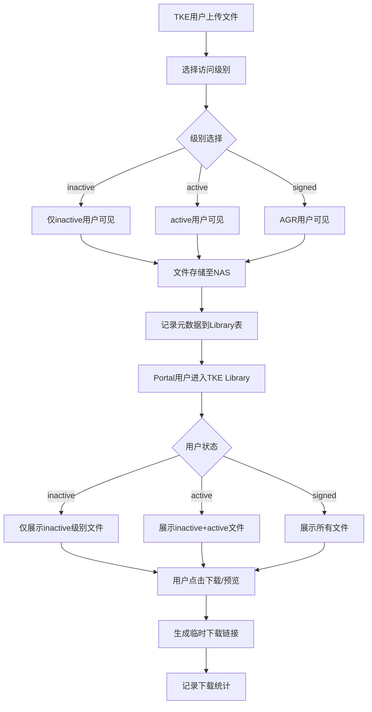

#### 3.6.2 影响的数据表

- **[user_company](#table-user_company)** : User&Company 关联表(记录 Partner 当前状态)
- **[librarys](#table-librarys)** : Portal端 文件关系 文件信息表

#### 3.6.3 前端实现

##### 3.6.3.1 视图目录结构

```plaintext
/src/views/Library/
  LibraryMain.vue              - TKE Library主页面

/src/components/Library/
  LibraryFileList.vue          - 文件列表组件
  LibraryPreviewModal.vue      - 预览弹窗组件
```

##### 3.6.3.2 关键组件功能

- **LibraryMain.vue**
  - 文件目录浏览
  - 权限状态检查(active/inactive/agr状态严格匹配)
  - 文件预览和下载功能

- **LibraryFileList.vue**
  - 文件列表展示
  - 根据用户状态过滤文件
  - 支持文件图标和缩略图

##### 3.6.3.3 TKE Library API设计

| HTTP 方法 | 端点                          | 描述                    |
|-----------|-------------------------------|-------------------------|
| GET       | `/api/Library/files`             | 获取文件列表(按权限过滤) |
| GET       | `/api/Library/download/{id}`     | 下载文件 |
| GET       | `/api/Library/preview/{id}`      | 预览文件 |

#### 3.6.4 功能开发与实现

##### 3.6.4.1 类关系图

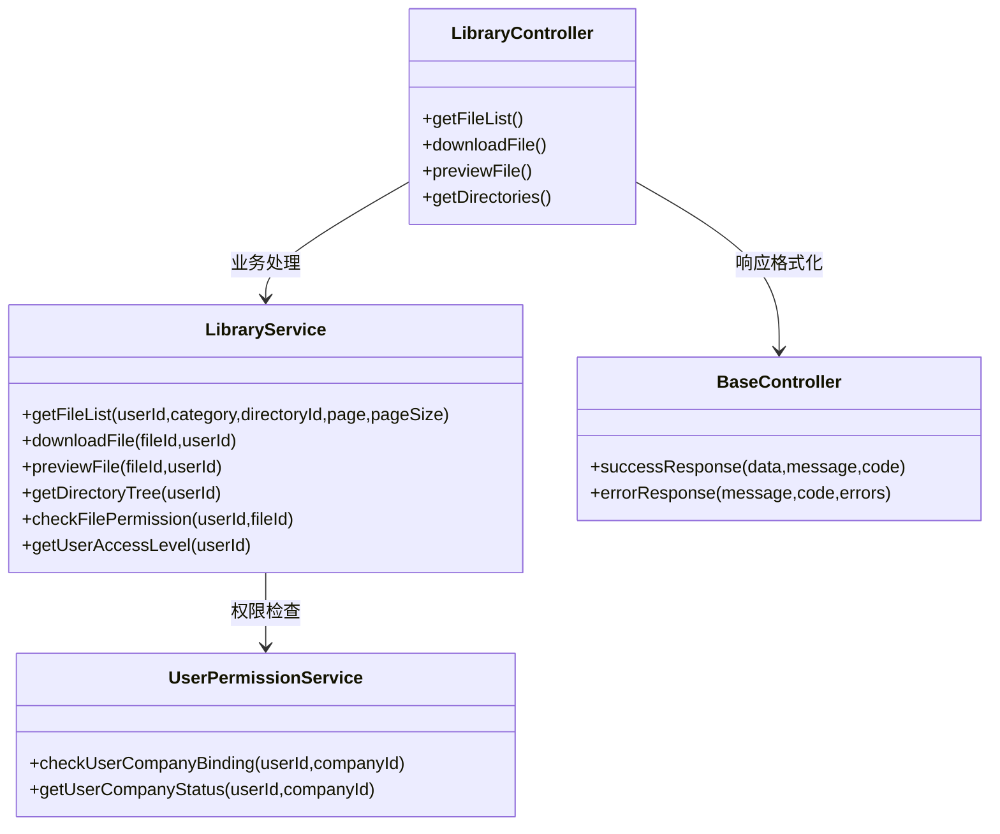

##### 3.6.4.2 代码实现

- **LibraryController.php**
  - **文件路径**:`packages/TkeLibrary/src/Controllers/LibraryController.php`
  - **文件状态**:新增
  - **方法**:
    - **getFileList()**  
      - **功能描述**:获取TKE Library文件列表，根据用户状态严格匹配文件状态(active用户只能看active文件，inactive用户只能看inactive文件，agr用户只能看agr文件)，支持目录浏览和分类筛选。  
      - **方法状态**:新增  
      - **调用顺序**:用户进入TKE Library页面或切换目录时调用  
      - **依赖服务**:
        - `LibraryService::getFileList()`
        - `auth('sanctum')->user()`
        - `Log::channel('business')->info()`
      - **请求参数**:  

        | 参数名称 | 数据类型 | 是否必填 | 描述             |
        |----------|----------|----------|------------------|
        | category | String   | 否       | 文件分类(files/report_two) |
        | directoryId | Integer | 否     | 目录ID(浏览子目录) |
        | page     | Integer  | 否       | 页码(默认1) |
        | pageSize | Integer  | 否       | 每页条数(默认20) |

      - **响应数据**:  

        | 参数名称 | 数据类型 | 描述                  |
        |----------|----------|-----------------------|
        | success  | Boolean  | 是否获取成功           |
        | files    | Array    | 文件列表数据           |
        | directories | Array | 目录列表数据           |
        | total    | Integer  | 总记录数               |
        | userStatus | String | 用户状态级别(active/inactive/agr) |
        | hasMore  | Boolean  | 是否有更多数据         |

    - **downloadFile()**
      - **功能描述**:下载指定文件，验证用户状态展示对应文件，生成安全下载链接。支持断点续传。  
      - **方法状态**:新增  
      - **调用顺序**:用户点击下载按钮时调用  
      - **依赖服务**:
        - `LibraryService::downloadFile()`
        - `LibraryService::checkFilePermission()`
        - `Log::channel('business')->info()`
      - **请求参数**:  

        | 参数名称 | 数据类型 | 是否必填 | 描述             |
        |----------|----------|----------|------------------|
        | fileId   | Integer  | 是       | 文件ID           |
        | range    | String   | 否       | 断点续传范围     |

      - **响应数据**:  

        | 参数名称 | 数据类型 | 描述                  |
        |----------|----------|-----------------------|
        | success  | Boolean  | 是否下载成功           |
        | downloadUrl | String | 安全下载链接(临时)     |
        | fileName | String   | 文件名称               |
        | fileSize | Integer  | 文件大小               |
        | mimeType | String   | 文件类型               |

    - **previewFile()**
      - **功能描述**:预览指定文件，验证用户状态展示对应文件，支持图片、PDF等格式在线预览，生成预览链接。  
      - **方法状态**:新增  
      - **调用顺序**:用户点击预览按钮或文件卡片时调用  
      - **依赖服务**:
        - `LibraryService::previewFile()`
        - `LibraryService::checkFilePermission()`
        - `Log::channel('business')->info()`
      - **请求参数**:  

        | 参数名称 | 数据类型 | 是否必填 | 描述             |
        |----------|----------|----------|------------------|
        | fileId   | Integer  | 是       | 文件ID           |
        | quality  | String   | 否       | 预览质量(high/medium/low) |

      - **响应数据**:  

        | 参数名称 | 数据类型 | 描述                  |
        |----------|----------|-----------------------|
        | success  | Boolean  | 是否预览成功           |
        | previewUrl | String | 预览链接               |
        | previewType | String | 预览类型(image/pdf/unsupported) |
        | fileName | String   | 文件名称               |
        | canDownload | Boolean | 是否允许下载         |

- **LibraryService.php**
  - **文件路径**:`packages/TkeLibrary/src/Services/LibraryService.php`
  - **文件状态**:新增
  - **方法**:
    - **getFileList($userId, $category, $directoryId, $page, $pageSize)**
      - **功能描述**:获取用户可访问的文件列表，严格按用户状态过滤对应状态的文件，支持分页和目录筛选
      - **方法状态**:新增
      - **返回数据**:文件列表数组和分页信息

    - **downloadFile($fileId, $userId)**
      - **功能描述**:处理文件下载逻辑，验证用户状态获取对应文件生成下载链接
      - **方法状态**:新增
      - **返回数据**:下载URL和文件信息

    - **previewFile($fileId, $userId)**
      - **功能描述**:处理文件预览逻辑，验证状态匹配后生成预览链接，支持多种文件格式
      - **方法状态**:新增
      - **返回数据**:预览URL和文件类型

    - **getDirectoryTree($userId)**
      - **功能描述**:获取用户可访问的目录树结构，支持层级导航
      - **方法状态**:新增
      - **返回数据**:目录树数据和导航信息

    - **getUserAccessLevel($userId)**
      - **功能描述**:获取用户的访问级别，确定可访问的文件状态
      - **方法状态**:新增
      - **返回数据**:用户状态级别(active/inactive/agr)

### 3.7 AGR Homepage

#### 3.7.1 业务流程

##### 3.7.1.1 业务背景

- **背景**:当用户选择AGR类型公司时，系统跳转到VIEW的AGR Homepage。

- **主要流程**:

  1. **AGR识别**:检查companies.CompanyStatus = '1'
  2. **跳转处理**:重定向到VIEW系统的AGR Homepage
  3. **返回处理**:从VIEW返回到Portal主界面

- **流程图**:

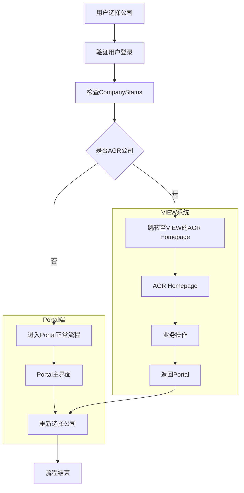

#### 3.7.2 数据表设计

- **[user_company](#table-user_company)** : User&Company 关联表(记录 Partner 当前状态)

#### 3.7.3 功能开发与实现

##### 3.7.3.1 类关系图

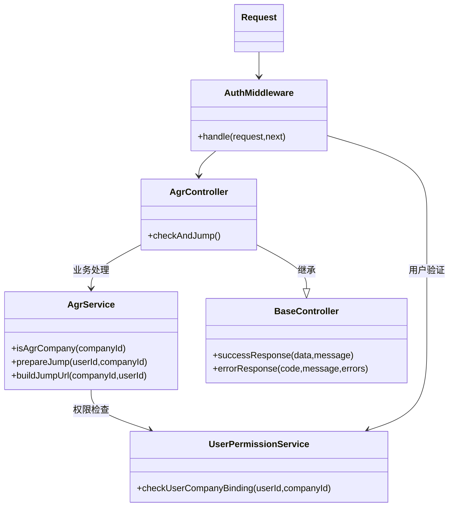

##### 3.7.3.2 API设计

| HTTP 方法 | 端点                      | 描述                    | 中间件 |
|-----------|---------------------------|-------------------------|--------|
| POST      | `/api/agr/check-and-jump` | 检查AGR并处理跳转       | auth:sanctum |

##### 3.7.3.3 代码实现

- **AgrController.php**

  - **文件路径**:`app/Http/Controllers/AgrController.php`
  - **文件状态**:新
  - **方法**:

    - **checkAndJump()**  
      - **功能描述**:检查公司类型，如果是AGR则跳转到VIEW/AGR Homepage，否则返回正常流程标识。  
      - **方法状态**:新增  
      - **调用顺序**:用户选择公司时调用  
      - **依赖服务**:
        - `AgrService::isAgrCompany()`
        - `AgrService::prepareJump()`
        - `UserPermissionService::checkUserCompanyBinding()`
        - `auth('sanctum')->user()`
      - **请求参数**:  

        | 参数名称 | 数据类型 | 是否必填 | 描述             |
        |----------|----------|----------|------------------|
        | companyId | Integer | 是       | 公司ID           |

      - **响应数据**:使用 `successResponse()` 返回

        | 参数名称 | 数据类型 | 描述                  |
        |----------|----------|-----------------------|
        | success  | Boolean  | 固定true              |
        | code     | Integer  | 成功状态码(2000)      |
        | data     | Object   | 包含以下字段          |
        | - isAgr    | Boolean  | 是否为AGR公司          |
        | - jumpUrl  | String   | 跳转URL（如果是AGR）   |
        | - action   | String   | 操作类型:'jump'或'normal' |
        | message  | String   | 处理结果信息           |

- **AgrService.php**
  - **文件路径**:`app/Services/Agr/AgrService.php`
  - **文件状态**:新增
  - **方法**:

    - **isAgrCompany($companyId)**
      - **功能描述**:检查公司是否为AGR类型，查询companies表的CompanyStatus字段
      - **方法状态**:新增
      - **参数**:公司ID
      - **返回数据**:Boolean结果

    - **prepareJump($userId, $companyId)**
      - **功能描述**:准备跳转AGR Homepage，构建跳转URL
      - **方法状态**:新增
      - **参数**:用户ID、公司ID
      - **业务逻辑**:
        1. 验证用户对AGR公司的访问权限
        2. 构造VIEW/AGR Homepage的跳转URL
        3. 记录跳转日志
      - **返回数据**:跳转URL和操作类型

    - **buildJumpUrl($companyId, $userId)**
      - **功能描述**:构建VIEW/AGR Homepage的跳转URL
      - **方法状态**:新增
      - **参数**:公司ID、用户ID
      - **业务逻辑**:
        1. 从配置文件读取VIEW基础URL
        2. 构造AGR Homepage路径
        3. 添加必要的跳转参数
      - **返回数据**:完整的跳转URL

## 4. Portal端 Testing Strategy

### 4.1 PHPUnit 单元测试设计

#### 4.1.1 服务层测试设计

##### 4.1.1.1 Registration 模块服务测试

**RegistrationServiceTest.php**

```php
class RegistrationServiceTest extends TestCase
{
    public function testProcessWechatRegistrationWithValidOpenid() { /* 对应 3.1.4.2 RegistrationService::processWechatRegistration */ }
    public function testValidateRegistrationDataCorrectly() { /* 对应 validateRegistrationData */ }
    public function testCreateUserAndCompanyHandlesNewAndExistingCompany() { /* 对应 createUserAndCompany */ }
    public function testHandleCompanyBindingAssignsBranchManagerWhenNoSales() { /* 对应 handleCompanyBinding */ }
    public function testSendNotificationsFindsSalesFromSceneOrBranchManager() { /* 对应 sendNotifications */ }
}
```

##### 4.1.1.2 Login 模块服务测试

**LoginServiceTest.php**

```php
class LoginServiceTest extends TestCase
{
    public function testProcessMobileLoginWithValidCodeReturnsUserAndCompanies() { /* 对应 3.2.4.2 LoginService::processMobileLogin */ }
    public function testHandleMultiCompanySelectionReturnsAllBindings() { /* 对应 handleMultiCompanySelection */ }
    public function testSwitchUserCompanyUpdatesLastVisitCompanyId() { /* 对应 switchUserCompany */ }
    public function testValidateUserStatusChecksAccountStatus() { /* 对应 validateUserStatus */ }
}
```

##### 4.1.1.3 MyInfo 模块服务测试

**MyInfoServiceTest.php**

```php
class MyInfoServiceTest extends TestCase
{
    public function testGetUserProfileReturnsUserInfoAndEditPermissions() { /* 对应 3.3.4.2 MyInfoService::getUserProfile */ }
    public function testUpdateUserInfoAllowsPersonalInfoEditAlways() { /* 对应 updateUserInfo */ }
    public function testUpdateUserInfoAllowsCompanyEditOnlyWhenPending() { /* 同上，验证 pending 可编辑 */ }
    public function testCheckCompanyEditPermissionReturnsFalseForActiveCompany() { /* 对应 checkCompanyEditPermission */ }
}

class AccountManageServiceTest extends TestCase
{
    public function testDeleteAccountUnbindsUserCompanyAndContractBindings() { /* 对应 AccountManageService::deleteAccount */ }
    public function testUnbindAllCompaniesRemovesAllUserCompanyRecords() { /* 对应 unbindAllCompanies */ }
    public function testValidateDeletePermissionChecksUserStatus() { /* 对应 validateDeletePermission */ }
}
```

##### 4.1.1.4 Inquiry 模块服务测试

**InquiryServiceTest.php**

```php
class InquiryServiceTest extends TestCase
{
    public function testGetInquiriesWithPermissionMergesActiveAndInactiveData() { /* 对应 3.4.4.2 InquiryService::getInquiriesWithPermission */ }
    public function testGetActiveUserInquiriesQueriesViewInquiriesTable() { /* 对应 getActiveUserInquiries */ }
    public function testGetInactiveUserInquiriesCallsPortalApi() { /* 对应 getInactiveUserInquiries */ }
    public function testReplyToActiveInquirySetsRatingDeadlineAndExclusiveLock() { /* 对应 replyToActiveInquiry */ }
    public function testReplyToInactiveInquiryCallsPortalApiForReply() { /* 对应 replyToInactiveInquiry */ }
    public function testProcessAutoCloseMarksExpiredInquiriesAsClosed() { /* 对应 processAutoClose */ }
    public function testSyncInquiriesFromPortalConvertsArrayToViewJson() { /* 对应 syncInquiriesFromPortal */ }
}
```

##### 4.1.1.5 Project 模块服务测试

**ProjectServiceTest.php**

```php
class ProjectServiceTest extends TestCase
{
    public function testGetProjectListFiltersByUserPermission() { /* 对应 3.5.4.2 ProjectService::getProjectList */ }
    public function testCreateProjectSetsDefaultStatusToPreLead() { /* 对应 createProject */ }
    public function testUpdateProjectChecksEditPermissionAndLogsChanges() { /* 对应 updateProject */ }
    public function testAcceptTkeProjectUpdatesStatusToAccepted() { /* 对应 acceptTkeProject */ }
    public function testRejectTkeProjectUpdatesStatusToRejected() { /* 对应 rejectTkeProject */ }
    public function testValidateProjectNameChecksUniquenessInCompany() { /* 对应 validateProjectName */ }
    public function testAutoExpireProjectsMarksUnrespondedTkeProjectsAsCancelled() { /* 对应 autoExpireProjects */ }
}
```

##### 4.1.1.6 TKE Library 模块服务测试

**LibraryServiceTest.php**

```php
class LibraryServiceTest extends TestCase
{
    public function testGetFileListFiltersByUserStatusStrictly() { /* 对应 3.6.4.2 LibraryService::getFileList */ }
    public function testDownloadFileRequiresPermissionAndGeneratesSecureUrl() { /* 对应 downloadFile */ }
    public function testPreviewFileSupportsPdfAndImageFormats() { /* 对应 previewFile */ }
    public function testGetDirectoryTreeReturnsAccessibleStructure() { /* 对应 getDirectoryTree */ }
    public function testGetUserAccessLevelReturnsInactiveForPending() { /* 对应 getUserAccessLevel */ }
    public function testGetUserAccessLevelReturnsActiveForActive() { /* 同上 */ }
    public function testGetUserAccessLevelReturnsSignedForCompanyStatus1() { /* 同上，AGR */ }
}
```

##### 4.1.1.7 AGR Homepage 模块服务测试

**AgrServiceTest.php**

```php
class AgrServiceTest extends TestCase
{
    public function testIsAgrCompanyReturnsTrueWhenCompanyStatusEquals1() { /* 对应 3.7.3.3 AgrService::isAgrCompany */ }
    public function testPrepareJumpBuildsValidJumpUrlAndLogs() { /* 对应 prepareJump */ }
    public function testBuildJumpUrlConstructsViewAgrHomepageUrl() { /* 对应 buildJumpUrl */ }
}
```

### 4.2 BDD测试框架（Cucumber）

#### 4.2 BDD 测试框架（Cucumber）

##### 4.2.1.1 注册全流程

**features/registration.feature**

```gherkin
Feature: 扫码注册成为 Partner
  作为新用户，我希望通过扫描销售或公司二维码完成注册

  Scenario: 扫描销售二维码注册新公司
    Given 我扫描了销售ID为123的二维码
    When 我授权微信获取openid
    And 我输入手机号"13800138000"
    And 我填写个人信息和新公司信息
    And 我勾选隐私协议（版本v1.0）
    And 我提交注册
    Then 系统创建新公司记录，状态为pending
    And 销售123收到注册通知邮件
    And 我看到“注册申请已提交”提示

  Scenario: 扫描公司二维码注册，无销售码
    Given 我扫描了公司二维码（无scene参数）
    When 我填写公司主营业务城市为["上海市"]
    And 我完成注册
    Then 系统根据MainOperatingCities第一个城市匹配Branch Manager
    And Branch Manager收到通知
```

##### 4.2.1.2 登录与公司切换

**features/login.feature**

```gherkin
Feature: 手机号登录与公司切换
  作为已注册用户，我希望通过手机号登录并切换公司

  Scenario: 绑定多个公司，需选择
    Given 我绑定了公司A（active）和公司B（pending）
    When 我输入手机号并验证验证码
    Then 我看到公司选择页面
    When 我选择公司A
    Then 我进入主页，权限为active

  Scenario: 更换设备登录，替换openid
    Given 我在设备1登录过
    When 我在设备2输入手机号并验证验证码
    Then 系统更新我的openid为设备2的值
```

##### 4.2.1.3 MyInfo 信息维护

**features/myinfo.feature**

```gherkin
Feature: 编辑个人信息与公司信息
  作为用户，我希望安全地更新我的信息

  Scenario: pending状态下编辑公司信息
    Given 我的Partner状态为pending
    When 我进入公司信息页
    Then 所有字段可编辑

  Scenario: active状态下公司信息只读
    Given 我的Partner状态为active
    When 我进入公司信息页
    Then 公司字段为只读

  Scenario: 修改手机号需短信验证
    Given 我当前手机号为"13800138000"
    When 我输入新手机号"13900139000"
    And 我输入验证码
    Then 手机号更新成功
```

##### 4.2.1.4 Inquiry 问询流程

**features/inquiry.feature**

```gherkin
Feature: 发起问询与评价
  作为Partner，我希望提交技术问题并评价回复

  Scenario: pending用户只能看到自己创建的问询
    Given 我的状态为pending
    When 我进入问询页面
    Then 我只能看到自己创建的记录

  Scenario: 销售回复后进入Rating状态
    Given 我有一条Open状态问询
    When 销售回复我的问题
    Then 我收到微信通知
    And 问询出现在Rating列表，30天内需评价

  Scenario: 30天未评价自动关闭
    Given 我有一条Rating状态问询，RatingDeadline已过
    When 我刷新页面
    Then 问询状态变为Closed
```

##### 4.2.1.5 Project 项目管理

**features/project.feature**

```gherkin
Feature: 创建项目与处理TKE分配

  Scenario: 创建新项目，默认Pre-Lead
    Given 我处于active状态
    When 我创建项目"万达改造"
    Then 项目状态为Pre-Lead
    And 项目出现在Ongoing列表

  Scenario: TKE项目24小时未处理自动取消
    Given 我收到TKE项目"国贸三期"
    When 24小时内未操作
    Then 项目不再显示
    And 销售收到取消通知

  Scenario: 接受TKE项目后进入Ongoing
    Given 我收到TKE项目
    When 我点击"接受"
    Then 项目移入Ongoing列表
```

##### 4.2.1.6 TKE Library 文件访问

**features/Library.feature**

```gherkin
Feature: TKE Library文件权限控制

  Scenario: pending用户只能访问pending_partner级别文件
    Given 我的状态为pending
    When 我进入TKE Library
    Then 我只能看到Visiability=pending_partner的文件

  Scenario: AGR用户访问signed_partner文件
    Given 我绑定的公司CompanyStatus=1
    When 我进入TKE Library
    Then 我可以看到Visiability=signed_partner的文件
```

##### 4.2.1.7 AGR 跳转流程

**features/agr.feature**

```gherkin
Feature: AGR公司自动跳转

  Scenario: 选择AGR公司后跳转View
    Given 我绑定了CompanyStatus=1的公司
    When 我在登录后选择该公司
    Then 系统返回 action='jump' 和 jumpUrl
    And 前端跳转至View AGR Homepage

  Scenario: 非AGR公司正常进入Portal
    Given 我选择的公司CompanyStatus≠1
    When 我完成登录
    Then 系统返回 action='normal'
    And 进入Portal主页
```

## 5. View端公共组件设计

### 5.1 数据接收路由组件

#### 5.1.1 ModChannelDataReceiver

- **概述**:CNView端渠道数据接收路由组件，作为Portal端数据同步的统一入口，负责接收、解析、验证和分发来自Portal端的各类数据请求。
- **代码路径**:`vivid\app\Http\Controllers\ModChannelDataReceiver.php`
- **文件状态**:新增
- **核心职责**:接收Portal数据 → 验证数据完整性 → 分发给对应业务服务
- **接口定义**:
  - **receive(Request $request)**
    - **功能描述**:统一数据接收入口，根据数据类型分发给对应处理服务
    - **请求参数**:

      | 参数名称 | 类型 | 必填 | 描述 |
      |----------|------|------|------|
      | dataType | String | 是 | 数据类型（`userRegistration`/`inquiryCreate`/`projectCreate`/`inquiryRating`/`projectResponse`/`userUpdate`/`userDeactivation`） |
      | dataPayload | Object | 是 | 具体数据内容 |
      | sourceSystem | String | 是 | 固定为 "Portal" |
      | timestamp | String | 是 | ISO8601 时间戳 |

    - **响应数据**:

      | 参数名称 | 类型 | 描述 |
      |----------|------|------|
      | success | Boolean | 处理是否成功 |
      | message | String | 处理结果信息 |

#### 5.1.2 数据分发路由逻辑

在 `receive` 方法中，根据 `dataType` 将请求路由至对应 Handler:

```php
switch ($dataType) {
    // === Portal → CNView:推送（被动接收）===
    case 'userRegistration':
        return app(UserRegistrationHandler::class)->handle($dataPayload);
    case 'userUpdate':
        return app(UserRegistrationHandler::class)->handleUpdate($dataPayload);
    case 'userDeactivation':
        return app(UserRegistrationHandler::class)->handleDeactivation($dataPayload);
    case 'inquiryCreate':
        return app(InquiryHandler::class)->handleCreate($dataPayload);
    case 'inquiryRating':
        return app(InquiryHandler::class)->handleRating($dataPayload);
    case 'projectCreate':
        return app(ProjectHandler::class)->handleCreate($dataPayload);
    case 'projectResponse':
        return app(ProjectHandler::class)->handleResponse($dataPayload);

    // === CNView → Portal:拉取（主动请求）===
    case 'pullUserData':
        return app(UserDataPullHandler::class)->handlePullUser($dataPayload);
    case 'pullInquiryList':
        return app(InquiryHandler::class)->handlePullList($dataPayload);
    case 'pullProjectList':
        return app(ProjectHandler::class)->handlePullList($dataPayload);

    default:
        throw new \Exception("Unsupported dataType: {$dataType}");
}
```

### 5.2 业务数据处理服务（Handler）

#### 5.2.1 UserRegistrationHandler

- **概述**:处理Portal端推送的用户注册、信息变更及账号注销事件，维护CNView端渠道用户主数据。
- **代码路径**:`vivid\app\Services\ModChannelHandlers\UserRegistrationHandler.php`
- **文件状态**:新增
- **方法**:
  - **handle($registrationData)**
    - **功能描述**:处理Portal用户首次注册事件，创建CNView用户及关联公司档案
    - **请求参数**:

      | 参数名称 | 类型 | 必填 | 描述 |
      |----------|------|------|------|
      | portalUserId | Integer | 是 | Portal用户唯一ID |
      | firstName | String | 是 | 用户姓氏 |
      | lastName | String | 是 | 用户名字 |
      | mobile | String | 是 | 手机号 |
      | email | String | 是 | 邮箱 |
      | openId | String | 是 | 微信OpenID |
      | companyInfo | Object | 是 | 公司信息对象 |
      | companyInfo.companyName | String | 是 | 公司全称 |
      | companyInfo.taxCode | String | 是 | 统一社会信用代码 |
      | companyInfo.province | Integer | 是 | 省份编码 |
      | companyInfo.city | Integer | 是 | 城市编码 |
      | companyInfo.district | Integer | 是 | 区县编码 |
      | companyInfo.mainOperatingCities | Array | 是 | 主营城市列表（城市编码数组） |

    - **业务逻辑**:
      1. 校验 `portalUserId` 是否已存在，若存在则拒绝重复注册；
      2. 创建 CNView 渠道用户记录，状态为 “inactive”（等待审批）；
      3. 创建或关联公司主数据（通过 `taxCode` 唯一性判断）；
      4. 记录注册时间、来源渠道（`DataSource = 'portal'`）；
      5. 触发审批流程（自动进入 Channel Partner Approval 模块）；
      6. 返回处理成功结果。

  - **handleUpdate($updateData)**
    - **功能描述**:处理Portal用户或公司信息变更事件
    - **请求参数**:

      | 参数名称 | 类型 | 必填 | 描述 |
      |----------|------|------|------|
      | portalUserId | Integer | 是 | Portal用户唯一ID |
      | firstName | String | 否 | 姓氏（变更时提供） |
      | lastName | String | 否 | 名字（变更时提供） |
      | email | String | 否 | 邮箱（变更时提供） |
      | mobile | String | 否 | 手机号（变更时提供） |
      | companyInfo | Object | 否 | 公司信息变更部分 |

    - **业务逻辑**:
      1. 根据 `portalUserId` 查找本地用户记录；
      2. 更新用户字段（仅更新非空字段）；
      3. 同步更新关联公司信息（如主营业务、主营城市）；
      4. 记录变更日志到 `audit_log` 表（含变更前/后值）；
      5. 触发数据一致性校验任务（确保与 Portal 端同步）。

  - **handleDeactivation($deactivationData)**
    - **功能描述**:处理Portal用户账号注销或停用事件
    - **请求参数**:

      | 参数名称 | 类型 | 必填 | 描述 |
      |----------|------|------|------|
      | portalUserId | Integer | 是 | Portal用户唯一ID |
      | deactivationReason | String | 是 | 注销原因（如“主动注销”、“违规封禁”） |
      | deactivationTime | String | 是 | 注销时间（ISO8601格式） |

    - **业务逻辑**:
      1. 查找本地用户记录；
      2. 将用户状态更新为 “inactive”；
      3. 冻结该用户创建的所有问询、项目操作权限；
      4. 记录注销时间与原因；
      5. 通知风控系统进行后续处理。

#### 5.2.2 InquiryHandler

- **概述**:处理Portal端推送的问询创建、评价事件，以及CNView端主动拉取问询列表请求。
- **代码路径**:`vivid\app\Services\ModChannelHandlers\InquiryHandler.php`
- **文件状态**:新增
- **方法**:
  - **handleCreate($inquiryData)**
    - **功能描述**:处理Portal用户创建新问询事件
    - **请求参数**:

      | 参数名称 | 类型 | 必填 | 描述 |
      |----------|------|------|------|
      | portalInquiryId | Integer | 是 | Portal问询唯一ID |
      | portalUserId | Integer | 是 | 创建用户ID |
      | portalCompanyId | Integer | 是 | 所属公司ID |
      | title | String | 是 | 问询标题 |
      | content | String | 是 | 问询内容 |
      | categoryId | Integer | 是 | 分类ID |
      | createdDate | String | 是 | 创建时间（ISO8601） |

    - **业务逻辑**:
      1. 校验 `portalInquiryId` 是否重复；
      2. 创建 CNView 问询工单，状态为 “待分配”；
      3. 关联用户与公司信息；
      4. 触发销售分配规则（自动分配或进入待分配池）；
      5. 返回创建成功结果。

  - **handleRating($ratingData)**
    - **功能描述**:处理Portal用户对已处理问询的评分与反馈
    - **请求参数**:

      | 参数名称 | 类型 | 必填 | 描述 |
      |----------|------|------|------|
      | portalInquiryId | Integer | 是 | Portal问询ID |
      | ratingScore | Integer | 是 | 评分（1-5分） |
      | feedbackComment | String | 否 | 文字反馈 |
      | ratedAt | String | 是 | 评分时间（ISO8601） |

    - **业务逻辑**:
      1. 根据 `portalInquiryId` 查找本地问询；
      2. 更新问询状态为 “已评价”；
      3. 记录评分与反馈内容到 `inquiry_ratings` 表；
      4. 更新关联销售绩效数据；
      5. 触发满意度分析任务（用于月度报告）。

  - **handlePullList($pullRequest)**
    - **功能描述**:CNView主动拉取Portal端指定用户或公司的问询列表
    - **请求参数**:

      | 参数名称 | 类型 | 必填 | 描述 |
      |----------|------|------|------|
      | portalUserId | Integer | 否 | Portal用户ID（与companyId二选一） |
      | portalCompanyId | Integer | 否 | Portal公司ID |
      | statusFilter | String | 否 | 状态过滤（open/rating/closed） |
      | page | Integer | 否 | 页码，默认1 |
      | pageSize | Integer | 否 | 每页数量，默认100 |

    - **业务逻辑**:
      1. 调用 Portal API `/api/intersystem/inquiries`；
      2. 传入用户/公司 ID 及过滤条件；
      3. 解析返回的问询列表；
      4. 标准化字段后返回给 CNView 调用方；
      5. 记录拉取操作日志（含调用方、时间、记录数）。

#### 5.2.3 ProjectHandler

- **概述**:处理Portal端推送的项目创建、更新、响应事件，以及CNView端主动拉取项目列表请求。
- **代码路径**:`vivid\app\Services\ModChannelHandlers\ProjectHandler.php`
- **文件状态**:新增
- **方法**:
  - **handleCreate($projectData)**
    - **功能描述**:处理Portal用户创建新项目事件
    - **请求参数**:

      | 参数名称 | 类型 | 必填 | 描述 |
      |----------|------|------|------|
      | portalProjectId | Integer | 是 | Portal项目唯一ID |
      | portalUserId | Integer | 是 | 创建用户ID |
      | portalCompanyId | Integer | 是 | 所属公司ID |
      | projectName | String | 是 | 项目名称 |
      | contractValue | Decimal | 是 | 合同金额 |
      | currency | String | 是 | 币种 |
      | forecastTenderDate | String | 是 | 预计报价日期（YYYY-MM-DD） |
      | unitsCount | Integer | 是 | 梯台数 |

    - **业务逻辑**:
      1. 校验 `portalProjectId` 是否重复；
      2. 创建项目记录，状态为 “Pre-Lead”；
      3. 关联用户与公司信息；
      4. 记录创建时间、数据来源（`DataSource = 'portal'`）；
      5. 返回创建成功结果。

  - **handleResponse($responseData)**
    - **功能描述**:处理Portal用户对TKE项目的接受/拒绝
    - **请求参数**:

      | 参数名称 | 类型 | 必填 | 描述 |
      |----------|------|------|------|
      | portalProjectId | Integer | 是 | Portal项目ID |
      | action | String | 是 | 操作（`accept`/`reject`） |
      | responseTime | String | 是 | 响应时间（ISO8601） |

    - **业务逻辑**:
      1. 根据 `portalProjectId` 查找项目；
      2. 更新 `AcceptanceStatus`（accepted/rejected）；
      3. 若为 “accepted”，设置项目为 “Ongoing”；
      4. 若为 “rejected”，记录拒绝原因；
      5. 通知销售查看响应结果；
      6. 记录响应时间用于 SLA 统计。

  - **handlePullList($pullRequest)**
    - **功能描述**:CNView主动拉取Portal端指定用户或公司的项目列表
    - **请求参数**:

      | 参数名称 | 类型 | 必填 | 描述 |
      |----------|------|------|------|
      | portalUserId | Integer | 否 | Portal用户ID |
      | portalCompanyId | Integer | 否 | Portal公司ID |
      | statusFilter | String | 否 | 项目状态过滤 |
      | includeArchived | Boolean | 否 | 是否包含归档项目 |
      | page | Integer | 否 | 页码 |
      | pageSize | Integer | 否 | 每页数量 |

    - **业务逻辑**:
      1. 调用 Portal 项目列表 API；
      2. 支持多维度过滤（状态、时间、公司）；
      3. 返回结构化项目数据；
      4. 记录拉取日志（用于审计）。

#### 5.2.4 UserDataPullHandler

- **概述**:处理CNView端主动拉取Portal用户完整档案的请求，返回用户+公司一体化数据。
- **代码路径**:`vivid\app\Services\ModChannelHandlers\UserDataPullHandler.php`
- **文件状态**:新增
- **方法**:
  - **handlePullUser($pullRequest)**
    - **功能描述**:拉取Portal上某用户的最新完整档案，包含用户信息与公司信息，结构与userRegistration推送完全一致
    - **请求参数**:

      | 参数名称 | 类型 | 必填 | 描述 |
      |----------|------|------|------|
      | portalUserId | Integer | 是 | Portal用户唯一ID |
      | purpose | String | 是 | 拉取目的（`approval`/`validation`/`statistics`） |

    - **业务逻辑**:
      1. 调用 Portal 接口 `/api/intersystem/user-profile/{portalUserId}`；
      2. 验证接口返回状态（404/500 需重试）；
      3. 解析并标准化用户与公司数据；
      4. 返回与注册推送完全一致的结构；
      5. 记录拉取操作日志（含 `purpose`:approval/validation/statistics）。

---

### 5.3 数据推送组件

#### 5.3.1 ModChannelDataSender

- **概述**:CNView端向Portal端推送数据的统一组件。
- **代码路径**:`vivid\app\Services\ModChannelDataSender.php`
- **文件状态**:新增
- **核心职责**:格式化数据 → 调用Portal端API → 处理推送结果
- **接口定义**:
  - **sendToPortal($dataType, $payload)**
    - **功能描述**:通用推送方法，所有 CNView → Portal 的数据同步均通过此方法发送
    - **请求参数**:

      | 参数名称 | 类型 | 必填 | 描述 |
      |----------|------|------|------|
      | dataType | String | 是 | 数据类型标识 |
      | payload | Array | 是 | 业务数据内容 |

    - **调用方式**:统一调用 Portal 端 `InterSystemService` 的 `/api/intersystem/push-from-cnview` 接口

  - **sendApprovalResult($approvalData)**
    - **功能描述**:发送审批结果到Portal端
    - **请求参数**:

      | 参数名称 | 类型 | 必填 | 描述 |
      |----------|------|------|------|
      | approvalAction | String | 是 | 审批动作（`approved`/`rejected`） |
      | portalUserId | Integer | 是 | Portal端用户ID |
      | portalCompanyId | Integer | 是 | Portal端公司ID |
      | approvalReason | String | 否 | 审批原因 |
      | approvalDate | String | 是 | 审批时间（ISO8601） |

    - **推送示例**:

      ```json
      {
        "dataType": "approvalResult",
        "dataPayload": {
          "approvalAction": "approved",
          "portalUserId": 101,
          "portalCompanyId": 201,
          "approvalReason": "资质符合要求",
          "approvalDate": "2025-10-11T12:00:00Z"
        },
        "sourceSystem": "CNView",
        "timestamp": "2025-10-11T12:00:05Z"
      }
      ```

  - **sendInquiryReply($replyData)**
    - **功能描述**:发送问询回复到Portal端
    - **请求参数**:

      | 参数名称 | 类型 | 必填 | 描述 |
      |----------|------|------|------|
      | portalInquiryId | Integer | 是 | Portal端问询ID |
      | replyContent | String | 是 | 回复内容 |
      | repliedBy | Integer | 是 | 回复销售ID |
      | repliedName | String | 是 | 回复销售姓名 |
      | repliedDate | String | 是 | 回复时间（ISO8601） |

    - **推送示例**:

      ```json
      {
        "dataType": "inquiryReply",
        "dataPayload": {
          "portalInquiryId": 501,
          "replyContent": "建议检查曳引机润滑情况",
          "repliedBy": 301,
          "repliedName": "张销售",
          "repliedDate": "2025-10-11T14:30:00Z"
        },
        "sourceSystem": "CNView",
        "timestamp": "2025-10-11T14:30:05Z"
      }
      ```

  - **sendUserStatusUpdate($statusData)**
    - **功能描述**:发送用户状态变更到Portal端
    - **请求参数**:

      | 参数名称 | 类型 | 必填 | 描述 |
      |----------|------|------|------|
      | portalUserId | Integer | 是 | Portal端用户ID |
      | portalCompanyId | Integer | 是 | Portal端公司ID |
      | newContactStatus | String | 是 | 新联系人状态（`active`/`inactive`） |
      | effectiveDate | String | 是 | 生效时间（ISO8601） |
      | changedBy | Integer | 是 | 变更操作人ID |

    - **推送示例**:

      ```json
      {
        "dataType": "userStatusUpdate",
        "dataPayload": {
          "portalUserId": 101,
          "portalCompanyId": 201,
          "newContactStatus": "active",
          "effectiveDate": "2025-10-11T10:00:00Z",
          "changedBy": 301
        },
        "sourceSystem": "CNView",
        "timestamp": "2025-10-11T10:00:05Z"
      }
      ```

  - **sendUserDeactivation($deactivationData)**
    - **功能描述**:当 CNView 主动停用或解绑用户时，通知 Portal 端同步禁用其渠道权限
    - **请求参数**:

      | 参数名称 | 类型 | 必填 | 描述 |
      |----------|------|------|------|
      | portalUserId | Integer | 是 | Portal端用户ID |
      | portalCompanyId | Integer | 是 | Portal端公司ID |
      | deactivationReason | String | 是 | 停用原因（如 "manual_unbind", "violation", "client_request"） |
      | deactivatedBy | Integer | 是 | CNView操作人ID |

    - **推送示例**:

      ```json
      {
        "dataType": "userDeactivation",
        "dataPayload": {
          "portalUserId": 101,
          "portalCompanyId": 201,
          "deactivationReason": "manual_unbind",
          "deactivatedBy": 301
        },
        "sourceSystem": "CNView",
        "timestamp": "2025-10-11T16:00:05Z"
      }
      ```

### 5.4 通知服务组件

#### 5.4.1 ModChannelNotificationService

- **概述**:CNView端通知服务，复用Portal端的通知能力
- **代码路径**:`vivid\app\Services\ModChannelNotificationService.php`
- **文件状态**:新增
- **核心职责**:调用Portal端的通知服务，避免重复实现

**接口定义**:

- **sendWechatNotification($notificationData)**
  - **功能描述**:发送微信通知
  - **请求参数**:

    | 参数名称 | 类型 | 必填 | 描述 |
    |----------|------|------|------|
    | openId | String | 是 | 微信OpenID |
    | templateType | String | 是 | 模板类型(approval_result/project_assignment/inquiry_reply) |
    | templateData | Object | 是 | 模板数据对象 |
    | templateData.companyName | String | 是 | 公司名称 |
    | templateData.result | String | 否 | 结果描述 |
    | templateData.date | String | 是 | 日期 |

  - **实现方式**:调用Portal端WechatMessageService的API
  
- **sendEmailNotification($emailData)**
  - **功能描述**:发送邮件通知给TKE销售
  - **请求参数**:

    | 参数名称 | 类型 | 必填 | 描述 |
    |----------|------|------|------|
    | toEmail | String | 是 | 收件人邮箱 |
    | subject | String | 是 | 邮件主题 |
    | content | String | 是 | 邮件内容 |
    | projectId | Integer | 否 | 项目ID |
    | partnerName | String | 否 | 渠道商名称 |

  - **实现方式**:使用CNView端现有邮件服务

**实现示例**:

```php
public function sendWechatNotification($notificationData)
{
    $portalApiUrl = config('modchannel.portalBaseUrl') . '/api/wechat/send-template-message';
    
    $response = Http::timeout(30)->post($portalApiUrl, [
        'openId' => $notificationData['openId'],
        'templateType' => $notificationData['templateType'],
        'templateData' => $notificationData['templateData'],
    ]);
    
    // 记录日志
    $logger = DynamicLoggerFactory::getLogger("mod-channel", "notification");
    $logger->info(json_encode([
        'templateType' => $notificationData['templateType'],
        'success' => $response->successful()
    ]), '发送微信通知');
    
    return $response->successful();
}
```

### 5.5 ModChannel集成配置管理

#### 5.5.1 限流控制

使用Laravel内置的限流中间件throttle实现API限流:

```php
// 路由中直接使用Laravel限流
Route::middleware(['throttle:60,1'])->group(function () {
    Route::post('/modchannel/receive', [ModChannelDataController::class, 'receive']);
});

// 自定义限流规则
RateLimiter::for('modchannel-api', function (Request $request) {
    $config = config('modchannel.rate_limit');
    
    return $request->user()
        ? Limit::perMinute($config['user_requests_per_minute'])->by($request->user()->id)
        : Limit::perMinute($config['guest_requests_per_minute'])->by($request->ip());
});
```

#### 5.5.2 系统配置

使用Laravel Config系统管理配置:

```php
// config/modchannel.php
return [
    'portal' => [
        'base_url' => env('PORTAL_BASE_URL', 'https://portal.example.com'),
        'api_key' => env('PORTAL_API_KEY'),
        'timeout' => env('PORTAL_TIMEOUT', 30),
    ],
    'rate_limit' => [
        'api_requests_per_minute' => env('MODCHANNEL_API_RATE_LIMIT', 60),
        'user_requests_per_minute' => env('MODCHANNEL_USER_RATE_LIMIT', 10),
        'guest_requests_per_minute' => env('MODCHANNEL_GUEST_RATE_LIMIT', 5),
    ],
];

// 使用
$portalUrl = config('modchannel.portal.base_url');
```

## 6. CNView端 业务流程设计

- **View端新增权限**


- **View端新增Menu**


### 6.1 Channel Partner Upload模块

#### 6.1.1 业务流程

##### 6.1.1.1 业务背景

- **背景**:潜在渠道渠道商批量上传功能，支持通过Excel模板批量导入渠道商信息。系统提供完整的上传生命周期管理，包括模板下载、数据验证、重复检查、失败处理和历史记录管理。上传的渠道商初始状态为非活动状态，需要通过渠道渠道商仪表板进行激活管理。

- **主要流程**
  - **模板下载**
    - 用户下载标准Excel上传模板
    - 模板包含20个字段:公司名称、法定代表人、注册资本、成立日期、所属省份、所属城市、所属区县、纳税人识别号、最新年报地址、网址、邮箱、新梯销售、安装、维保、全改造、部分改造、维保设备数量、联系人姓名、联系人手机号、联系人邮箱、其他联系方式
    [Agent&Distributor_upload_tmplate](Agent&Distributor_upload_tmplate.xls)

  - **Partner数据上传** 
    - 用户填写模板并上传Excel文件
    - 系统解析文件内容并进行格式验证
    - 单次上传最多支持1000条记录
    
  
  - **数据校验**
    - 纳税人识别号重复性检查
    - **重复记录替换规则**:
    - **Active状态记录**:直接跳过，不允许替换，标记为失败
    - **Inactive/Declined状态记录**:弹窗提示用户确认是否替换
    - 数据完整性和格式验证（必填字段:公司名称、法定代表人、所属省市区、联系人姓名、联系人手机号）
    - 生成校验结果和错误报告
    

  - **数据结果处理**
    - 成功记录导入系统，状态设为非活动（inactive）
    - 失败记录生成错误Excel文件
    - 提供失败结果文件下载
    - fail失败的 Excel 存储在NAS

- **异常流程**:
  - 文件格式错误 → 提示格式要求并拒绝上传
  - 超过1000条记录 → 提示记录数量限制
  - 纳税人识别号重复冲突 →
    - Active状态:直接跳过并标记失败，不弹窗
    - Inactive/Declined状态:弹窗确认是否替换
  - 部分成功上传 → 生成包含失败记录的结果文件

- **流程图**:

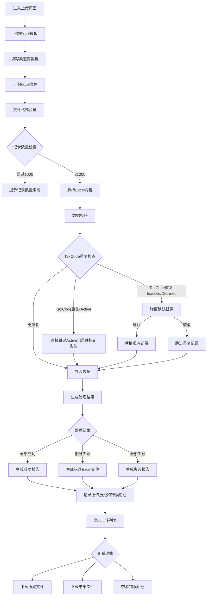

#### 6.1.2 影响的数据表

- View端
  - **[mod_channel_partner_uploads](#table-mod_channel_partner_uploads)** : View端 Upload记录
  - **[mod_channel_partner_companies](#table-mod_channel_partner_companies)** : View端 Upload Company基础信息表
  - **[mod_channel_partner_user](#table-mod_channel_partner_user)** : View端 Upload User基础信息表

#### 6.1.3 前端实现

##### 6.1.3.1 视图目录结构

```plaintext
/resources/views/partner-upload/
  index.blade.php              - 上传主页面（包含上传区域、进度显示、历史列表）
  detail.blade.php             - 上传详情页面（查看具体上传记录详情）
```

##### 6.1.3.2 关键视图功能

- **index.blade.php** 包含:
  - 模板下载按钮
  - 文件上传区域（拖拽/点击上传）
  - 上传进度条
  - 重复记录确认弹窗（Bootstrap Modal）
    - TaxCode重复确认弹窗
  - 上传历史列表（分页显示）
  - 错误汇总展示

- **detail.blade.php** 包含:
  - 上传记录基本信息
  - 处理结果统计
  - 错误详情列表
  - 文件下载链接

##### 6.1.3.3 路由设计

| HTTP方法 | 端点 | 描述 |
|----------|------|------|
| GET | `/partner-upload` | 上传主页面 |
| GET | `/partner-upload/template` | 下载模板 |
| POST | `/partner-upload/upload` | 文件上传 |
| POST | `/partner-upload/confirm-duplicates` | 确认重复记录处理 |
| GET | `/partner-upload/history` | 上传历史列表 |
| GET | `/partner-upload/{id}` | 上传详情页面 |
| GET | `/partner-upload/{id}/download/{type}` | 下载文件 |

##### 6.1.3.4 日志记录

使用DynamicLoggerFactory进行模块化日志记录:

```php
use VIEW\Util\Logger\DynamicLoggerFactory;

$logger = DynamicLoggerFactory::getLogger("sys", "partner-upload");
```

- **系统错误日志记录场景**:

  | 操作类型 | 记录时机 |
  |----------|----------|
  | file_parse_failed | Excel文件解析失败 |
  | validation_failed | 数据验证失败 |
  | duplicate_check_failed | 重复检查失败 |
  | import_failed | 数据导入失败 |
  | result_generation_failed | 结果文件生成失败 |
  | phone_parsing_failed | 多手机号解析失败 |

#### 6.1.5 功能开发与实现

##### 6.1.5.1 类关系图

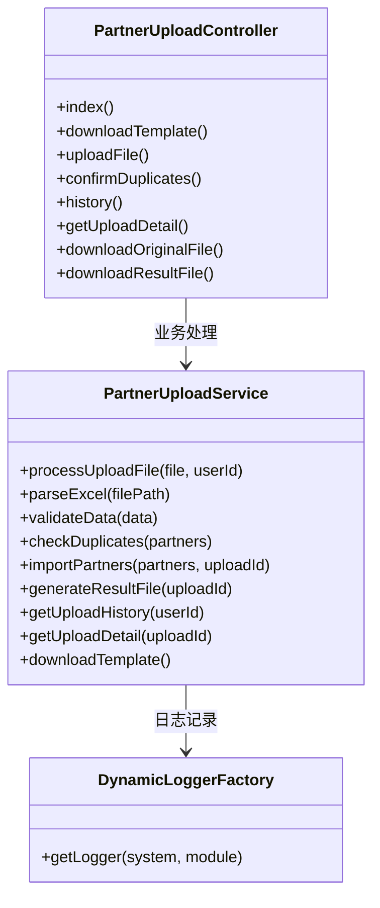

##### 6.1.5.2 代码实现

- **PartnerUploadController.php**
  - **文件路径**:`app/Http/Controllers/ModChannelPlatform/PartnerUploadController.php`
  - **文件状态**:新增
  - **方法**:
    - **index()**
      - **功能描述**:显示渠道商上传主页面，包含上传区域和模板下载。
      - **方法状态**:新增
      - **调用顺序**:用户访问上传页面时调用
      - **请求参数**:无

      - **响应数据**:

        | 参数名称 | 数据类型 | 描述 |
        |----------|----------|------|
        | view | Blade | index.blade.php视图 |

    - **downloadTemplate()**
      - **功能描述**:下载标准Excel上传模板，包含20个字段（包含业务信息和联系人相关字段）和字段说明。
      - **方法状态**:新增
      - **调用顺序**:用户点击下载模板按钮时调用
      - **依赖服务**:PartnerUploadService
      - **请求参数**:无

      - **响应数据**:

        | 参数名称 | 数据类型 | 描述 |
        |----------|----------|------|
        | file | File | Excel模板文件流 |
        | filename | String | 渠道商上传模板.xlsx |
        | contentType | String | application/vnd.openxmlformats-officedocument.spreadsheetml.sheet |

    - **uploadFile()**
      - **功能描述**:处理Excel文件上传，解析数据并进行校验，处理TaxCode和ContactPhone重复记录确认，生成处理结果和错误汇总。集成完整日志记录。
      - **方法状态**:新增
      - **调用顺序**:用户上传Excel文件时调用
      - **依赖服务**:PartnerUploadService
      - **请求参数**:

        | 参数名称 | 数据类型 | 是否必填 | 描述 |
        |----------|----------|----------|------|
        | file | File | 是 | Excel文件 |

      - **响应数据**:

        | 参数名称 | 数据类型 | 描述 |
        |----------|----------|------|
        | success | Boolean | 是否上传成功 |
        | uploadId | Integer | 上传记录ID |
        | totalRecords | Integer | 总记录数 |
        | successRecords | Integer | 成功记录数 |
        | failedRecords | Integer | 失败记录数 |
        | duplicateRecords | Integer | 重复记录数 |
        | taxcodeDuplicates | Array | TaxCode重复记录详情（仅Inactive/Declined） |
        | autoSkippedActiveRecords | Integer | 自动跳过的Active重复记录数 |
        | needConfirmation | Boolean | 是否需要确认重复处理 |
        | resultFileUrl | String | 结果文件下载链接 |
        | message | String | 处理结果信息 |

    - **confirmDuplicates()**
      - **功能描述**:处理重复记录确认，根据用户选择替换或跳过TaxCode重复记录，完成最终导入。
      - **方法状态**:新增
      - **调用顺序**:用户确认重复处理方式后调用
      - **依赖服务**:PartnerUploadService
      - **请求参数**:

        | 参数名称 | 数据类型 | 是否必填 | 描述 |
        |----------|----------|----------|------|
        | uploadId | Integer | 是 | 上传记录ID |
        | taxcodeConfirmations | Array | 是 | TaxCode重复记录处理确认列表 |

      - **响应数据**:

        | 参数名称 | 数据类型 | 描述 |
        |----------|----------|------|
        | success | Boolean | 是否处理成功 |
        | processedRecords | Integer | 最终处理记录数 |
        | replacedRecords | Integer | 替换记录数 |
        | skippedRecords | Integer | 跳过记录数 |
        | resultFileUrl | String | 最终结果文件链接 |

    - **history()**
      - **功能描述**:显示上传历史页面，包含历史记录列表和搜索筛选功能。
      - **方法状态**:新增
      - **调用顺序**:用户访问历史页面时调用
      - **依赖服务**:PartnerUploadService
      - **请求参数**:

        | 参数名称 | 数据类型 | 是否必填 | 描述 |
        |----------|----------|----------|------|
        | page | Integer | 否 | 页码(默认1) |
        | pageSize | Integer | 否 | 每页条数(默认20) |
        | status | String | 否 | 状态筛选 |

      - **响应数据**:

        | 参数名称 | 数据类型 | 描述 |
        |----------|----------|------|
        | view | Blade | history.blade.php视图 |
        | uploads | Array | 上传记录列表 |
        | total | Integer | 总记录数 |
        | hasMore | Boolean | 是否有更多数据 |

    - **getUploadDetail()**
      - **功能描述**:获取指定上传记录的详细信息，包括处理统计和错误记录摘要。
      - **方法状态**:新增
      - **调用顺序**:用户点击上传记录查看详情时调用
      - **依赖服务**:PartnerUploadService
      - **请求参数**:

        | 参数名称 | 数据类型 | 是否必填 | 描述 |
        |----------|----------|----------|------|
        | uploadId | Integer | 是 | 上传记录ID |

      - **响应数据**:

        | 参数名称 | 数据类型 | 描述 |
        |----------|----------|------|
        | success | Boolean | 是否获取成功 |
        | upload | Object | 上传记录详情 |
        | hasOriginalFile | Boolean | 是否有原始文件 |
        | hasResultFile | Boolean | 是否有结果文件 |

    - **downloadOriginalFile()**
      - **功能描述**:下载原始上传的Excel文件。
      - **方法状态**:新增
      - **调用顺序**:用户点击下载原始文件时调用
      - **依赖服务**:PartnerUploadService
      - **请求参数**:

        | 参数名称 | 数据类型 | 是否必填 | 描述 |
        |----------|----------|----------|------|
        | uploadId | Integer | 是 | 上传记录ID |

      - **响应数据**:

        | 参数名称 | 数据类型 | 描述 |
        |----------|----------|------|
        | file | File | 原始Excel文件流 |
        | filename | String | 原始文件名 |
        | contentType | String | 文件类型 |

    - **downloadResultFile()**
      - **功能描述**:下载处理结果Excel文件，包含失败记录和错误信息。
      - **方法状态**:新增
      - **调用顺序**:用户点击下载结果文件时调用
      - **依赖服务**:PartnerUploadService
      - **请求参数**:

        | 参数名称 | 数据类型 | 是否必填 | 描述 |
        |----------|----------|----------|------|
        | uploadId | Integer | 是 | 上传记录ID |

      - **响应数据**:

        | 参数名称 | 数据类型 | 描述 |
        |----------|----------|------|
        | file | File | 结果Excel文件流 |
        | filename | String | 结果文件名 |
        | contentType | String | 文件类型 |

- **PartnerUploadService.php**
  - **文件路径**:`app/Services/ModChannelPlatform/PartnerUploadService.php`
  - **文件状态**:新增
  - **方法**:
    - **processUploadFile($file, $userId)**
      - **功能描述**:处理上传文件的完整流程，包括解析、验证、导入和结果生成
      - **方法状态**:新增
      - **返回数据**:上传结果对象和处理统计

    - **parseExcel($filePath)**
      - **功能描述**:解析Excel文件，支持多种格式（.xlsx, .xls），处理20个字段（包含业务信息和联系人信息）
      - **方法状态**:新增
      - **返回数据**:解析后的数据数组

    - **validateData($data)**
      - **功能描述**:验证数据完整性和格式，包括必填字段、手机号格式、邮箱格式等
      - **方法状态**:新增
      - **返回数据**:验证结果和错误列表

    - **checkDuplicates($partners)**
      - **功能描述**:检查TaxCode重复性，识别与现有记录的冲突，区分Active和Inactive/Declined状态
      - **方法状态**:新增
      - **重复处理逻辑**:
        - Active状态记录:自动标记为跳过，不需要用户确认
        - Inactive/Declined状态记录:返回给用户确认是否替换
      - **返回数据**:TaxCode重复记录列表（仅Inactive/Declined）和冲突详情

    - **importPartners($partners, $uploadId)**
      - **功能描述**:批量导入渠道商数据，处理成功和失败记录
      - **方法状态**:新增
      - **返回数据**:导入结果统计

    - **generateResultFile($uploadId)**
      - **功能描述**:生成包含失败记录的Excel结果文件
      - **方法状态**:新增
      - **返回数据**:结果文件路径和下载链接

    - **getUploadHistory($userId)**
      - **功能描述**:获取用户上传历史列表，支持分页和状态筛选
      - **方法状态**:新增
      - **返回数据**:分页后的上传记录列表

    - **getUploadDetail($uploadId)**
      - **功能描述**:获取上传记录详细信息和关联数据
      - **方法状态**:新增
      - **返回数据**:完整的上传记录详情

    - **downloadTemplate()**
      - **功能描述**:生成并返回上传模板文件，包含字段说明和示例数据（包含完整的20个字段）
      - **方法状态**:新增
      - **返回数据**:模板文件流

### 6.2 Channel Partner Dashboard模块

#### 6.2.1 业务流程

##### 6.2.1.1 业务背景

- **背景**:Channel Partner Dashboard是渠道商管理的核心界面，用于展示和管理所有渠道商信息，包括通过Excel导入和Portal端注册申请的公司数据。系统提供多维度搜索和批量分配给销售功能。

- **主要流程**

  - **Dashboard List**
    - 展示所有渠道商信息（Excel导入 + Portal申请）
    - 支持多字段搜索筛选
    - 列表根据 TaxCode 将多个注册申请合并成1条数据展示(Portal端为主)
    

  - **分配销售**:
    - 可批量给Partner Pending状态的分配 销售(Partner Onwer)
    - 分配销售后, 批量替换当前 Company 下所有 User的 对应销售
    - 可分配多个销售, 可重新分配销售
    

- **异常流程**:
  - 搜索条件无结果 → 显示无数据提示
  - 查询PortalApi无反馈

- **流程图**:

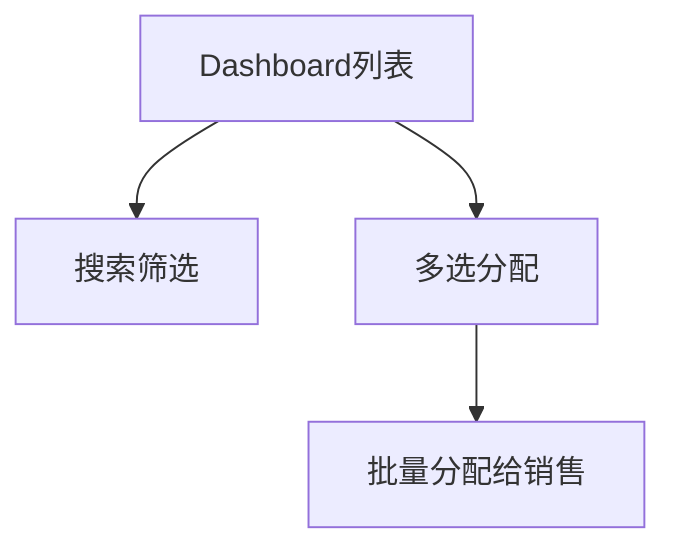

#### 6.2.2 影响的数据表

- View端
  - **[mod_channel_partner_companies](#table-mod_channel_partner_companies)** : View端 Upload Company基础信息表
  - **[mod_channel_partner_user](#table-mod_channel_partner_user)** : View端 Upload User基础信息表
  - **[mod_channel_assignment_history](#table-mod_channel_assignment_history)** : View端 Partner(非Actice的) 关联 销售表

- Portal端
  - **[users](#table-users)** : Portal端 User基础信息表
  - **[companies](#table-companies)** : Portal端 Company 基础信息表
  - **[user_company](#table-user_company)** : User&Company 关联表(记录 Partner 当前状态)
  - **[user_company_assignment](#table-user_company_assignment)** : Portal端 Partner 关联 销售表

#### 6.2.3 前端实现

##### 6.2.3.1 视图目录结构

```plaintext
/resources/views/partner-dashboard/
  index.blade.php              - Dashboard主页面
```

##### 6.2.3.2 关键视图功能

- **index.blade.php** 包含:
  - 搜索筛选表单（9个筛选字段）
  - 批量操作工具栏（分配按钮、选择统计）
  - 渠道商列表表格（分页、排序）
  - 批量分配给销售Modal弹窗

#### 6.2.4 路由设计

| HTTP方法 | 端点 | 描述 |
|----------|------|------|
| GET | `/partner-dashboard` | Dashboard主页面 |
| GET | `/partner-dashboard/search` | 搜索渠道商 |
| POST | `/partner-dashboard/assign` | 批量分配给销售 |

#### 6.2.5 错误处理和日志记录

##### 6.2.5.1 日志记录

使用DynamicLoggerFactory进行模块化日志记录:

- **系统错误日志记录场景**:

  | 操作类型 | 记录时机 |
  |----------|----------|
  | searchFailed | 搜索查询失败 |
  | assignmentFailed | 分配操作失败 |

#### 6.2.6 功能开发与实现

##### 6.2.6.1 类关系图

```mermaid
classDiagram
    class PartnerDashboardController {
        +index()
        +search()
        +assign()
        +getSalesList()
    }

    class PartnerDashboardService {
        +getPartnerList(filters, page, pageSize)
        +searchPartners(searchParams)
        +batchAssign(partnerIds, salesIds, assignedBy)
        +validateAssignment(partnerIds)
        +getSalesOptions()
        +recordAssignmentHistory(companyId, salesIds, assignedBy)
    }

    PartnerDashboardController --> PartnerDashboardService : 业务处理
```

##### 6.2.6.2 代码实现

- **PartnerDashboardController.php**
  - **文件路径**:`app/Http/Controllers/ModChannelPlatform/PartnerDashboardController.php`
  - **文件状态**:新增
  - **方法**:
    - **index()**
      - **功能描述**:显示Dashboard主页面，加载默认列表数据和筛选选项
      - **方法状态**:新增
      - **依赖服务**:PartnerDashboardService
      - **请求参数**:无
      - **响应数据**:

        | 参数名称 | 数据类型 | 描述 |
        |----------|----------|------|
        | view | Blade | index.blade.php视图 |
        | partners | Array | 渠道商列表（前50条） |
        | total | Integer | 总记录数 |
        | salesList | Array | 销售人员列表 |

    - **search()**
      - **功能描述**:根据搜索条件筛选渠道商列表，支持9个筛选字段，分页显示，默认50条/页
      - **方法状态**:新增
      - **依赖服务**:PartnerDashboardService
      - **请求参数**:

        | 参数名称 | 数据类型 | 是否必填 | 描述 |
        |----------|----------|----------|------|
        | region | String | 否 | 区域筛选 |
        | branch | String | 否 | 分公司筛选 |
        | province | String | 否 | 省份筛选 |
        | city | String | 否 | 城市筛选 |
        | district | String | 否 | 区县筛选 |
        | taxcode | String | 否 | 税号搜索 |
        | partner | String | 否 | Partner名称搜索 |
        | partnerowner | String | 否 | 负责人筛选 |
        | datasource | String | 否 | 数据来源筛选 |
        | partnerstatus | String | 否 | Partner状态筛选 |
        | requeststatus | String | 否 | 申请状态筛选 |
        | page | Integer | 否 | 页码(默认1) |
        | pageSize | Integer | 否 | 每页条数(默认50) |

      - **响应数据**:

        | 参数名称 | 数据类型 | 描述 |
        |----------|----------|------|
        | success | Boolean | 是否搜索成功 |
        | partners | Array | 渠道商列表 |
        | total | Integer | 总记录数 |
        | hasMore | Boolean | 是否有更多数据 |
        | assignableCount | Integer | 可分配记录数 |

    - **assign()**
      - **功能描述**:批量分配渠道商给指定销售人员，验证分配权限，记录分配历史
      - **方法状态**:新增
      - **依赖服务**:PartnerDashboardService
      - **请求参数**:

        | 参数名称 | 数据类型 | 是否必填 | 描述 |
        |----------|----------|----------|------|
        | partnerIds | Array | 是 | 渠道商ID列表 |
        | salesIids | Array | 是 | 销售人员ID数组 |

      - **响应数据**:

        | 参数名称 | 数据类型 | 描述 |
        |----------|----------|------|
        | success | Boolean | 是否分配成功 |
        | assigneCount | Integer | 成功分配数量 |
        | skippedount | Integer | 跳过数量 |
        | salesNames | Array | 销售人员姓名数组 |
        | message | String | 结果信息 |

- **PartnerDashboardService.php**
  - **文件路径**:`app/Services/ModChannelPlatform/PartnerDashboardService.php`
  - **文件状态**:新增
  - **方法**:
    - **getPartnerList($filters, $page, $pageSize)**
      - **功能描述**:获取渠道商列表，支持多条件筛选和分页，标识可分配状态
      - **方法状态**:新增
      - **返回数据**:分页列表和统计信息

    - **searchPartners($searchParams)**
      - **功能描述**:执行多字段搜索，构建复杂查询条件，支持模糊搜索和精确匹配
      - **方法状态**:新增
      - **返回数据**:搜索结果列表

    - **batchAssign($partnerIds, $salesIds, $assignedBy)**
      - **功能描述**:批量分配处理，验证权限、更新负责人、记录历史
      - **方法状态**:新增
      - **返回数据**:分配结果统计

    - **validateAssignment($partnerIds)**
      - **功能描述**:验证哪些记录可以被分配（未分配且无关联销售的记录）
      - **方法状态**:新增
      - **返回数据**:可分配记录列表和不可分配原因

    - **recordAssignmentHistory($companyId, $salesIds, $assignedBy)**
      - **功能描述**:记录分配历史到mod_channel_assignment_history表
      - **方法状态**:新增
      - **返回数据**:历史记录ID

    - **getSalesOptions()**
      - **功能描述**:获取销售人员列表用于分配选择
      - **方法状态**:新增
      - **返回数据**:销售人员选项数组

### 6.3 Channel Partner Approval模块

#### 6.3.1 业务流程

##### 6.3.1.1 业务背景

- **背景**:Channel Partner Approval负责处理导入数据激活和Portal端扫码申请的审批流程。Portal数据通过API接口实时拉取，不存储在本地表中。审批通过时直接同步到View系统，审批拒绝时在View端创建decline记录。

- **主要流程**

  - **新Partner 申请审批**
    - **审批页面**: 新增 Manages Customers页面
    - **包含操作**: 接受/拒绝/保存/重新激活Decline的 Company&User信息, 回复Inquiry信息
    
    

  - **新User 申请审批**
    - **审批页面**: 新增Partner Info Tab
    - **包含操作**: 新增/接受/拒绝 联系人申请, 回复Inquiry信息
    

  - **ManageCustomer 新增业务**  
    - 新增字段展示 如 主营业务等
    
    - 新增 Portal Account选项
      1. 勾选Portal Account 在Portal端创建账号,并注册Company&User关联关系 且标记为Active状态
      2. 仅有权限销售可编辑勾选Portal Account的 Contract 敏感信息 如手机号
      3. 变更 Portal Contact 信息时，先根据手机号 同时变更其余所有勾选PortalAccount的 Contact信息(所有变更的Customer都要记录Log), 在同步Portal端
      4. 删除勾选Portal Account的 Contract 则解绑 Portal端 Company&User关联 并交集decline
    
    - 新增 Partner Info 展示当前Customer 关联的Querstion List(只读), Inquiry(可回复), 分配/创建 项目按钮跳转
    

    - 如果涉及到Portal端数据 被保存，需要将Company&User数据同步 mod_channel_partner_compines/user表记录
    - 如果该条申请没有税号，审批销售 必须填写税号, 如果该税号关联了Customer 则将对应信息填充 作为主数据 用户申请数据作为提醒 在INPUT框下提示
    - 涉及到Save Company信息 同上 有提醒
    - 不能修改Portal 申请的User信息
    - Portal Account勾选后在Active后 需要主动给创建Portal创建账号, Portal端申请 默认勾选(不可编辑)
    - 需要展示申请User 在Pending时 在当前审批的Company下 创建的项目 以及 Inquiry(销售可回复)
    - 审批的User不勾选 PortalAccount 仅创建Contact信息 不创建Portal账号
    - 审批时 不论 那种操作 删除了审批的 User时，都默认拒绝
    - 审批时 销售需填写 Querstion List信息(必填), 合作意向(非必填),备注(非必填)
    - 拒绝审批时，需选择拒绝原因
    - 审批通过后 需创建 Customer&Contact 以及 Contact和Portal User信息

  - **Question List配置**:
    - 复用现有组件(目前在本地)

  - **审批过程**:
    - Company信息展示:
      1. 多个User申请, Company信息以 第一个申请/Portal端申请 为展示
      2. 如果 Company未填写 Taxcode 检查是否有Customer信息, 有则关联展示,User填写信息作为 提示在Input下展示
      3. 如果 Save的信息 也将有提醒在Input下 并提示已有销售Save
    - User 信息展示:
      1. Portal端 申请的User 不能编辑信息
      2. 勾选PortalAccount后，在审批通过后 自动创建Portal账号
      3. Upload导入的User 多手机号 需要销售确认仅保留一个, 如果已存在需提醒
      4. 在审批页面删除User 信息, 则不论是 接受/拒绝/保存 都默认该User 审批被拒绝
    - Project List:Portal端Partner Pending时 创建的项目
    - Inquiry List:Portal端Partner Pending时 发起的问询
    - Quertiosn List:根据创建的模板内容 展示,需要销售填写 (审批新User时, 不需要重新填写)
    - 合作意见 , 备注 需销售填写

  - **审批保存流程**:
    1. 销售可以编辑 Company& Upload的User信息 并保存
    2. Portal端数据 被保存后 在View端保留记录
    3. 保存时仅页面包含的 User信息保留 其余被删除的自动Decline 

  - **审批通过流程**:
    1. 批量标记审批状态，生成新的Customer&Contact记录
    2. 直接同步数据到View系统customer表和contacts表，并标记来源
    3. 发送审批通过结果至Portal端，同时同步 customerId和 contactId
    4. 同时更新 Portal . companies表信息 与 View端一致, 同时 如果与portal端companies表税号一致 仅保留一条 companies信息
    5. 发送激活通知，推送激活wechat消息（仅通过的联系人）
    6. Dashboard中Request Status显示为done

  - **审批拒绝流程**:

    1. 记录拒绝原因，不生成Customer记录
    2. 发送审批拒绝结果，解绑Portal端 Company和User关系，同时标记为Decline，用户可以重新发起注册申请
    3. Portal端Decline得数据 会存储到View得 Channel_Partner表中,以用于重新激活
    4. 销售可以重新激活被Decline数据
    5. Dashboard中Request Status显示为done
    6. 解绑 Portal端 user_company  user和company表 关联记录
    7. **不发送微信推送通知**

  - **重新激活流程**
    - **Portal数据重新激活**:
      1. Dashboard列表点击被Decline数据进入编辑页面，重新激活被Decline的数据
      2. 激活数据关联关系从 registration_requests 表获取
      3. 检查Partner是否已存在，如果不存在生成新的Customer&Contact记录，如果已存在仅生成新的Contact记录
      4. 发送重新激活通知，重新绑定用户和公司，更新状态为active
      5. 发送激活通知，推送激活wechat消息

    - **View导入数据重新激活**:
      1. Dashboard列表点击被Decline数据进入编辑页面，重新激活被Decline的数据
      2. 检查Partner是否已存在，如果不存在生成新的Customer&Contact记录状态为active，如果已存在仅生成新的Contact记录状态为active
      3. 如果勾选Portal Account则创建Portal 端登录账号 否则 仅创建Contact

  - **项目分配管理**
    - **Partner Info项目分配功能**:
      - active状态Partner显示"新增项目"和"分配项目"按钮
      - 点击"分配项目"跳转到项目分配列表页面
      - 显示所有可分配项目（包括被拒绝的项目，允许重新分配）
      - 可批量分配至对应的Customer，分配时需选择分配原因
      - 未选择是Agent/Distributor 默认标记为Agent
      - 列表仅展示 Pre-Lead状态的项目 其余项目不展示
      - 分配项目后 推送wechat消息给 当前Company下所有Active状态的User
      - 记录分配日志
    

- **流程图**:

```mermaid
flowchart TD
    START[Channel Partner Approval] --> IMPORT[View导入数据激活流程]
    START --> PORTAL_PARTNER[Portal新Partner审批流程]
    START --> PORTAL_CONTRACT[Portal新Contract审批流程]
    START --> REACTIVATE[被Decline数据重新激活流程]
    
    IMPORT --> IMPORT_REVIEW[销售审批页面]
    IMPORT_REVIEW --> IMPORT_SAVE[保存草稿]
    IMPORT_REVIEW --> IMPORT_APPROVE[审批通过]
    IMPORT_REVIEW --> IMPORT_REJECT[审批拒绝]
    
    IMPORT_APPROVE --> SYNC_LEGACY[同步View系统]
    IMPORT_APPROVE --> UPDATE_STATUS[更新状态为active]
    IMPORT_REJECT --> CREATE_DECLINE[创建decline记录]
    
    PORTAL_PARTNER --> PORTAL_API[调用Portal API获取数据]
    PORTAL_API --> TAXCODE_CHECK{检查TaxCode}
    TAXCODE_CHECK -->|已填写| TAXCODE_EXISTS[显示审批页面]
    TAXCODE_CHECK -->|未填写| TAXCODE_REQUIRED[销售填写TaxCode]
    
    TAXCODE_EXISTS --> PORTAL_APPROVE[审批通过]
    TAXCODE_EXISTS --> PORTAL_REJECT[审批拒绝]
    TAXCODE_REQUIRED --> PORTAL_APPROVE
    TAXCODE_REQUIRED --> PORTAL_REJECT
    
    PORTAL_APPROVE --> SYNC_PORTAL[同步View系统]
    PORTAL_APPROVE --> WECHAT_PUSH[发送微信推送]
    PORTAL_REJECT --> UNBIND_USER[解绑Portal用户]
    PORTAL_REJECT --> NO_WECHAT[不发送推送]
    
    PORTAL_CONTRACT --> EXISTING_COMPANY[显示现有公司信息]
    EXISTING_COMPANY --> NEW_CONTACT[新申请联系人]
    NEW_CONTACT --> CONTRACT_APPROVE[审批通过]
    NEW_CONTACT --> CONTRACT_REJECT[审批拒绝]
    
    CONTRACT_APPROVE --> SYNC_CONTACT[同步联系人]
    CONTRACT_APPROVE --> WECHAT_CONTACT[发送微信推送]
    CONTRACT_REJECT --> UNBIND_CONTACT[解绑联系人]
    
    REACTIVATE --> CHECK_EXISTS{检查Partner是否存在}
    CHECK_EXISTS -->|不存在| CREATE_NEW[生成新Customer&Contact]
    CHECK_EXISTS -->|已存在| CREATE_CONTACT[仅生成Contact]
    CREATE_NEW --> REACTIVATE_NOTIFY[发送激活通知]
    CREATE_CONTACT --> REACTIVATE_NOTIFY
    
    SYNC_LEGACY --> PROJECT_ASSIGN[项目分配管理]
    SYNC_PORTAL --> PROJECT_ASSIGN
    SYNC_CONTACT --> PROJECT_ASSIGN
    REACTIVATE_NOTIFY --> PROJECT_ASSIGN
    
    PROJECT_ASSIGN --> ASSIGN_LIST[项目分配列表]
    ASSIGN_LIST --> BATCH_ASSIGN[批量分配]
    BATCH_ASSIGN --> PROJECT_WECHAT[发送项目通知]
```

**审批决策流程图**:

```mermaid
flowchart TD
    DATA_SOURCE{数据来源判断} --> VIEW_IMPORT[View导入数据]
    DATA_SOURCE --> PORTAL_NEW[Portal新公司申请]
    DATA_SOURCE --> PORTAL_EXISTING[Portal现有公司新联系人]
    
    VIEW_IMPORT --> QUESTION_LIST[Question List填写]
    PORTAL_NEW --> API_FETCH[API获取Portal数据]
    PORTAL_EXISTING --> PARTNER_INFO[进入Partner Info Tab]
    
    QUESTION_LIST --> CONTACT_EDIT[联系人新增/编辑/删除]
    API_FETCH --> TAXCODE_HANDLE[TaxCode处理]
    PARTNER_INFO --> EXISTING_INFO[显示现有信息]
    
    CONTACT_EDIT --> PORTAL_ACCOUNT[Portal Account设置]
    TAXCODE_HANDLE --> INQUIRY_REPLY[用户咨询处理]
    EXISTING_INFO --> NEW_APPLY[新申请信息对比]
    
    PORTAL_ACCOUNT --> SAVE_DRAFT[保存草稿]
    INQUIRY_REPLY --> SAVE_DRAFT
    NEW_APPLY --> SAVE_DRAFT
    
    SAVE_DRAFT --> APPROVE_REJECT{审批决策}
    APPROVE_REJECT -->|通过| APPROVAL_SUCCESS[审批通过流程]
    APPROVE_REJECT -->|拒绝| APPROVAL_REJECT[审批拒绝流程]
    
    APPROVAL_SUCCESS --> SYNC_CHECK{需要同步?}
    SYNC_CHECK -->|是| LEGACY_SYNC[View系统同步]
    SYNC_CHECK -->|否| WECHAT_CHECK{需要推送?}
    LEGACY_SYNC --> WECHAT_CHECK
    
    WECHAT_CHECK -->|Portal数据| SEND_WECHAT[发送微信推送]
    WECHAT_CHECK -->|View数据| NO_PUSH[不发送推送]
    SEND_WECHAT --> DONE[完成]
    NO_PUSH --> DONE
    
    APPROVAL_REJECT --> DECLINE_RECORD[创建decline记录]
    DECLINE_RECORD --> UNBIND_API[调用解绑API]
    UNBIND_API --> REJECT_DONE[完成]
```

#### 6.3.2 影响的数据表

- View端
  - **[mod_channel_partner_companies](#table-mod_channel_partner_companies)** : View端 Upload Company基础信息表
  - **[mod_channel_partner_user](#table-mod_channel_partner_user)** : View端 Upload User基础信息表
  - **[customer_employee](#table-customer_employee)** : View端 Customer关联的销售
  - **[customer](#table-customer)** : View端 Customer关联的销售
  - **[contact](#table-contact)** : View端 Customer关联的销售
  - **[project](#table-project)** : View端 Customer关联的销售
  - **[mod_channel_question_answers](#table-mod_channel_question_answers)** : View端 Customer关联的销售
  - **[mod_channel_project_assignments](#table-mod_channel_project_assignments)** : View端 Customer关联的销售
  - **[mod_channel_inquiries](#table-mod_channel_inquiries)** : View端 Customer关联的销售
  - **[mod_channel_inquiry_rating](#table-mod_channel_inquiry_rating)** : View端 Customer关联的销售
  - **[mod_channel_registration_requests](#table-mod_channel_registration_requests)** : View端 Customer关联的销售

- Portal端
  - **[users](#table-users)** : Portal端 User基础信息表
  - **[companies](#table-companies)** : Portal端 Company 基础信息表
  - **[user_company](#table-user_company)** : User&Company 关联表(记录 Partner 当前状态)
  - **[user_company_assignment](#table-user_company_assignment)** : Portal端 Partner 关联 销售表
  - **[registration_requests](#table-registration_requests)** : Portal端 Partner 关联 销售表
  - **[leads](#table-leads)** : Portal端 Partner 关联 销售表
  - **[inquiries](#table-inquiries)** : Portal端 Partner 关联 销售表
  - **[inquiry_rating](#table-inquiry_rating)** : Portal端 Partner 关联 销售表

#### 6.3.3 前端实现

##### 6.3.3.1 视图目录结构

```plaintext
/resources/views/channel-partner-approval/
  import-approval.blade.php        - View导入数据审批页面
  portal-partner-approval.blade.php - Portal新公司申请审批页面
  portal-contract-approval.blade.php - Portal新联系人申请审批页面
  reactivate-declined.blade.php    - 重新激活页面

/resources/views/project-assignment/
  assignment-list.blade.php        - 项目分配列表页面

/public/partner-info/
  partnerinfo.phtml                 - Partner Info页面（寄存ManageCustomer的新增tab）
```

##### 6.3.3.2 关键视图功能

- **import-approval.blade.php** 包含:
  - 渠道商基本信息展示（View本地数据）
  - 联系人信息展示和编辑（支持多联系人显示和操作）
  - **Question List组件集成**:可选填写，支持回复功能，标记新旧
  - Portal Account设置选项
  - 保存草稿、审批通过、审批拒绝按钮
  - 数据来源标识显示

- **portal-partner-approval.blade.php** 包含:
  - 渠道商基本信息展示（Portal API实时拉取数据）
  - 联系人信息展示和编辑
  - TaxCode处理逻辑（自动检查和手动填写）
  - ChannelProjectList（仅Portal申请显示，通过API实时拉取）
  - Inquiry管理（仅Portal申请显示，通过API实时拉取）
  - **Question List组件**:可选填写，支持回复功能，标记新旧
  - 保存草稿、审批通过、审批拒绝按钮
  - 数据来源标识显示

- **portal-contract-approval.blade.php** 包含:
  - **审批中状态**:新联系人申请审批功能，显示原有公司信息与新申请信息的对比
  - 现有公司信息展示（View系统数据）
  - 新申请公司信息对比展示
  - 现有联系人信息（只读）和新申请联系人信息（可编辑）
  - 项目列表对比（现有项目 vs 新申请项目）
  - 咨询记录对比（现有咨询 vs 新申请咨询）
  - **Question List组件**:可选填写，支持回复功能
  - 保存草稿、审批通过、审批拒绝按钮

- **assignment-list.blade.php** 包含:
  - 多条件搜索筛选表单
  - 项目列表表格（支持排序和分页）
  - 多选checkbox进行批量分配
  - 批量分配操作区域

- **partnerinfo.phtml** 包含:
  - **审批中状态**:新联系人申请审批功能，显示原有公司信息与新申请信息的对比，Question List组件
  - **审批通过状态**:仅查看模式，active渠道商显示"新增项目"和"分配项目"按钮

#### 6.3.4 路由设计

| HTTP方法 | 端点 | 描述 |
|----------|------|------|
| GET | `/modchannel-approval/import/{id}` | View导入数据审批页面 |
| GET | `/modchannel-approval/portal/partner/{portalId}` | Portal新公司申请审批页面 |
| GET | `/modchannel-approval/portal/contract/{portalId}` | Portal新联系人申请审批页面 |
| POST | `/modchannel-approval/save` | 保存审批草稿 |
| POST | `/modchannel-approval/import/{id}/approve` | 通过View导入数据审批 |
| POST | `/modchannel-approval/import/{id}/reject` | 拒绝View导入数据审批 |
| POST | `/modchannel-approval/portal/partner/{portalId}/approve` | 通过Portal新公司申请审批 |
| POST | `/modchannel-approval/portal/partner/{portalId}/reject` | 拒绝Portal新公司申请审批 |
| POST | `/modchannel-approval/portal/contract/{portalId}/approve` | 通过Portal新联系人申请审批 |
| POST | `/modchannel-approval/portal/contract/{portalId}/reject` | 拒绝Portal新联系人申请审批 |
| POST | `/modchannel-approval/reactivate` | 重新激活被decline的数据 |
| GET | `/project-assignment/list` | 项目分配列表页面 |
| GET | `/project-assignment/available-projects` | 获取可分配项目列表API |
| POST | `/project-assignment/assign` | 执行批量项目分配 |
| GET | `/partner-info/{companyId}` | Partner Info HTML页面 |
| POST | `/partner-info/{companyId}/approve-contact` | 通过新联系人审批 |
| POST | `/partner-info/{companyId}/reject-contact` | 拒绝新联系人审批 |

#### 6.3.5 错误处理和日志记录

##### 6.3.5.1 日志记录

使用DynamicLoggerFactory进行模块化日志记录:

| 操作类型 | 记录时机 |
|----------|----------|
| portal_api_failed | Portal API调用失败 |
| approval_failed | 审批操作失败 |
| legacy_sync_failed | View系统同步失败 |
| wechat_push_failed | 微信推送失败 |
| project_assignment_failed | 项目分配失败 |
| user_unbind_failed | Portal用户解绑失败 |

#### 6.3.6 功能开发与实现

##### 6.3.6.1 类关系图

```mermaid
classDiagram
    class ModChannelPartnerApprovalController {
        +showImportApproval(id)
        +showPortalPartnerApproval(portalId)
        +showPortalContractApproval(portalId)
        +saveApprovalData(Request)
        +approveImportData(id, Request)
        +rejectImportData(id, Request)
        +approvePortalPartner(portalId, Request)
        +rejectPortalPartner(portalId, Request)
        +approvePortalContract(portalId, Request)
        +rejectPortalContract(portalId, Request)
        +reactivateDeclinedData(Request)
    }

    class ModChannelProjectAssignmentController {
        +showAssignmentList(Request)
        +getAvailableProjects(Request)
        +batchAssignProjects(Request)
    }

    class LegacyCustomerController {
        +showManageCustomer(customerId)
        +approveNewContact(Request)
        +rejectNewContact(Request)
    }

    class ModChannelPartnerApprovalService {
        +getApprovalData(id, source)
        +getPortalUserAndCompanyData(portalId)
        +saveApprovalDraft(data)
        +processImportApproval(data)
        +processPortalPartnerApproval(data)
        +processPortalContractApproval(data)
        +reactivateDeclinedPartner(data)
        +validateApprovalData(data)
        +handleContactOperations(contacts)
        +processQuestionList(questions)
    }

    class ModChannelDataSyncService {
        +syncToLegacySystem(customerData)
        +createCustomerRecord(companyData)
        +createContactRecords(contactsData)
        +updatePartnerStatus(partnerId, status)
        +callPortalApprovalAPI(approvalResult)
        +callPortalUserUnbindAPI(unbindData)
        +validateSyncData(data)
        +handleSyncErrors(error)
    }

    class ModChannelNotificationService {
        +callWechatPushAPI(notificationData)
        +sendApprovalNotification(userIds, result)
        +sendProjectAssignmentNotification(assignment)
        +sendReactivationNotification(userIds)
        +validateNotificationData(data)
        +handlePushErrors(error)
    }

    class ModChannelProjectAssignmentService {
        +getAvailableProjects(filters)
        +validateProjectAssignment(projectIds, partnerId)
        +batchAssignProjects(assignmentData)
        +updateProjectDistributor(projectId, partnerId, status)
        +recordAssignmentHistory(assignment)
        +getPartnerProjects(partnerId)
    }

    class LegacyAccountService {
        +getPartnerAccountInfo(customerId)
        +processPartnerContactApproval(approvalData)
        +getCustomerPartnerInfo(customerId)
        +validatePartnerContact(contactData)
        +updateContactStatus(contactId, status)
    }

    class DynamicLoggerFactory {
        +createLogger(module)
        +logApprovalOperation(operation, result)
        +logSyncOperation(operation, result)
        +logNotificationOperation(operation, result)
        +logError(module, error)
    }

    ModChannelPartnerApprovalController --> ModChannelPartnerApprovalService : 业务处理
    ModChannelPartnerApprovalController --> ModChannelDataSyncService : 数据同步
    ModChannelPartnerApprovalController --> ModChannelNotificationService : 通知服务
    ModChannelPartnerApprovalController --> DynamicLoggerFactory : 日志记录

    ModChannelProjectAssignmentController --> ModChannelProjectAssignmentService : 项目分配
    ModChannelProjectAssignmentController --> ModChannelNotificationService : 通知服务
    ModChannelProjectAssignmentController --> DynamicLoggerFactory : 日志记录

    LegacyCustomerController --> LegacyAccountService : 账户服务
    LegacyCustomerController --> ModChannelNotificationService : 通知服务

    ModChannelPartnerApprovalService --> ModChannelDataSyncService : 调用同步
    ModChannelPartnerApprovalService --> DynamicLoggerFactory : 日志记录

    ModChannelDataSyncService --> DynamicLoggerFactory : 日志记录
    ModChannelNotificationService --> DynamicLoggerFactory : 日志记录
    ModChannelProjectAssignmentService --> DynamicLoggerFactory : 日志记录
    LegacyAccountService --> DynamicLoggerFactory : 日志记录
```

##### 6.3.6.2 控制器实现

- **ModChannelPartnerApprovalController.php**

- **文件路径**:`app/Http/Controllers/ModChannelPlatform/ModChannelPartnerApprovalController.php`
- **文件状态**:新增
- **依赖服务**:ModChannelPartnerApprovalService, ModChannelDataSyncService, ModChannelNotificationService
- **日志记录**:DynamicLoggerFactory
- **方法**:

  - **showImportApproval($id)**
    - **功能描述**:显示View导入数据审批页面，获取本地mod_channel_partners表数据
    - **方法状态**:新增
    - **调用顺序**:销售点击导入数据审批时调用
    - **依赖服务**:ModChannelPartnerApprovalService
    - **请求参数**:

      | 参数名称 | 数据类型 | 是否必填 | 描述 |
      |----------|----------|----------|------|
      | id | Integer | 是 | 渠道商记录ID |

    - **响应数据**:

      | 参数名称 | 数据类型 | 描述 |
      |----------|----------|------|
      | view | Blade | import-approval.blade.php视图 |
      | approvalData | Array | 审批数据对象 |

  - **showPortalPartnerApproval($portalId)**
    - **功能描述**:显示Portal新公司申请审批页面，调用Portal API获取用户和公司数据
    - **方法状态**:新增
    - **调用顺序**:销售点击Portal公司申请审批时调用
    - **依赖服务**:ModChannelPartnerApprovalService
    - **请求参数**:

      | 参数名称 | 数据类型 | 是否必填 | 描述 |
      |----------|----------|----------|------|
      | portalId | Integer | 是 | Portal端申请ID |

    - **响应数据**:

      | 参数名称 | 数据类型 | 描述 |
      |----------|----------|------|
      | view | Blade | portal-partner-approval.blade.php视图 |
      | approvalData | Array | Portal数据对象 |

  - **showPortalContractApproval($portalId)**
    - **功能描述**:显示Portal新联系人申请审批页面，调用Portal API获取用户数据和现有公司信息
    - **方法状态**:新增
    - **调用顺序**:销售点击Portal联系人申请审批时调用
    - **依赖服务**:ModChannelPartnerApprovalService
    - **请求参数**:

      | 参数名称 | 数据类型 | 是否必填 | 描述 |
      |----------|----------|----------|------|
      | portalId | Integer | 是 | Portal端申请ID |

    - **响应数据**:

      | 参数名称 | 数据类型 | 描述 |
      |----------|----------|------|
      | view | Blade | portal-contract-approval.blade.php视图 |
      | approvalData | Array | Portal数据对象 |

  - **saveApprovalData(Request $request)**
    - **功能描述**:保存审批草稿，不改变审批状态，被删除联系人默认标记为拒绝
    - **方法状态**:新增
    - **调用顺序**:销售点击保存按钮时调用
    - **依赖服务**:ModChannelPartnerApprovalService
    - **请求参数**:

      | 参数名称 | 数据类型 | 是否必填 | 描述 |
      |----------|----------|----------|------|
      | approvalType | String | 是 | 审批类型(import/portal_partner/portal_contract) |
      | companyData | Array | 是 | 公司数据对象 |
      | contactsData | Array | 是 | 联系人数据数组 |
      | questionListData | Array | 否 | 问题列表数据 |
      | deletedContacts | Array | 否 | 被删除的联系人ID数组 |

    - **响应数据**:

      | 参数名称 | 数据类型 | 描述 |
      |----------|----------|------|
      | success | Boolean | 是否保存成功 |
      | message | String | 保存结果信息 |
      | data | Array | 保存结果数据 |

  - **approveImportData($id, Request $request)**
    - **功能描述**:通过View导入数据审批，同步到View系统，不发送微信推送
    - **方法状态**:新增
    - **调用顺序**:销售点击通过按钮时调用
    - **依赖服务**:ModChannelPartnerApprovalService, ModChannelDataSyncService
    - **请求参数**:

      | 参数名称 | 数据类型 | 是否必填 | 描述 |
      |----------|----------|----------|------|
      | id | Integer | 是 | 渠道商记录ID |
      | companyData | Array | 是 | 公司数据对象 |
      | contactsData | Array | 是 | 联系人数据数组 |
      | portalAccountSettings | Array | 否 | Portal账户设置 |
      | questionListData | Array | 否 | 问题列表数据 |

    - **响应数据**:

      | 参数名称 | 数据类型 | 描述 |
      |----------|----------|------|
      | success | Boolean | 是否审批成功 |
      | message | String | 审批结果信息 |
      | data | Array | 审批结果数据 |

  - **rejectImportData($id, Request $request)**
    - **功能描述**:拒绝View导入数据审批，不发送微信推送
    - **方法状态**:新增
    - **调用顺序**:销售点击拒绝按钮时调用
    - **依赖服务**:ModChannelPartnerApprovalService
    - **请求参数**:

      | 参数名称 | 数据类型 | 是否必填 | 描述 |
      |----------|----------|----------|------|
      | id | Integer | 是 | 渠道商记录ID |
      | rejectReason | String | 是 | 拒绝原因 |

    - **响应数据**:

      | 参数名称 | 数据类型 | 描述 |
      |----------|----------|------|
      | success | Boolean | 是否拒绝成功 |
      | message | String | 拒绝结果信息 |
      | data | Array | 拒绝结果数据 |

  - **approvePortalPartner($portalId, Request $request)**
    - **功能描述**:通过Portal新公司申请审批，同步到View系统，发送微信推送
    - **方法状态**:新增
    - **调用顺序**:销售点击通过按钮时调用
    - **依赖服务**:ModChannelPartnerApprovalService, ModChannelDataSyncService, ModChannelNotificationService
    - **请求参数**:

      | 参数名称 | 数据类型 | 是否必填 | 描述 |
      |----------|----------|----------|------|
      | portalId | Integer | 是 | Portal端申请ID |
      | companyData | Array | 是 | 公司数据对象 |
      | contactsData | Array | 是 | 联系人数据数组 |
      | taxCode | String | 是 | 税号 |
      | questionListData | Array | 否 | 问题列表数据 |

    - **响应数据**:

      | 参数名称 | 数据类型 | 描述 |
      |----------|----------|------|
      | success | Boolean | 是否审批成功 |
      | message | String | 审批结果信息 |
      | data | Array | 审批结果数据 |

  - **rejectPortalPartner($portalId, Request $request)**
    - **功能描述**:拒绝Portal新公司申请审批，创建decline记录，调用Portal解绑API，不发送微信推送
    - **方法状态**:新增
    - **调用顺序**:销售点击拒绝按钮时调用
    - **依赖服务**:ModChannelPartnerApprovalService, ModChannelDataSyncService
    - **请求参数**:

      | 参数名称 | 数据类型 | 是否必填 | 描述 |
      |----------|----------|----------|------|
      | portalId | Integer | 是 | Portal端申请ID |
      | rejectReason | String | 是 | 拒绝原因 |
      | contactsData | Array | 是 | 联系人数据数组 |

    - **响应数据**:

      | 参数名称 | 数据类型 | 描述 |
      |----------|----------|------|
      | success | Boolean | 是否拒绝成功 |
      | message | String | 拒绝结果信息 |
      | data | Array | 拒绝结果数据 |

  - **approvePortalContract($portalId, Request $request)**
    - **功能描述**:通过Portal新联系人申请审批，同步联系人到View系统，发送微信推送
    - **方法状态**:新增
    - **调用顺序**:销售点击通过按钮时调用
    - **依赖服务**:ModChannelPartnerApprovalService, ModChannelDataSyncService, ModChannelNotificationService
    - **请求参数**:

      | 参数名称 | 数据类型 | 是否必填 | 描述 |
      |----------|----------|----------|------|
      | portalId | Integer | 是 | Portal端申请ID |
      | contactsData | Array | 是 | 联系人数据数组 |
      | questionListData | Array | 否 | 问题列表数据 |

    - **响应数据**:

      | 参数名称 | 数据类型 | 描述 |
      |----------|----------|------|
      | success | Boolean | 是否审批成功 |
      | message | String | 审批结果信息 |
      | data | Array | 审批结果数据 |

  - **rejectPortalContract($portalId, Request $request)**
    - **功能描述**:拒绝Portal新联系人申请审批，创建decline记录，调用Portal解绑API，不发送微信推送
    - **方法状态**:新增
    - **调用顺序**:销售点击拒绝按钮时调用
    - **依赖服务**:ModChannelPartnerApprovalService, ModChannelDataSyncService
    - **请求参数**:

      | 参数名称 | 数据类型 | 是否必填 | 描述 |
      |----------|----------|----------|------|
      | portalId | Integer | 是 | Portal端申请ID |
      | rejectReason | String | 是 | 拒绝原因 |
      | contactsData | Array | 是 | 联系人数据数组 |

    - **响应数据**:

      | 参数名称 | 数据类型 | 描述 |
      |----------|----------|------|
      | success | Boolean | 是否拒绝成功 |
      | message | String | 拒绝结果信息 |
      | data | Array | 拒绝结果数据 |

  - **reactivateDeclinedData(Request $request)**
    - **功能描述**:重新激活被decline的数据，根据数据来源决定是否发送微信推送
    - **方法状态**:新增
    - **调用顺序**:销售从Dashboard点击重新激活时调用
    - **依赖服务**:ModChannelPartnerApprovalService, ModChannelNotificationService
    - **请求参数**:

      | 参数名称 | 数据类型 | 是否必填 | 描述 |
      |----------|----------|----------|------|
      | recordId | Integer | 是 | decline记录ID |
      | reactivationType | String | 是 | 重新激活类型(portal/import) |

    - **响应数据**:

      | 参数名称 | 数据类型 | 描述 |
      |----------|----------|------|
      | success | Boolean | 是否重新激活成功 |
      | message | String | 重新激活结果信息 |
      | data | Array | 重新激活结果数据 |

- **ModChannelProjectAssignmentController.php**

- **文件路径**:`app/Http/Controllers/ModChannelPlatform/ModChannelProjectAssignmentController.php`
- **文件状态**:新增
- **依赖服务**:ModChannelProjectAssignmentService, ModChannelNotificationService
- **日志记录**:DynamicLoggerFactory
- **方法**:

  - **showAssignmentList(Request $request)**
    - **功能描述**:显示项目分配列表页面，支持多条件筛选
    - **方法状态**:新增
    - **调用顺序**:渠道商点击分配项目按钮时调用
    - **依赖服务**:ModChannelProjectAssignmentService
    - **请求参数**:

      | 参数名称 | 数据类型 | 是否必填 | 描述 |
      |----------|----------|----------|------|
      | filters | Array | 否 | 筛选条件数组 |

    - **响应数据**:

      | 参数名称 | 数据类型 | 描述 |
      |----------|----------|------|
      | view | Blade | assignment-list.blade.php视图 |
      | projects | Array | 可分配项目列表 |
      | filters | Array | 筛选条件 |

  - **getAvailableProjects(Request $request)**
    - **功能描述**:获取可分配项目列表API，包括被拒绝的项目
    - **方法状态**:新增
    - **调用顺序**:前端AJAX调用获取项目列表时调用
    - **依赖服务**:ModChannelProjectAssignmentService
    - **请求参数**:

      | 参数名称 | 数据类型 | 是否必填 | 描述 |
      |----------|----------|----------|------|
      | filters | Array | 否 | 筛选条件数组 |

    - **响应数据**:

      | 参数名称 | 数据类型 | 描述 |
      |----------|----------|------|
      | success | Boolean | 是否获取成功 |
      | data | Array | 项目列表数据 |

  - **batchAssignProjects(Request $request)**
    - **功能描述**:执行批量项目分配，发送微信通知，记录操作日志
    - **方法状态**:新增
    - **调用顺序**:用户选择项目并执行分配时调用
    - **依赖服务**:ModChannelProjectAssignmentService, ModChannelNotificationService
    - **请求参数**:

      | 参数名称 | 数据类型 | 是否必填 | 描述 |
      |----------|----------|----------|------|
      | projectIds | Array | 是 | 项目ID数组 |
      | partnerId | Integer | 是 | 渠道商ID |
      | assignedBy | Integer | 是 | 分配操作人ID |

    - **响应数据**:

      | 参数名称 | 数据类型 | 描述 |
      |----------|----------|------|
      | success | Boolean | 是否分配成功 |
      | message | String | 分配结果信息 |
      | data | Array | 分配结果数据 |

- **View系统CustomerController.php**

- **文件路径**:`app/Http/Controllers/Legacy/CustomerController.php`
- **文件状态**:修改
- **依赖服务**:CustomerService, AccountService
- **方法**:

  - **showManageCustomer($customerId)**
    - **功能描述**:显示View系统ManageCustomer页面，新增Partner Info Tab
    - **方法状态**:修改
    - **调用顺序**:View系统用户访问客户管理页面时调用
    - **依赖服务**:CustomerService, AccountService
    - **请求参数**:

      | 参数名称 | 数据类型 | 是否必填 | 描述 |
      |----------|----------|----------|------|
      | customerId | Integer | 是 | 客户ID |

    - **响应数据**:

      | 参数名称 | 数据类型 | 描述 |
      |----------|----------|------|
      | view | Blade | manage-customer.blade.php视图 |
      | customerData | Array | 客户数据对象 |
      | partnerInfo | Array | 渠道商信息（新增） |

  - **approveNewContact(Request $request)**
    - **功能描述**:在Partner Info Tab中通过新联系人申请
    - **方法状态**:新增
    - **调用顺序**:View系统用户在Partner Info Tab中点击通过时调用
    - **依赖服务**:AccountService
    - **请求参数**:

      | 参数名称 | 数据类型 | 是否必填 | 描述 |
      |----------|----------|----------|------|
      | customerId | Integer | 是 | 客户ID |
      | portalUserId | Integer | 是 | Portal端用户ID |
      | contactsData | Array | 是 | 联系人数据数组 |

    - **响应数据**:

      | 参数名称 | 数据类型 | 描述 |
      |----------|----------|------|
      | success | Boolean | 是否审批成功 |
      | message | String | 审批结果信息 |
      | data | Array | 审批结果数据 |

  - **rejectNewContact(Request $request)**
    - **功能描述**:在Partner Info Tab中拒绝新联系人申请
    - **方法状态**:新增
    - **调用顺序**:View系统用户在Partner Info Tab中点击拒绝时调用
    - **依赖服务**:AccountService
    - **请求参数**:

      | 参数名称 | 数据类型 | 是否必填 | 描述 |
      |----------|----------|----------|------|
      | customerId | Integer | 是 | 客户ID |
      | portalUserId | Integer | 是 | Portal端用户ID |
      | rejectReason | String | 是 | 拒绝原因 |

    - **响应数据**:

      | 参数名称 | 数据类型 | 描述 |
      |----------|----------|------|
      | success | Boolean | 是否拒绝成功 |
      | message | String | 拒绝结果信息 |
      | data | Array | 拒绝结果数据 |

- **ModChannelPartnerApprovalService.php**
  - **文件路径**:`app/Services/ModChannelPlatform/ModChannelPartnerApprovalService.php`
  - **文件状态**:新增
  - **方法**:
    - **getApprovalData($id, $source)**
      - **功能描述**:根据数据来源获取审批数据，View导入从本地表获取，Portal申请通过API实时拉取
      - **方法状态**:新增
      - **调用顺序**:控制器显示审批页面时调用

    - **getPortalUserAndCompanyData($portalId)**
      - **功能描述**:调用Portal API获取用户和公司数据、项目、咨询、问题回答等信息
      - **方法状态**:新增
      - **调用顺序**:显示Portal审批页面时调用

    - **saveApprovalDraft($data)**
      - **功能描述**:保存审批草稿，不改变审批状态，被删除的联系人默认标记为拒绝状态
      - **方法状态**:新增
      - **调用顺序**:用户点击保存按钮时调用

- **ModChannelDataSyncService.php**
  - **文件路径**:`app/Services/ModChannelPlatform/ModChannelDataSyncService.php`
  - **文件状态**:新增
  - **方法**:
    - **syncToLegacySystem($customerData)**
      - **功能描述**:同步客户和联系人数据到View系统customer和contacts表
      - **方法状态**:新增
      - **调用顺序**:审批通过后调用

    - **callPortalApprovalAPI($approvalResult)**
      - **功能描述**:调用Portal端专门的审批结果推送API
      - **方法状态**:新增
      - **调用顺序**:Portal审批操作后调用

    - **callPortalUserUnbindAPI($unbindData)**
      - **功能描述**:调用Portal端专门的用户解绑API
      - **方法状态**:新增
      - **调用顺序**:Portal申请被拒绝时调用

- **ModChannelNotificationService.php**
  - **文件路径**:`app/Services/ModChannelPlatform/ModChannelNotificationService.php`
  - **文件状态**:新增
  - **方法**:
    - **callWechatPushAPI($notificationData)**
      - **功能描述**:调用Portal端专门的微信推送API
      - **方法状态**:新增
      - **调用顺序**:需要发送微信推送时调用

- **View系统AccountService.php**
  - **文件路径**:`app/Services/Legacy/AccountService.php`
  - **文件状态**:修改
  - **方法**:
    - **getPartnerAccountInfo($customerId)**
      - **功能描述**:获取渠道商账户信息，用于Partner Info Tab显示
      - **方法状态**:新增
      - **调用顺序**:显示Partner Info时调用

    - **processPartnerContactApproval($approvalData)**
      - **功能描述**:处理渠道商新联系人审批，用于Partner Info Tab功能
      - **方法状态**:新增
      - **调用顺序**:Partner Info Tab中审批操作时调用

### 6.4 Channel Partner Status Summary模块

#### 6.4.1 业务流程

##### 6.4.1.1 业务背景

- **背景**:Channel Partner Status Summary是渠道商状态统计汇总模块，按照country->region->branch->partner owner 4级结构展示各状态渠道商的数量统计。提供多维度筛选功能，支持点击统计数字跳转至Channel Partner Dashboard查看具体列表。**统计数据来源于View端本地存储的数据（Excel导入的inactive数据 + 审批通过后同步的active数据）和通过API实时获取的Portal端inactive用户数据。**

- **主要流程**
  - **Summary List**
    - 获取 Portal&Upload 数据进行汇总统计
    - 按4级结构统计各状态渠道商数量
    - 支持状态分类:All（所有）、Pending on Branch（未处理-分公司）、Pending on Sales（未处理-销售）、Declined（已拒绝）、Active（已激活）
    - 实时计算各层级汇总数据
    - 根据sales当view权限 可以看到对应branch或自己相关的数据
    
    - 点击统计数字 弹出Popup 同Channel Partner Dashboard
    

- **异常流程**:
  - Portal API调用失败 → 仅显示View端数据统计，标记Portal数据获取失败
  - 筛选条件无结果 → 显示无数据提示

- **流程图**:

```mermaid
flowchart TD
    START[进入Status Summary页面] --> LOAD_VIEW[加载View端数据]
    LOAD_VIEW --> CALL_API[调用Portal API获取inactive数据]
    CALL_API --> MERGE[合并View数据和Portal数据]
    MERGE --> DISPLAY[按4级结构展示统计]
    DISPLAY --> FILTER[搜索筛选]
    FILTER --> UPDATE[更新统计结果]
    UPDATE --> CLICK[点击统计数字]
    CLICK --> REDIRECT[跳转Dashboard带层级+状态参数]
    REDIRECT --> LIST[展示筛选后列表]
    
    CALL_API -->|API失败| ONLY_VIEW[仅显示View端统计]
    ONLY_VIEW --> DISPLAY
```

#### 6.4.2 影响的数据表

- View端
  - **[mod_channel_partner_companies](#table-mod_channel_partner_companies)** : View端 Upload Company基础信息表
  - **[mod_channel_partner_user](#table-mod_channel_partner_user)** : View端 Upload User基础信息表

- Portal端
  - **[user_company](#table-user_company)** : User&Company 关联表(记录 Partner 当前状态)

#### 6.4.3 前端实现

##### 6.4.3.1 视图目录结构

```plaintext
/resources/views/partner-summary/
  index.blade.php              - 状态统计主页面
```

##### 6.4.3.2 关键组件功能

- **index.blade.php** 包含:
  - 搜索筛选表单（5个筛选字段）
  - 4级层次统计表格（Country > Region > Branch > Partner Owner）
  - 状态分类统计列（All, Pending on Branch, Pending on Sales, Declined, Active）
  - 可点击统计数字（直接跳转Dashboard带层级+状态参数）
  - 汇总统计行
  - Portal数据加载状态提示

##### 6.4.3.3 路由设计

| HTTP方法 | 端点 | 描述 |
|----------|------|------|
| GET | `/partner-summary` | 状态统计主页面 |
| GET | `/partner-summary/stats` | 获取统计数据（Ajax） |

#### 6.4.4 错误处理和日志记录

##### 6.4.4.1 日志记录

使用DynamicLoggerFactory进行模块化日志记录:

- **系统错误日志记录场景**:

  | 操作类型 | 记录时机 |
  |----------|----------|
  | portal_api_failed | Portal API调用失败 |
  | stats_calculation_failed | 统计数据计算失败 |
  | filter_query_failed | 筛选查询失败 |

#### 6.4.5 功能开发与实现

##### 6.4.5.1 类关系图

```mermaid
classDiagram
    class PartnerStatusSummaryController {
        +index()
        +getStats()
    }

    class PartnerStatusSummaryService {
        +getStatusSummary(filters)
        +getViewPartnerData(filters)
        +getPortalInactiveData()
        +mergePartnerData(viewData, portalData)
        +calculateHierarchyStats(mergedData)
        +applyFilters(query, filters)
        +getFilterOptions()
        +calculateStatusCounts(groupData)
    }

    class DynamicLoggerFactory {
        +getLogger(system, module)
    }

    PartnerStatusSummaryController --> PartnerStatusSummaryService : 统计处理
    PartnerStatusSummaryService --> DynamicLoggerFactory : 日志记录
```

##### 6.4.5.2 代码实现

- **PartnerStatusSummaryController.php**
  - **文件路径**:`app/Http/Controllers/ModChannelPlatform/PartnerStatusSummaryController.php`
  - **文件状态**:新增
  - **方法**:
    - **index()**  
      - **功能描述**:显示状态统计主页面，加载默认统计数据和筛选选项。合并View端数据和Portal API获取的inactive数据进行统计。
      - **方法状态**:新增  
      - **调用顺序**:用户访问状态统计页面时调用  
      - **依赖服务**:PartnerStatusSummaryService
      - **请求参数**:无

      - **响应数据**:  

          | 参数名称 | 数据类型 | 描述 |
          |----------|----------|------|
          | view | Blade | index.blade.php视图 |
          | statsData | Array | 4级层次统计数据（合并后） |
          | filterOptions | Object | 筛选选项数据 |
          | totalStats | Object | 总计统计数据 |
          | portalDataStatus | String | Portal数据获取状态 |

    - **getStats()**
      - **功能描述**:根据筛选条件获取状态统计数据，按4级结构汇总各状态渠道商数量。先获取View端数据，再调用Portal API获取inactive数据，最后合并统计。
      - **方法状态**:新增  
      - **调用顺序**:用户应用筛选条件时Ajax调用  
      - **依赖服务**:PartnerStatusSummaryService
      - **请求参数**:  

          | 参数名称 | 数据类型 | 是否必填 | 描述 |
          |----------|----------|----------|------|
          | region | String | 否 | 区域筛选 |
          | branch | String | 否 | 分公司筛选 |
          | province | String | 否 | 省份筛选 |
          | city | String | 否 | 城市筛选 |
          | district | String | 否 | 区县筛选 |
          | dataSource | String | 否 | 数据来源筛选 |
          | partnerOwner | String | 否 | 客户负责人筛选 |

      - **响应数据**:  

          | 参数名称 | 数据类型 | 描述 |
          |----------|----------|------|
          | success | Boolean | 是否获取成功 |
          | hierarchyStats | Array | 4级层次统计数据（合并后） |
          | totalStats | Object | 总计统计 |
          | appliedFilters | Object | 应用的筛选条件 |
          | portalDataStatus | String | Portal数据获取状态 |

- **PartnerStatusSummaryService.php**
  - **文件路径**:`app/Services/ModChannelPlatform/PartnerStatusSummaryService.php`
  - **文件状态**:新增
  - **方法**:
    - **getStatusSummary($filters)**
      - **功能描述**:获取4级层次状态统计汇总,整合View端和Portal端数据并计算各状态数量
      - **方法状态**:新增
      - **返回数据**:层次化统计数据结构

    - **getFilterOptions()**
      - **功能描述**:获取筛选选项(区域、分公司、负责人等)
      - **方法状态**:新增
      - **返回数据**:筛选选项数组

### 6.5 Pre-Lead Project Upload, Creation and Updates模块

#### 6.5.1 业务流程

##### 6.5.1.1 业务背景

- **背景**：Pre-Lead Project Upload, Creation and Updates模块对View系统项目管理功能进行改造。将原有"mod lead upload"项目状态改为"pre-lead"状态，支持Excel批量上传和手动创建Pre-Lead项目。**Portal端active用户创建的项目会推送到View端并存储，inactive用户的项目仅在Portal端存储，激活后才同步到View端。**

  - **导入项目**
    - 改造原有"Upload Project Data"功能
    - 新增"import projects from offline units"选项，与现有"import projects from service units"并列，提供不同Excel模板
    - **验证规则**：
      - 如果用户在模板中填写了Taxcode，"分配原因"也将强制上传
      - 如果上传的项目名称与CN VIEW中的现有项目匹配，按照"项目名称重复验证"开关，阻止上传并弹出提醒"该项目可能已存在于您的分支中。请仔细检查您的输入。项目ID:244649（MOD）/项目名称在您所在分公司已存在，请检查更新。"
    - 现有的"mod lead upload"项目状态改为pre-lead
    
    - **Excel模板**
    [Pre-Lead_projects_upload_template](Pre-Lead_projects_upload_template.xls)

  - **新建项目**
    - 新建项目时增加"pre-lead project"勾选框
    - 勾选后代表是可以分配的项目
    - 必须选择代理商或分销商
    - 必须选择"分配原因"
    

  - **Project Info 增加内容**
    - **改造Agent/Distributor显示**：之前只显示NAME，现在多了状态和原因
    - **Agent/Distributor不同阶段显示情况**：
      - 如果Partner正在等待接受或拒绝，请显示等待状态
      - 如果被拒绝，请显示拒绝状态并说明原因。对应的销售人员将收到拒绝通知（邮件）
      - 如果24小时内没有响应，则自动显示取消状态。对应的销售人员将收到取消通知（邮件）
      - 如果接受，则显示接受状态。对应的销售人员将收到已接受的通知（邮件），然后继续跟进
    - **Pre-Lead项目规则**：
      - 初始销售阶段状Pre-Lead
      - 只有活跃的Partner才能分配Pre-Lead项目，Pre-Lead阶段只限制一个Partner
      - TKE和Partner都可以更新接受状态，拒绝或取消时项目从Partner门户中删除
      - 项目阶段转变为lead或其它后续状态，检测Partner是否接受,如果Partner未操作则直接删除
      - 非Pre-lead项目，TKE添加新Partner时无需接受流程
    
    - Partner 待处理
    
    - Partner 拒绝项目
    
    - Partner 24小时未处理 - 标记 Cancel
    
    - Partner接受项目 
    

  - **接收Portal端同步项目**：
    - 接收从Portal端active用户推送过来的项目数据 以及变更Active时 同步的项目
    - 自动存储到View端project表，设置为Pre-Lead项目，Lead Source为"MOD Lead"
    

- **异常流程**：
  - Excel文件格式验证失败 → 返回格式错误信息，阻止上传
  - Taxcode已填写但分配原因为空 → 返回验证错误，阻止上传
  - 项目名称重复且验证开关启用 → 显示重复警告，阻止创建
  - Pre-Lead项目必填信息缺失 → 返回字段验证错误

- **流程图**：

```mermaid
flowchart TD
    START[项目管理] --> EXCEL[Excel批量上传]
    START --> MANUAL[手动创建项目]
    START --> PORTAL[Portal端项目推送]
    
    EXCEL --> VALIDATE[数据验证]
    VALIDATE --> CHECK_TAX{是否填写Taxcode}
    CHECK_TAX -->|是| CHECK_REASON{是否填写分配原因}
    CHECK_REASON -->|否| ERROR1[验证失败]
    CHECK_REASON -->|是| CHECK_NAME[项目名称重复检查]
    CHECK_TAX -->|否| CHECK_NAME
    CHECK_NAME -->|重复| ERROR2[阻止上传]
    CHECK_NAME -->|不重复| STORE_EXCEL[存储到project表]
    
    MANUAL --> SELECT_AGENT[选择Agent/Distributor]
    SELECT_AGENT --> SELECT_REASON[选择分配原因]
    SELECT_REASON --> STORE_MANUAL[存储到project表]
    
    PORTAL --> CHECK_USER{用户状态}
    CHECK_USER -->|active| PUSH[推送到View端]
    PUSH --> STORE_PORTAL[存储到project表]
    STORE_PORTAL --> NOTIFY[通知TKE销售]
    CHECK_USER -->|inactive| PORTAL_ONLY[仅在Portal端存储]
    PORTAL_ONLY --> WAIT_ACTIVE[等待用户激活]
    WAIT_ACTIVE -->|激活| SYNC[同步到View端]
    SYNC --> STORE_SYNC[存储到project表]
    
    STORE_EXCEL --> AGENT_MANAGE[Agent/Distributor状态管理]
    STORE_MANUAL --> AGENT_MANAGE
    STORE_PORTAL --> AGENT_MANAGE
    STORE_SYNC --> AGENT_MANAGE
```

#### 6.5.2 影响的数据表

- View端
  - **[project](#table-project)** : View端 Project基础信息表
  - **[project_customer](#table-project_customer)** : View端 Project Agent关联表
  - **[project_distributor](#table-project_distributor)** : View端 Project Distributor关联表
  - **[mod_channel_project_assignments](#table-mod_channel_project_assignments)** : View端 分配记录表

#### 6.5.3 前端实现

##### 6.5.3.1 视图目录结构

```plaintext
/web/sharp/modules/importproject/views/scripts/index/
  index.phtml                   - Excel导入页面(修改)
/web/nimod/application/views/scripts/projectinfolite/
  newproject.phtml             - 新建项目页面(修改)
  index.phtml                  - 项目详情页面(修改)
/web/nimod/application/views/scripts/projectinfo/
  project.phtml                - 项目详情页面(修改)
```

##### 6.5.3.2 关键组件功能

- **index.phtml（Excel导入）** 包含：
  - 双模板选项（offline units和service units）
  - 模板下载功能
  - Excel文件上传和验证

- **newproject.phtml** 包含：
  - Pre-Lead project勾选框
  - 代理商/分销商选择控件
  - 分配原因选择控件
  - 创建前置项目按钮

- **project.phtml** 包含：
  - Agents状态显示（等待/接受/拒绝/取消）
  - 拒绝原因展示
  - 状态变更操作按钮
  - 数据来源标识（View/Portal）

##### 6.5.3.3 路由设计

| HTTP 方法 | 端点 | 描述 |
|----------|------|------|
| GET | `/importproject/template` | 下载Excel模板 |
| POST | `/importproject/upload` | 上传Pre-Lead项目Excel |
| POST | `/projectinfolite/create` | 创建Pre-Lead项目 |
| PUT | `/projectinfo/updatestatus` | 更新Agents状态 |
| POST | `/projectinfo/sync-from-portal` | 接收Portal项目推送 |

#### 6.5.4 错误处理和日志记录

##### 6.5.4.1 日志记录

使用View系统现有日志机制：

- **系统错误日志记录场景**：

  | 操作类型 | 记录时机 |
  |----------|----------|
  | excel_validation_failed | Excel数据验证失败 |
  | creation_failed | 项目创建失败 |
  | status_update_failed | Agents状态更新失败 |
  | portal_push_failed | Portal项目推送接收失败 |
  | portal_sync_failed | Portal项目同步失败 |

#### 6.5.5 功能开发与实现

##### 6.5.5.1 类关系图

```mermaid
classDiagram
    class IndexController {
        +uploadAction()
        +downloadTemplateAction()
        +indexAction()
    }

    class ProjectinfoLiteController {
        +newprojectAction()
        +createAction()
        +indexAction()
        +addproject()
    }

    class ProjectinfoController {
        +UpdateProjectAction()
        +updateStatusAction()
        +syncFromPortalAction()
    }

    class ProjectinfoLiteService {
        +validatePreLeadForm(formData)
        +createPreLeadProject(data)
    }

    class ProjectService {
        +updateAgentStatus(projectId, distributorId, status, reason)
        +processSyncFromPortal(portalProjectData)
        +storePortalProject(projectData)
        +sendEmailNotification(projectId, status, reason)
        +processTimeoutCancellation(projectId)
    }

    class importproject {
        +validateExcelData(data)
        +importOfflineUnits(data)
        +checkProjectNameDuplicate(projectName, branch)
    }

    IndexController --> importproject : Excel导入
    ProjectinfoLiteController --> ProjectinfoLiteService : 项目创建
    ProjectinfoController --> ProjectService : 项目管理
```

##### 6.5.5.2 代码实现

- **IndexController.php**
  - **文件路径**：`web\sharp\modules\importproject\controllers\IndexController.php`
  - **文件状态**：MODIFY
  - **方法**:
    - **uploadAction()**  
      - **功能描述**：处理Excel文件上传，支持offline units和service units双模板。  
      - **方法状态**：改造  
      - **请求参数**：  

        | 参数名称 | 数据类型 | 是否必填 | 描述 |
        |----------|----------|----------|------|
        | templateType | String | 是 | 模板类型(offline_units/service_units) |
        | excelFile | File | 是 | Excel上传文件 |

      - **响应数据**：  

        | 参数名称 | 数据类型 | 描述 |
        |----------|----------|------|
        | success | Boolean | 是否上传成功 |
        | message | String | 处理结果信息 |

    - **indexAction()**
      - **功能描述**：导入页面展示，增加双模板选择功能。  
      - **方法状态**：改造  

- **ProjectinfoLiteController.php**
  - **文件路径**：`web\nimod\application\controllers\ProjectinfoliteController.php`
  - **文件状态**：MODIFY
  - **方法**:
    - **newprojectAction()**  
      - **功能描述**：新建项目页面，集成Pre-Lead复选框和相关控件。  
      - **方法状态**：改造  

    - **createAction()**
      - **功能描述**：创建项目处理，支持Pre-Lead项目创建逻辑。  
      - **方法状态**：改造  
      - **请求参数**：  

        | 参数名称 | 数据类型 | 是否必填 | 描述 |
        |----------|----------|----------|------|
        | isPrelead | Boolean | 否 | 是否为Pre-Lead项目 |
        | agentDistributorId | Integer | 否 | 代理商ID |
        | assignmentReason | String | 否 | 分配原因 |

    - **indexAction()**
      - **功能描述**：项目列表页面，增加Pre-Lead项目字段显示。  
      - **方法状态**：改造  

    - **addproject()**
      - **功能描述**：新增项目方法, 增加Pre-Lead项目添加  
      - **方法状态**：改造  

- **ProjectinfoController.php**
  - **文件路径**：`web\nimod\application\controllers\ProjectinfoController.php`
  - **文件状态**：MODIFY
  - **方法**:

    - **UpdateProjectAction()**  
      - **功能描述**：项目编辑页面，显示Agents状态管理界面和数据来源标识。  
      - **方法状态**：改造  

    - **updateStatusAction()**
      - **功能描述**：更新项目Agents状态，触发TKE销售邮件通知。  
      - **方法状态**：新增  
      - **请求参数**：  

        | 参数名称 | 数据类型 | 是否必填 | 描述 |
        |----------|----------|----------|------|
        | projectId | Integer | 是 | 项目ID |
        | distributorId | Integer | 是 | 分销商ID |
        | status | String | 是 | 状态(pending/accepted/rejected/cancelled) |
        | rejectionReason | String | 否 | 拒绝原因 |

      - **响应数据**：

        | 参数名称 | 数据类型 | 描述 |
        |----------|----------|------|
        | success | Boolean | 更新是否成功 |
        | message | String | 处理结果信息 |

- **ProjectinfoLiteService.php**
  - **文件路径**：`sys\libs\logic\NiSales\Service\ProjectInfoLiteService.php`
  - **文件状态**：MODIFY
  - **方法**:

    - **validatePreLeadForm($formData)**
      - **功能描述**：验证Pre-Lead项目表单数据
      - **方法状态**：新增

    - **createPreLeadProject($data)**
      - **功能描述**：创建Pre-Lead项目，设置相关标识和状态
      - **方法状态**：新增

- **ProjectService.php**
  - **文件路径**：`sys\libs\logic\NiSales\Project\SalesProject\Bo\Project.php`
  - **文件状态**：MODIFY
  - **方法**:
    - **storePortsalProject($projectData)**
      - **功能描述**：存储Portal端推送的项目数据到View端project表
      - **方法状态**：新增
      - **处理流程**：
        1. 验证Portal项目数据完整性
        2. 创建project记录，设置DataSource='portal's
        3. 记录PortalProjectId和PortalUserId
        4. 设置IsPreLead=1，LeadSource='MOD Lead'
        5. 返回View端项目ID

  - **sendEmailNotification($projectId, $status, $reason)**
    - **功能描述**：发送TKE销售邮件通知（拒绝/取消/接受）
    - **方法状态**：新增

- **importproject.php**
  - **文件路径**：`web\sharp\modules\importproject\models\importproject.php`
  - **文件状态**：MODIFY
  - **方法**:
    - **validateExcelData($data)**
      - **功能描述**：验证Excel数据，Taxcode分配原因关联验证
      - **方法状态**：改造

    - **importOfflineUnits($data)**
      - **功能描述**：导入模板数据
      - **方法状态**：新增

    - **checkProjectNameDuplicate($projectName, $branch)**
      - **功能描述**：检查项目名称重复性，根据开关配置执行
      - **方法状态**：新增

### 6.6 Channel Partner Project Summary模块

#### 6.6.1 业务流程

##### 6.6.1.1 业务背景

- **背景**：Channel Partner Project Summary是渠道合作伙伴项目统计模块，为销售人员和管理层提供多维度的项目数据汇总分析。**统计数据仅来源于View端project表中的Pre-Lead阶段项目，不通过API获取Portal端数据。**支持4级层次结构钻取（Country→Region→Branch→TKE Sales）和权限控制的数据展示。

- **主要流程**
  - **Summary List**
    - 仅统计View端project表中状态为Pre-Lead的项目
    - 包括View端导入/新建的Pre-Lead项目
    - 包括Portal端active用户推送后存储在View端的项目
    - **不通过API获取Portal端数据**
    - 对应销售只能看到自己有权限的branch下得项目
    
    - 点击统计数字跳转至Popup列表 展示Pre-lead项目
    

- **异常流程**：
  - 统计数据查询失败 → 显示错误提示并记录日志
  - 权限不足 → 仅显示用户权限范围内的数据
  - 筛选条件无结果 → 显示无数据提示

- **流程图**：

```mermaid
flowchart TD
    START[进入Project Summary] --> QUERY[查询View端project表]
    QUERY --> FILTER[筛选状态为Pre-Lead的项目]
    FILTER --> STATS[按层级统计项目数据]
    STATS --> CLASSIFY[按维度分类统计]
    CLASSIFY --> DISPLAY[展示统计结果]
    
    DISPLAY --> USER_FILTER[用户应用筛选条件]
    USER_FILTER --> REFRESH[刷新统计数据]
    
    DISPLAY --> CLICK[点击统计数字]
    CLICK --> REDIRECT[跳转Project Report带筛选参数]
```

#### 6.6.2 影响的数据表

- **[project](#table-project)** : View端 Project基础信息表
- **[project_customer](#table-project_customer)** : View端 Project Agent关联表
- **[project_distributor](#table-project_distributor)** : View端 Project Distributor关联表
- **[mod_channel_project_assignments](#table-mod_channel_project_assignments)** : View端 分配记录表

#### 6.6.3 前端实现

##### 6.6.3.1 视图目录结构

```plaintext
/web/nimod/application/views/scripts/channel-summary/
  index.phtml                  - 项目统计主页面
```

##### 6.6.3.2 关键组件功能

- **多层级统计树** 包含：
  - 4级层次展开收起功能
  - 各状态数量统计显示
  - 数字链接点击跳转功能

- **筛选条件组件** 包含：
  - Region, Branch, Partner, Project Sales下拉选择
  - 搜索和重置功能

##### 6.6.3.3 路由设计

| HTTP 方法 | 端点 | 描述 |
|----------|------|------|
| GET | `/channel-summary/stats` | 获取项目统计数据 |
| GET | `/channel-summary/drill-down` | 钻取获取详细统计 |

#### 6.6.4 错误处理和日志记录

##### 6.6.4.1 日志记录

使用View系统现有日志机制：

- **系统错误日志记录场景**：

  | 操作类型 | 记录时机 |
  |----------|----------|
  | stats_query_failed | 统计数据查询失败 |
  | permission_denied | 权限不足 |

#### 6.6.5 功能开发与实现

##### 6.6.5.1 类关系图

```mermaid
classDiagram
    class ChannelSummaryController {
        +index()
        +getStats()
        +getDrillDown()
    }

    class ChannelSummaryService {
        +getProjectStatsByLevel(level, parentId, userId, filters)
        +buildDrillDownUrl(level, filters)
        +getFilterOptions(userId)
        +buildSummaryTree(userId, filters, expandLevel)
        +queryPreLeadProjects(filters)
        +calculateStatsByDimension(projects)
    }

    class ProjectListService {
        +getProjectsWithFilters(filters)
        +getProjectStats(filters)
        +formatProjectListData(projects)
        +getProjectUnitsCount(projectId)
    }

    class DynamicLoggerFactory {
        +getLogger(system, module)
    }

    ChannelSummaryController --> ChannelSummaryService : 统计处理
    ChannelSummaryController --> ProjectListService : 项目数据
    ChannelSummaryService --> ProjectListService : 项目查询
    ChannelSummaryService --> DynamicLoggerFactory : 日志记录
```

##### 6.6.5.2 代码实现

- **ChannelSummaryController.php**
  - **文件路径**：`app/Http/Controllers/ModChannelPlatform/ChannelSummaryController.php`
  - **文件状态**：新增
  - **方法**:
    - **index()**
      - **功能描述**：显示项目统计主页面，根据用户权限加载对应数据。仅统计View端project表中项目状态为Pre-Lead的。
      - **方法状态**：新增
      - **依赖服务**：ChannelSummaryService, ProjectListService
      - **请求参数**：

        | 参数名称 | 数据类型 | 是否必填 | 描述 |
        |----------|----------|----------|------|
        | region | String | 否 | 区域筛选 |
        | branch | String | 否 | 分支筛选 |
        | partner | String | 否 | 合作伙伴筛选 |
        | projectSales | String | 否 | 项目销售筛选 |
        | expandLevel | String | 否 | 默认展开层级 |

      - **响应数据**：

        | 参数名称 | 数据类型 | 描述 |
        |----------|----------|------|
        | summaryTree | Object | 多层级统计树数据 |
        | filterOptions | Object | 筛选条件选项 |
        | defaultExpanded | String | 默认展开层级 |
        | breadcrumb | Array | 导航面包屑 |

    - **getStats()**
      - **功能描述**：获取多层级统计数据，支持权限过滤。仅查询View端project表。
      - **方法状态**：新增
      - **依赖服务**：ChannelSummaryService
      - **请求参数**：

        | 参数名称 | 数据类型 | 是否必填 | 描述 |
        |----------|----------|----------|------|
        | level | String | 否 | 统计层级(country/region/branch/sales) |
        | parentId | String | 否 | 父级ID |
        | filters | Object | 否 | 筛选条件 |
        | expand | Boolean | 否 | 是否展开下级 |

      - **响应数据**：

        | 参数名称 | 数据类型 | 描述 |
        |----------|----------|------|
        | level_data | Array | 当前层级统计数据 |
        | statistics | Object | 各状态统计数量 |
        | drill_down_urls | Object | 钻取跳转链接 |
        | sub_levels | Array | 下级层次数据（如果展开） |
        | total_counts | Object | 汇总统计 |

    - **getDrillDown()**
      - **功能描述**：钻取获取详细统计，跳转到详细报告页面
      - **方法状态**：新增
      - **依赖服务**：ChannelSummaryService, ProjectListService
      - **请求参数**：

        | 参数名称 | 数据类型 | 是否必填 | 描述 |
        |----------|----------|----------|------|
        | level | String | 是 | 钻取层级 |
        | levelId | String | 是 | 层级ID |
        | status | String | 是 | 项目状态筛选 |
        | region | String | 否 | 区域筛选 |
        | branch | String | 否 | 分支筛选 |
        | projectSales | String | 否 | 项目销售筛选 |

      - **响应数据**：

        | 参数名称 | 数据类型 | 描述 |
        |----------|----------|------|
        | redirectUrl | String | 详细报告页面URL |
        | appliedFilters | Object | 应用的筛选条件 |
        | context | Object | 钻取上下文信息 |

- **ChannelSummaryService.php**
  - **文件路径**：`app/Services/ModChannelPlatform/ChannelSummaryService.php`
  - **文件状态**：新增
  - **方法**:

    - **getProjectStatsByLevel($level, $parentId, $userId, $filters)**
      - **功能描述**：获取指定层级的项目统计数据，根据用户权限过滤。仅查询View端project表中状态为Pre-Lead的项目的项目。
      - **方法状态**：新增
      - **请求参数**：

        | 参数名称 | 数据类型 | 是否必填 | 描述 |
        |----------|----------|----------|------|
        | level | String | 是 | 统计层级 |
        | parentId | String | 否 | 父级ID |
        | userId | Integer | 是 | 用户ID |
        | filters | Array | 否 | 筛选条件 |

      - **返回数据**：

        | 参数名称 | 数据类型 | 描述 |
        |----------|----------|------|
        | levelStats | Array | 层级统计数据 |
        | summaryCounts | Object | 各状态汇总数量 |
        | permissionFiltered | Boolean | 是否应用了权限过滤 |

    - **queryPreLeadProjects($filters)**
      - **功能描述**：查询View端project表中状态为Pre-Lead的项目，应用筛选条件
      - **方法状态**：新增
      - **返回数据**：Pre-Lead项目列表

    - **calculateStatsByDimension($projects)**
      - **功能描述**：计算各统计维度的项目数量
      - **方法状态**：新增
      - **处理逻辑**：
        - All (Created by Partner): DataSource='portal'
        - To Be Assigned: DataSource='view' AND DistributorId IS NULL
        - Accepted: AcceptanceStatus='accepted'
        - Pending: AcceptanceStatus='pending' AND ResponseDeadline > NOW()
        - Declined: AcceptanceStatus='rejected'
        - Cancelled: AcceptanceStatus='cancelled'
      - **返回数据**：各维度统计数量

    - **buildDrillDownUrl($level, $filters)**
      - **功能描述**：构建钻取跳转URL，传递筛选条件
      - **方法状态**：新增
      - **返回数据**：跳转URL和查询参数

    - **getFilterOptions($userId)**
      - **功能描述**：获取用户可访问的筛选选项（Region, Branch, Partner, Project Sales）
      - **方法状态**：新增
      - **返回数据**：筛选选项数组

    - **buildSummaryTree($userId, $filters, $expandLevel)**
      - **功能描述**：构建多层级统计树结构，支持权限控制和默认展开
      - **方法状态**：新增
      - **返回数据**：多层级树结构和总体统计信息

### 6.7 Channel Partner Project Report模块

#### 6.7.1 业务流程

##### 6.7.1.1 业务背景

- **背景**：Channel Partner Project Report是渠道合作伙伴项目详细报告模块，提供Pre-Lead阶段项目的详细信息监控和管理功能。**报告数据来源于View端project表中已存储的项目，包括View端创建的和Portal端active用户推送同步的项目。**支持基于权限的数据访问控制。

- **主要流程**
  
  - **Report List**
    - 查询View端project表中状态为Pre-Lead的项目
    - 包括View端导入/新建的Pre-Lead项目
    - 包括Portal端active用户推送后存储在View端的项目
    - **不通过API获取Portal端数据，所有数据已存储在View端**
    - 查询View端project表中状态为Pre-Lead的项目
    - 包括View端导入/新建的Pre-Lead项目
    - 包括Portal端active用户推送后存储在View端的项目
    - **不通过API获取Portal端数据，所有数据已存储在View端**
    

- **权限控制访问**：
  - **"查看"权限**：Sales只能查看和处理自己负责的项目
  - **"查看全部"权限**：根据当前view权限走看对应branch权限和角色
  - 根据权限动态过滤项目列表

- **异常流程**：
  - 项目数据查询失败 → 显示错误提示并记录日志
  - 权限不足 → 仅显示用户权限范围内的数据
  - 筛选条件无结果 → 显示无数据提示

- **流程图**：

```mermaid
flowchart TD
    START[进入Project Report] --> CHECK_PERMISSION{检查用户权限}
    CHECK_PERMISSION -->|查看| QUERY_OWN[查询用户自己的项目]
    CHECK_PERMISSION -->|查看全部| QUERY_ALL[查询所有Pre-Lead项目]
    
    QUERY_OWN --> FILTER[应用筛选条件]
    QUERY_ALL --> FILTER
    
    FILTER --> QUERY_DB[从project表查询状态为Pre-Lead的项目]
    QUERY_DB --> JOIN[关联project_distributor和projectbank_units]
    JOIN --> FORMAT[格式化报告数据]
    FORMAT --> DISPLAY[展示项目列表]
    
    DISPLAY --> USER_ACTION{用户操作}
    USER_ACTION -->|点击Partner Name| JUMP_PARTNER[跳转PartnerInfo]
    USER_ACTION -->|点击Project| JUMP_PROJECT[跳转ProjectInfo]
    USER_ACTION -->|应用筛选| FILTER
```

#### 6.7.2 影响的数据表

- **[project](#table-project)** : View端 Project基础信息表
- **[project_customer](#table-project_customer)** : View端 Project Agent关联表
- **[project_distributor](#table-project_distributor)** : View端 Project Distributor关联表
- **[mod_channel_project_assignments](#table-mod_channel_project_assignments)** : View端 分配记录表

#### 6.7.3 前端实现

##### 6.7.3.1 视图目录结构

```plaintext
/web/nimod/application/views/scripts/channel-report/
  index.phtml                  - 项目报告主页面
```

##### 6.7.3.2 关键组件功能

- **项目列表表格** 包含：
  - Region, Branch, Project ID, Project Name, Partner Name（可点击）
  - Contact, Project Sales, Lead Source, Sales Stage
  - Accept Status, Partner Decline Reason, Units, Latest Update
  - 数据来源标识（View/Portal）
  - 排序和分页功能

- **搜索筛选组件** 包含：
  - Region, Branch, Partner, Project Sales, Project Name, Project ID
  - Accept Status, Lead Source, Data Source筛选

##### 6.7.3.3 路由设计

| HTTP 方法 | 端点 | 描述 |
|----------|------|------|
| GET | `/channel-report` | 获取项目报告列表 |
| GET | `/channel-report/export` | 导出报告数据 |

#### 6.7.4 错误处理和日志记录

##### 6.7.4.1 日志记录

使用View系统现有日志机制：

- **系统错误日志记录场景**：

  | 操作类型 | 记录时机 |
  |----------|----------|
  | report_query_failed | 报告数据查询失败 |
  | permission_denied | 权限不足 |
  | export_failed | 导出失败 |

#### 6.7.5 功能开发与实现

##### 6.7.5.1 类关系图

```mermaid
classDiagram
    class ChannelReportController {
        +index()
        +getReportData()
        +exportReport()
    }

    class ProjectListService {
        +getProjectsWithFilters(filters)
        +getProjectStats(filters)
        +formatProjectListData(projects)
        +getProjectUnitsCount(projectId)
        +getProjectsWithPermission(userId, filters, pagination)
        +formatReportData(projects)
        +queryPreLeadProjects(filters, userId)
    }

    class DynamicLoggerFactory {
        +getLogger(system, module)
    }

    ChannelReportController --> ProjectListService : 报告数据
    ProjectListService --> DynamicLoggerFactory : 日志记录
```

##### 6.7.5.2 代码实现

- **ChannelReportController.php**
  - **文件路径**：`app/Http/Controllers/ModChannelPlatform/ChannelReportController.php`
  - **文件状态**：新增
  - **方法**:
    - **index()**
      - **功能描述**：显示项目报告列表页面，根据用户权限过滤数据，支持从Summary页面跳转并保持筛选条件。仅查询View端project表中已存储的Pre-Lead项目。
      - **方法状态**：新增
      - **依赖服务**：ProjectListService
      - **请求参数**：

        | 参数名称 | 数据类型 | 是否必填 | 描述 |
        |----------|----------|----------|------|
        | region | String | 否 | 区域筛选 |
        | branch | String | 否 | 分支筛选 |
        | partner | String | 否 | 合作伙伴筛选 |
        | projectSales | String | 否 | 项目销售筛选 |
        | projectName | String | 否 | 项目名称搜索 |
        | projectId | String | 否 | 项目ID搜索 |
        | acceptStatus | String | 否 | 接受状态筛选 |
        | leadSource | String | 否 | Lead来源筛选 |
        | dataSource | String | 否 | 数据来源筛选(view/portal) |
        | fromSummary | Boolean | 否 | 是否从Summary页面跳转 |

      - **响应数据**：

        | 参数名称 | 数据类型 | 描述 |
        |----------|----------|------|
        | view | Blade | index.phtml视图 |
        | projects | Array | 项目报告列表 |
        | total | Integer | 总记录数 |
        | hasMore | Boolean | 是否有更多数据 |
        | filterOptions | Object | 筛选条件选项 |

    - **getReportData()**
      - **功能描述**：获取项目报告数据API，根据权限返回对应项目列表。仅查询View端project表。
      - **方法状态**：新增
      - **调用顺序**：前端Ajax获取报告数据时调用
      - **依赖服务**：ProjectListService
      - **请求参数**：

        | 参数名称 | 数据类型 | 是否必填 | 描述 |
        |----------|----------|----------|------|
        | filters | Object | 否 | 筛选条件对象 |
        | page | Integer | 否 | 页码 |
        | perPage | Integer | 否 | 每页条数 |

      - **响应数据**：

        | 参数名称 | 数据类型 | 描述 |
        |----------|----------|------|
        | success | Boolean | 是否获取成功 |
        | projects | Array | 项目报告列表 |
        | total | Integer | 总记录数 |
        | hasMore | Boolean | 是否有更多数据 |

    - **exportReport()**
      - **功能描述**：导出项目报告数据为Excel文件
      - **方法状态**：新增
      - **依赖服务**：ProjectListService
      - **请求参数**：

        | 参数名称 | 数据类型 | 是否必填 | 描述 |
        |----------|----------|----------|------|
        | filters | Object | 否 | 筛选条件对象 |

      - **响应数据**：

        | 参数名称 | 数据类型 | 描述 |
        |----------|----------|------|
        | file | File | Excel文件流 |
        | filename | String | 文件名 |

- **ProjectListService.php**
  - **文件路径**：`app/Services/ModChannelPlatform/ProjectListService.php`
  - **文件状态**：MODIFY
  - **方法**:
    - **getProjectsWithPermission($userId, $filters, $pagination)**
      - **功能描述**：根据用户权限获取项目列表，"查看"权限只返回自己的项目，"查看全部"权限返回所有项目。仅查询View端project表中状态为Pre-Lead的项目。
      - **方法状态**：新增
      - **返回数据**：权限过滤后的项目列表

    - **queryPreLeadProjects($filters, $userId)**
      - **功能描述**：查询View端project表中状态为Pre-Lead的项目，应用权限和筛选条件
      - **方法状态**：新增
      - **处理流程**：
        1. 构建基础查询
        2. 应用用户权限过滤
        3. 应用筛选条件（Region, Branch, Partner等）
        4. JOIN mod_channel_project_assignments获取AcceptanceStatus
        5. JOIN projectbank_units统计Units
        6. JOIN customer获取Partner信息
      - **返回数据**：Pre-Lead项目列表

    - **formatReportData($projects)**
      - **功能描述**：格式化报告数据，包含Partner Name链接、Units统计、数据来源标识等
      - **方法状态**：新增
      - **返回数据**：格式化的报告数据

### 6.8 Inquiry 模块

#### 6.8.1 业务流程

##### 6.8.1.1 业务背景

- **背景**：Inquiry是CNView端咨询管理模块，销售人员通过此模块管理与合作伙伴的询盘交互。**Active用户的咨询数据在激活时同步到View端并存储在inquiries表中，inactive用户的咨询数据通过API实时获取和操作。**支持基于权限的数据访问控制、多状态管理和自动过期机制。

- **主要流程**

  - **Inactive/Active**：两端数据分开展示
  - **Open**：新建咨询，等待销售回复，默认显示状态， 列表展示 partner 对应的销售 (可多个)
  - **Rating**：销售已回复，等待合作伙伴评价， 列表展示 回答问题的销售
  - **Closed**：已完成评价或自动关闭的咨询， 列表展示 回答问题的销售
  - **All**：显示所有状态咨询
  
  - **Inquiry Open List**
    - 待回复列表, Partner Pending时,数据存储至Portal
    - 对应销售可以回复信息
    - 列表销售名称为 ： 分配的销售/扫码的销售
    

  - **Inquiry Rating List**
    - 待评价列表,仅查看数据 等待Portal端Partner回复
    - 列表展示的销售为 回复inquiry的销售
    

  - **Inquiry Closed List**
    - 已评价的列表, 仅查看 并展示统计数据
    
    

- **权限控制访问**：
  - **"查看"权限**：Sales只能查看自己负责的咨询
  - **"查看全部"权限**：有权限的人查看所有咨询和统计数据
  - 多销售分配时，所有Sales都能收到通知

- **评价统计系统**：
  - **"查看全部"权限用户**：可查看国家平均分、分公司平均分、销售平均分和详细评价
  - **"查看"权限用户**：不显示星级和平均分数
  - Closed状态显示评价统计

- **异常流程**：
  - 销售回复失败 → 保持Open状态，允许重试
  - 过期处理失败 → 记录错误，下次定时任务重试

- **流程图**：

```mermaid
flowchart TD
    START[进入Inquiry模块] --> CHECK_SOURCE{检查数据来源}
    
    CHECK_SOURCE -->|Active用户| QUERY_VIEW[查询View端inquiries表]
    CHECK_SOURCE -->|Inactive用户| CALL_API[调用Portal API获取]
    
    QUERY_VIEW --> MERGE[合并数据]
    CALL_API --> MERGE
    
    MERGE --> FILTER_PERMISSION[应用权限过滤]
    FILTER_PERMISSION --> DISPLAY[展示咨询列表]
    
    DISPLAY --> USER_ACTION{用户操作}
    USER_ACTION -->|回复Active用户| REPLY_ACTIVE[存储回复到View端]
    USER_ACTION -->|回复Inactive用户| REPLY_INACTIVE[通过API操作Portal端]
    
    REPLY_ACTIVE --> UPDATE_STATUS[更新状态为Rating]
    REPLY_INACTIVE --> UPDATE_STATUS
    
    UPDATE_STATUS --> SET_DEADLINE[设置30天评价期限]
    SET_DEADLINE --> CHECK_RATING{是否评价}
    
    CHECK_RATING -->|30天内评价| RATING[存储评价数据JSON]
    CHECK_RATING -->|30天未评价| AUTO_CLOSE[自动关闭]
    
    RATING --> UPDATE_STATS[实时计算统计数据]
    AUTO_CLOSE --> CLOSED[状态变为Closed]
    UPDATE_STATS --> CLOSED
```

#### 6.8.2 影响的数据表

- View端
  - **[customer_employee](#table-customer_employee)** : View端 customer关联的销售
  - **[mod_channel_inquiries](#table-mod_channel_inquiries)** : View端 Inquiry基础表
  - **[mod_channel_inquiry_rating](#table-mod_channel_inquiry_rating)** : View端 Inquiry评分表

- Portal端
  - **[users](#table-users)** : Portal端 User基础信息表
  - **[user_company](#table-user_company)** : User&Company 关联表(记录 Partner 当前状态)
  - **[user_company_assignment](#table-user_company_assignment)** : Portal端 Partner 关联 销售表
  - **[inquiries](#table-inquiries)** : Portal端 Partner 关联 销售表
  - **[inquiry_rating](#table-inquiry_rating)** : Portal端 Partner 关联 销售表

#### 6.8.3 前端实现

##### 6.8.3.1 视图目录结构

```plaintext
/web/nimod/application/views/scripts/inquiry/
  index.phtml                  - 咨询列表主页面
  reply.phtml                  - 咨询回复页面
  stats.phtml                  - 咨询统计页面
```

##### 6.8.3.2 关键组件功能

- **状态标签页** 包含：
  - Open (默认)、Rating、Closed、All 四个状态切换
  - 各状态下的咨询数量统计

- **咨询列表** 包含：
  - 筛选条件：Sales, Partner, Q&A Category, Create Date
  - 列表字段：咨询标题、合作伙伴、分类、销售、创建日期、状态
  - 每页15条记录，分页功能
  - 仅显示最近12个月数据
  - 数据来源标识（Active用户/Inactive用户）

- **评价统计** 包含：
  - 权限控制的星级评分显示
  - 国家/分公司/销售平均分（仅"查看全部"权限可见）
  - 基于JSON评价数据的实时计算

##### 6.8.3.3 路由设计

| HTTP 方法 | 端点 | 描述 |
|----------|------|------|
| GET | `/inquiry` | 获取咨询列表（支持筛选） |
| GET | `/inquiry/{id}` | 获取咨询详情 |
| POST | `/inquiry/{id}/reply` | 回复咨询 |
| GET | `/inquiry/stats` | 获取咨询统计数据 |
| POST | `/inquiry/sync-from-portal` | 从Portal同步咨询数据（激活时） |

#### 6.8.4 错误处理和日志记录

##### 6.8.4.1 日志记录

使用DynamicLoggerFactory进行模块化日志记录：

- **系统错误日志记录场景**：

  | 操作类型 | 记录时机 |
  |----------|----------|
  | portal_api_failed | Portal API调用失败 |
  | reply_failed | 回复发送失败 |
  | sync_failed | Portal同步失败 |
  | auto_close_failed | 自动关闭失败 |
  | stats_calculation_failed | 统计计算失败 |
  | exclusive_lock_failed | 回复独占锁失败 |
  | json_parse_failed | JSON数据解析失败 |

#### 6.8.5 功能开发与实现

##### 6.8.5.1 类关系图

```mermaid
classDiagram
    class InquiryController {
        +index()
        +show()
        +reply()
        +getStats()
        +syncFromPortal()
    }

    class InquiryService {
        +getInquiriesWithPermission(userId, filters, pagination)
        +getActiveUserInquiries(userId, filters)
        +getInactiveUserInquiries(userId)
        +replyToActiveInquiry(inquiryId, userId, replyContent)
        +replyToInactiveInquiry(userId, replyContent)
        +processAutoClose()
        +syncInquiriesFromPortal(userId, portalData)
    }

    class InquiryStatsService {
        +getStatsWithPermission(userId, statsType)
        +calculateAverageRatings(statsType, statsKey)
    }

    class DynamicLoggerFactory {
        +getLogger(system, module)
    }

    InquiryController --> InquiryService : 咨询处理
    InquiryController --> InquiryStatsService : 统计服务
    InquiryController --> DynamicLoggerFactory : 日志记录
    InquiryService --> DynamicLoggerFactory : 日志记录
    InquiryStatsService --> DynamicLoggerFactory : 日志记录
```

##### 6.8.5.2 代码实现

- **InquiryController.php**
  - **文件路径**：`app/Http/Controllers/ModChannelPlatform/InquiryController.php`
  - **文件状态**：新增
  - **方法**:
    - **index()**
      - **功能描述**：显示咨询列表页面，根据用户权限过滤数据。Active用户咨询从View端inquiries表查询，inactive用户咨询通过Portal API获取，最后合并展示。仅显示最近12个月数据，默认显示Open状态。
      - **方法状态**：新增
      - **依赖服务**：InquiryService, InquiryStatsService
      - **请求参数**：

        | 参数名称 | 数据类型 | 是否必填 | 描述 |
        |----------|----------|----------|------|
        | status | String | 否 | 状态筛选(open/rating/closed/all)，默认open |
        | sales | String | 否 | 销售人员筛选 |
        | partner | String | 否 | 合作伙伴筛选 |
        | category | String | 否 | 分类筛选 |
        | createDate | String | 否 | 创建日期筛选 |
        | page | Integer | 否 | 页码，默认1 |
        | perPage | Integer | 否 | 每页条数，默认15 |

      - **响应数据**：

        | 参数名称 | 数据类型 | 描述 |
        |----------|----------|------|
        | inquiries | Array | 咨询列表（合并Active和Inactive数据） |
        | pagination | Object | 分页信息 {current_page, total_pages, total_count} |
        | filterOptions | Object | 筛选条件选项 {sales_list, category_list} |
        | statusCounts | Object | 各状态咨询数量 {open, rating, closed, all} |
        | defaultStatus | String | 默认状态（open） |
        | portalDataStatus | String | Portal数据获取状态 (success/failed/partial) |

    - **reply()**
      - **功能描述**：处理咨询回复，实现独占机制。Active用户咨询存储回复到View端inquiries表的SalesReply字段，inactive用户咨询通过API操作Portal端。回复后其他销售无法查看，状态变为Rating，设置RatingDeadline为30天后。
      - **方法状态**：新增
      - **依赖服务**：InquiryService
      - **请求参数**：

        | 参数名称 | 数据类型 | 是否必填 | 描述 |
        |----------|----------|----------|------|
        | inquiryId | Integer | 是 | 咨询ID |
        | replyContent | String | 是 | 回复内容 |
        | registerChannel | Boolean | 否 | 是否为Portal端数据 |
        | portalInquiryId | Integer | 否 | Portal端咨询ID |

      - **响应数据**：

        | 参数名称 | 数据类型 | 描述 |
        |----------|----------|------|
        | success | Boolean | 回复是否成功 |
        | inquiryStatus | String | 更新后咨询状态（rating） |
        | exclusiveLocked | Boolean | 是否获得独占锁 |
        | ratingDeadline | String | 评价截止时间 |
        | message | String | 操作结果信息 |
        | registerChannel | String | 数据来源(view/portal) |

    - **getStats()**
      - **功能描述**：获取咨询统计数据，根据权限返回不同详细程度的统计信息。仅统计View端inquiries表中的Active用户数据。
      - **方法状态**：新增
      - **依赖服务**：InquiryStatsService
      - **请求参数**：

        | 参数名称 | 数据类型 | 是否必填 | 描述 |
        |----------|----------|----------|------|
        | statsType | String | 否 | 统计类型(country/branch/sales)，默认sales |
        | dateRange | String | 否 | 日期范围(last_year) |
        | salesFilter | String | 否 | 销售人员筛选 |

      - **响应数据**：

        | 参数名称 | 数据类型 | 描述 |
        |----------|----------|------|
        | stats | Object | 统计数据 |
        | averages | Object | 平均评分 {professional, timeliness, satisfaction, overall}（仅查看全部权限） |
        | showRatings | Boolean | 是否显示评分（基于权限） |
        | permissionLevel | String | 用户权限级别(view/view_all) |
        | totalInquiries | Integer | 总咨询数 |
        | ratingDistribution | Object | 评分分布（仅查看全部权限） |

- **InquiryService.php**
  - **文件路径**：`app/Services/ModChannelPlatform/InquiryService.php`
  - **文件状态**：新增
  - **方法**:
    - **getInquiriesWithPermission($userId, $filters, $pagination)**
      - **功能描述**：根据用户权限获取咨询列表。查询View端inquiries表获取Active用户咨询，调用Portal API获取inactive用户咨询，最后合并返回。Sales只能看自己的，SalesManager能看所有。解析JSON字段用于展示。
      - **方法状态**：新增
      - **处理流程**：
          1. 检查用户权限（view/view_all）
          2. 查询inquiries表，过滤最近12个月数据
          3. 解析AssignedSales
          4. 调用Portal API获取inactive用户数据
          5. 合并两部分数据并分页
          6. 解析Rating用于列表展示
      - **返回数据**：权限过滤后的咨询列表（合并数据）

    - **getActiveUserInquiries($userId, $filters)**
      - **功能描述**：从View端inquiries表查询Active用户的咨询数据，解析JSON字段
      - **方法状态**：新增
      - **返回数据**：Active用户咨询列表

    - **getInactiveUserInquiries($userId)**
      - **功能描述**：调用Portal API获取inactive用户的咨询数据
      - **方法状态**：新增
      - **返回数据**：Inactive用户咨询列表

    - **replyToActiveInquiry($inquiryId, $userId, $replyContent)**
      - **功能描述**：回复Active用户咨询，存储回复到View端inquiries表的SalesReply字段，实现独占机制，更新状态为Rating，设置RatingDeadline为30天后
      - **方法状态**：新增
      - **处理流程**：
          1. 检查咨询是否仍为Open状态
          2. 设置独占锁，更新RepliedBy和RepliedName字段
          3. 更新SalesReply字段存储回复内容
          4. 更新Status为'rating'，设置RatingDeadline（当前时间+30天）
          5. 更新LastModifiedDate
          6. 对其他销售隐藏该咨询
          7. 调用Portal API通知用户（发送微信消息）
      - **返回数据**：回复结果和状态

    - **replyToInactiveInquiry($userId, $replyContent)**
      - **功能描述**：回复Inactive用户咨询，通过Portal API操作Portal端数据，设置评价截止时间
      - **方法状态**：新增
      - **处理流程**：
          1. 调用Portal API发送回复
          2. Portal端更新状态为Rating
          3. Portal端设置30天评价期限
          4. Portal端触发微信通知
      - **返回数据**：回复结果

    - **processAutoClose()**
      - **功能描述**：定时任务处理咨询自动关闭，仅处理View端inquiries表中的数据
      - **方法状态**：新增
      - **处理流程**：
          1. 扫描用户30天未评价的Rating状态咨询（RatingDeadline < NOW()）
          2. 批量更新Status为'closed'，设置AutoClosed=1
          3. 设置ClosedDate为当前时间
          4. 记录自动关闭日志
      - **返回数据**：处理的咨询数量统计

    - **syncInquiriesFromPortal($userId, $portalData)**
      - **功能描述**：用户激活时将Portal端所有咨询数据同步到View端inquiries表存储，将Portal端的数组数据转换为JSON格式
      - **方法状态**：新增
      - **处理流程**：
          1. 验证Portal咨询数据完整性
          2. 转换AssignedSales 逗号分割
          3. 处理失败项记录错误日志
      - **返回数据**：同步结果统计

- **InquiryStatsService.php**
  - **文件路径**：`app/Services/ModChannelPlatform/InquiryStatsService.php`
  - **文件状态**：新增
  - **方法**:
    - **getStatsWithPermission($userId, $statsType)**
      - **功能描述**：根据权限获取统计数据，仅统计View端inquiries表中的数据。"查看"权限不显示星级，"查看全部"权限显示完整统计。从Rating字段解析评分数据。
      - **方法状态**：新增
      - **处理流程**：
          1. 检查用户权限
          2. 查询inquiries表，筛选status='closed'且Rating不为NULL的记录
          3. 解析Rating字段提取评分数据
          4. 根据statsType分组统计（country/branch/sales）
          5. 计算平均分和分布
          6. 根据权限过滤返回数据
      - **返回数据**：权限过滤的统计数据

    - **calculateAverageRatings($statsType, $statsKey)**
      - **功能描述**：计算指定维度的平均评分（国家/分公司/销售），从Rating字段提取数据计算
      - **方法状态**：新增
      - **处理流程**：
          1. 根据statsType和statsKey筛选数据
          2. 解析所有相关记录的Rating
          3. 提取professional、timeliness、satisfaction评分
          4. 计算各维度平均分
          5. 计算综合平均分
      - **返回数据**：平均评分数据 {professionalAvg, timelinessAvg, satisfactionAvg, overall_avg}

### 6.9 TKE Library模块

#### 6.9.1 业务流程

##### 6.9.1.1 业务背景

- **背景**：TKE Library是View端文件管理模块，TKE用户维护向Portal端合作伙伴开放的文档资料。

- **设计图**
  
  - **TKE Library**
    - TKE用户创建目录结构，上传文件到目录
    - 文件存储到NAS服务器，元数据记录到Library表
    - 只有具有权限的人可以维护文件和目录
    - 根据配置的不同显示文件 不同状态的User可以看到不同的文件资料
    

**异常流程**：

- 文件上传失败 → 显示错误信息，允许重试
- 目录创建失败 → 显示错误信息，允许重试

**流程图**：

```mermaid
flowchart TD
    START[TKE用户进入TKE Library] --> CHECK_PERM{检查用户权限}
    CHECK_PERM -->|无上传删除权限| VIEW[仅查看模式]
    CHECK_PERM -->|有上传删除权限| MANAGE[管理模式]
    
    MANAGE --> CREATE_DIR[创建目录]
    CREATE_DIR --> SET_DIR_LEVEL[设置目录访问级别<br/>Inactive/Active/AGR]
    SET_DIR_LEVEL --> SAVE_DIR[保存目录到Library表]
    
    MANAGE --> UPLOAD[上传文件]
    UPLOAD --> SELECT_PARENT[选择父目录]
    SELECT_PARENT --> SELECT_LEVEL[设置文件访问级别<br/>Inactive/Active/AGR]
    SELECT_LEVEL --> STORE_NAS[存储到NAS服务器]
    STORE_NAS --> SAVE_META[保存元数据到Library表]
    
    MANAGE --> DELETE[删除文件/目录]
    DELETE --> DELETE_NAS[删除NAS文件]
    DELETE_NAS --> SOFT_DELETE[软删除表记录IsDeleted=1]
    
    VIEW --> LIST[查看文件树结构]
    MANAGE --> LIST
```

#### 6.9.2 影响的数据表

- View端
  - **[mod_channel_library](#table-mod_channel_library)** : View端 文件资料基础表

- Portal端
  - **[library](#table-library)** : Portal端 文件资料表

#### 6.9.3 前端实现

##### 6.9.3.1 视图目录结构

```plaintext
/web/nimod/application/views/scripts/tke-library/
  index.phtml                  - TKE Library主页面
  upload.phtml                 - 文件上传页面
  create-directory.phtml       - 创建目录页面
```

##### 6.9.3.2 关键组件功能

- **树形目录展示** 包含：
  - 目录树结构展示（支持展开/折叠）
  - 目录和文件图标区分
  - 访问级别标签显示

- **访问级别标签页** 包含：
  - Inactive、Active、AGR 三个标签切换
  - 各标签下的文件树展示
  - 文件和目录数量统计

- **文件管理操作** 包含：
  - 创建目录按钮（权限控制显示）
  - 文件上传按钮（权限控制显示）
  - 文件/目录删除按钮（权限控制显示）
  - 文件下载功能
  - 访问级别标签选择
  - 排序调整功能

- **文件列表展示** 包含：
  - 文件名称显示
  - 文件大小和上传时间
  - 上传人信息
  - 下载次数统计
  - 操作按钮组（下载、删除）

##### 6.9.3.3 路由设计

| HTTP 方法 | 端点 | 描述 |
|----------|------|------|
| GET | `/tke-library` | TKE Library文件管理页面 |
| GET | `/tke-library/nodes` | 获取节点树结构 |
| POST | `/tke-library/directory` | 创建目录 |
| POST | `/tke-library/upload` | 上传文件 |
| PUT | `/tke-library/nodes/{id}` | 更新节点信息 |
| DELETE | `/tke-library/nodes/{id}` | 删除节点 |
| GET | `/tke-library/files/{id}/download` | 下载文件 |

#### 6.9.4 错误处理和日志记录

##### 6.9.4.1 日志记录

使用DynamicLoggerFactory进行模块化日志记录：

- **系统错误日志记录场景**：

  | 操作类型 | 记录时机 |
  |----------|----------|
  | upload_failed | 文件上传失败 |
  | delete_failed | 文件或目录删除失败 |
  | create_directory_failed | 目录创建失败 |
  | nas_connection_failed | NAS连接失败 |
  | permission_denied | 权限不足操作 |

#### 6.9.5 功能开发与实现

##### 6.9.5.1 类关系图

```mermaid
classDiagram
    class TkeLibraryController {
        +index()
        +createDirectory()
        +upload()
        +updateNode()
        +delete()
        +download()
    }

    class TkeLibraryService {
        +getNodeTree(filters)
        +createDirectory(directoryData, userId)
        +uploadFile(fileData, parentId, userId)
        +updateNode(nodeId, updateData, userId)
        +deleteNode(nodeId, userId)
        +checkUserPermission(userId)
    }

    class DynamicLoggerFactory {
        +getLogger(system, module)
    }

    TkeLibraryController --> TkeLibraryService : 文件管理
    TkeLibraryController --> DynamicLoggerFactory : 日志记录
    TkeLibraryService --> DynamicLoggerFactory : 日志记录
```

##### 6.9.5.2 代码实现

- **TkeLibraryController.php**
  - **文件路径**：`app/Http/Controllers/ModChannelPlatform/TkeLibraryController.php`
  - **文件状态**：新增
  - **方法**

    - **index()**
      - **功能描述**：显示TKE Library文件管理页面，根据TKE用户权限显示操作按钮
      - **方法状态**：新增
      - **依赖服务**：TkeLibraryService
      - **请求参数**：

        | 参数名称 | 数据类型 | 是否必填 | 描述 |
        |----------|----------|----------|------|
        | accessLevel | String | 否 | 访问级别筛选(inactive/active/agr) |
        | parentId | Integer | 否 | 父节点ID筛选 |

      - **响应数据**：

        | 参数名称 | 数据类型 | 描述 |
        |----------|----------|------|
        | hasUploadPermission | Boolean | 是否有上传权限 |
        | nodeTree | Array | 节点树结构 |
        | stats | Object | 文件统计信息 |

    - **createDirectory()**
      - **功能描述**：创建目录节点，记录到Library表
      - **方法状态**：新增
      - **依赖服务**：TkeLibraryService
      - **请求参数**：

        | 参数名称 | 数据类型 | 是否必填 | 描述 |
        |----------|----------|----------|------|
        | name | String | 是 | 目录名称 |
        | parentId | Integer | 否 | 父目录ID(NULL表示根目录) |
        | accessLevel | String | 是 | 访问级别(inactive/active/agr) |
        | sortOrder | Integer | 否 | 排序顺序 |

      - **响应数据**：

        | 参数名称 | 数据类型 | 描述 |
        |----------|----------|------|
        | success | Boolean | 创建是否成功 |
        | nodeId | Integer | 目录节点ID |
        | message | String | 处理结果信息 |

    - **upload()**
      - **功能描述**：上传文件到NAS，选择访问级别标签，记录元数据到Library表
      - **方法状态**：新增
      - **依赖服务**：TkeLibraryService
      - **请求参数**：

        | 参数名称 | 数据类型 | 是否必填 | 描述 |
        |----------|----------|----------|------|
        | file | File | 是 | 上传的文件 |
        | parentId | Integer | 否 | 父目录ID(NULL表示根目录) |
        | accessLevel | String | 是 | 访问级别(inactive/active/agr) |
        | sortOrder | Integer | 否 | 排序顺序 |

      - **响应数据**：

        | 参数名称 | 数据类型 | 描述 |
        |----------|----------|------|
        | success | Boolean | 上传是否成功 |
        | nodeId | Integer | 文件节点ID |
        | message | String | 处理结果信息 |

    - **updateNode()**
      - **功能描述**：更新节点信息（名称、访问级别、排序等）
      - **方法状态**：新增
      - **依赖服务**：TkeLibraryService
      - **请求参数**：

        | 参数名称 | 数据类型 | 是否必填 | 描述 |
        |----------|----------|----------|------|
        | nodeId | Integer | 是 | 节点ID |
        | name | String | 否 | 节点名称 |
        | accessLevel | String | 否 | 访问级别(inactive/active/agr) |
        | sortOrder | Integer | 否 | 排序顺序 |

      - **响应数据**：

        | 参数名称 | 数据类型 | 描述 |
        |----------|----------|------|
        | success | Boolean | 更新是否成功 |
        | message | String | 处理结果信息 |

    - **delete()**
      - **功能描述**：删除NAS文件，软删除Library表记录(IsDeleted=1)，级联删除子节点
      - **方法状态**：新增
      - **依赖服务**：TkeLibraryService
      - **请求参数**：

        | 参数名称 | 数据类型 | 是否必填 | 描述 |
        |----------|----------|----------|------|
        | nodeId | Integer | 是 | 节点ID |

      - **响应数据**：

        | 参数名称 | 数据类型 | 描述 |
        |----------|----------|------|
        | success | Boolean | 删除是否成功 |
        | message | String | 处理结果信息 |

    - **download()**
      - **功能描述**：生成NAS下载URL，更新下载统计
      - **方法状态**：新增
      - **依赖服务**：TkeLibraryService
      - **请求参数**：

        | 参数名称 | 数据类型 | 是否必填 | 描述 |
        |----------|----------|----------|------|
        | nodeId | Integer | 是 | 文件节点ID |

      - **响应数据**：

        | 参数名称 | 数据类型 | 描述 |
        |----------|----------|------|
        | success | Boolean | 下载是否成功 |
        | downloadUrl | String | NAS下载URL |
        | fileName | String | 文件名 |

- **TkeLibraryService.php**
  - **文件路径**：`app/Services/ModChannelPlatform/TkeLibraryService.php`
  - **文件状态**：新增
  - **方法**

    - **getNodeTree($filters)**
      - **功能描述**：获取节点树结构，支持按访问级别标签筛选
      - **方法状态**：新增
      - **返回数据**：节点树结构数据

    - **createDirectory($directoryData, $userId)**
      - **功能描述**：创建目录节点并记录到Library表
      - **方法状态**：新增
      - **处理流程**：
          1. 验证目录名称格式
          2. 验证父节点存在性（如果指定）
          3. 插入Library表，NodeType='directory'
          4. 返回目录节点ID
      - **返回数据**：创建结果

    - **uploadFile($fileData, $parentId, $userId)**
      - **功能描述**：上传文件到NAS并记录元数据到Library表
      - **方法状态**：新增
      - **处理流程**：
          1. 验证文件格式和大小
          2. 验证父目录存在性（如果指定）
          3. 上传文件到NAS服务器
          4. 插入Library表，NodeType='file'，记录NasFilePath、FileSize等元数据
          5. 返回文件节点ID
      - **返回数据**：上传结果

    - **updateNode($nodeId, $updateData, $userId)**
      - **功能描述**：更新节点信息（名称、访问级别、排序等）
      - **方法状态**：新增
      - **处理流程**：
          1. 验证节点存在
          2. 更新Library表指定字段
          3. 更新LastModifiedDate和LastModifiedBy
      - **返回数据**：更新结果

    - **deleteNode($nodeId, $userId)**
      - **功能描述**：删除NAS文件并软删除Library表记录(IsDeleted=1)，级联处理子节点
      - **方法状态**：新增
      - **处理流程**：
          1. 检查用户删除权限
          2. 如果是目录，递归查找所有子节点
          3. 删除文件节点对应的NAS文件
          4. 软删除所有相关节点（设置IsDeleted=1）
      - **返回数据**：删除结果

## 第7章：View端 Testing Strategy

### 7.1 单元测试（PHPUnit）

#### 7.1.1 服务层测试设计

##### 7.1.1.1 Channel Partner Upload 模块服务测试

**PartnerUploadServiceTest.php**

```php
class PartnerUploadServiceTest extends TestCase
{
    // 对应 6.1.5.2 PartnerUploadService::processUploadFile
    public function testProcessUploadFileParsesExcelAndValidatesData() { /* 验证20字段解析与格式校验 */ }
    public function testCheckDuplicatesHandlesActiveRecordsAsAutoSkipped() { /* Active重复记录自动跳过 */ }
    public function testCheckDuplicatesReturnsInactiveRecordsForConfirmation() { /* Inactive/Declined需确认 */ }
    public function testImportPartnersCreatesInactiveRecordsInModChannelTables() { /* 成功记录状态为inactive */ }
    public function testGenerateResultFileCreatesErrorExcelWithFailedRecords() { /* 生成含错误的Excel结果文件 */ }
}
```

##### 7.1.1.2 Channel Partner Dashboard 模块服务测试

**PartnerDashboardServiceTest.php**

```php
class PartnerDashboardServiceTest extends TestCase
{
    // 对应 6.2.6.2 PartnerDashboardService::batchAssign
    public function testBatchAssignUpdatesPartnerOwnerAndRecordsHistory() { /* 批量分配销售并记录历史 */ }
    public function testGetPartnerListMergesPortalAndViewDataByTaxCode() { /* 按TaxCode合并Portal与View数据 */ }
    public function testValidateAssignmentSkipsAlreadyAssignedPartners() { /* 跳过已分配记录 */ }
}
```

##### 7.1.1.3 Channel Partner Approval 模块服务测试

**ModChannelPartnerApprovalServiceTest.php**

```php
class ModChannelPartnerApprovalServiceTest extends TestCase
{
    // 对应 6.3.6.2 ModChannelPartnerApprovalService::getPortalUserAndCompanyData
    public function testGetPortalUserAndCompanyDataFetchesFromPortalApi() { /* 调用Portal API获取用户/公司/项目/问询 */ }
    public function testSaveApprovalDraftMarksDeletedContactsAsDeclined() { /* 保存草稿时删除的联系人默认拒绝 */ }
    public function testProcessPortalPartnerApprovalCreatesCustomerAndContact() { /* 审批通过创建View端Customer/Contact */ }
    public function testProcessPortalPartnerApprovalSendsWechatPushOnApprove() { /* Portal审批通过发送微信通知 */ }
    public function testProcessPortalPartnerApprovalCallsUnbindApiOnReject() { /* 拒绝时调用Portal解绑API */ }
    public function testReactivateDeclinedPartnerCreatesNewContactIfExists() { /* 重新激活时若Partner存在仅建Contact */ }
}
```

**ModChannelDataSyncServiceTest.php**

```php
class ModChannelDataSyncServiceTest extends TestCase
{
    // 对应 6.3.6.2 ModChannelDataSyncService::syncToLegacySystem
    public function testSyncToLegacySystemCreatesCustomerWithPortalCompanyId() { /* 同步时写入PortalCompanyId */ }
    public function testCallPortalApprovalApiPushesCustomerIdAndContractId() { /* 推送审批结果含View端ID */ }
    public function testCallPortalUserUnbindApiUnbindsUserCompanyRelation() { /* 解绑Portal端user_company关联 */ }
}
```

##### 7.1.1.4 Channel Partner Status Summary 模块服务测试

**PartnerStatusSummaryServiceTest.php**

```php
class PartnerStatusSummaryServiceTest extends TestCase
{
    // 对应 6.4.5.2 PartnerStatusSummaryService::getStatusSummary
    public function testGetStatusSummaryMergesViewAndPortalInactiveData() { /* 合并View本地与Portal API数据 */ }
    public function testCalculateHierarchyStatsGroupsByCountryRegionBranchOwner() { /* 按4级结构统计各状态数量 */ }
    public function testGetStatsHandlesPortalApiFailureGracefully() { /* Portal API失败时仅显示View数据 */ }
}
```

##### 7.1.1.5 Pre-Lead Project Upload/Creation 模块服务测试

**ProjectinfoLiteServiceTest.php**

```php
class ProjectinfoLiteServiceTest extends TestCase
{
    // 对应 6.5.5.2 ProjectinfoLiteService::validatePreLeadForm
    public function testValidatePreLeadFormRequiresAssignmentReasonWhenTaxcodeFilled() { /* Taxcode填写时分配原因必填 */ }
    public function testCreatePreLeadProjectSetsIsPreLeadAndLeadSourceModLead() { /* 创建时标记Pre-Lead和MOD Lead来源 */ }
}
```

**ProjectServiceTest.php**

```php
class ProjectServiceTest extends TestCase
{
    // 对应 6.5.5.2 ProjectService::storePortalProject
    public function testStorePortalProjectSetsDataSourceToPortal() { /* 存储Portal项目标记DataSource=portal */ }
    public function testUpdateAgentStatusSendsEmailOnRejectOrCancel() { /* 拒绝/取消时发邮件给TKE销售 */ }
    public function testProcessTimeoutCancellationMarksAsCancelledAfter24Hours() { /* 24小时未处理自动标记取消 */ }
}
```

##### 7.1.1.6 Channel Partner Project Summary/Report 模块服务测试

**ChannelSummaryServiceTest.php**

```php
class ChannelSummaryServiceTest extends TestCase
{
    // 对应 6.6.5.2 ChannelSummaryService::queryPreLeadProjects
    public function testQueryPreLeadProjectsOnlyQueriesViewProjectTable() { /* 仅查View端project表，不调Portal API */ }
    public function testCalculateStatsByDimensionClassifiesByDataSourceAndStatus() { /* 按DataSource和AcceptanceStatus分类统计 */ }
}
```

**ProjectListServiceTest.php**

```php
class ProjectListServiceTest extends TestCase
{
    // 对应 6.7.5.2 ProjectListService::getProjectsWithPermission
    public function testGetProjectsWithPermissionFiltersByUserPermission() { /* “查看”权限仅看自己，“查看全部”看所有 */ }
    public function testFormatReportDataIncludesPartnerNameLinkAndDataSourceTag() { /* 报告含Partner跳转链接和数据来源标识 */ }
}
```

##### 7.1.1.7 Inquiry 模块服务测试

**InquiryServiceTest.php**

```php
class InquiryServiceTest extends TestCase
{
    // 对应 6.8.5.2 InquiryService::getInquiriesWithPermission
    public function testGetInquiriesWithPermissionMergesActiveAndViewData() { /* Active查View表，Inactive调Portal API */ }
    public function testReplyToActiveInquirySetsRatingDeadlineAndExclusiveLock() { /* Active回复设30天期限并独占锁 */ }
    public function testReplyToInactiveInquiryCallsPortalApiForReply() { /* Inactive回复通过Portal API操作 */ }
    public function testProcessAutoCloseMarksExpiredInquiriesAsClosed() { /* 30天未评价自动关闭 */ }
    public function testSyncInquiriesFromPortalConvertsArrayToViewJson() { /* 激活时同步将Portal数组转JSON存View */ }
}
```

**InquiryStatsServiceTest.php**

```php
class InquiryStatsServiceTest extends TestCase
{
    // 对应 6.8.5.2 InquiryStatsService::getStatsWithPermission
    public function testGetStatsWithPermissionShowsRatingsOnlyForViewAllPermission() { /* 仅“查看全部”显示星级 */ }
    public function testCalculateAverageRatingsParsesJsonFromRatingField() { /* 从Rating字段JSON解析评分计算平均分 */ }
}
```

##### 7.1.1.8 TKE Library 模块服务测试

**TkeLibraryServiceTest.php**

```php
class TkeLibraryServiceTest extends TestCase
{
    // 对应 6.9.5.2 TkeLibraryService::uploadFile
    public function testUploadFileStoresToNasAndRecordsMetadataInLibraryTable() { /* 上传文件到NAS，元数据存Library表 */ }
    public function testCreateDirectorySetsAccessLevelAndParentId() { /* 创建目录记录访问级别和父ID */ }
    public function testDeleteNodeSoftDeletesAndCascadesToChildren() { /* 删除节点软删并级联子节点 */ }
    public function testCheckUserPermissionControlsUploadDeleteAccess() { /* 权限控制上传/删除按钮显示 */ }
}
```

### 7.2 BDD测试框架（Cucumber）

#### 7.2.1 功能文件设计

##### 7.2.1.1 Channel Partner Upload 功能文件

**features/partner_upload.feature**

```gherkin
Feature: 批量上传渠道商数据
  作为TKE销售经理，我希望通过Excel批量导入潜在渠道商

  Scenario: 上传含Active重复税号的文件
    Given 我上传一个Excel文件，其中一条记录税号与现有Active公司重复
    When 系统校验数据
    Then 该重复记录自动跳过并标记失败
    And 其他记录正常处理

  Scenario: 上传含Inactive重复税号的文件
    Given 我上传一个Excel文件，其中一条记录税号与Inactive公司重复
    When 系统校验数据
    Then 弹窗提示我确认是否替换
    When 我选择“替换”
    Then 该记录被更新，状态仍为inactive
```

##### 7.2.1.2 Channel Partner Approval 功能文件

**features/partner_approval.feature**

```gherkin
Feature: 审批Portal端注册申请
  作为TKE销售，我需要审批来自Portal的注册申请

  Scenario: 审批通过Portal新公司申请
    Given 我打开一个Portal新公司申请
    And 该公司未填写税号
    When 我填写税号并点击“通过”
    Then View系统创建Customer和Contact记录
    And Portal端收到审批通过通知
    And 用户收到微信激活通知

  Scenario: 拒绝Portal新公司申请
    Given 我打开一个Portal新公司申请
    When 我选择拒绝原因并点击“拒绝”
    Then Portal端user_company关联被解绑
    And 用户状态变为decline
    And 不发送微信通知
```

##### 7.2.1.3 Pre-Lead Project 功能文件

**features/prelead_project.feature**

```gherkin
Feature: Pre-Lead项目管理
  作为TKE销售，我需要管理Pre-Lead项目

  Scenario: 创建Pre-Lead项目
    Given 我进入新建项目页面
    When 我勾选“Pre-Lead project”
    And 我选择代理商和分配原因
    And 我提交项目
    Then 项目状态为Pre-Lead，Lead Source为“MOD Lead”

  Scenario: Partner 24小时未处理项目
    Given 我分配了一个Pre-Lead项目给Partner
    When 24小时内Partner未操作
    Then 项目状态自动变为“Cancelled”
    And 我收到取消通知邮件
```

##### 7.2.1.4 Inquiry 管理功能文件

**features/inquiry_management.feature**

```gherkin
Feature: 咨询回复与评价管理
  作为TKE销售，我需要回复Partner的咨询

  Scenario: 回复Active用户咨询
    Given 我有一条Open状态的Active用户咨询
    When 我输入回复内容并提交
    Then 咨询状态变为Rating
    And 设置30天评价期限
    And 其他销售无法再看到该咨询

  Scenario: 回复Inactive用户咨询
    Given 我有一条Open状态的Inactive用户咨询
    When 我回复该咨询
    Then Portal端状态变为Rating
    And 用户收到微信通知
```

##### 7.2.1.5 TKE Library 文件管理功能文件

**features/tke_Library_management.feature**

```gherkin
Feature: TKE Library文件维护
  作为TKE管理员，我需要维护向Partner开放的文档

  Scenario: 上传文件并设置访问级别
    Given 我有TKE Library管理权限
    When 我上传一个PDF文件
    And 我设置访问级别为“active_partner”
    Then 文件存储到NAS
    And 元数据记录到Library表
    And Active状态Partner可看到该文件

  Scenario: 删除目录
    Given 我有一个包含子文件的目录
    When 我删除该目录
    Then NAS中所有子文件被删除
    And Library表中所有节点标记为IsDeleted=1
```

##### 7.2.1.6 Portal数据同步功能文件

**features/portal_data_sync.feature**

```gherkin
Feature: Portal数据同步到View
  作为系统，我需要在审批通过时同步Portal数据

  Scenario: 用户激活时同步历史问询
    Given 一个Pending用户在Portal端创建了3条问询
    When 销售在View端审批通过该用户
    Then Portal端推送所有问询数据到View
    And View端inquiries表存储这些记录，状态为closed/open
    And Rating字段以JSON格式存储

  Scenario: Active用户创建项目同步到View
    Given 一个Active用户在Portal端创建新项目
    When 用户提交项目
    Then Portal端推送项目数据到View
    And View端project表创建Pre-Lead项目，DataSource=portal
```

## 8. 附录

### 8.1 数据库表设计

#### 8.1.1 Portal端

<a id="table-users"></a>

- **users**
  - **用途**:存储用户基本信息、微信绑定和销售来源追踪。

| 字段名         | 类型        | 约束 | 描述          |
|----------------|-------------|------|---------------|
| Id             | INT         | PK, AI | 用户ID      |
| BusinessUserID |   VARCHAR(32) |   UNIQUE, NOT NULL  |  用户编码 |
| FirstName      | VARCHAR(50) | NOT NULL | 姓氏       |
| LastName       | VARCHAR(50) | NOT NULL | 名字       |
| Role           | INT | NOT NULL | 职务       |
| Mobile          | VARCHAR(20) | UNIQUE   | 手机号     |
| Email          | VARCHAR(100)|          | 邮箱       |
| OpenId         | VARCHAR(64) | UNIQUE   | 微信 openid |
| Status | ENUM('active','deleted') | DEFAULT 'active' | 账号状态（active=使用中，deleted=已注销） |
| LastLoginTime  | DATETIME         |          | 最后登录时间 |
| LastVisitCompanyId  | INT         | FK(companies.Id) | 最后操作的公司ID |
| Language  | VARCHAR(10) | DEFAULT 'zh' | 用户语言偏好(zh/en) |
| PrivacyAccepted | TINYINT(1) | DEFAULT 0 | 是否同意隐私协议(0=未同意，1=已同意) |
| PrivacyAcceptedAt | DATETIME | NULL    | 同意隐私协议的时间 |
| PrivacyVersion | VARCHAR(20) | NULL    | 同意的隐私协议版本号 |
| CreatedDate    | DATETIME    |         | 创建时间    |
| LastModifiedDate | DATETIME  |          | 最后更新时间 |

<a id="table-companies"></a>

- **companies**
  - **用途**:存储公司信息和主营业务。

| 字段名          | 类型         | 约束      | 描述                   |
|-----------------|--------------|-----------|------------------------|
| Id              | INT          | PK, AI    | 公司ID                 |
| TaxCode         | VARCHAR(30)  | NULL UNIQUE    | 税号               |
| CompanyName     | VARCHAR(200) | NOT NULL  | 公司名称               |
| ProvinceId | INT | NOT NULL  | 省                     |
| CityId     | INT | NOT NULL  | 市                     |
| DistrictId | INT | NOT NULL  | 区                     |
| DetailAddress   | VARCHAR(200) |           | 详细地址               |
| IsNiSales         | TINYINT(1)   | DEFAULT 0 | 主营业务 - 新梯销售     |
| IsInstallation    | TINYINT(1)   | DEFAULT 0 | 主营业务 - 电梯安装         |
| IsMaintenance     | TINYINT(1)   | DEFAULT 0 | 主营业务 - 电梯保养         |
| IsModernization   | TINYINT(1)   | DEFAULT 0 | 主营业务 - 电梯改造        |
| IsSpareparts      | TINYINT(1)   | DEFAULT 0 | 主营业务 - 配件销售      |
| NoOfMaintenanceUnits| INT          |           | 维保设备数量 (仅在维保业务时必填) |
| MainOperatingCities       | JSON         | NOT NULL  | 主营业务覆盖城市（多选） |
| CreatedDate     | DATETIME     |           | 创建时间               |
| CreatedBy     | INT     | FK(users.Id) | 用户ID               |
| LastModifiedDate| DATETIME     |           | 最后更新时间           |
| LastModifiedBy     | INT     | FK(users.Id) | 用户ID               |

<a id="table-user_company"></a>

- **user_company**
  - **用途**:用户与公司关联关系。

| 字段名         | 类型 | 约束 | 描述             |
|----------------|------|------|------------------|
| Id             | INT  | PK, AI | 关联ID        |
| UserId         | INT  | FK(users.Id) | 用户ID     |
| CompanyId      | INT  | FK(companies.Id) | 公司ID  |
| contractId         | INT  | NULL | View端联系人Id     |
| CustomerId      | INT  | NULL | View端公司ID  |
| Status | ENUM('pending', 'active', 'signed', 'declined')| DEFAULT 'pending' | 审核状态 |
| RegisterChannel  | TINYINT(1)| DEFAULT 1  | 注册渠道 portal端 or VIEW端 |
| CreatedDate    | DATETIME     |        | 创建时间 |
| LastModifiedDate | DATETIME |  | 最后更新时间 |

<a id="table-registration_requests"></a>

- **registration_requests**
  - **用途**:Portal端用户的注册申请审批记录。

| 字段名         | 类型         | 约束 | 描述                     |
|----------------|--------------|------|-------------------------|
| Id             | INT          | PK, AI | 申请ID                |
| UserId         | INT          | FK(users.Id) | 用户ID          |
| CompanyId      | INT          | FK(companies.Id) | 公司ID      |
| CustomerId      | INT  | NULL | View端customer ID  |
| contractId         | INT  | NULL | View端联系人Id     |
| Status         | ENUM('pending','approved','declineded')| DEFAULT 'pending' | 审核状态 |
| SalesId    | INT  |        | 审核的销售          |
| SalesName    | VARCHAR(50)  |        | 审核的销售          |
| Remark         | TEXT         |        | 备注                   |
| CreatedDate    | DATETIME     |        | 创建时间               |
| LastModifiedDate | DATETIME   |        | 最后更新时间           |

<a id="table-user_company_assignment"></a>

- **user_company_assignment**  
  - **用途**:关联系统用户（User）、客户公司（Company）与销售人员（Sales），记录三方绑定关系，并缓存销售人员及公司关键信息用于快速查询或历史追溯。

| 字段名               | 类型            | 约束         | 描述 |
|----------------------|-----------------|--------------|------|
| Id                   | INT            | PK, AI | 关联ID        |
| CompanyId            | INT             | NOT NULL     | 公司ID，关联 companies 表 |
| UserId               | INT             | NOT NULL     | 系统用户ID，关联 users 表  |
| BranchId             | INT             | NULL         | 分支机构ID |
| SalesId              | INT             | NOT NULL     | 销售人员业务ID |
| LastName             | VARCHAR(100)    | NOT NULL     | 销售人员姓氏 |
| FirstName            | VARCHAR(100)    | NOT NULL     | 销售人员名字 |
| CompanyName          | VARCHAR(255)    | NOT NULL     | 公司名称 |
| Email                | VARCHAR(255)    | NULL         | 销售人员邮箱 |
| CompanyWebsite       | VARCHAR(255)    | NULL         | 公司官网 |
| MobileCountryCode    | VARCHAR(10)     | NULL         | 手机国际区号（如 +86） |
| MobileNumber         | VARCHAR(20)     | NULL         | 手机号码 |
| Address              | VARCHAR(255)     | NULL         | 地址 |

<a id="table-inquiries"></a>

- **inquiries**  
  - **用途**:存储问询记录，Partner激活后 迁移至View端 inquiries表。

| 字段名         | 类型        | 约束 | 描述          |
|----------------|-------------|------|---------------|
| Id             | INT         | PK, AI | 问询ID      |
| UserId         | INT         | FK(users.Id) | 发起用户ID |
| CompanyId      | INT         | FK(companies.Id), NULL | 关联公司ID |
| CategoryId     | INT         | FK(general_options.Id) | 问题分类ID（`OptionType = 'inquiry_category'`） |
| Content        | TEXT        | NOT NULL | 问题内容 |
| Status         | ENUM('open','rating','closed') | DEFAULT 'open' | 问询状态 |
| SalesResponse     | TEXT        |      | 销售回复内容 |
| SalesId        | INT         |      | 回复销售ID |
| SalesName      | VARCHAR(50) |      | 回复销售名字 |
| ResponseTime    | DATETIME    |      | 回复时间 |
| RatedTime      | DATETIME    |      | 评价时间 |
| IsDeleted      | INT    |      | 是否删除 |
| CreatedDate    | DATETIME    |      | 创建时间 |
| LastModifiedDate | DATETIME  |      | 最后更新时间 |

<a id="table-inquiry_ratings"></a>

- **inquiry_ratings**  
  - **用途**:存储问询的结构化评分明细，每条记录对应一个评分维度。

| 字段名         | 类型        | 约束 | 描述          |
|----------------|-------------|------|---------------|
| Id             | INT         | PK, AI | 评分明细ID |
| InquiryId      | INT         | FK(inquiries.Id) | 所属问询ID |
| RatePerspectiveId    | INT         | FK(general_options.Id) | 评分维度ID（`OptionType = 'inquiry_rating_perspective'`） |
| Score          | TINYINT UNSIGNED | NOT NULL | 评分值（1-5） |
| RatedBy  | INT    | NOT NULL | 评价人 |
| RatedTime    | DATETIME    | NOT NULL | 评价时间 |
| CreatedBy | INT | NOT NULL | 创建人ID |
| CreatedDate    | DATETIME    |      | 创建时间 |
| LastModifiedBy | INT | NOT NULL | 最后更新人 |
| LastModifiedDate | DATETIME  |      | 最后更新时间 |

<a id="table-leads"></a>

- **leads**
  - **用途**:存储客户提供的项目信息, 用户激活后 迁移至View的Project表。

| 字段名         | 类型        | 约束 | 描述          |
|----------------|-------------|------|---------------|
| Id             | INT         | PK, AI | 项目ID      |
| Name    | VARCHAR(200) | NOT NULL | 项目名称 |
| UserId         | INT         | FK(users.Id) | 创建用户ID |
| CompanyId      | INT         | FK(companies.Id), NULL | 关联公司ID |
| BusinessLine | ENUM('ni','mod','serivce') | DEFAULT 'mod' | 业务范围 |
| ModernizationScope | ENUM('full_mod','partial_mod') | NOT NULL | 改造范围 |
| Brand          | TINYINT(1) | NOT NULL | 品牌选择 1 tke 2 尚途 |
| Province       | INT | NOT NULL | 省份 |
| City           | INT | NOT NULL | 城市 |
| District       | INT | NOT NULL | 区县 |
| DetailAddress  | VARCHAR(200) |     | 详细地址 |
| UnitsCount     | INT         | NOT NULL | 梯台数 |
| ContractValue  | DECIMAL(15,2) | NOT NULL | 合同金额 |
| ForecastTenderDate | DATE    | NOT NULL | 预计报价日期 |
| IsDeleted      | INT    |      | 是否删除 |
| CreatedDate    | DATETIME    |     | 创建时间 |
| LastModifiedDate | DATETIME  |     | 最后更新时间 |

<a id="table-librarys"></a>

- **librarys**  
  - **用途**:存储TKE Library文件的关联关系和权限配置。

| 字段名 | 类型 | 约束 | 描述 |
|--------|------|------|------|
| Id | BIGINT | PK, AI | 节点ID |
| ParentId | BIGINT | NULL | 父节点ID（指向本表Id，根节点为NULL） |
| NodeType | TINYINT | NOT NULL | 0=文件夹, 1=文件 |
| Filename | VARCHAR(255) | NOT NULL | 文件名或文件夹名（如 `Report_Exception.pdf`） |
| FileID | INT | NULL | 文件ID（仅文件有效） |
| Visiability | ENUM('pending_partner', 'active_partner', 'signed_partner') | NOT NULL | Portal端访问级别 |
| Rank | INT | DEFAULT 0 | 同级节点排序顺序 |
| IsDeleted | TINYINT(1) | DEFAULT 0 | 是否删除 |
| Path | VARCHAR(2000) | NOT NULL | 完整路径 |
| LibraryId | INT | UNIQUE, NOT NULL | View.Library.Id（用于增量同步对齐） |
| CreatedBy | INT | NOT NULL | 创建人ID |
| CreatedDate | DATETIME | NOT NULL | 创建时间|
| LastModifiedBy | INT | NOT NULL | 最后更新人 |
| LastModifiedDate | DATETIME | NOT NULL | 最后更新时间|

<a id="table-audit_log"></a>

- **audit_log**
  - **用途**:用于记录用户在系统内各类操作与状态变更的日志。

| 字段名 | 类型 | 约束 | 描述 |
|--------|------|------|------|
| Id | INT | PK, AI | 历史记录ID |
| EntityType | VARCHAR(50) | NOT NULL | 实体类型 |
| EntityId | INT | NOT NULL | 实体ID |
| OldValue | JSON | | 修改前值 |
| NewValue | JSON | | 修改后值 |
| ChangeType | ENUM('create','update','delete') | NOT NULL | 变更类型 |
| ChangedInPortalBy | INT | FK(users.Id) | 修改人ID |
| ChangedInViewBy | INT |  | VIEW user ID |
| CreatedDate | DATETIME | NOT NULL | 创建时间 |

```
// old_value示例
{
    "FirstName": "张",
    "LastName": "三",
    "Mobile": "13800138000",
    "taxCode": "91110105MA00B7GT2W",
    "DetailAddress": "北京市朝阳区"
    ...
}

// new_value示例
{
    "FirstName": "李",
    "LastName": "四",
    "Mobile": "13900139000",
    "TaxCode": "91110105MA00B7GT2W",
    "DetailAddress": "上海市浦东新区"
    ...
}
```

<a id="table-general_options"></a>

- **general_options**
  - **用途**:表用于存储系统中各类下拉选项、枚举值和配置项。

| 字段名 | 数据类型 | 约束 | 描述 |
|--------|----------|------|------|
| Id | BIGINT | PRIMARY KEY, AUTO_INCREMENT | 主键ID |
| OptionType | VARCHAR(50) NOT NULL | 选项分类|
| Title | VARCHAR(100) | NOT NULL | 选项标题/名称 |
| DefineSymbol | VARCHAR(50) | NOT NULL | 选项代码 |
| Value | VARCHAR(255) | NOT NULL | 选项显示值 |
| Description | TEXT | NULL | 选项描述 |
| Rank | INT | DEFAULT 0 | 排序顺序 |
| IsDefault | BOOLEAN | DEFAULT FALSE | 是否为默认选项 |
| IsActive | BOOLEAN | DEFAULT TRUE | 是否激活 |
| CreatedDate | DATETIME | NOT NULL | 创建时间 |
| LastModifiedDate | DATETIME | NOT NULL | 最后修改时间 |

#### 8.1.2 View端

<a id="table-mod_channel_partner_uploads"></a>

- **mod_channel_partner_uploads**
  - **用途**:存储渠道商上传批次记录，包括文件信息、处理状态和错误汇总。

| 字段名 | 类型 | 约束 | 描述 |
|--------|------|------|------|
| Id | INT | PK, AI | 上传记录ID |
| OriginalFileName | VARCHAR(255) | NOT NULL | 原始文件名 |
| FailedFileName | VARCHAR(255) | NULL | 结果文件名 |
| TotalRecords | INT | NOT NULL | 总记录数 |
| SucceededRecords | INT | DEFAULT 0 | 成功记录数 |
| FailedRecords | INT | DEFAULT 0 | 失败记录数 |
| CreatedBy | INT | NOT NULL | 创建人ID |
| CreatedDate | DATETIME | NOT NULL | 创建时间 |
| LastModifiedBy | INT | NOT NULL | 最后更新人 |
| LastModifiedDate | DATETIME | NOT NULL | 最后更新时间 |

<a id="table-mod_channel_partner_companies"></a>

- **mod_channel_partner_companies**
  - **用途**:存储所有渠道商数据Excel导入的Partner数据

| 字段名 | 类型 | 约束 | 描述 |
|--------|------|------|------|
| Id | INT | PK, AI | 记录ID |
| PartnerUploadId | INT | FK(mod_channel_partner_uploads.Id), NULL | 上传记录ID（Excel导入时有值） |
| PortalCompanyId | INT | NULL | Portal端公司ID |
| CompanyName | VARCHAR(200) | NOT NULL | 公司名称 |
| Taxcode | VARCHAR(30) | NULL | 纳税人识别号 |
| BranchId | INT | NULL | BranchId |
| Province | INT | NOT NULL | 省份 |
| City | INT | NOT NULL | 城市 |
| District | INT | NOT NULL | 区县 |
| DetailAddress   | VARCHAR(200) |           | 详细地址               |
| IsNiSales         | TINYINT(1)   | DEFAULT 0 | 主营业务 - 新梯销售     |
| IsInstallation    | TINYINT(1)   | DEFAULT 0 | 主营业务 - 电梯安装         |
| IsMaintenance     | TINYINT(1)   | DEFAULT 0 | 主营业务 - 电梯保养         |
| IsModernization         | TINYINT(1)   | DEFAULT 0 | 主营业务 - 电梯改造        |
| IsSpareparts      | TINYINT(1)   | DEFAULT 0 | 主营业务 - 配件销售      |
| NoOfMaintenanceUnits| INT          |           | 维保设备数量 (仅在维保业务时必填) |
| MainOperatingCities       | JSON         | NOT NULL  | 主营业务覆盖城市（多选） |
| LegalRepresentative | VARCHAR(100) | NULL | 法定代表人 |
| RegisteredCapital | VARCHAR(100) | NULL | 注册资本 |
| EstablishmentDate | DATE | NULL | 成立日期 |
| Website | VARCHAR(255) | NULL | 网址 |
| LatestAnnualReportAddress | VARCHAR(200) | NULL | 最新年报地址 |
| OthercontractNumber | VARCHAR(200) | NULL | 更多电话 |
| CooperationIntent |INT | NULL | 合作意向 |
| Remarks | VARCHAR(200) | NULL | 备注 |
| IsPortalRegistered | TINYINT(1) | NULL | 是否portal端已经注册 0,1 |
| CreatedBy | INT | NOT NULL | 创建人ID |
| CreatedDate | DATETIME | NOT NULL | 创建时间 |
| LastModifiedBy | INT | NOT NULL | 最后更新人 |
| LastModifiedDate | DATETIME | NOT NULL | 最后更新时间 |

<a id="table-mod_channel_partner_users"></a>

- **mod_channel_partner_users**
  - **用途**:存储所有渠道商数据Excel导入的Partner数据

| 字段名 | 类型 | 约束 | 描述 |
|--------|------|------|------|
| Id | INT | PK, AI | 记录ID |
| CompanyId | INT | FK(mod_channel_partner_companies.Id),NULL | 公司ID |
| PortalUserId | INT | NULL | Portal端用户ID |
| FirstName      | VARCHAR(50) | NOT NULL | 姓氏       |
| LastName       | VARCHAR(50) | NOT NULL | 名字       |
| Mobile          | VARCHAR(20) | UNIQUE   | 手机号     |
| Email          | VARCHAR(100)|   NULL   | 邮箱       |
| Role           | INT | NOT NULL | 职务       |
| HasPortalAccount | TINYINT(1) | DEFAULT 0 | 是否开通Portal账户 |
| CreatedBy | INT | NOT NULL | 创建人ID |
| CreatedDate | DATETIME | NOT NULL | 创建时间 |
| LastModifiedBy | INT | NOT NULL | 最后更新人 |
| LastModifiedDate | DATETIME | NOT NULL | 最后更新时间 |

<a id="table-mod_channel_registration_requests"></a>

- **mod_channel_registration_requests**
  - **用途**:View端用户的注册申请审批记录。

| 字段名 | 类型 | 约束 | 描述 |
|--------|------|------|------|
| Id | INT  | PK, AI | 审批记录ID |
| CompanyId | INT | NULL | 申请的公司ID |
| UserId | INT | NULL | 申请的用户ID |
| CustomerId      | INT  | NULL | View customerid  |
| contractId       | INT  | NULL | View contractid  |
| RegisterChannel | TINYINT(1)| DEFAULT 1  | 注册渠道 Upload or Customer Approval |
| Status | ENUM('pending', 'active', 'declined')| DEFAULT 'pending' | 审核状态 |
| DeclineReason  | INT | NULL | 审批拒绝原因 |
| CreatedBy      | INT | NOT NULL | 创建人ID |
| CreatedDate    | DATETIME | NOT NULL | 创建时间 |
| LastModifiedBy | INT | NOT NULL | 最后更新人 |
| LastModifiedDate | DATETIME | NOT NULL | 最后更新时间 |

<a id="table-mod_channel_assignment_history"></a>

- **mod_channel_assignment_history**
  - **用途**:记录分配销售得日志

| 字段名 | 类型 | 约束 | 描述 |
|--------|------|------|------|
| Id | INT | PK, AI | 分配历史ID |
| PartnerCompanyId | INT | FK(mod_channel_partner_companies.Id) | 公司ID |
| PortalCompanyId | INT | NULL | Portal端公司ID |
| AssignedSales | INT | NOT NULL | 分配的销售人员 |
| RegisterChannel | TINYINT | NOT NULL | 注册渠道 portal端 or VIEW端 |
| CreatedBy | INT | NOT NULL | 创建人ID |
| CreatedDate | DATETIME | NOT NULL | 创建时间 |
| LastModifiedBy | INT | NOT NULL | 最后更新人 |
| LastModifiedDate | DATETIME | NOT NULL | 最后更新时间 |

<a id="table-mod_channel_contract_bindings"></a>

- **mod_channel_contract_bindings**

| 字段名 | 类型 | 约束 | 描述 |
|--------|------|------|------|
| contractId | TINYINT(1) | DEFAULT 0 | 注册渠道 |
| PortalUserId | INT | NULL | Portal用户ID |
| BusinessUserID |   VARCHAR(32) |   UNIQUE, NOT NULL  |  用户编码 |
| RegisterChannel | TINYINT(1) | DEFAULT 0 | 注册渠道 Portal(1) or ViewUpload(2) or View add(0)  |

<a id="table-mod_channel_question_answers"></a>

- **mod_channel_question_answers**
  - **用途**:存储销售回答的问题答案。

| 字段名 | 类型 | 约束 | 描述 |
|--------|------|------|------|
| Id | INT | PK, AI | 记录ID |
| CompanyId | INT | NOT NULL | 提交批次ID（关联审批申请或检查任务） |
| CustomerId | INT | NOT NULL, FK(`customer.Id`) | 公司ID |
| TemplateId | INT | NOT NULL, FK(`general_checklist_template.Id`) | 所属 checklist 模板ID |
| SectionId | INT | NOT NULL, FK(`general_checklist_section.Id`) | 所属章节ID |
| ItemId | INT | NOT NULL, FK(`general_checklist_item.Id`) | 检查项（问题）ID |
| OptionId | INT | NULL, FK(`general_checklist_option.Id`) | 选项ID（仅当问题为单选/多选时使用） |
| AnswerText | VARCHAR(1000) | NULL | 自由文本答案（用于文本、文件说明等） |
| CreatedBy | INT | NOT NULL | 创建人（销售ID） |
| CreatedDate | DATETIME | NOT NULL DEFAULT CURRENT_TIMESTAMP | 创建时间 |
| LastModifiedBy | INT | NOT NULL | 最后更新人 |
| LastModifiedDate | DATETIME | NOT NULL DEFAULT CURRENT_TIMESTAMP ON UPDATE CURRENT_TIMESTAMP | 最后更新时间 |

<a id="table-mod_channel_project_assignments"></a>

- **mod_channel_project_assignments**
  - **用途**:记录项目分配操作记录。

| 字段名 | 类型 | 约束 | 描述 |
|--------|------|------|------|
| Id | INT | PK, AI | 分配记录ID |
| CustomerId | INT | NOT NULL | 渠道商ID |
| contractId  | INT | FK(contracts.Id) | 操作的联系人(接受拒绝) |
| ProjectCustomerType  | TINYINT | NOT NULL | Customer类型 Agent = 1/Distributor = 5 |
| ProjectId  | INT | NOT NULL | 项目ID |
| AssignedDate | DATETIME | NOT NULL | 分配时间 |
| AcceptanceStatus | ENUM('pending','accepted','declined','cancelled') | DEFAULT 'pending' | Agents接受状态 |
| ResponseDeadline | DATETIME | NULL | 响应截止时间（24小时） |
| AssignmentReason | VARCHAR(200) | NULL | 项目分配原因 |
| RejectionReason | VARCHAR(500) | NULL | 拒绝原因说明 |
| OperatingTime | DATETIME | NULL | Partner操作时间 |
| CreatedBy | INT | NOT NULL | 创建人ID |
| CreatedDate | DATETIME | NOT NULL | 创建时间 |
| LastModifiedBy | INT | NOT NULL | 最后更新人 |
| LastModifiedDate | DATETIME | NOT NULL | 最后更新时间 |

<a id="table-mod_channel_inquiries"></a>

- **mod_channel_inquiries**  
  - **用途**:存储Active用户的咨询完整信息，激活时从Portal端同步。包含咨询内容、回复等所有数据。

| 字段名         | 类型        | 约束 | 描述          |
|----------------|-------------|------|---------------|
| Id             | INT         | PK, AI | 咨询ID |
| CustomerId     | INT         | FK(customer.Id) | 关联客户ID |
| contractId      | INT         | FK(contracts.Id) | 发起联系人ID |
| CategoryId     | INT         | FK(general_options.Id) | 分类ID（`OptionType = 'inquiry_category'`） |
| Content        | TEXT        | NOT NULL | 咨询内容 |
| Status         | ENUM('open','rating','closed') | DEFAULT 'open' | 咨询状态 |
| Reply          | TEXT        | NULL | 回复内容 |
| RepliedBy      | INT         | FK(users.Id), NULL | 回复销售ID |
| RepliedDate    | DATETIME    | NULL | 回复时间 |
| RatedDate      | DATETIME    | NULL | 评价时间 |
| RatingDeadline | DATETIME    | NULL | 评价截止时间（回复后30天） |
| AutoClosed     | TINYINT(1)  | DEFAULT 0 | 是否自动关闭 |
| ClosedDate     | DATETIME    | NULL | 关闭时间 |
| CreatedBy      | INT         | NOT NULL | 创建人ID |
| CreatedDate    | DATETIME    | NOT NULL | 创建时间 |
| LastModifiedBy | INT         | NOT NULL | 最后更新人 |
| LastModifiedDate | DATETIME  | NOT NULL | 最后更新时间 |

<a id="table-mod_channel_inquiry_ratings"></a>

- **mod_channel_inquiry_ratings**  
  - **用途**:存储咨询的结构化评分明细，每条记录对应一个评分维度。

| 字段名         | 类型        | 约束 | 描述          |
|----------------|-------------|------|---------------|
| Id             | INT         | PK, AI | 评分明细ID |
| InquiryId      | INT         | FK(mod_channel_inquiries.Id) | 所属咨询ID |
| CriterionId    | INT         | FK(general_options.Id) | 评分维度ID（`OptionType = 'inquiry_rating_perspective'`） |
| Score          | TINYINT UNSIGNED | NOT NULL | 评分值（1-5） |
| RatedBy        | INT         | NOT NULL | 评价人 |
| RatedTime      | DATETIME    | NOT NULL | 评价时间 |
| CreatedBy      | INT         | NOT NULL | 创建人ID |
| CreatedDate    | DATETIME    | NOT NULL | 创建时间 |
| LastModifiedBy | INT         | NOT NULL | 最后更新人 |
| LastModifiedDate | DATETIME  | NOT NULL | 最后更新时间 |

<a id="table-mod_channel_library"></a>

- **mod_channel_library**
  - **用途**: TKE开放给 Portal端用户资料存储 文件name标准 {filaname}_Exception   / {filaname}_异常

| 字段名 | 类型 | 约束 | 描述 |
|--------|------|------|------|
| Id | INT | PK, AI | 节点ID |
| FileDirectoryStructureID | INT | NOT NULL | 文件目录结构ID |
| FileID | INT | NULL | 文件ID |
| NodeType | TINYINT |NOT NULL DEFAULT 1 | 文件/文件夹 |
| Visiability | ENUM('pending_partner', 'active_partner', 'signed_partner') | NOT NULL | Portal端访问级别 |
| Rank | INT | DEFAULT 0 | 同级节点排序顺序 |
| IsDeleted | TINYINT(1) | DEFAULT 0 | 是否删除 |
| CreatedBy | INT | NOT NULL | 创建人ID |
| CreatedDate | DATETIME | NOT NULL | 创建时间 |
| LastModifiedBy | INT | NOT NULL | 最后更新人 |
| LastModifiedDate | DATETIME | NOT NULL | 最后更新时间 |

<a id="table-customer"></a>

- **customer (view 寄存）**

| 字段名 | 类型 | 约束 | 描述 |
|--------|------|------|------|
| Id | INT | PK, AI | 节点ID |
| PortalCompanyId | INT | NULL | Portal公司ID (新增) |
| RegisterChannel | TINYINT(1) | DEFAULT 0 | 注册渠道 Portal(1) or ViewUpload(2) or View add(0) (新增) |

<a id="table-contract"></a>

- **contract（view 寄存）**

| 字段名 | 类型 | 约束 | 描述 |
|--------|------|------|------|
| Id | INT | PK, AI | ID |
| CustomerID | INT | NOT NULL | CustomerId |

<a id="table-customer_employee"></a>

- **customer_employee (view 寄存）**

| 字段名 | 类型 | 约束 | 描述 |
|--------|------|------|------|
| CustomerID | INT | PK, AI | CustomerId  |
| EmployeeID | INT | PK, AI | SalesId |

<a id="table-project"></a>

- **project (view 寄存）**

| 字段名 | 类型 | 约束 | 描述 |
|--------|------|------|------|
| Id | INT | PK, AI | ID |

<a id="table-project_customer"></a>

- **project_customer (view 寄存）**

| 字段名 | 类型 | 约束 | 描述 |
|--------|------|------|------|
| Id | INT | PK, AI | ID |
| ProjectID | INT | NOT NULL | ProjectID |
| CustomerID | INT | NOT NULL | Customerid |
| ProjectCustomerType | TINYINT  | PK, AI | Customer类型 (1 agent) |

<a id="table-project_distributor"></a>

- **project_distributor (view 寄存）**

| 字段名 | 类型 | 约束 | 描述 |
|--------|------|------|------|
| Id | INT | PK, AI | ID |
| CustomerID | INT | NOT NULL | Customerid |

<a id="table-projectbank"></a>

- **projectbank (view 寄存）**

| 字段名 | 类型 | 约束 | 描述 |
|--------|------|------|------|
| Id | INT | PK, AI | ID |
| ProjectId | INT | NOT NULL | ProjectId |

<a id="table-projectbank_unitdetails"></a>

- **projectbank_unitdetails (view 寄存）**

| 字段名 | 类型 | 约束 | 描述 |
|--------|------|------|------|
| Id | INT | PK, AI | ID |
| Bankid | INT | NOT NULL| BankId |
| ProjectId | INT | NOT NULL | ID |

#### 8.1.3 Portal端&View端 ER关系图

```plantuml
@startuml
' =============== 全局样式 ===============
' 移除 ortho，使用默认折线
skinparam rectangle {
    BackgroundColor #FFFFFF
    BorderColor #000000
}
skinparam class {
    BorderColor #000000
    BackgroundColor #FEFECE
}

' =============== 左侧:Portal 域 ===============
rectangle "Portal" {
    class users <<P>> {
        + Id: PK
        + BusinessUserID: UK
        + Mobile: UK
        + Email
        + OpenId: UK
        + Status
        + LastVisitCompanyId: FK
    }

    class companies <<P>> {
        + Id: PK
        + TaxCode: UK
        + CompanyName
        + MainOperatingCities: JSON
    }

    class user_company <<P>> {
        + Id: PK
        + UserId: FK
        + CompanyId: FK
        + CustomerId
        + contractId
        + Status
    }

    class registration_requests <<P>> {
        + Id: PK
        + UserId: FK
        + CompanyId: FK
        + CustomerId
        + contractId
        + Status
    }
}

' =============== 右侧:View 域 ===============
rectangle "View" {
    class customer <<V>> {
        + Id: PK
        + Taxcode: UK
        + PortalCompanyId: UK
    }

    class contracts <<V>> {
        + Id: PK
        + MobileNumber: UK
        + PortalUserId: UK
        + CustomerId: FK
    }

    class mod_channel_partner_uploads <<V>> {
        + Id: PK
        + OriginalFileName
        + TotalRecords
    }

    class mod_channel_partner_companies <<V>> {
        + Id: PK
        + PartnerUploadId: FK
        + Taxcode: UK
        + PortalCompanyId
        + IsPortalRegistered
    }

    class mod_channel_partner_users <<V>> {
        + Id: PK
        + CompanyId: FK
        + PortalUserId
        + Mobile: UK
        + HasPortalAccount
    }

    class mod_channel_registration_requests <<V>> {
        + Id: PK
        + CompanyId
        + UserId
        + CustomerId
        + contractId
        + RegisterChannel
        + Status
        + DeclineReason
    }
}

' =============== 黑色实线:真实外键 ===============
mod_channel_partner_uploads --> mod_channel_partner_companies
mod_channel_partner_companies --> mod_channel_partner_users
customer --> contracts

' =============== 红色虚线:一次性同步（审批/激活） ===============
mod_channel_partner_companies ..> customer : Active>创建/激活
mod_channel_partner_users ..> contracts : Active>创建
registration_requests ..> mod_channel_registration_requests : 申请提交
mod_channel_registration_requests ..> registration_requests : 审批结果回写
mod_channel_registration_requests ..> customer : 关联正式Customer
mod_channel_registration_requests ..> contracts : 关联正式contract
user_company ..> mod_channel_registration_requests : 关联审批记录

' =============== 绿色虚线:后续变更同步 ===============
customer ..> companies : Manage编辑>同步Portal Company
contracts ..> users : Manage改手机号>同步并清空openid
companies ..> customer : Portal改公司>仅快照（提醒用）

note right of customer
  **1:1 同步规则**:
  - View.customer 是主数据
  - 编辑时同步 Portal.companies
  - Portal.companies 变更不覆盖 customer
end note

note right of contracts
  **关联规则**:
  - contracts.PortalUserId ↔ users.Id
  - user_company 表维护 User-Company-contract 映射
end note

@enduml
```

### 8.2 邮件通知规则

| 触发条件                  | 接收对象                | 邮件内容|
|---------------------------|-------------------------|--------------------------|
| 扫描公司二维码注册              | 分公司销售经理分配销售          | 待定 |
| 扫描公司二维码注册 | 分公司销售经理分配销售              | 待定 |
| 通过扫描销售二维码进行注册 | 销售人员发送通知  | 待定 |
| 每日提醒 待分配销售的数据 | 分公司销售经理  |待定 |
| 每日提醒 分配待处理的请求 | 销售人员  | 待定 |
| New inquiry notice | 分公司销售经理或者销售  |
| partner创建的项目通知（如果有多个销售，默认第一个销售为主销售，用户状态时active）。 | 销售人员  | 待定 |
| partner接受项目通知 | 销售人员  | 待定 |
| 项目24小时后自动取消通知无响应 | 销售人员  | 待定 |
| partner通知拒绝项目 | 销售人员  | 待定 |

### 8.3 微信推送通知规则

| 触发条件                  | 模板内容 |
|---------------------------|-----------------------------|
| 用户关注TKE服务帐户时的欢迎消息 | 待定 |
| TKE接受帐户注册通知 | 待定 |
| 询价回复通知 | 待定 |
| 指定项目通知 | 待定 |

### 8.4 Portal端API响应格式完整规范

#### 8.4.1 统一响应格式

所有API接口采用统一的JSON响应格式:

```json
{
  "code": 200,
  "message": "操作成功",
  "data": {},
  "timestamp": "2025-10-11T14:30:05Z"
}
```

#### 8.4.2 业务状态码完整定义

**成功状态码**

- `200`: 操作成功

**通用错误 (1000-1999)**

- `1001`: 参数缺失
- `1002`: 参数格式错误
- `1003`: 数据验证失败
- `1004`: 操作失败
- `1005`: 数据不存在
- `1006`: 数据重复
- `1007`: 请求频率过快
- `1008`: 文件上传失败
- `1009`: 文件格式不支持
- `1010`: 文件大小超限

**微信相关 (2000-2099)**

- `2001`: 微信授权失败
- `2002`: 获取用户信息失败
- `2003`: openid无效
- `2004`: 微信接口调用失败
- `2005`: 微信消息发送失败

**用户认证相关 (3000-3099)**

- `3001`: 未登录
- `3002`: 登录已过期
- `3003`: 无权限访问
- `3004`: 账号被禁用
- `3005`: 账号未激活
- `3006`: token无效
- `3007`: token已过期

**短信验证相关 (3100-3199)**

- `3101`: 验证码错误
- `3102`: 验证码已过期
- `3103`: 验证码发送失败
- `3104`: 验证码发送过于频繁
- `3105`: 验证码已使用
- `3106`: 手机号格式错误

**用户管理相关 (4000-4099)**

- `4001`: 手机号已存在
- `4002`: 用户不存在
- `4003`: 用户信息不完整
- `4004`: 用户状态异常
- `4005`: 修改个人信息失败

**公司管理相关 (4100-4199)**

- `4101`: 公司名称已存在
- `4102`: 税号已存在
- `4103`: 公司信息不完整
- `4104`: 公司审核未通过

**问询相关 (5000-5099)**

- `5001`: 问询提交失败
- `5002`: 问询不存在
- `5003`: 问询状态不允许操作
- `5004`: 问询已关闭
- `5005`: 评价提交失败
- `5006`: 已评价不能重复评价

**项目管理相关 (5100-5199)**

- `5101`: 项目创建失败
- `5102`: 项目不存在
- `5103`: 项目状态不允许修改
- `5104`: 项目已锁定
- `5105`: 项目信息不完整

**TKE Library相关 (5200-5299)**

- `5201`: TKE项目分配失败
- `5202`: TKE项目已过期
- `5203`: TKE项目响应失败
- `5204`: 文件下载失败
- `5205`: 文件访问权限不足

**地址数据相关 (6000-6099)**

- `6001`: 地址数据获取失败
- `6002`: 地址级别错误

**AGR专用状态码 (7000-7099)**

- `7001`: AGR公司不存在
- `7002`: AGR权限不足
- `7003`: 跳转认证失败
- `7004`: View系统不可用
- `7005`: View会话已过期
- `7006`: 返回认证失败
- `7007`: AGR跳转令牌无效
- `7008`: AGR会话创建失败

**系统相关 (9000-9999)**

- `9001`: 系统维护中
- `9002`: 服务暂时不可用
- `9003`: 接口不存在
- `9999`: 系统未知错误

#### 8.4.3 前端处理示例

```javascript
// axios响应拦截器
axios.interceptors.response.use(
  response => {
    const { code, message, data } = response.data;
    
    if (code === 200) {
      // 成功，返回数据
      return data;
    } else if (code === 3001 || code === 3002) {
      // 未登录或登录过期，跳转登录
      router.push('/login');
      showToast(message);
      return Promise.reject(new Error(message));
    } else {
      // 其他业务错误，显示错误信息
      showToast(message);
      return Promise.reject(new Error(message));
    }
  },
  error => {
    // 网络错误或服务器错误
    showToast('网络错误，请稍后重试');
    return Promise.reject(error);
  }
);
```

#### 8.4.4 Portal端 API 接口响应示例(VUE)

**用户登录成功响应**

```json
{
  "code": 200,
  "message": "登录成功",
  "data": {
    "token": "1|abcdef123456...",
    "userInfo": {
      "userId": 123,
      "firstName": "张三",
      "mobile": "13800138000",
    },
    "permissions": {
      "canCreateProject": true,
      "canSubmitInquiry": true
    }
  },
  "timestamp": "2025-10-11T14:30:05Z"
}
```

**参数错误响应**

```json
{
  "code": 1002,
  "message": "手机号格式错误",
  "data": null,
  "timestamp": "2025-10-11T14:30:05Z"
}
```

**权限不足响应**

```json
{
  "code": 3003,
  "message": "您没有权限访问此功能",
  "data": null,
  "timestamp": "2025-10-11T14:30:05Z"
}
```

**分页数据响应**

```json
{
  "code": 200,
  "message": "获取成功",
  "data": {
    "list": [
      {
        "id": 1,
        "title": "问询标题",
        "status": "replied",
        "createdDate": "2025-01-01 10:00:00"
      }
    ],
    "pagination": {
      "total": 100,
      "currentPage": 1,
      "pageSize": 10,
      "totalPages": 10
    }
  },
  "timestamp": "2025-10-11T14:30:05Z"
}
```

#### 8.4.5 Portal 与 CNView 双向 API 接口清单

##### 8.4.5.1 Portal 提供给 CNView 的 API（CNView 调用 Portal）

- **请求/响应示例**

**1. 拉取用户档案**

```http
GET /api/intersystem/user-profile/101 HTTP/1.1
X-API-Key: your-secret-key
```

```json
{
  "success": true,
  "userInfo": {
    "portalUserId": 101,
    "firstName": "张",
    "lastName": "三",
    "mobile": "13800138000",
    "email": "zhangsan@example.com",
    "openId": "oAbc123",
    "status": "inactive"
  },
  "companyInfo": {
    "companyName": "ABC电梯公司",
    "taxCode": "91310101MA1FL12345",
    "mainOperatingCities": ["110000", "310000"]
  }
}
```

**2. 拉取问询列表**

```http
POST /api/intersystem/inquiries HTTP/1.1
X-API-Key: your-secret-key
Content-Type: application/json

{
  "portalCompanyId": 201,
  "statusFilter": "open",
  "page": 1,
  "pageSize": 50
}
```

```json
{
  "success": true,
  "inquiries": [
    {
      "portalInquiryId": 501,
      "title": "电梯噪音问题",
      "content": "运行时噪音过大",
      "status": "open",
      "createdDate": "2025-10-11T10:00:00Z"
    }
  ],
  "total": 1
}
```

**3. 拉取项目列表**

```http
POST /api/intersystem/projects HTTP/1.1
X-API-Key: your-secret-key
Content-Type: application/json

{
  "portalCompanyId": 201,
  "statusFilter": "Pre-Lead",
  "page": 1,
  "pageSize": 20
}
```

```json
{
  "success": true,
  "projects": [
    {
      "portalProjectId": 701,
      "projectName": "万达广场电梯改造",
      "contractValue": 500000.00,
      "currency": "CNY",
      "createdDate": "2025-10-11T09:00:00Z"
    }
  ],
  "total": 1
}
```

##### 8.4.5.2 CNView 提供给 Portal 的 API（Portal 调用 CNView）

- **请求/响应示例**

**1. 推送审批结果**

```json
{
  "dataType": "approvalResult",
  "dataPayload": {
    "approvalAction": "approved",
    "portalUserId": 101,
    "portalCompanyId": 201,
    "approvalReason": "资质符合要求",
    "approvalDate": "2025-10-11T12:00:00Z"
  },
  "sourceSystem": "CNView",
  "timestamp": "2025-10-11T12:00:05Z"
}
```

**2. 推送问询回复**

```json
{
  "dataType": "inquiryReply",
  "dataPayload": {
    "portalInquiryId": 501,
    "replyContent": "建议检查曳引机润滑情况",
    "repliedBy": 301,
    "repliedName": "张销售",
    "repliedDate": "2025-10-11T14:30:00Z"
  },
  "sourceSystem": "CNView",
  "timestamp": "2025-10-11T14:30:05Z"
}
```

**3. 推送用户状态变更**

```json
{
  "dataType": "userStatusUpdate",
  "dataPayload": {
    "portalUserId": 101,
    "portalCompanyId": 201,
    "newcontractStatus": "active",
    "effectiveDate": "2025-10-11T10:00:00Z",
    "changedBy": 301
  },
  "sourceSystem": "CNView",
  "timestamp": "2025-10-11T10:00:05Z"
}
```

**4. 推送用户注销通知**

```json
{
  "dataType": "userDeactivation",
  "dataPayload": {
    "portalUserId": 101,
    "portalCompanyId": 201,
    "deactivationReason": "manual_unbind",
    "deactivatedBy": 301
  },
  "sourceSystem": "CNView",
  "timestamp": "2025-10-11T16:00:05Z"
}
```

**通用响应格式**

```json
{
  "success": true,
  "message": "数据接收成功"
}
```

##### 8.4.5.3 Portal 主动推送数据到 CNView 的 API（Portal 调用 CNView）

| 序号 | 业务场景                 | dataType                | 推送时机                     |
|------|--------------------------|-------------------------|------------------------------|
| 1    | 用户注册申请             | `user_registration`     | 用户完成注册表单提交时       |
| 2    | 激活用户历史数据迁移     | `user_activation_data`  | VIEW端销售审批通过时         |
| 3    | 激活用户问询提交         | `inquiry_create`        | 已激活用户发起新问询时       |
| 4    | 问询评价结果同步         | `inquiry_rating`        | 用户完成问询评价时           |
| 5    | 激活用户项目操作         | `project_update`        | 已激活用户新建/编辑项目时    |
| 6    | TKE项目处理结果          | `project_response`      | 用户接受/拒绝TKE项目时       |

- **统一推送端点**

- **归属方**:CNView  
- **端点**:`POST /api/modchannel/receive`  
- **认证方式**:API Key（通过 `X-API-Key` Header 传递）  
- **Content-Type**:`application/json`

- **通用请求 envelope 结构**

```json
{
  "dataType": "string",
  "dataPayload": { /* 业务数据 */ },
  "sourceSystem": "Portal",
  "timestamp": "ISO8601"
}
```

- **具体推送示例**

**1. 用户注册申请**

```json
{
  "dataType": "user_registration",
  "dataPayload": {
    "portalUserId": 123,
    "firstName": "张",
    "lastName": "三",
    "mobile": "13800138000",
    "email": "zhang@example.com",
    "openId": "oAbc123",
    "companyInfo": {
      "companyName": "ABC电梯公司",
      "taxCode": "91310101MA12345678",
      "province": 110000,
      "city": 110100,
      "district": 110105,
      "mainOperatingCities": ["110000", "310000"]
    },
    "salesId": 456
  },
  "sourceSystem": "Portal",
  "timestamp": "2025-10-11T10:30:00Z"
}
```

**2. 问询创建（激活用户）**

```json
{
  "dataType": "inquiry_create",
  "dataPayload": {
    "portalInquiryId": 456,
    "portalUserId": 123,
    "portalCompanyId": 789,
    "categoryId": 1,
    "content": "电梯噪音过大，如何解决？"
  },
  "sourceSystem": "Portal",
  "timestamp": "2025-10-11T13:00:00Z"
}
```

**3. TKE项目处理结果**

```json
{
  "dataType": "project_response",
  "dataPayload": {
    "portalProjectId": 1001,
    "portalUserId": 123,
    "action": "accept",
    "responseTime": "2025-10-11T17:00:00Z"
  },
  "sourceSystem": "Portal",
  "timestamp": "2025-10-11T17:00:05Z"
}
```

- **通用响应格式**

```json
{
  "success": true,
  "message": "数据接收成功"
}
```
